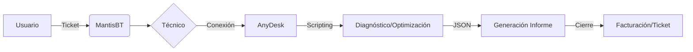

<div align="center">

<picture>
  <source media="(prefers-color-scheme: dark)" srcset="assets/logo/resolvcore-logo-dark.png">
  <source media="(prefers-color-scheme: light)" srcset="assets/logo/resolvcore-logo-light.png">
  
</picture>

### **Ecosistema de Mantenimiento, Diagnóstico y Optimización Multiplataforma**
*La solución integral, proactiva y profesional para la infraestructura IT moderna.*

<br/>


[](https://github.com/Haplee/ResolvCore)
[](#)
[](#)

</div>

---

## 🚀 Sobre ResolvCore

**ResolvCore** no es solo una herramienta, es un ecosistema diseñado bajo los estándares de **Administración de Sistemas Informáticos en Red (ASIR)**. Centraliza el soporte técnico remoto mediante un flujo de trabajo estructurado en 7 fases, integrando CMS, Ticketing y Scripts de bajo nivel para ofrecer una experiencia técnica impecable tanto al administrador como al usuario final.

### 🔄 Flujo de Trabajo Operativo


---

## ✨ Características Premium

| Característica | Beneficio |
|---|---|
| 🩺 **Smart Diagnostics** | Análisis automatizado con scoring (0-100) en CPU, RAM, Disk (S.M.A.R.T), Red y Seguridad. |
| 🛡️ **CVE Engine** | Auditoría de software contra la base de datos nacional de vulnerabilidades (NIST). |
| ⚙️ **Power Optimization** | Scripts de optimización con modos `--dry-run`, `--confirm` y `--undo` (seguridad ante todo). |
| 📱 **Mobile Integration** | Diagnóstico nativo para Android mediante ADB y shell scripting. |
| 🎫 **Enterprise Ticketing** | Integración profunda con **MantisBT** vía REST API para trazabilidad completa. |
| ♿ **Universal Access** | Interfaz web optimizada para accesibilidad (WCAG 2.1 AA) y SEO avanzado. |

---

## 🎨 Branding e Identidad Visual

La identidad de ResolvCore ha sido refinada para proyectar profesionalidad y dinamismo.

<p align="center">
  
</p>

### Variantes de Logotipo
Se han diseñado versiones específicas para garantizar legibilidad en cualquier entorno:

| Light Mode | Dark Mode |
| :---: | :---: |
|  |  |

---

## 📂 Arquitectura del Repositorio

Estructura modular para facilitar el mantenimiento y escalabilidad:

```bash
ResolvCore/
├── 🌐 wordpress/          # Tema custom y plugins de integración
│   ├── resolvecore-theme/  # Tema profesional con templates especializados
│   └── plugins/            # Lógica de conexión MantisBT (REST API)
├── 📜 scripts/            # Motor de diagnóstico y optimización
│   ├── windows/           # PowerShell 7 (Core)
│   ├── linux/             # Bash (Standard)
│   └── android/           # ADB Shell Scripts
├── 📂 assets/             # Branding, logotipos y recursos visuales
├── 📚 docs/               # Documentación técnica, TFG y guías de uso
└── 📝 notes/              # Bitácora de desarrollo (diary.md)
```

---

## 🛠️ Stack Tecnológico

| Capa | Tecnología | Implementación |
|------|-----------|----------------|
| **Core Engine** | PowerShell 7 / Bash | Scripts multiplataforma de bajo nivel. |
| **Backend** | PHP 8.1 / WordPress 6 | Gestión de contenido y APIs REST. |
| **Base de Datos** | MariaDB | Almacenamiento persistente de tickets y logs. |
| **Ticketing** | MantisBT 2.26 | Sistema de gestión de incidencias enterprise. |
| **Frontend** | Vanilla CSS / JS | Interfaz premium con enfoque en rendimiento. |
| **Remote** | AnyDesk | Herramienta de acceso remoto corporativo. |

---

## 📦 Instalación Rápida

### Requisitos del Sistema
- **Servidor:** WordPress 6.0+, PHP 8.1+, MariaDB 10.4+.
- **Cliente:** PowerShell 7 (recomendado) o Bash.

### Despliegue del Tema
1. Sube el archivo `wordpress/resolvecore-theme.zip` desde el panel de administración de WordPress (**Apariencia > Temas**).
2. Activa el tema y configura los templates de página para `Docs` y `Changelog`.
3. Configura las constantes de MantisBT en tu `wp-config.php`:

```php
define( 'RC_MANTIS_URL',   'https://tu-mantis.com' );
define( 'RC_MANTIS_TOKEN', 'tu_api_token' );
```

---

## 👨‍💻 Autor y Contacto

<div align="center">

### Francisco Vidal Mateo
**Técnico Superior en ASIR · Full Stack Developer**

Especialista en administración de sistemas, redes y desarrollo de soluciones IT integrales.

| Plataforma | Enlace |
|---|---|
| 🐙 **GitHub** | [Haplee](https://github.com/Haplee) |
| 📸 **Instagram** | [@franvidalmateo](https://www.instagram.com/franvidalmateo) |
| 🐦 **X (Twitter)** | [@FranVidalMateo](https://x.com/FranVidalMateo) |
| 📧 **Email** | [fvidalmateo@gmail.com](mailto:fvidalmateo@gmail.com) |

---

> *"Transformando el mantenimiento reactivo en gestión proactiva."*

**ResolvCore — Proyecto Integrado ASIR 2025-26 · Barbate, Cádiz**
</div>
