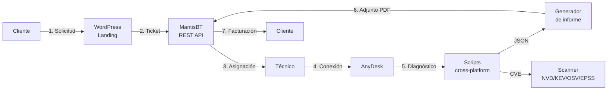

<div align="center">

<picture>
  <source media="(prefers-color-scheme: dark)" srcset="assets/logo/resolvcore-logo-dark.png">
  <source media="(prefers-color-scheme: light)" srcset="assets/logo/resolvcore-logo-light.png">
  
</picture>

# ResolvCore

**Plataforma cross-platform de mantenimiento, diagnóstico y optimización remota.**

*Solución integral, proactiva y profesional para infraestructura IT moderna.*

<br/>

[](docs/defensa-tfg.md#changelog-del-documento)
[](#estado-del-proyecto)
[](#licencia)
[](docs/defensa-tfg.md)
[](#)

<br/>


</div>

---

## Tabla de contenidos

1. [Resumen ejecutivo](#resumen-ejecutivo)
2. [Características principales](#características-principales)
3. [Arquitectura](#arquitectura)
4. [Stack tecnológico](#stack-tecnológico)
5. [Estructura del repositorio](#estructura-del-repositorio)
6. [Instalación](#instalación)
7. [Uso rápido](#uso-rápido)
8. [Módulos](#módulos)
9. [Esquema de salida JSON](#esquema-de-salida-json)
10. [Seguridad y reversibilidad](#seguridad-y-reversibilidad)
11. [Documentación](#documentación)
12. [Roadmap](#roadmap)
13. [Estado del proyecto](#estado-del-proyecto)
14. [Licencia](#licencia)
15. [Autor](#autor)

---

## Resumen ejecutivo

**ResolvCore** es un ecosistema diseñado bajo los estándares de **Administración de Sistemas Informáticos en Red (ASIR)**. Centraliza el ciclo completo de soporte técnico remoto en siete fases automatizadas, integrando un CMS público (WordPress), un sistema de tickets enterprise (MantisBT), un motor de scripts cross-platform (PowerShell 5.1+ + Bash) y un escáner de vulnerabilidades multi-feed (Python stdlib).

**Propuesta de valor**

- Soporte técnico **proactivo en lugar de reactivo**: revisiones programadas + alerta temprana.
- **Trazabilidad completa** de la incidencia: del ticket al informe técnico al cierre facturado.
- **Cero vendor lock-in**: APIs públicas, software libre, integraciones REST estándar.
- **Cross-platform real**: paridad funcional entre Windows, Linux, macOS y Android.

---

## Características principales

| Módulo | Descripción |
|---|---|
| **TUI Launcher** | `ResolveCore.{ps1,sh}` — menú interactivo con análisis previo del sistema, pass-through de flags y ayuda embebida. |
| **Smart Diagnostics** | Análisis automatizado con scoring 0–100 sobre CPU, RAM, disco (S.M.A.R.T), red, sensores y seguridad. Salida JSON estructurada. |
| **CVE Engine multi-feed** | Auditoría paralela contra NVD (NIST), CISA KEV, OSV (Google) y EPSS-FIRST. Sin dependencias `pip` — solo Python 3.8+ stdlib. |
| **Power Optimization** | Cuatro perfiles (`ligero`, `estandar`, `rendimiento`, `extreme`) con `--dry-run`, `--undo` y `--backup-only`. |
| **Cross-platform Suite** | Scripts nativos Windows / Linux / macOS / Android con paridad funcional y API consistente. |
| **Mobile Integration** | Diagnóstico Android vía ADB shell con detección automática de dispositivo. |
| **Enterprise Ticketing** | Integración profunda con **MantisBT** vía REST API: alta de incidencias, adjunto automático de informes, cierre. |
| **Auto-deps** | Instalación bajo demanda de paquetes opcionales (`smartmontools`, `lm-sensors`, `nmap`, `jq`) vía winget/choco/apt/dnf/brew. |
| **WordPress Theme** | Tema profesional con landing FSE-compatible, plugin shortcode independiente y accesibilidad WCAG 2.1 AA. |

---

## Arquitectura



**Capas**

| Capa | Responsabilidad |
|---|---|
| **Presentación** | Tema WordPress + plugin shortcode + landing FSE. |
| **Tickets** | MantisBT 2.26 con REST API y plugin de integración. |
| **Acceso remoto** | AnyDesk (sesiones supervisadas). |
| **Diagnóstico** | PowerShell 5.1+ / Bash 4+ — scripts modulares con salida JSON. |
| **Análisis CVE** | Python 3.8+ stdlib, multi-feed, paralelo, sin red privada. |
| **Persistencia** | MariaDB con prefijo `rc_` y migraciones idempotentes. |
| **Reporting** | Plantilla HTML + wkhtmltopdf/DomPDF → PDF auto-adjunto al ticket. |

---

## Stack tecnológico

| Capa | Tecnología | Versión | Nota |
|---|---|---|---|
| Core engine | PowerShell / Bash | 5.1+ / 4+ | Multiplataforma con paridad funcional. |
| TUI launcher | PowerShell / Bash | 5.1+ / 4+ | Menú interactivo + pass-through. |
| Vuln scanner | Python | 3.8+ stdlib | Sin dependencias `pip`. |
| Backend | PHP / WordPress | 8.1+ / 6.x | Gestión de contenido y REST. |
| Base de datos | MariaDB / MySQL | 10.4+ / 8.0+ | Tickets, histórico CVE. |
| Ticketing | MantisBT | 2.26 | REST API enterprise. |
| Frontend | CSS / JS | vanilla | Sin frameworks, foco en LCP. |
| Remote | AnyDesk | corporate | Acceso remoto cifrado. |

---

## Estructura del repositorio

```text
ResolvCore/
├── wordpress/
│   ├── resolvecore-theme/             Tema FSE-compatible (front-page, docs, changelog).
│   ├── page-resolvecore.php           Plantilla landing con servicios, pipeline, FAQ y precios.
│   ├── resolvecore-landing.php        Plugin con shortcode [resolvecore_landing].
│   ├── resolvecore-theme.zip          Empaquetado del tema (slug original).
│   ├── resolvecore-theme-v11.zip      Empaquetado v1.1 (slug versionado).
│   ├── resolvecore-landing.zip        Empaquetado del plugin shortcode.
│   └── plugins/
│       └── rc-mantisbt/               Cliente REST de MantisBT.
├── scripts/
│   ├── windows/                       PowerShell 5.1+: ResolveCore.ps1, diagnostico.ps1, optimizacion.ps1.
│   ├── linux/                         Bash: ResolveCore.sh, diagnostico.sh, optimizacion.sh.
│   ├── macos/                         Bash: paridad con Linux para macOS 12+.
│   ├── android/                       ADB shell: diagnostico.sh, optimizacion.sh, ResolveCore.sh.
│   ├── diagnosticos/                  Salidas JSON/HTML/TXT (gitignored).
│   ├── buscar_vulnerabilidades.py     Scanner CVE multi-feed (NVD/KEV/OSV/EPSS).
│   ├── informe.html                   Plantilla del informe técnico.
│   └── iso/                           Recursos para imagen booteable.
├── mantisbt/                          Configuración y plugins de MantisBT.
├── assets/                            Branding, logotipos y recursos visuales.
└── docs/                              Documentación técnica y memoria del TFG.
    ├── defensa-tfg.md                 Memoria principal del proyecto.
    ├── stack-tecnologico.md           Justificación del stack.
    ├── schema-diagnostico.md          Esquema JSON de salida.
    ├── mantis-integration.md          Integración con MantisBT.
    └── so-especializado.md            Notas específicas por SO.
```

---

## Instalación

### Requisitos

| Componente | Versión mínima |
|---|---|
| WordPress | 6.0 |
| PHP | 8.1 |
| MariaDB / MySQL | 10.4 / 8.0 |
| PowerShell (Windows) | 5.1 (default Win10/11) |
| Bash (Linux / macOS) | 4.0 |
| Python (scanner CVE) | 3.8 |
| MantisBT | 2.26 |

### 1. Tema WordPress

```bash
# Subir desde Apariencia > Temas > Añadir nuevo > Subir tema
wordpress/resolvecore-theme-v11.zip
```

Activar el tema y asignar la plantilla **"ResolveCore Landing"** desde **Páginas > Atributos > Plantilla**.

### 2. Plugin shortcode (alternativa al tema)

```bash
# Subir desde Plugins > Añadir nuevo > Subir plugin
wordpress/resolvecore-landing.zip
```

Insertar en cualquier página: `[resolvecore_landing]` (acepta `show_nav`, `show_pricing`, `show_footer`).

### 3. Integración MantisBT

```php
// wp-config.php
define( 'RC_MANTIS_URL',   'https://tu-mantis.com' );
define( 'RC_MANTIS_TOKEN', 'tu_api_token' );
```

### 4. Scripts cliente

Clonar el repositorio en la máquina del técnico:

```bash
git clone https://github.com/Haplee/ResolvCore.git
cd ResolvCore/scripts
```

---

## Uso rápido

### TUI Launcher (recomendado)

```powershell
# Windows — menú interactivo
pwsh ./scripts/windows/ResolveCore.ps1

# Pass-through directo a diagnóstico
pwsh ./scripts/windows/ResolveCore.ps1 -O C:\reports -A

# Pass-through a optimización con preview
pwsh ./scripts/windows/ResolveCore.ps1 -Nivel rendimiento -DryRun
```

```bash
# Linux / macOS — menú interactivo
bash ./scripts/linux/ResolveCore.sh
bash ./scripts/macos/ResolveCore.sh

# Optimización con rollback
bash ./scripts/linux/optimizacion.sh estandar
bash ./scripts/linux/optimizacion.sh --undo

# Scanner de vulnerabilidades multi-feed
python3 ./scripts/buscar_vulnerabilidades.py --output json
```

### Operaciones individuales

```bash
# Diagnóstico Linux con auto-instalación de dependencias
bash ./scripts/linux/diagnostico.sh -A -O ~/reports

# Optimización Windows nivel extreme con backup previo
pwsh ./scripts/windows/optimizacion.ps1 -Nivel extreme -BackupOnly

# Scanner CVE con histórico y comparativa
python3 ./scripts/buscar_vulnerabilidades.py --compare last
```

---

## Módulos

### 1. Diagnóstico (`scripts/{windows,linux,macos,android}/diagnostico.*`)

| SO | Métricas recogidas |
|---|---|
| Windows | CPU/RAM/disco, Windows Update, servicios críticos, log de eventos, Defender, S.M.A.R.T. |
| Linux | `top`, `journalctl`, `df`, paquetes (apt/dnf), cron, puertos, sensores, S.M.A.R.T. |
| macOS | `system_profiler`, `pmset`, `vm_stat`, paquetes (brew), puertos. |
| Android | Versión, batería, almacenamiento, apps instaladas, root status. |

**Flags comunes**: `-O` salida, `-S` silencio, `-I/-A` instalar deps (interactivo / auto).

### 2. Optimización (`scripts/{windows,linux,macos}/optimizacion.*`)

| Nivel | Acciones |
|---|---|
| `ligero` | Limpieza temporales + servicios no críticos. Spooler **siempre excluido**. |
| `estandar` | + telemetría off + visual effects ajustados. |
| `rendimiento` | + tuning disco/red/RAM (sysctl en Linux, registro en Windows). |
| `extreme` | + bloqueo Cortana/OneDrive/Bing en Windows. |

**Flags**: `--dry-run` previsualizar, `--undo` revertir, `--backup-only` solo respaldo.

### 3. Scanner de vulnerabilidades (`scripts/buscar_vulnerabilidades.py`)

```bash
python3 buscar_vulnerabilidades.py [--output json|html|txt|csv]
                                   [--compare last|<run_id>]
                                   [--mantis ticket_id]
                                   [--email destinatario@dominio]
                                   [--ssh user@host]
```

**Feeds integrados**

| Feed | Origen | Uso |
|---|---|---|
| NVD | NIST | Catálogo principal de CVEs. |
| CISA KEV | CISA | Vulnerabilidades activamente explotadas. |
| OSV | Google | Vulnerabilidades de OSS por ecosistema. |
| EPSS-FIRST | FIRST.org | Probabilidad de explotación 0–1. |

### 4. Integración MantisBT (`wordpress/plugins/rc-mantisbt/`)

Cliente REST con `RC_Mantis_API` y helper `rc_mantis_attach_diagnostic()` para adjuntar el JSON/HTML del diagnóstico al ticket de origen.

---

## Esquema de salida JSON

Todos los scripts de diagnóstico producen JSON conforme al esquema documentado en [`docs/schema-diagnostico.md`](docs/schema-diagnostico.md). Resumen:

```json
{
  "metadata": { "host", "os", "version", "timestamp", "duracion_segundos" },
  "score": { "total", "desglose": { "cpu", "ram", "disco", "red", "seguridad" } },
  "hardware": { "cpu", "ram", "discos[]", "red[]", "sensores" },
  "software": { "actualizaciones[]", "servicios[]", "paquetes_obsoletos[]" },
  "vulnerabilidades": { "por_severidad", "score_desglose", "items[]" },
  "recomendaciones": [],
  "proxima_revision": "ISO-8601"
}
```

---

## Seguridad y reversibilidad

- **Confirmación explícita** para acciones destructivas (`--confirm` obligatorio en limpieza profunda).
- **Backup automático** del registro (Windows) y `sysctl`/servicios (Linux) antes de cualquier optimización.
- **Rollback total** mediante `--undo` que lee `estado_previo.json`.
- **Spooler excluido por política**: la cola de impresión nunca se desactiva (impacto crítico en usuarios finales).
- **Sin telemetría externa**: el scanner CVE solo consulta APIs públicas auditables (NVD, KEV, OSV, EPSS).
- **Credenciales fuera del repo**: `wp-config.php` y tokens via variables de entorno o constantes WordPress.
- **Modo `--dry-run`** disponible en optimización para previsualizar cambios sin aplicarlos.

---

## Documentación

| Documento | Contenido |
|---|---|
| [`docs/defensa-tfg.md`](docs/defensa-tfg.md) | Memoria técnica completa del TFG (20+ secciones, changelog). |
| [`docs/stack-tecnologico.md`](docs/stack-tecnologico.md) | Justificación del stack y decisiones arquitectónicas. |
| [`docs/schema-diagnostico.md`](docs/schema-diagnostico.md) | Esquema JSON producido por los scripts de diagnóstico. |
| [`docs/mantis-integration.md`](docs/mantis-integration.md) | Integración con MantisBT (endpoints, payloads). |
| [`docs/so-especializado.md`](docs/so-especializado.md) | Notas específicas por sistema operativo. |
| [`docs/anotaciones-tutor.md`](docs/anotaciones-tutor.md) | Feedback del tutor académico. |

---

## Roadmap

- **v1.2** — Sincronización automática NVD → tabla local `rc_vulnerabilities` (cron semanal).
- **v1.3** — App nativa Android (Kotlin + Jetpack Compose + Material 3).
- **v1.4** — Dashboard de métricas en Grafana + exporter Prometheus.
- **v2.0** — Multi-tenant: panel del técnico con varios clientes y SLAs.

---

## Estado del proyecto

| Indicador | Estado |
|---|---|
| Versión actual | **1.1.0** |
| Plataformas con paridad | Windows · Linux · macOS · Android |
| Cobertura de feeds CVE | NVD · CISA KEV · OSV · EPSS-FIRST |
| Tema WordPress | FSE-compatible · WCAG 2.1 AA |
| Integración tickets | MantisBT 2.26 vía REST |
| Última actualización | Mayo 2026 |

---

## Licencia

Distribuido bajo licencia **GNU General Public License v3.0**. Consulta el archivo `LICENSE` para los términos completos.

El scanner de vulnerabilidades y los scripts de diagnóstico son software libre. Las APIs consumidas (NVD, CISA KEV, OSV, EPSS-FIRST) son públicas y auditables.

---

## Autor

<div align="center">

### Francisco Vidal Mateo

**Técnico Superior en ASIR · Full Stack Developer**
*Especialista en administración de sistemas, redes y soluciones IT integrales.*

| Plataforma | Enlace |
|---|---|
| GitHub | [Haplee](https://github.com/Haplee) |
| Email | [fvidalmateo@gmail.com](mailto:fvidalmateo@gmail.com) |
| Instagram | [@franvidalmateo](https://www.instagram.com/franvidalmateo) |
| X (Twitter) | [@FranVidalMateo](https://x.com/FranVidalMateo) |

---

> *"Transformando el mantenimiento reactivo en gestión proactiva."*

**ResolvCore** — Proyecto Integrado ASIR 2025-26 · Barbate, Cádiz

</div>
