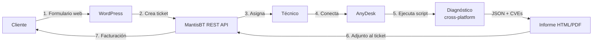

<div align="center">

<picture>
  <source media="(prefers-color-scheme: dark)" srcset="assets/logo/resolvcore-logo-dark.png">
  <source media="(prefers-color-scheme: light)" srcset="assets/logo/resolvcore-logo-light.png">
  
</picture>

# ResolveCore

**Plataforma cross-platform de mantenimiento, diagnóstico y optimización remota.**

*Solución a tus problemas informáticos.*

<br/>

[](#estado-del-proyecto)
[](#estado-del-proyecto)
[](#licencia)
[](docs/defensa/defensa-tfg.md)

<br/>


</div>

---

## Tabla de contenidos

1. [Resumen ejecutivo](#resumen-ejecutivo)
2. [Flujo del servicio](#flujo-del-servicio)
3. [Stack tecnológico](#stack-tecnológico)
4. [Estructura del repositorio](#estructura-del-repositorio)
5. [Instalación](#instalación)
6. [Uso rápido](#uso-rápido)
7. [Módulos](#módulos)
8. [Seguridad y reversibilidad](#seguridad-y-reversibilidad)
9. [Documentación](#documentación)
10. [Roadmap](#roadmap)
11. [Estado del proyecto](#estado-del-proyecto)
12. [Licencia](#licencia)
13. [Autor](#autor)

---

## Resumen ejecutivo

**ResolveCore** es una plataforma de soporte técnico remoto estructurada en 7 fases: solicitud → ticket (MantisBT) → conexión remota (AnyDesk) → diagnóstico (PowerShell/Bash/Python) → resolución → informe PDF → facturación.

**Propuesta de valor**

- **Diagnóstico automatizado** con scoring 0-100 sobre CPU, RAM, disco, red y seguridad.
- **Trazabilidad completa**: del ticket al informe técnico al cierre facturado.
- **Cross-platform real**: paridad funcional entre Windows, Linux, macOS y Android.
- **Escáner CVE multi-feed** sin dependencias pip — solo Python 3.8+ stdlib.
- **Cero vendor lock-in**: APIs públicas, software libre, integraciones REST estándar.

---

## Flujo del servicio



---

## Stack tecnológico

| Componente | Tecnología | Versión | Rol |
|---|---|---|---|
| Frontend / CMS | WordPress (PHP) | 6.x / 8.2+ | Web pública, formulario de contacto |
| Tema | resolvecore-theme | 3.0.0 | Dark theme custom, sin frameworks CSS |
| Plugin integración | rc-mantisbt | 1.0.0 | Crea tickets MantisBT desde el formulario |
| Gestión tickets | MantisBT | 2.27 LTS | REST API, campos personalizados, plugins |
| Scripts Windows | PowerShell | 5.1+ | Diagnóstico, optimización, informes |
| Scripts Linux/macOS | Bash | 4+ | Diagnóstico, optimización |
| Scripts Android | Bash (ADB) | — | Diagnóstico remoto vía ADB |
| Escáner vulns/red | Python | 3.8+ stdlib | NVD, CISA KEV, OSV, EPSS, Shodan, Nmap |
| Informe técnico | HTML → PDF | — | wkhtmltopdf / DomPDF (en desarrollo) |
| Base de datos | MariaDB / MySQL | 10.4+ / 8.0+ | MantisBT + vulnerabilidades |
| Acceso remoto | AnyDesk | — | Conexión al equipo del cliente |
| Entorno dev | LocalWP | — | PHP 8.2, nginx, MySQL local |
| Contenedores | Docker Compose | — | MantisBT local (localhost:8989) |

---

## Estructura del repositorio

```text
ResolveCore/
├── wordpress/
│   ├── resolvecore-theme/          Tema dark custom (PHP + CSS + JS vanilla)
│   │   ├── front-page.php          Landing page con hero, servicios, precios, contacto
│   │   ├── page-docs.php           Página de documentación pública
│   │   ├── page-changelog.php      Historial de versiones
│   │   ├── page-contacto.php       Formulario de soporte
│   │   ├── header.php / footer.php Layout global
│   │   ├── functions.php           Hooks, AJAX, integración MantisBT
│   │   ├── style.css               Variables CSS, layout, responsive
│   │   └── assets/
│   │       ├── js/main.js          JS vanilla (formulario AJAX, nav)
│   │       └── logo/               SVG + PNG (dark / light / icon)
│   └── plugins/rc-mantisbt/        Plugin integración MantisBT vía REST
│       ├── rc-mantisbt.php         Plugin principal + panel de ajustes
│       └── includes/
│           └── class-mantis-api.php  Cliente REST (create_issue, get_issue...)
├── mantisbt/
│   ├── docker-compose.yml          Stack local: MantisBT 2.27 + MySQL 5.7
│   ├── config/
│   │   ├── config_inc.php          Config real (local, no commiteada)
│   │   └── config_inc.php.template Plantilla para producción
│   ├── sql/
│   │   ├── mantisbt-db.sql         Dump local (no commiteado)
│   │   └── resolvecore-setup.sql   Categorías + campos personalizados ResolveCore
│   └── plugins/                    EventLog, Kanban, SetDuedate, Reminder, mailtemplate, source-integration
├── scripts/
│   ├── windows/
│   │   ├── ResolveCore.ps1         TUI launcher (menú interactivo)
│   │   ├── diagnostico.ps1         Diagnóstico completo v4.1.0
│   │   └── optimizacion.ps1        Optimización con --dry-run y --undo
│   ├── linux/
│   │   ├── ResolveCore.sh          TUI launcher Linux
│   │   ├── diagnostico.sh          Diagnóstico completo v3.2.0
│   │   └── optimizacion.sh         Optimización con --dry-run v3.2.0
│   ├── macos/                      Equivalente Linux para macOS
│   ├── android/                    Diagnóstico + optimización vía ADB
│   ├── common/                     Python — Hexagonal Architecture
│   │   ├── domain/                 Modelos: Host, Vulnerability, Service
│   │   ├── ports/                  Interfaces: HostIntelSource
│   │   ├── adapters/               Implementaciones: shodan_rest.py
│   │   ├── buscar_vulnerabilidades.py  Motor CVE multi-feed (NVD/KEV/OSV/EPSS)
│   │   ├── escaner_shodan.py       Auditoría exposición pública (Shodan API)
│   │   └── escaner_nmap.py         Escáner de puertos (Nmap wrapper)
│   ├── setup/                      Setup entorno técnico (Linux + Windows)
│   ├── server/                     Bootstrap VPS (post-install.sh, bootstrap-mantis.sh)
│   └── diagnosticos/               Salidas JSON + HTML generadas (gitignored)
├── reports/
│   └── informe.html                Plantilla HTML del informe técnico
├── vulnerabilities/
│   └── migrations/                 SQL idempotentes (0001_init.sql)
├── assets/logo/                    Logos SVG + PNG (dark / light / icon)
└── docs/
    ├── INDEX.md                    Índice navegable de toda la documentación
    ├── defensa/                    Docs para tribunal y tutor (defensa-tfg, informe-tutor...)
    ├── tecnica/                    Docs técnicas del sistema (stack, entornos, servicios...)
    ├── scripting/                  Arquitectura scripts, schemas JSON, regex
    └── capturas/                   Evidencias del sprint (lun19, mar20)
```

---

## Instalación

### Requisitos

| Componente | Versión mínima |
|---|---|
| WordPress | 6.0 |
| PHP | 8.2 |
| MariaDB / MySQL | 10.4 / 8.0 |
| PowerShell (Windows) | 5.1 (incluido en Win 10/11) |
| Bash (Linux / macOS) | 4.0 |
| Python (scanner CVE) | 3.8 |
| MantisBT | 2.27 LTS |
| Docker + Compose | 20.x+ |

### 1. Entorno de desarrollo (LocalWP)

```bash
# 1. Descargar LocalWP desde https://localwp.com
# 2. Crear sitio: nombre=ResolveCore, PHP 8.2, nginx, MySQL
# 3. Clonar tema en wp-content/themes/
git clone https://github.com/Haplee/ResolveCore.git
ln -s /ruta/ResolveCore/wordpress/resolvecore-theme \
      ~/Local\ Sites/resolvecore/app/public/wp-content/themes/resolvecore-theme
```

### 2. MantisBT local (Docker)

```bash
docker compose -f mantisbt/docker-compose.yml up -d
# Acceder a http://localhost:8989
# Aplicar setup: mantisbt/sql/resolvecore-setup.sql
```

### 3. Plugin WordPress → MantisBT

```bash
# Copiar plugin al WordPress de desarrollo
cp -r wordpress/plugins/rc-mantisbt \
      ~/Local\ Sites/resolvecore/app/public/wp-content/plugins/

# Activar en WP Admin → Plugins
# Configurar en Ajustes → MantisBT: URL + API Token
```

### 4. Scripts de diagnóstico

```bash
# Clonar en la máquina del técnico
git clone https://github.com/Haplee/ResolveCore.git
cd ResolveCore

# Variables de entorno para Python (opcional)
cp .env.example .env   # añadir SHODAN_API_KEY, NVD_API_KEY
```

---

## Uso rápido

### TUI Launcher

```powershell
# Windows — menú interactivo
pwsh ./scripts/windows/ResolveCore.ps1
```

```bash
# Linux / macOS — menú interactivo
bash ./scripts/linux/ResolveCore.sh
bash ./scripts/macos/ResolveCore.sh
```

### Diagnóstico directo

```powershell
# Windows — genera JSON + HTML en scripts/diagnosticos/
pwsh ./scripts/windows/diagnostico.ps1

# Con directorio de salida personalizado
pwsh ./scripts/windows/diagnostico.ps1 -OutputDir C:\reports
```

```bash
# Linux
bash ./scripts/linux/diagnostico.sh

# Android (requiere ADB conectado)
bash ./scripts/android/diagnostico.sh
```

### Optimización

```bash
# Linux — previsualizar sin aplicar
bash ./scripts/linux/optimizacion.sh --dry-run

# Linux — aplicar y guardar estado previo
bash ./scripts/linux/optimizacion.sh

# Linux — revertir
bash ./scripts/linux/optimizacion.sh --undo
```

### Escáner de vulnerabilidades y red

```bash
# CVE multi-feed (NVD + CISA KEV + OSV + EPSS)
python3 scripts/common/buscar_vulnerabilidades.py --output json

# Auditoría exposición pública (Shodan)
python3 scripts/common/escaner_shodan.py

# Escáner de puertos (requiere nmap instalado)
python3 scripts/common/escaner_nmap.py
```

---

## Módulos

### 1. Diagnóstico multiplataforma

| SO | Versión | Métricas recogidas |
|---|---|---|
| Windows | v4.1.0 | CPU/RAM/disco, servicios, Event Log, Windows Update, software instalado (con conteo real), red, firewall |
| Linux | v3.2.0 | CPU/RAM/disco, systemd, journalctl, puertos, sensores (lm-sensors), S.M.A.R.T., paquetes |
| macOS | — | system_profiler, pmset, vm_stat, brew, puertos |
| Android | v2.2.0 | Batería, almacenamiento, apps, conectividad (vía ADB) |

Todos generan JSON estructurado + HTML visual con inyección segura (`<script type="application/json">`).

### 2. Optimización

| Flag | Efecto |
|---|---|
| `--dry-run` | Muestra qué haría sin ejecutar nada (respetado en todas las fases) |
| `--undo` | Revierte al estado guardado antes de la última optimización |
| _(sin flags)_ | Aplica optimizaciones y guarda estado previo |

**Spooler de impresión siempre excluido** por política (impacto crítico en usuarios finales).

### 3. Escáner CVE y red (Python — Hexagonal Architecture)

| Módulo | Feed / Herramienta | Salida |
|---|---|---|
| `buscar_vulnerabilidades.py` | NVD (NIST), CISA KEV, OSV, EPSS-FIRST | JSON, HTML, texto |
| `escaner_shodan.py` | Shodan REST API | Puertos, CVEs, org, país |
| `escaner_nmap.py` | Nmap (wrapper) | Puertos, servicios, OS |

Sin dependencias `pip` — solo Python 3.8+ stdlib.

### 4. Plugin WordPress: rc-mantisbt

Cliente REST para MantisBT 2.x. Cuando el usuario envía el formulario de contacto, el plugin crea automáticamente un ticket en MantisBT y devuelve el número al cliente:

> *"¡Mensaje enviado! Ticket #42 creado. Te responderemos pronto."*

Panel de configuración en **Ajustes → MantisBT**: URL, API Token, ID de proyecto.

### 5. Tema WordPress: resolvecore-theme

Tema dark custom (sin Bootstrap, sin Tailwind). Paleta `#0a0c10` / `#00e5a0`. Páginas incluidas: landing, documentación, changelog, contacto. Responsive, AJAX nativo.

---

## Seguridad y reversibilidad

- **`--dry-run`** respetado en todas las fases de optimización (cache, logs, sysctl, servicios).
- **Backup automático** de sysctl / registro antes de cualquier optimización.
- **`--undo`** revierte al estado guardado anteriormente.
- **Inyección JSON segura** en informes HTML: JSON en `<script type="application/json">`, parseado con `JSON.parse()`. Evita XSS si un valor contiene `</script>`.
- **Spooler excluido por política**: la cola de impresión nunca se toca.
- **Credenciales fuera del repo**: `wp-config.php`, `config_inc.php` y tokens vía variables de entorno. Los archivos de configuración con valores reales están en `.gitignore`.
- **Reglas udev ADB** con lista de vendor IDs oficiales de Google (sin `ATTR{idVendor}=="*"` que es sintaxis inválida).

---

## Documentación

| Documento | Descripción |
|---|---|
| [`docs/INDEX.md`](docs/INDEX.md) | Índice navegable de toda la documentación |
| [`docs/defensa/defensa-tfg.md`](docs/defensa/defensa-tfg.md) | Memoria técnica del TFG — FAQs del tribunal, decisiones justificadas |
| [`docs/defensa/informe-tutor-estado-proyecto.md`](docs/defensa/informe-tutor-estado-proyecto.md) | Estado del proyecto para el tutor (actualizado 20/05) |
| [`docs/defensa/origen-componentes.md`](docs/defensa/origen-componentes.md) | Autoría de cada componente: terceros, propio, uso de IA |
| [`docs/tecnica/stack-tecnologico.md`](docs/tecnica/stack-tecnologico.md) | Justificación del stack tecnológico con comparativas |
| [`docs/tecnica/entornos.md`](docs/tecnica/entornos.md) | Entornos dev/prod y política de backup |
| [`docs/tecnica/flujo-sistema.md`](docs/tecnica/flujo-sistema.md) | Diagrama del flujo completo del sistema |
| [`docs/tecnica/mantis-integration.md`](docs/tecnica/mantis-integration.md) | Integración WordPress ↔ MantisBT (endpoints, payloads) |
| [`docs/tecnica/servicios-adicionales.md`](docs/tecnica/servicios-adicionales.md) | Clonación, congelación, acceso remoto, cifrado |
| [`docs/scripting/arquitectura-scripting.md`](docs/scripting/arquitectura-scripting.md) | Arquitectura de módulos: diagnóstico → JSON → informe → PDF |
| [`docs/scripting/schema-diagnostico.md`](docs/scripting/schema-diagnostico.md) | Esquema JSON unificado de diagnóstico |

---

## Roadmap

| Versión | Objetivo |
|---|---|
| **v1.2** (próxima) | Generación PDF automática (wkhtmltopdf + plantilla HTML) |
| **v1.3** | Sincronización NVD → tabla `rc_vulnerabilities` (cron semanal) |
| **v1.4** | Despliegue VPS productivo + dominio + Let's Encrypt |
| **v2.0** | Facturación: pago por servicio + suscripción (cron) |
| **v3.0** | App nativa Android (Kotlin + Jetpack Compose + Material 3) |

---

## Estado del proyecto

| Indicador | Estado |
|---|---|
| Versión | **1.2.0-beta** |
| Entrega TFG | **5 de junio de 2026** |
| Plataformas | Windows · Linux · macOS · Android |
| Web beta | Operativa en WordPress.com |
| MantisBT | Docker local operativo · VPS pendiente |
| Flujo end-to-end | Formulario WP → ticket MantisBT ✅ |
| Informe HTML | Generado por scripts ✅ |
| Informe PDF | En desarrollo |
| Escáner CVE | NVD · CISA KEV · OSV · EPSS · Shodan ✅ |
| Última actualización | 20 de mayo de 2026 |

---

## Licencia

Distribuido bajo licencia **GNU General Public License v3.0**.

El escáner de vulnerabilidades y los scripts de diagnóstico son software libre. Las APIs consumidas (NVD, CISA KEV, OSV, EPSS-FIRST, Shodan) son públicas y auditables.

---

## Autor

<div align="center">

### Francisco Vidal Mateo

**Técnico Superior en ASIR**  
*TFG 2024/25 · Plataforma de soporte técnico remoto*

| Plataforma | Enlace |
|---|---|
| GitHub | [Haplee](https://github.com/Haplee) |
| Email | [fvidalmateo@gmail.com](mailto:fvidalmateo@gmail.com) |

---

> *"Solución a tus problemas informáticos."*

**ResolveCore** — Proyecto Integrado ASIR 2025-26

</div>
