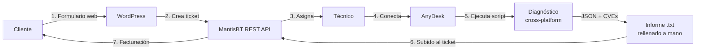

<div align="center">

<picture>
  <source media="(prefers-color-scheme: dark)" srcset="assets/logo/resolvcore-logo-dark.png">
  <source media="(prefers-color-scheme: light)" srcset="assets/logo/resolvcore-logo-light.png">
  
</picture>

# ResolveCore

**Plataforma cross-platform de mantenimiento, diagnóstico y optimización remota.**

*Solución a tus problemas informáticos.*

<br/>

[](#estado-del-proyecto)
[](#estado-del-proyecto)
[](#licencia)
[](docs/defensa/defensa-tfg.md)
[](.github/workflows/lint.yml)

<br/>


</div>

---

## Tabla de contenidos

1. [Resumen ejecutivo](#resumen-ejecutivo)
2. [Flujo del servicio](#flujo-del-servicio)
3. [Stack tecnológico](#stack-tecnológico)
4. [Estructura del repositorio](#estructura-del-repositorio)
5. [Instalación](#instalación)
6. [Uso rápido](#uso-rápido)
7. [Módulos](#módulos)
8. [Seguridad y reversibilidad](#seguridad-y-reversibilidad)
9. [Documentación](#documentación)
10. [Roadmap](#roadmap)
11. [Estado del proyecto](#estado-del-proyecto)
12. [Licencia](#licencia)
13. [Autor](#autor)

---

## Resumen ejecutivo

**ResolveCore** es una plataforma de soporte técnico remoto estructurada en 7 fases: solicitud → ticket (MantisBT) → conexión remota (AnyDesk) → diagnóstico (PowerShell/Bash/Python) → resolución → informe `.txt` (plantilla rellenada a mano por el técnico) → facturación (MantisBT).

**Propuesta de valor**

- **Diagnóstico automatizado** con scoring 0-100 sobre CPU, RAM, disco, red y seguridad.
- **Trazabilidad completa**: del ticket al informe técnico al cierre facturado.
- **Cross-platform real**: paridad funcional entre Windows, Linux, macOS y Android.
- **Escáner CVE multi-feed** sin dependencias pip — solo Python 3.8+ stdlib.
- **Cero vendor lock-in**: APIs públicas, software libre, integraciones REST estándar.

---

## Flujo del servicio


```mermaid
flowchart LR
    A[Cliente] -->|1. Formulario web| B[WordPress]
    B -->|2. Crea ticket| C[MantisBT REST API]
    C -->|3. Asigna| D[Técnico]
    D -->|4. Conecta| E[AnyDesk]
    E -->|5. Ejecuta script| F[Diagnóstico\ncross-platform]
    F -->|JSON + CVEs| G[Informe .txt\nrellenado a mano]
    G -->|6. Subido al ticket| C
    C -->|7. Facturación| A
```

---

## Stack tecnológico

| Componente | Tecnología | Versión | Rol |
|---|---|---|---|
| Frontend / CMS | WordPress (PHP) | 6.x / 8.2+ | Web pública, formulario de contacto |
| Tema | resolvecore-theme | 3.2.2 | Dark theme custom, sin frameworks CSS |
| Plugins WP | rc-core · rc-mantisbt · rc-fleet · rc-tech | — | Clientes, tickets MantisBT, panel flota, panel técnico |
| Gestión tickets | MantisBT | 2.28 | REST API, campos personalizados, plugins |
| Scripts Windows | PowerShell | 5.1+ | Diagnóstico, optimización, informes |
| Scripts Linux | Bash | 4+ | Diagnóstico, optimización |
| Scripts Android | Bash (ADB) | — | Diagnóstico remoto vía ADB |
| Escáner vulns/red | Python | 3.8+ stdlib | NVD, CISA KEV, OSV, EPSS, Nmap |
| Informe técnico | Texto plano (`.txt`) | — | Plantilla rellenada a mano por el técnico (sin PDF) |
| Base de datos | MariaDB / MySQL | 10.4+ / 8.0+ | MantisBT + vulnerabilidades |
| Acceso remoto | AnyDesk | — | Conexión al equipo del cliente |
| Entorno dev | LocalWP | — | PHP 8.2, nginx, MySQL local |
| Contenedores | Docker Compose | — | MantisBT local (localhost:8989) |

---

## Estructura del repositorio

```text
ResolveCore/
├── wordpress/
│   ├── resolvecore-theme/          Tema dark custom (PHP + CSS + JS vanilla)
│   │   ├── front-page.php          Landing page con hero, servicios, precios, contacto
│   │   ├── page-dashboard.php      Panel del cliente (tickets, solicitar informe)
│   │   ├── page-tecnicos.php       Portal técnicos (rol Editor/Admin, descarga kit)
│   │   ├── page-docs / page-changelog / page-contacto / page-registro ...
│   │   ├── header.php / footer.php Layout global (nav condicional por rol)
│   │   ├── functions.php           Hooks, AJAX, login_redirect, handler descargas técnicos
│   │   ├── style.css               Variables CSS, layout, responsive
│   │   └── assets/{js,logo}/       JS vanilla + logos (dark / light / icon / favicons)
│   └── plugins/
│       ├── rc-core/                Alta de clientes rc_cliente + dashboard + registro
│       ├── rc-mantisbt/            Integración MantisBT vía REST (RC_Mantis_API)
│       ├── rc-fleet/               Panel de flota (REST agregado, sin datos sensibles)
│       └── rc-tech/                Panel técnico (cola, SLA, alertas, timeline)
├── mantisbt/
│   ├── docker-compose.yml          Stack local: vimagick/mantisbt + MySQL (localhost:8989)
│   ├── config/config_inc.php       Branding white-label + ajustes (local)
│   ├── sql/resolvecore-setup.sql   Categorías + campos personalizados ResolveCore
│   └── plugins/ResolveCoreBranding/  Plugin de marca (logo, footer, favicon, fixes JS)
├── scripts/
│   ├── windows/
│   │   ├── ResolveCore.ps1         TUI launcher (menú interactivo)
│   │   ├── diagnostico.ps1         Diagnóstico completo v2.1 (JSON + resumen en pantalla)
│   │   └── optimizacion.ps1        Optimización v2.0 (--dry-run / --undo)
│   ├── linux/
│   │   ├── ResolveCore.sh          TUI launcher Linux
│   │   ├── diagnostico.sh          Diagnóstico completo v3.1 (JSON + resumen)
│   │   └── optimizacion.sh         Optimización v2.0 (--dry-run)
│   ├── android/                    Diagnóstico v2.2 + optimización vía ADB
│   ├── common/                     Python — arquitectura hexagonal (sin clases)
│   │   ├── domain/models.py        Entidades como dicts: host, vulnerabilidad, servicio
│   │   ├── ports/                  Contratos (docstrings): vuln_source, inventory_source...
│   │   ├── adapters/               nvd_rest, kev_rest, osv_rest, nmap_local, inventario_local
│   │   ├── buscar_vulnerabilidades.py  Motor CVE multi-feed v3.0 (NVD/KEV/OSV) + --salida-json
│   │   ├── generar_informe.py      Plantilla informe .txt (pre-rellena desde el diagnóstico)
│   │   └── adjuntar_informe_mantis.py  CLI legacy de subida vía API REST
│   ├── servicios/                  Servicios adicionales (congelación + clonación + kit)
│   │   ├── congelacion/            congelacion-windows.ps1 + congelacion-linux.sh
│   │   ├── clonacion/              registrar-imagen.sh + verificar-imagen.sh
│   │   ├── kit/                    construir-kit.ps1 (genera resolvecore-kit.zip)
│   │   ├── install.ps1             Bootstrap Windows (Chocolatey + WSL + AnyDesk)
│   │   └── install.sh              Bootstrap Linux (jq + btrfs-progs + snapper)
│   └── server/                     Bootstrap + ops VPS (post-install, deploy, backup, mantis-branding...)
├── vulnerabilities/
│   └── migrations/                 SQL idempotentes (0001_init.sql)
├── assets/logo/                    Logos SVG + PNG canónicos (dark / light / icon)
├── _archivo/                       Código y mockups archivados (preview/, factura, escaner_nmap...)
└── docs/
    ├── INDEX.md                    Índice navegable de toda la documentación
    ├── defensa/                    Docs para tribunal y tutor (defensa-tfg, informe-tutor...)
    ├── tecnica/                    Docs técnicas del sistema (stack, entornos, servicios...)
    ├── scripting/                  Arquitectura scripts, schemas JSON, regex
    ├── ER/                         Diagrama entidad-relación de la BD de MantisBT (PDF/PNG/SVG)
    └── capturas/                   Evidencias (entornos, mantisbt-web, workbench)
```

> El informe `reports/informe.html` (HTML→PDF) y los scripts `macos/` y `setup/`
> se retiraron del árbol activo. El informe es hoy una plantilla `.txt` que el
> técnico rellena a mano; macOS queda como ROADMAP. Código retirado conservado en
> `_archivo/` (restaurable con `git mv`).

---

## Instalación

### Requisitos

| Componente | Versión mínima |
|---|---|
| WordPress | 6.0 |
| PHP | 8.2 |
| MariaDB / MySQL | 10.4 / 8.0 |
| PowerShell (Windows) | 5.1 (incluido en Win 10/11) |
| Bash (Linux / macOS) | 4.0 |
| Python (scanner CVE) | 3.8 |
| MantisBT | 2.28 |
| Docker + Compose | 20.x+ |

### 1. Entorno de desarrollo (LocalWP)

```bash
# 1. Descargar LocalWP desde https://localwp.com
# 2. Crear sitio: nombre=ResolveCore, PHP 8.2, nginx, MySQL
# 3. Clonar tema en wp-content/themes/
git clone https://github.com/Haplee/ResolveCore.git
ln -s /ruta/ResolveCore/wordpress/resolvecore-theme \
      ~/Local\ Sites/resolvecore/app/public/wp-content/themes/resolvecore-theme
```

### 2. MantisBT local (Docker)

```bash
docker compose -f mantisbt/docker-compose.yml up -d
# Acceder a http://localhost:8989
# Aplicar setup: mantisbt/sql/resolvecore-setup.sql
```

### 3. Plugin WordPress → MantisBT

```bash
# Copiar plugin al WordPress de desarrollo
cp -r wordpress/plugins/rc-mantisbt \
      ~/Local\ Sites/resolvecore/app/public/wp-content/plugins/

# Activar en WP Admin → Plugins
# Configurar en Ajustes → MantisBT: URL + API Token
```

### 4. Scripts de diagnóstico

```bash
# Clonar en la máquina del técnico
git clone https://github.com/Haplee/ResolveCore.git
cd ResolveCore

# Variables de entorno para Python (opcional)
cp .env.example .env   # añadir NVD_API_KEY si se quiere mayor rate limit
```

---

## Uso rápido

### TUI Launcher

```powershell
# Windows — menú interactivo
pwsh ./scripts/windows/ResolveCore.ps1
```

```bash
# Linux — menú interactivo
bash ./scripts/linux/ResolveCore.sh
```

### Diagnóstico directo

```powershell
# Windows — genera JSON + HTML en scripts/diagnosticos/
pwsh ./scripts/windows/diagnostico.ps1

# Con directorio de salida personalizado
pwsh ./scripts/windows/diagnostico.ps1 -OutputDir C:\reports
```

```bash
# Linux
bash ./scripts/linux/diagnostico.sh

# Android (requiere ADB conectado)
bash ./scripts/android/diagnostico.sh
```

### Optimización

```bash
# Linux — previsualizar sin aplicar
bash ./scripts/linux/optimizacion.sh --dry-run

# Linux — aplicar y guardar estado previo
bash ./scripts/linux/optimizacion.sh

# Linux — revertir
bash ./scripts/linux/optimizacion.sh --undo
```

### Escáner de vulnerabilidades y red

```bash
# CVE multi-feed por plataforma (NVD + CISA KEV + OSV). Exporta JSON limpio.
python3 scripts/common/buscar_vulnerabilidades.py --plataforma linux --salida-json /tmp/vuln.json

# Generar la plantilla de informe .txt (pre-rellena desde el diagnóstico)
python3 scripts/common/generar_informe.py --json diagnostico.json --ticket 42
```

---

## Módulos

### 1. Diagnóstico multiplataforma

| SO | Versión | Métricas recogidas |
|---|---|---|
| Windows | v2.1 | CPU/RAM/disco, servicios críticos, top procesos, red (IP/GW/DNS/puertos), S.M.A.R.T., uptime/build, Defender/Firewall/UAC, actualizaciones |
| Linux | v3.1 | CPU/RAM/disco, systemd, top procesos, puertos, S.M.A.R.T., firewall (ufw/iptables), paquetes pendientes |
| Android | v2.2 | Dispositivo, batería, almacenamiento, apps, conectividad (vía ADB) |
| macOS | ROADMAP | No incluido en el árbol activo (ver `_archivo/` y CLAUDE.md A11/D5) |

Cada script guarda el JSON estructurado e **imprime un resumen legible en terminal**. Con `--ticket <N>` organiza la salida en `reparaciones/<NNNNN>/`.

### 2. Optimización

| Flag | Efecto |
|---|---|
| `--dry-run` | Muestra qué haría sin ejecutar nada (respetado en todas las fases) |
| `--undo` | Revierte al estado guardado antes de la última optimización |
| _(sin flags)_ | Aplica optimizaciones y guarda estado previo |

**Spooler de impresión siempre excluido** por política (impacto crítico en usuarios finales).

### 3. Escáner CVE y red (Python — Hexagonal Architecture)

| Módulo | Feed / Herramienta | Salida |
|---|---|---|
| `buscar_vulnerabilidades.py` v3.0 | NVD (NIST), CISA KEV, OSV | JSON (`--salida-json`), avisos filtrados KEV/CVSS≥7.0 |

Tras el escaneo, los launchers leen el JSON y ofrecen un **menú de desinstalación** del software vulnerable (selección + confirmación explícita; Spooler/cups y componentes del sistema siempre excluidos). El escáner de puertos Nmap (`escaner_nmap.py`) queda archivado en `_archivo/common/`. Sin dependencias `pip` — solo Python 3.8+ stdlib.

### 4. Plugin WordPress: rc-mantisbt

Cliente REST para MantisBT 2.x. Provee el transporte (`RC_Mantis_API`) que crea tickets, adjunta informes y consulta estado vía la API REST de MantisBT.

Panel de configuración en **Ajustes → MantisBT**: URL, API Token, ID de proyecto.

### 4c. Plugin WordPress: rc-core

Funciones de cliente. El formulario público de la home **da de alta una cuenta `rc_cliente`** (no crea ticket) y envía un email de activación con enlace para fijar contraseña. Los tickets se crean luego desde el **dashboard del cliente** (`[rc_cliente_dashboard]`); el alta usa `[rc_registro_cliente]`. Throttle por IP y por email, honeypot anti-spam y purga cron de cuentas no activadas.

> *"¡Solicitud recibida! Te hemos enviado un email para fijar tu contraseña y acceder a tu panel."*

### 4b. Servicios adicionales (congelación · clonación · kit)

Scripts operativos en `scripts/servicios/`:

| Script | SO | Función |
|---|---|---|
| `congelacion/congelacion-windows.ps1` | Windows | Status / Configure / Freeze / Thaw con Reboot Restore Rx o Deep Freeze |
| `congelacion/congelacion-linux.sh` | Linux | BTRFS + snapper: status / configure / snapshot / rollback |
| `clonacion/registrar-imagen.sh` | Linux | Registra imagen en `imagenes-manifest.json` con SHA-256 |
| `clonacion/verificar-imagen.sh` | Linux | Valida integridad de imagen (exit 0 íntegra / 1 corrupta / 2 no encontrada) |
| `kit/construir-kit.ps1` | Windows | Empaqueta `resolvecore-kit.zip` (AnyDesk portable + scripts + README-cliente.txt) |

```powershell
# Construir kit de implantación en cliente
pwsh scripts/servicios/kit/construir-kit.ps1 -AnyDeskPath .\anydesk.exe
```

```bash
# Tomar snapshot de congelación Linux
bash scripts/servicios/congelacion/congelacion-linux.sh --action=snapshot --etiqueta="estado-limpio"

# Registrar imagen de clonación
bash scripts/servicios/clonacion/registrar-imagen.sh --imagen=/ruta/imagen.img --equipo=pc-cliente-01 --so=linux --estado=limpio
```

### 4c. Portal de técnicos

Página WordPress protegida en `/tecnicos/` (rol Editor o Admin). Centro de operaciones del técnico.

**Bootstrap one-liner público** (sin auth):

```powershell
# Windows (PowerShell Admin)
irm https://resolvecore.website/install.ps1 | iex
```

```bash
# Linux
curl -fsSL https://resolvecore.website/install.sh | sudo bash
```

**Features UI:**

- Hero con gradient mesh animado + auto-detect SO por navegador
- Estado infraestructura en vivo: MantisBT / Web / Fleet (ping cada 60 s, cached)
- Terminal mock con chrome (3 dots + prompt + cursor)
- SHA-256 + tamaño + mtime reales por fichero
- Troubleshooting expandible (UAC, BOM, BTRFS, ExecutionPolicy)
- Checklist post-instalación persistido en `localStorage`
- Widget tickets MantisBT del técnico (filtrados por handler/reporter)
- **Dashboard ticket activo (pinned, sticky)**: cronómetro intervención, añadir nota a Mantis, subir el informe `.txt` al ticket, AnyDesk launcher (`anydesk:ID` + historial 5 sesiones). La factura la gestiona MantisBT, no el panel.
- **Command palette (`Ctrl`+`K`)**: búsqueda fuzzy de tabs, acciones, links y tickets
- **Tail logs en vivo**: últimas 20 entradas `wp_rc_download_log`, refresh 10 s
- Atajos teclado: `1` `2` `3` tabs · `C` copia oneliner · `Ctrl`+`K` palette · `Esc` cierra
- Generador README cliente personalizado (cliente + ticket → `.txt` descargable)
- Admin bar de WordPress oculta para rol Editor

**Endpoints AJAX nuevos (en `wordpress/resolvecore-theme/functions.php`):**

| Acción | Función | Uso |
|---|---|---|
| `rc_tech_infra_status` | Pings Mantis/Web/Fleet | Cache 60 s |
| `rc_tech_my_tickets` | Tickets Mantis del user | Cache 2 min |
| `rc_tech_logs_tail` | Últimas 20 descargas | — |
| `rc_tech_add_note` | Nota al ticket pinned | `MantisApi::add_note()` |
| `rc_tech_upload_informe` | Adjunta el informe `.txt` | `MantisApi::attach_file()` |
| `rc_tech_factura_inline` | Factura HTML imprimible | `template_redirect` |
| `rc_tech_build_readme` | README cliente personalizado | `admin-post.php` |

**Tabla DB nueva:** `wp_rc_download_log` (id, file_key, user_login, ip, ua, downloaded_at) — creada vía `dbDelta` en `after_setup_theme`. Auditoría completa de descargas técnicos.

**Despliegue VPS:** symlink permanente `/var/www/wp/wp-content/themes/resolvecore-theme` → `/opt/resolvecore-repo/wordpress/resolvecore-theme`. `git pull` actualiza al instante.

URL en producción: `https://resolvecore.website/tecnicos/`

### 4d. Adjuntador de informes MantisBT (legacy)

CLI Python hexagonal (stdlib-only) que sube un fichero al ticket vía `POST /api/rest/issues/{id}/files`. Se conserva como utilidad, pero **no forma parte del flujo actual**: el informe `.txt` lo sube el técnico **a mano** a MantisBT. Ver [`docs/defensa/mantisbt-api-integracion.md`](docs/defensa/mantisbt-api-integracion.md).

### 4c. Plugin Fleet Panel (rc-fleet)

Agentes diagnóstico publican su JSON vía `POST /wp-json/rc/v1/fleet` (Bearer). Endpoint público agregado `GET /wp-json/rc/v1/fleet/stats` y página **Estado de la flota** muestran score medio, distribución de salud y recuento por SO — sin emails, hostnames ni IPs.

### 5. Tema WordPress: resolvecore-theme

Tema dark custom (sin Bootstrap, sin Tailwind). Paleta `#0a0c10` / `#00e5a0`. Páginas incluidas: landing, documentación, changelog, contacto. Responsive, AJAX nativo.

---

## Seguridad y reversibilidad

- **`--dry-run`** respetado en todas las fases de optimización (cache, logs, sysctl, servicios).
- **Backup automático** de sysctl / registro antes de cualquier optimización.
- **`--undo`** revierte al estado guardado anteriormente.
- **Informe `.txt` 100% ASCII**: sin HTML ni ejecución; evita mojibake (`Nº`→`Nro.`) y cualquier vector de inyección. En la web, salidas escapadas con `esc_html()`/`esc_attr()` (WPCS).
- **Spooler excluido por política**: la cola de impresión nunca se toca.
- **Credenciales fuera del repo**: `wp-config.php`, `config_inc.php` y tokens vía variables de entorno. Los archivos de configuración con valores reales están en `.gitignore`.
- **Reglas udev ADB** con lista de vendor IDs oficiales de Google (sin `ATTR{idVendor}=="*"` que es sintaxis inválida).

---

## Documentación

| Documento | Descripción |
|---|---|
| [`docs/INDEX.md`](docs/INDEX.md) | Índice navegable de toda la documentación |
| [`docs/defensa/defensa-tfg.md`](docs/defensa/defensa-tfg.md) | Memoria técnica del TFG — FAQs del tribunal, decisiones justificadas |
| [`docs/defensa/informe-tutor-estado-proyecto.md`](docs/defensa/informe-tutor-estado-proyecto.md) | Estado del proyecto para el tutor (actualizado 20/05) |
| [`docs/defensa/origen-componentes.md`](docs/defensa/origen-componentes.md) | Autoría de cada componente: terceros, propio, uso de IA |
| [`docs/tecnica/stack-tecnologico.md`](docs/tecnica/stack-tecnologico.md) | Justificación del stack tecnológico con comparativas |
| [`docs/tecnica/entornos.md`](docs/tecnica/entornos.md) | Entornos dev/prod y política de backup |
| [`docs/tecnica/flujo-sistema.md`](docs/tecnica/flujo-sistema.md) | Diagrama del flujo completo del sistema |
| [`docs/tecnica/mantis-integration.md`](docs/tecnica/mantis-integration.md) | Integración WordPress ↔ MantisBT (endpoints, payloads) |
| [`docs/tecnica/servicios-adicionales.md`](docs/tecnica/servicios-adicionales.md) | Clonación, congelación, acceso remoto, cifrado |
| [`docs/scripting/arquitectura-scripting.md`](docs/scripting/arquitectura-scripting.md) | Arquitectura de módulos: diagnóstico → JSON → plantilla informe `.txt` |
| [`docs/scripting/schema-diagnostico.md`](docs/scripting/schema-diagnostico.md) | Esquema JSON unificado de diagnóstico |
| [`docs/scripting/schema-servicios-adicionales.md`](docs/scripting/schema-servicios-adicionales.md) | Esquemas JSON de congelación, clonación y kit |
| [`docs/tecnica/servicios-adicionales.md`](docs/tecnica/servicios-adicionales.md) | Justificación técnica servicios adicionales |
| [`docs/ER/diagrama-er-mantisbt.pdf`](docs/ER/diagrama-er-mantisbt.pdf) | Diagrama entidad-relación de la BD de MantisBT (ingeniería inversa del esquema) — también en PNG y SVG |

---

## Roadmap

| Versión | Objetivo |
|---|---|
| **v1.2** ✅ | Informe `.txt` rellenado a mano + menú desinstalación CVE + Fleet Panel + servicios (congelación/clonación/kit) + despliegue VPS (deploy-ionos.sh, Let's Encrypt, hardening) |
| **v1.3** | Sincronización NVD → tabla `rc_vulnerabilities` (cron semanal) |
| **v1.4** | Diagnóstico macOS (`scripts/macos/`) con paridad Linux |
| **v2.0** | Facturación avanzada en MantisBT: pago por servicio + suscripción (cron) |
| **v3.0** | App nativa Android (Kotlin + Jetpack Compose + Material 3) |

---

## Estado del proyecto

| Indicador | Estado |
|---|---|
| Versión | **1.2.0-beta** |
| Entrega TFG | **5 de junio de 2026** |
| Web | Desplegada en VPS Ionos (nginx + PHP-FPM 8.3 + MariaDB + Let's Encrypt) |
| MantisBT | Docker local ✅ · VPS productivo ✅ |
| Flujo end-to-end | Formulario WP → cuenta cliente → ticket MantisBT ✅ |
| Informe técnico | Plantilla `.txt` rellenada a mano, subida al ticket por el técnico ✅ |
| Plataformas | Windows · Linux · Android (macOS = ROADMAP) |
| Fleet Panel | Endpoint REST + página pública agregada ✅ |
| Servicios adicionales | Congelación (Win+Linux) · Clonación · Kit implantación ✅ |
| Portal técnicos | `/tecnicos/` WP + `/downloads/` nginx con htpasswd ✅ |
| Escáner CVE | NVD · CISA KEV · OSV + menú desinstalación en los launchers ✅ |
| CI lint | shellcheck · PSScriptAnalyzer · PHPCS WPCS · ruff (4/4 verde, bloqueante) |
| Última actualización | 4 de junio de 2026 |

### Versiones por componente

> La versión **del proyecto** (1.2.0) es la del producto end-to-end (web + plugin + scripts + docs). Cada componente versiona de forma independiente porque tienen ciclos de release distintos.

| Componente | Path | Versión | Política |
|---|---|---|---|
| Producto (release tag) | repo root | `1.2.0-beta` | SemVer; bump al cerrar hito de roadmap |
| Tema WordPress | `wordpress/resolvecore-theme/` | `3.2.2` | SemVer; bump al cambiar layout o paleta |
| Plugin WP (rc-core) | `wordpress/plugins/rc-core/` | `1.5.2` | SemVer; alta de clientes `rc_cliente`, dashboard + registro, integración Mantis |
| Plugin WP (rc-mantisbt) | `wordpress/plugins/rc-mantisbt/` | `1.0.0` | SemVer; bump al cambiar payload Mantis o API REST consumida |
| Plugin WP (rc-fleet) | `wordpress/plugins/rc-fleet/` | `0.2.2` | SemVer; panel de flota (REST agregado) |
| Plugin WP (rc-tech) | `wordpress/plugins/rc-tech/` | `0.2.0` | SemVer; panel técnico (cola, SLA, alertas) |
| Diagnóstico Windows | `scripts/windows/diagnostico.ps1` | `2.1` | SemVer; **major** rompe schema JSON |
| Optimización Windows | `scripts/windows/optimizacion.ps1` | `2.0` | SemVer; **major** cambia comportamiento `--undo` |
| Diagnóstico Linux | `scripts/linux/diagnostico.sh` | `3.1` | SemVer; **major** rompe schema JSON |
| Optimización Linux | `scripts/linux/optimizacion.sh` | `2.0` | SemVer |
| Diagnóstico Android | `scripts/android/diagnostico.sh` | `2.2` | SemVer; **major** rompe schema JSON |
| Optimización Android | `scripts/android/optimizacion.sh` | `2.0` | SemVer |
| Escáner CVE (Python) | `scripts/common/buscar_vulnerabilidades.py` | `3.0` | SemVer; **major** cambia feeds o salida JSON |
| Schema JSON diagnóstico | `docs/scripting/schema-diagnostico.md` | trackea SO con menor versión | Bump al añadir/quitar campos obligatorios |

**Regla de paridad**: el `_meta.version` del JSON emitido por cada script de diagnóstico **debe coincidir** con la versión declarada en cabecera. Si modificas el schema, bump major y actualiza `docs/scripting/schema-diagnostico.md` (CLAUDE.md lo exige).

---

## Licencia

Distribuido bajo licencia **GNU General Public License v3.0**.

El escáner de vulnerabilidades y los scripts de diagnóstico son software libre. Las APIs consumidas (NVD, CISA KEV, OSV, EPSS-FIRST) son públicas y auditables.

---

## Autor

<div align="center">

### Francisco Vidal Mateo

**Técnico Superior en ASIR**  
*TFG 2024/25 · Plataforma de soporte técnico remoto*

| Plataforma | Enlace |
|---|---|
| GitHub | [Haplee](https://github.com/Haplee) |
| Email | [fvidalmateo@gmail.com](mailto:fvidalmateo@gmail.com) |

---

> *"Solución a tus problemas informáticos."*

**ResolveCore** — Proyecto Integrado ASIR 2025-26

</div>
