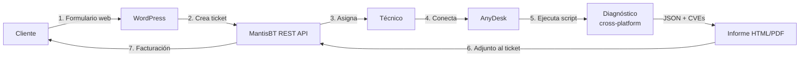
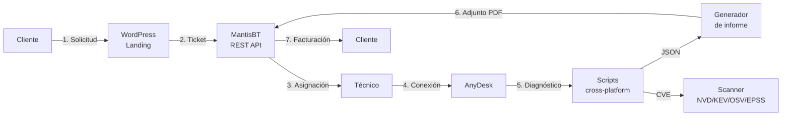
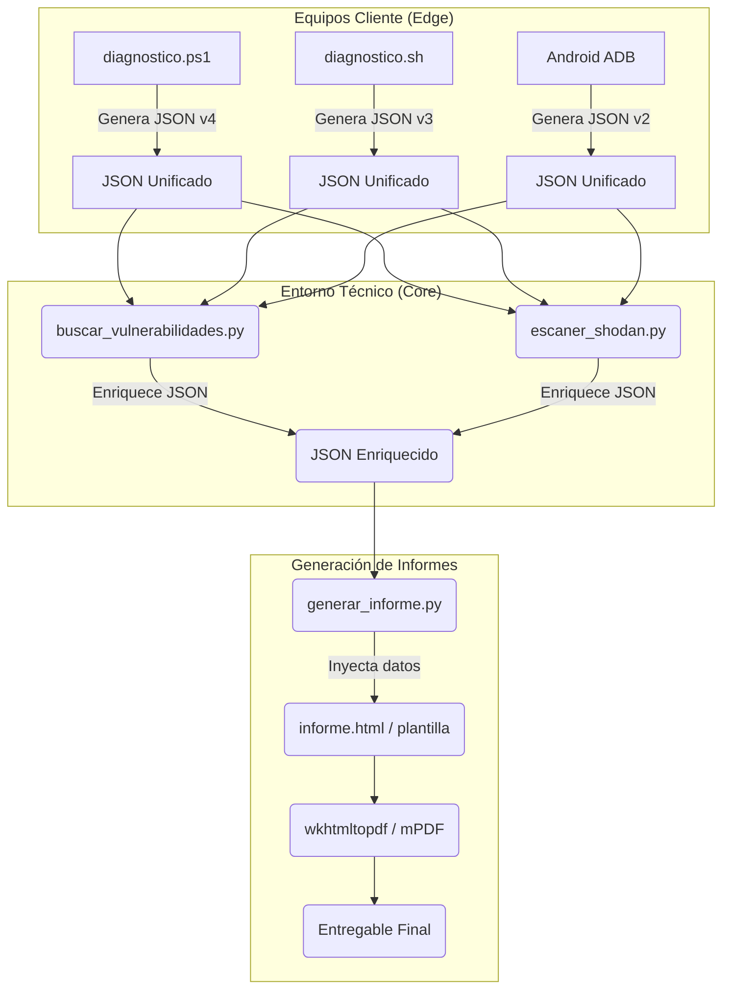

# ResolveCore — Documentación Unificada del Proyecto
> **TFG ASIR 2024/25 — Francisco Vidal Mateo**
> Generado automáticamente el 20/05/2026 12:59

---


<div style='page-break-after: always;'></div>

<!--===========================================================-->
<!-- ARCHIVO: .\README.md -->
<!--===========================================================-->


<div align="center">

<picture>
  <source media="(prefers-color-scheme: dark)" srcset="assets/logo/resolvcore-logo-dark.png">
  <source media="(prefers-color-scheme: light)" srcset="assets/logo/resolvcore-logo-light.png">
  
</picture>

# ResolveCore

**Plataforma cross-platform de mantenimiento, diagnóstico y optimización remota.**

*Solución a tus problemas informáticos.*

<br/>

[](#estado-del-proyecto)
[](#estado-del-proyecto)
[](#licencia)
[](docs/defensa/defensa-tfg.md)

<br/>


</div>

---

## Tabla de contenidos

1. [Resumen ejecutivo](#resumen-ejecutivo)
2. [Flujo del servicio](#flujo-del-servicio)
3. [Stack tecnológico](#stack-tecnológico)
4. [Estructura del repositorio](#estructura-del-repositorio)
5. [Instalación](#instalación)
6. [Uso rápido](#uso-rápido)
7. [Módulos](#módulos)
8. [Seguridad y reversibilidad](#seguridad-y-reversibilidad)
9. [Documentación](#documentación)
10. [Roadmap](#roadmap)
11. [Estado del proyecto](#estado-del-proyecto)
12. [Licencia](#licencia)
13. [Autor](#autor)

---

## Resumen ejecutivo

**ResolveCore** es una plataforma de soporte técnico remoto estructurada en 7 fases: solicitud → ticket (MantisBT) → conexión remota (AnyDesk) → diagnóstico (PowerShell/Bash/Python) → resolución → informe PDF → facturación.

**Propuesta de valor**

- **Diagnóstico automatizado** con scoring 0-100 sobre CPU, RAM, disco, red y seguridad.
- **Trazabilidad completa**: del ticket al informe técnico al cierre facturado.
- **Cross-platform real**: paridad funcional entre Windows, Linux, macOS y Android.
- **Escáner CVE multi-feed** sin dependencias pip — solo Python 3.8+ stdlib.
- **Cero vendor lock-in**: APIs públicas, software libre, integraciones REST estándar.

---

## Flujo del servicio



---

## Stack tecnológico

| Componente | Tecnología | Versión | Rol |
|---|---|---|---|
| Frontend / CMS | WordPress (PHP) | 6.x / 8.2+ | Web pública, formulario de contacto |
| Tema | resolvecore-theme | 3.0.0 | Dark theme custom, sin frameworks CSS |
| Plugin integración | rc-mantisbt | 1.0.0 | Crea tickets MantisBT desde el formulario |
| Gestión tickets | MantisBT | 2.27 LTS | REST API, campos personalizados, plugins |
| Scripts Windows | PowerShell | 5.1+ | Diagnóstico, optimización, informes |
| Scripts Linux/macOS | Bash | 4+ | Diagnóstico, optimización |
| Scripts Android | Bash (ADB) | — | Diagnóstico remoto vía ADB |
| Escáner vulns/red | Python | 3.8+ stdlib | NVD, CISA KEV, OSV, EPSS, Shodan, Nmap |
| Informe técnico | HTML → PDF | — | wkhtmltopdf / DomPDF (en desarrollo) |
| Base de datos | MariaDB / MySQL | 10.4+ / 8.0+ | MantisBT + vulnerabilidades |
| Acceso remoto | AnyDesk | — | Conexión al equipo del cliente |
| Entorno dev | LocalWP | — | PHP 8.2, nginx, MySQL local |
| Contenedores | Docker Compose | — | MantisBT local (localhost:8989) |

---

## Estructura del repositorio

```text
ResolveCore/
├── wordpress/
│   ├── resolvecore-theme/          Tema dark custom (PHP + CSS + JS vanilla)
│   │   ├── front-page.php          Landing page con hero, servicios, precios, contacto
│   │   ├── page-docs.php           Página de documentación pública
│   │   ├── page-changelog.php      Historial de versiones
│   │   ├── page-contacto.php       Formulario de soporte
│   │   ├── header.php / footer.php Layout global
│   │   ├── functions.php           Hooks, AJAX, integración MantisBT
│   │   ├── style.css               Variables CSS, layout, responsive
│   │   └── assets/
│   │       ├── js/main.js          JS vanilla (formulario AJAX, nav)
│   │       └── logo/               SVG + PNG (dark / light / icon)
│   └── plugins/rc-mantisbt/        Plugin integración MantisBT vía REST
│       ├── rc-mantisbt.php         Plugin principal + panel de ajustes
│       └── includes/
│           └── class-mantis-api.php  Cliente REST (create_issue, get_issue...)
├── mantisbt/
│   ├── docker-compose.yml          Stack local: MantisBT 2.27 + MySQL 5.7
│   ├── config/
│   │   ├── config_inc.php          Config real (local, no commiteada)
│   │   └── config_inc.php.template Plantilla para producción
│   ├── sql/
│   │   ├── mantisbt-db.sql         Dump local (no commiteado)
│   │   └── resolvecore-setup.sql   Categorías + campos personalizados ResolveCore
│   └── plugins/                    EventLog, Kanban, SetDuedate, Reminder, mailtemplate, source-integration
├── scripts/
│   ├── windows/
│   │   ├── ResolveCore.ps1         TUI launcher (menú interactivo)
│   │   ├── diagnostico.ps1         Diagnóstico completo v4.1.0
│   │   └── optimizacion.ps1        Optimización con --dry-run y --undo
│   ├── linux/
│   │   ├── ResolveCore.sh          TUI launcher Linux
│   │   ├── diagnostico.sh          Diagnóstico completo v3.2.0
│   │   └── optimizacion.sh         Optimización con --dry-run v3.2.0
│   ├── macos/                      Equivalente Linux para macOS
│   ├── android/                    Diagnóstico + optimización vía ADB
│   ├── common/                     Python — Hexagonal Architecture
│   │   ├── domain/                 Modelos: Host, Vulnerability, Service
│   │   ├── ports/                  Interfaces: HostIntelSource
│   │   ├── adapters/               Implementaciones: shodan_rest.py
│   │   ├── buscar_vulnerabilidades.py  Motor CVE multi-feed (NVD/KEV/OSV/EPSS)
│   │   ├── escaner_shodan.py       Auditoría exposición pública (Shodan API)
│   │   └── escaner_nmap.py         Escáner de puertos (Nmap wrapper)
│   ├── setup/                      Setup entorno técnico (Linux + Windows)
│   ├── server/                     Bootstrap VPS (post-install.sh, bootstrap-mantis.sh)
│   └── diagnosticos/               Salidas JSON + HTML generadas (gitignored)
├── reports/
│   └── informe.html                Plantilla HTML del informe técnico
├── vulnerabilities/
│   └── migrations/                 SQL idempotentes (0001_init.sql)
├── assets/logo/                    Logos SVG + PNG (dark / light / icon)
└── docs/
    ├── INDEX.md                    Índice navegable de toda la documentación
    ├── defensa/                    Docs para tribunal y tutor (defensa-tfg, informe-tutor...)
    ├── tecnica/                    Docs técnicas del sistema (stack, entornos, servicios...)
    ├── scripting/                  Arquitectura scripts, schemas JSON, regex
    └── capturas/                   Evidencias del sprint (lun19, mar20)
```

---

## Instalación

### Requisitos

| Componente | Versión mínima |
|---|---|
| WordPress | 6.0 |
| PHP | 8.2 |
| MariaDB / MySQL | 10.4 / 8.0 |
| PowerShell (Windows) | 5.1 (incluido en Win 10/11) |
| Bash (Linux / macOS) | 4.0 |
| Python (scanner CVE) | 3.8 |
| MantisBT | 2.27 LTS |
| Docker + Compose | 20.x+ |

### 1. Entorno de desarrollo (LocalWP)

```bash
# 1. Descargar LocalWP desde https://localwp.com
# 2. Crear sitio: nombre=ResolveCore, PHP 8.2, nginx, MySQL
# 3. Clonar tema en wp-content/themes/
git clone https://github.com/Haplee/ResolveCore.git
ln -s /ruta/ResolveCore/wordpress/resolvecore-theme \
      ~/Local\ Sites/resolvecore/app/public/wp-content/themes/resolvecore-theme
```

### 2. MantisBT local (Docker)

```bash
docker compose -f mantisbt/docker-compose.yml up -d
# Acceder a http://localhost:8989
# Aplicar setup: mantisbt/sql/resolvecore-setup.sql
```

### 3. Plugin WordPress → MantisBT

```bash
# Copiar plugin al WordPress de desarrollo
cp -r wordpress/plugins/rc-mantisbt \
      ~/Local\ Sites/resolvecore/app/public/wp-content/plugins/

# Activar en WP Admin → Plugins
# Configurar en Ajustes → MantisBT: URL + API Token
```

### 4. Scripts de diagnóstico

```bash
# Clonar en la máquina del técnico
git clone https://github.com/Haplee/ResolveCore.git
cd ResolveCore

# Variables de entorno para Python (opcional)
cp .env.example .env   # añadir SHODAN_API_KEY, NVD_API_KEY
```

---

## Uso rápido

### TUI Launcher

```powershell
# Windows — menú interactivo
pwsh ./scripts/windows/ResolveCore.ps1
```

```bash
# Linux / macOS — menú interactivo
bash ./scripts/linux/ResolveCore.sh
bash ./scripts/macos/ResolveCore.sh
```

### Diagnóstico directo

```powershell
# Windows — genera JSON + HTML en scripts/diagnosticos/
pwsh ./scripts/windows/diagnostico.ps1

# Con directorio de salida personalizado
pwsh ./scripts/windows/diagnostico.ps1 -OutputDir C:\reports
```

```bash
# Linux
bash ./scripts/linux/diagnostico.sh

# Android (requiere ADB conectado)
bash ./scripts/android/diagnostico.sh
```

### Optimización

```bash
# Linux — previsualizar sin aplicar
bash ./scripts/linux/optimizacion.sh --dry-run

# Linux — aplicar y guardar estado previo
bash ./scripts/linux/optimizacion.sh

# Linux — revertir
bash ./scripts/linux/optimizacion.sh --undo
```

### Escáner de vulnerabilidades y red

```bash
# CVE multi-feed (NVD + CISA KEV + OSV + EPSS)
python3 scripts/common/buscar_vulnerabilidades.py --output json

# Auditoría exposición pública (Shodan)
python3 scripts/common/escaner_shodan.py

# Escáner de puertos (requiere nmap instalado)
python3 scripts/common/escaner_nmap.py
```

---

## Módulos

### 1. Diagnóstico multiplataforma

| SO | Versión | Métricas recogidas |
|---|---|---|
| Windows | v4.1.0 | CPU/RAM/disco, servicios, Event Log, Windows Update, software instalado (con conteo real), red, firewall |
| Linux | v3.2.0 | CPU/RAM/disco, systemd, journalctl, puertos, sensores (lm-sensors), S.M.A.R.T., paquetes |
| macOS | — | system_profiler, pmset, vm_stat, brew, puertos |
| Android | v2.2.0 | Batería, almacenamiento, apps, conectividad (vía ADB) |

Todos generan JSON estructurado + HTML visual con inyección segura (`<script type="application/json">`).

### 2. Optimización

| Flag | Efecto |
|---|---|
| `--dry-run` | Muestra qué haría sin ejecutar nada (respetado en todas las fases) |
| `--undo` | Revierte al estado guardado antes de la última optimización |
| _(sin flags)_ | Aplica optimizaciones y guarda estado previo |

**Spooler de impresión siempre excluido** por política (impacto crítico en usuarios finales).

### 3. Escáner CVE y red (Python — Hexagonal Architecture)

| Módulo | Feed / Herramienta | Salida |
|---|---|---|
| `buscar_vulnerabilidades.py` | NVD (NIST), CISA KEV, OSV, EPSS-FIRST | JSON, HTML, texto |
| `escaner_shodan.py` | Shodan REST API | Puertos, CVEs, org, país |
| `escaner_nmap.py` | Nmap (wrapper) | Puertos, servicios, OS |

Sin dependencias `pip` — solo Python 3.8+ stdlib.

### 4. Plugin WordPress: rc-mantisbt

Cliente REST para MantisBT 2.x. Cuando el usuario envía el formulario de contacto, el plugin crea automáticamente un ticket en MantisBT y devuelve el número al cliente:

> *"¡Mensaje enviado! Ticket #42 creado. Te responderemos pronto."*

Panel de configuración en **Ajustes → MantisBT**: URL, API Token, ID de proyecto.

### 5. Tema WordPress: resolvecore-theme

Tema dark custom (sin Bootstrap, sin Tailwind). Paleta `#0a0c10` / `#00e5a0`. Páginas incluidas: landing, documentación, changelog, contacto. Responsive, AJAX nativo.

---

## Seguridad y reversibilidad

- **`--dry-run`** respetado en todas las fases de optimización (cache, logs, sysctl, servicios).
- **Backup automático** de sysctl / registro antes de cualquier optimización.
- **`--undo`** revierte al estado guardado anteriormente.
- **Inyección JSON segura** en informes HTML: JSON en `<script type="application/json">`, parseado con `JSON.parse()`. Evita XSS si un valor contiene `</script>`.
- **Spooler excluido por política**: la cola de impresión nunca se toca.
- **Credenciales fuera del repo**: `wp-config.php`, `config_inc.php` y tokens vía variables de entorno. Los archivos de configuración con valores reales están en `.gitignore`.
- **Reglas udev ADB** con lista de vendor IDs oficiales de Google (sin `ATTR{idVendor}=="*"` que es sintaxis inválida).

---

## Documentación

| Documento | Descripción |
|---|---|
| [`docs/INDEX.md`](docs/INDEX.md) | Índice navegable de toda la documentación |
| [`docs/defensa/defensa-tfg.md`](docs/defensa/defensa-tfg.md) | Memoria técnica del TFG — FAQs del tribunal, decisiones justificadas |
| [`docs/defensa/informe-tutor-estado-proyecto.md`](docs/defensa/informe-tutor-estado-proyecto.md) | Estado del proyecto para el tutor (actualizado 20/05) |
| [`docs/defensa/origen-componentes.md`](docs/defensa/origen-componentes.md) | Autoría de cada componente: terceros, propio, uso de IA |
| [`docs/tecnica/stack-tecnologico.md`](docs/tecnica/stack-tecnologico.md) | Justificación del stack tecnológico con comparativas |
| [`docs/tecnica/entornos.md`](docs/tecnica/entornos.md) | Entornos dev/prod y política de backup |
| [`docs/tecnica/flujo-sistema.md`](docs/tecnica/flujo-sistema.md) | Diagrama del flujo completo del sistema |
| [`docs/tecnica/mantis-integration.md`](docs/tecnica/mantis-integration.md) | Integración WordPress ↔ MantisBT (endpoints, payloads) |
| [`docs/tecnica/servicios-adicionales.md`](docs/tecnica/servicios-adicionales.md) | Clonación, congelación, acceso remoto, cifrado |
| [`docs/scripting/arquitectura-scripting.md`](docs/scripting/arquitectura-scripting.md) | Arquitectura de módulos: diagnóstico → JSON → informe → PDF |
| [`docs/scripting/schema-diagnostico.md`](docs/scripting/schema-diagnostico.md) | Esquema JSON unificado de diagnóstico |

---

## Roadmap

| Versión | Objetivo |
|---|---|
| **v1.2** (próxima) | Generación PDF automática (wkhtmltopdf + plantilla HTML) |
| **v1.3** | Sincronización NVD → tabla `rc_vulnerabilities` (cron semanal) |
| **v1.4** | Despliegue VPS productivo + dominio + Let's Encrypt |
| **v2.0** | Facturación: pago por servicio + suscripción (cron) |
| **v3.0** | App nativa Android (Kotlin + Jetpack Compose + Material 3) |

---

## Estado del proyecto

| Indicador | Estado |
|---|---|
| Versión | **1.2.0-beta** |
| Entrega TFG | **5 de junio de 2026** |
| Plataformas | Windows · Linux · macOS · Android |
| Web beta | Operativa en WordPress.com |
| MantisBT | Docker local operativo · VPS pendiente |
| Flujo end-to-end | Formulario WP → ticket MantisBT ✅ |
| Informe HTML | Generado por scripts ✅ |
| Informe PDF | En desarrollo |
| Escáner CVE | NVD · CISA KEV · OSV · EPSS · Shodan ✅ |
| Última actualización | 20 de mayo de 2026 |

---

## Licencia

Distribuido bajo licencia **GNU General Public License v3.0**.

El escáner de vulnerabilidades y los scripts de diagnóstico son software libre. Las APIs consumidas (NVD, CISA KEV, OSV, EPSS-FIRST, Shodan) son públicas y auditables.

---

## Autor

<div align="center">

### Francisco Vidal Mateo

**Técnico Superior en ASIR**  
*TFG 2024/25 · Plataforma de soporte técnico remoto*

| Plataforma | Enlace |
|---|---|
| GitHub | [Haplee](https://github.com/Haplee) |
| Email | [fvidalmateo@gmail.com](mailto:fvidalmateo@gmail.com) |

---

> *"Solución a tus problemas informáticos."*

**ResolveCore** — Proyecto Integrado ASIR 2025-26

</div>


<div style='page-break-after: always;'></div>

<!--===========================================================-->
<!-- ARCHIVO: .\docs\tecnica\stack-tecnologico.md -->
<!--===========================================================-->


# ResolveCore — Stack Tecnológico

> Documento técnico de justificación de tecnologías.  
> Autor: Francisco Vidal Mateo · TFG ASIR 2024/25  
> Última actualización: mayo 2026

---

## Índice

1. [Visión general](#1-visión-general)
2. [Frontend / CMS — WordPress](#2-frontend--cms--wordpress)
3. [Gestión de incidencias — MantisBT](#3-gestión-de-incidencias--mantisbt)
4. [Plugins MantisBT](#4-plugins-mantisbt)
5. [Acceso remoto — AnyDesk](#5-acceso-remoto--anydesk)
6. [Scripts de diagnóstico — PowerShell / Bash](#6-scripts-de-diagnóstico--powershell--bash)
7. [Base de datos — MariaDB](#7-base-de-datos--mariadb)
8. [Servidor web — Nginx + PHP-FPM](#8-servidor-web--nginx--php-fpm)
9. [Integración REST — MantisBT API](#9-integración-rest--mantisbt-api)
10. [Control de versiones — Git / GitHub](#10-control-de-versiones--git--github)
11. [Generación de informes — PDF](#11-generación-de-informes--pdf)
12. [Futuro — App Android](#12-futuro--app-android)
13. [Auditoría de exposición — Shodan](#13-auditoría-de-exposición--shodan)
14. [Clonado e imágenes de SO](#14-clonado-e-imágenes-de-so)
15. [Seguridad en cliente — Cifrado y gestores](#15-seguridad-en-cliente--cifrado-y-gestores)
16. [Resumen comparativo](#16-resumen-comparativo)

---

## 1. Visión general

ResolveCore es una plataforma de soporte técnico remoto estructurada en 7 fases:

```
Solicitud → Ticket (MantisBT) → Acceso remoto (AnyDesk) →
Diagnóstico (PS/Bash) → Resolución → Informe PDF → Facturación
```

El stack combina herramientas de código abierto maduras, con integración vía API REST, para cubrir todos los módulos del ciclo ASIR: administración de sistemas, redes, bases de datos, seguridad y servicios en red.

---

## 2. Frontend / CMS — WordPress

### Tecnología elegida

**WordPress 6.x** con tema personalizado `resolvecore-theme` (PHP puro, sin builders).

### Plan de WordPress elegido

WordPress.com ofrece cuatro planes. ResolveCore requiere el plan **Business** (mínimo) por la necesidad de instalar plugins propios.

| Característica | Gratuito | Personal | Business | VIP |
|---------------|----------|---------|---------|-----|
| Precio (aprox.) | 0 €/mes | ~4 €/mes | ~25 €/mes | Contacto |
| Plugins propios | ❌ | ❌ | ✅ | ✅ |
| Themes propios | ❌ | ❌ | ✅ | ✅ |
| Dominio personalizado | ❌ | ✅ | ✅ | ✅ |
| SSL automático | ✅ | ✅ | ✅ | ✅ |
| Acceso SFTP/DB | ❌ | ❌ | ✅ | ✅ |
| Soporte prioritario | ❌ | Chat | Chat + Email | Dedicado |
| Sin anuncios WordPress.com | ❌ | ✅ | ✅ | ✅ |
| WooCommerce | ❌ | ❌ | ✅ | ✅ |

**Por qué Business y no VIP:** VIP está orientado a grandes medios (CNN, TechCrunch). El coste es desproporcionado para un proyecto académico. Business proporciona todo lo necesario: plugin `rc-mantisbt`, tema personalizado `resolvecore-theme`, dominio `resolvecore.com` y acceso SFTP para despliegue.

**Alternativa considerada (WordPress.org + hosting propio):** WordPress.org (software libre) sobre VPS propio daría control total. Se descarta para la fase actual porque WordPress.com Business elimina la gestión de servidor en el periodo del TFG. El despliegue en VPS propio (Oracle Cloud Free Tier) está planificado para producción final.

---

### Por qué WordPress

| Criterio | WordPress | Joomla | Drupal | Desarrollo custom |
|----------|-----------|--------|--------|-------------------|
| Curva de aprendizaje | Baja | Media | Alta | Alta |
| Ecosistema de plugins | 60 000+ | ~7 000 | ~50 000 | N/A |
| Comunidad / documentación | Muy amplia | Media | Media | N/A |
| Hosting compartido | Omnipresente | Común | Menos común | Variable |
| Tiempo de desarrollo | Bajo | Medio | Alto | Muy alto |
| Estándares PHP modernos (WPCS) | Sí | Parcial | Sí | Sí |
| Relevancia mercado laboral | 43% web mundial | ~2% | ~2% | — |

**Razón principal:** WordPress permite entregar un frontend profesional en el tiempo disponible para el TFG, con formularios AJAX, modo mantenimiento, SEO y un sistema de plugins que facilita la integración con MantisBT. El desarrollo de un CMS custom aportaría poco valor pedagógico frente al tiempo invertido. El stack completo (frontend + backend + BBDD) en un único sistema es el adecuado para demostrar administración web en ASIR, reduce dependencias de servicios externos y simplifica el despliegue en VPS propio.

### Componentes del tema

- `front-page.php` — Landing page con demo interactiva, formulario AJAX, pricing
- `page-docs.php` — Documentación técnica con sidebar navegable
- `page-changelog.php` — Historial de versiones con timeline visual
- `functions.php` — Lógica PHP: AJAX handlers, rate limiting, integración MantisBT

---

## 3. Gestión de incidencias — MantisBT

### Tecnología elegida

**MantisBT 2.x** (Bug Tracker de código abierto, PHP + MySQL).

### Evolución de versiones MantisBT

| Versión | Año | Hitos principales |
|---------|-----|-------------------|
| 1.0.x | 2002-2006 | Primera versión estable. Solo SOAP, sin REST. PHP 4. |
| 1.2.x | 2010-2014 | Campos personalizados, plugins básicos. PHP 5. |
| 1.3.x LTS | 2015-2018 | Última rama 1.x. Soporte extendido. Sin REST nativa. |
| 2.0.x | 2017 | Reescritura UI (Bootstrap), REST API v1 introducida, PHP 5.6+. |
| 2.4.x – 2.25.x | 2018-2023 | Mejoras incrementales: API OAuth, 2FA, JSON configurable. |
| **2.26.x LTS** | 2023-2024 | Long Term Support. PHP 8.1+. Soporte hasta 2025. |
| **2.27.x** | 2024-act. | Versión actual. PHP 8.2, MariaDB 10.6, mejoras API. Elegida para ResolveCore. |

**Por qué 2.27 y no 2.26 LTS:** La rama LTS garantiza parches de seguridad sin nuevas features. Para un entorno de producción de empresa, LTS sería la elección. Para un TFG donde se demuestran capacidades técnicas actuales, 2.27 incluye mejoras en la API REST que simplifican la integración con el plugin WordPress.

---

### Por qué MantisBT

| Criterio | MantisBT | Jira | GitLab Issues | Redmine | osTicket |
|----------|----------|------|---------------|---------|---------|
| Licencia | GPL (gratis) | Comercial (≥$8.15/user/mes) | GPL (gratis) | GPL (gratis) | GPL (gratis) |
| Autohospedaje | Sí | Cloud / Server costoso | Sí (GitLab CE) | Sí | Sí |
| REST API | Sí (v2+) | Sí | Sí | Sí (parcial) | No nativa |
| Curva de aprendizaje | Baja | Alta | Media | Media | Baja |
| Plugins disponibles | ~30 oficiales | Miles (pagos) | Integrado en GitLab | ~100 | ~20 |
| Workflow personalizable | Sí | Sí | Limitado | Sí | Sí |
| PHP nativo | Sí | No (Java) | No (Ruby/Go) | Sí | Sí |
| Integración GitHub | Plugin oficial | Sí | Nativo | Plugin | No |

**Razón principal:** MantisBT es la opción de bug tracker open-source más fácil de instalar en un VPS con PHP + MySQL (mismo stack que WordPress). Ofrece REST API completa desde la versión 2.0, flujo de estados configurable (new → assigned → resolved → closed), campos personalizados y un ecosistema de plugins suficiente para las necesidades de ResolveCore.

**Por qué no Jira:** Licencia comercial incompatible con un proyecto académico sin presupuesto. La complejidad de configuración supera las necesidades del TFG.

**Por qué no GitLab Issues:** Requeriría instalar GitLab completo (Ruby, Go, PostgreSQL, Redis, ~4GB RAM) solo para gestionar tickets. MantisBT ocupa <50MB y funciona en cualquier VPS básico.

**Por qué no Redmine:** Requiere Ruby on Rails, más complejo de administrar en entorno PHP. MantisBT encaja mejor con el stack PHP/MySQL del proyecto.

### Flujo de ticket en ResolveCore

```
new → acknowledged → assigned → resolved → closed
         ↑                          ↓
      feedback ←────────────────────┘
```

Campos personalizados añadidos:
- **Plataforma:** Windows / Linux / macOS / Android / Otro
- **AnyDesk ID:** identificador de sesión remota

---

## 4. Plugins MantisBT

### 4.1 source-integration

**Repositorio:** github.com/mantisbt-plugins/source-integration

**Función:** Vincula commits de GitHub con tickets MantisBT. Al incluir `fix #42` en un commit, el ticket #42 se marca automáticamente como resuelto y se adjunta el enlace al commit.

**Por qué:** Demuestra integración DevOps entre control de versiones y gestión de incidencias. Cubre el módulo ASIR de administración de sistemas y herramientas de desarrollo. Alternativa nativa no existe en MantisBT; este plugin es el estándar oficial.

**Configuración:** webhook en GitHub → `POST /mantis/plugin.php?page=Source/checkin`

---

### 4.2 MantisKanban

**Repositorio:** github.com/mantisbt-plugins/MantisKanban

**Función:** Añade una vista Kanban sobre los tickets del proyecto. Columnas: Nuevo / En proceso / Feedback / Resuelto / Cerrado.

**Por qué:** Visualización inmediata del estado de las incidencias durante la demo de defensa. El tribunal puede ver el flujo de trabajo en tiempo real. Alternativas como Trello o Azure Boards requieren servicios externos y no se integran con MantisBT.

---

### 4.3 SetDuedate

**Repositorio:** github.com/mantisbt-plugins/SetDuedate

**Función:** Asigna automáticamente fecha de vencimiento al crear un ticket, según su prioridad.

**Mapeo SLA ResolveCore:**

| Prioridad | Vencimiento |
|-----------|-------------|
| Inmediata | 1 hora |
| Urgente | 2 horas |
| Alta | 4 horas |
| Normal | 24 horas |
| Baja | 72 horas |

**Por qué:** Automatiza el SLA prometido en la landing page (`<2h de respuesta`). Sin este plugin, el técnico debe establecer la fecha manualmente en cada ticket. Ningún otro plugin MantisBT cubre esta funcionalidad.

---

### 4.4 Reminder

**Repositorio:** github.com/mantisbt-plugins/Reminder

**Función:** Envía notificaciones por email cuando un ticket lleva X horas sin cambio de estado.

**Por qué:** Garantiza que ningún ticket quede sin atender más del tiempo acordado en el SLA. Complementa SetDuedate con avisos proactivos. Funciona vía cron del servidor, sin depender de servicios externos.

---

### 4.5 mailtemplate

**Repositorio:** github.com/mantisbt-plugins/mailtemplate

**Función:** Sustituye los emails de texto plano de MantisBT por plantillas HTML con la identidad visual de ResolveCore.

**Por qué:** Los emails de notificación son el punto de contacto principal con el usuario. Emails HTML con el branding del proyecto (fondo oscuro, acento verde `#00e5a0`) ofrecen una imagen profesional coherente. MantisBT por defecto solo envía texto plano.

---

### 4.6 EventLog

**Repositorio:** github.com/mantisbt-plugins/EventLog

**Función:** Registra todos los eventos de MantisBT: logins, creación/modificación de tickets, cambios de configuración, subida de archivos.

**Por qué:** Trazabilidad y auditoría, requisito de seguridad del módulo ASIR. Permite demostrar que el sistema registra quién hizo qué y cuándo sobre cada incidencia. Cubre normativas de seguridad básica (control de acceso, registro de actividad). No existe funcionalidad equivalente en MantisBT sin este plugin.

---

## 5. Acceso remoto — AnyDesk

### Tecnología elegida

**AnyDesk** (acceso remoto por escritorio).

### Por qué AnyDesk

| Criterio | AnyDesk | TeamViewer | RustDesk | VNC | SSH |
|----------|---------|-----------|----------|-----|-----|
| Licencia uso personal/educativo | Gratuita | Gratuita (limitada) | Gratuita (OSS) | Gratuita | Gratuita |
| Rendimiento (codec DeskRT) | Muy alto | Alto | Medio | Bajo | N/A |
| Latencia en conexiones pobres | Muy baja | Baja | Media | Alta | N/A |
| Compatible Windows+Linux+Android | Sí | Sí | Sí | Sí (parcial) | Solo CLI |
| Instalación en cliente | Opcional (portable) | Requerida | Opcional | Requerida | Requerida |
| ID único por dispositivo | Sí | Sí | Sí | No | No |
| Transferencia de archivos | Sí | Sí | Sí | No nativa | Sí (SCP) |

**Razón principal:** AnyDesk ofrece la mejor relación rendimiento/coste para uso educativo. El codec DeskRT minimiza la latencia incluso en conexiones lentas, lo que es crítico para diagnóstico remoto en tiempo real. La versión portable no requiere instalación en el equipo del cliente.

**Por qué no TeamViewer:** Detecta uso "comercial" en sesiones largas y bloquea la conexión en la versión gratuita. Poco fiable para demos en entornos de evaluación.

**Por qué no RustDesk (auto-alojado):** Requiere configurar un servidor relay propio, añadiendo complejidad de infraestructura innecesaria para el alcance del TFG.

**Integración con MantisBT:** El ID de AnyDesk del cliente se almacena como campo personalizado en el ticket, permitiendo al técnico iniciar la sesión remota directamente desde MantisBT.

---

## 6. Scripts de diagnóstico — PowerShell / Bash

### Tecnología elegida

- **PowerShell 7+** para Windows
- **Bash (sh-compatible)** para Linux / macOS / Android

### Por qué PowerShell en Windows

| Criterio | PowerShell 7 | CMD / .bat | Python | WMI/WMIC |
|----------|-------------|-----------|--------|---------|
| Acceso a WMI/CIM | Nativo | Limitado | Via pywin32 | Nativo |
| Objetos estructurados | Sí (PSCustomObject) | No | Sí | Parcial |
| Salida JSON | `ConvertTo-Json` nativo | No | `json.dumps()` | No |
| Manejo de errores | try/catch robusto | Limitado | try/except | Limitado |
| Multiplataforma | Sí (PS7) | No | Sí | Solo Windows |
| Disponible sin instalación | Win 10/11 (PS5) | Siempre | No (Python 3) | Siempre |
| Integración con Windows Update | Sí | No | Via subprocess | Parcial |

**Razón principal:** PowerShell 7 proporciona acceso nativo a todas las APIs de Windows (WMI, CIM, Event Log, Windows Update, S.M.A.R.T.) con salida en objetos tipados que se serializan directamente a JSON. Ninguna otra shell en Windows ofrece esta integración sin dependencias adicionales.

### Por qué Bash en Linux/macOS/Android

| Criterio | Bash | Python | Perl | Zsh |
|----------|------|--------|------|-----|
| Disponible por defecto | Prácticamente siempre | No garantizado | No garantizado | No siempre |
| Dependencias | Ninguna | Python 3 instalado | Perl instalado | Ninguna |
| Llamadas a herramientas del sistema | Nativo | subprocess | system() | Nativo |
| Portabilidad sh-compatible | Sí | N/A | N/A | Parcial |
| Curva de aprendizaje ASIR | Baja | Media | Alta | Baja |

**Razón principal:** Bash garantiza funcionamiento en cualquier sistema Linux sin instalar nada. Los diagnósticos (CPU, RAM, disco, red, logs del sistema) se realizan llamando a herramientas estándar (`top`, `df`, `ss`, `journalctl`) que Bash orquesta directamente.

### Salida estructurada

Ambos scripts generan un objeto JSON común:

```json
{
  "metadata": { "platform": "Windows", "version": "3.0.0", "timestamp": "..." },
  "hardware":  { "cpu": {...}, "ram": {...}, "disk": [...], "battery": {...} },
  "os":        { "name": "...", "build": "...", "updates_pending": 3 },
  "security":  { "firewall": true, "av_active": true, "vulnerabilities": [...] },
  "network":   { "interfaces": [...], "open_ports": [...] },
  "score":     { "health": 87, "risk": "medium" }
}
```

---

## 7. Base de datos — MariaDB

### Tecnología elegida

**MariaDB 10.x** (fork de MySQL, motor InnoDB).

### Por qué MariaDB

| Criterio | MariaDB | MySQL 8 | PostgreSQL | SQLite |
|----------|---------|---------|-----------|--------|
| Compatibilidad MySQL | Casi total | N/A | Parcial | Parcial |
| Licencia | GPL (100% libre) | GPL + Oracle | PostgreSQL | Dominio público |
| Rendimiento lectura | Alto | Alto | Muy alto | Medio |
| Instalación en VPS Linux | Estándar | Común | Menos común | N/A (embebido) |
| Requerido por WordPress | Compatible | Oficial | No | No |
| Requerido por MantisBT | Compatible | Oficial | Soportado | No |
| Comunidad Española / documentación | Amplia | Amplia | Media | Media |

**Razón principal:** MariaDB es el motor predeterminado en la mayoría de distribuciones Linux (Debian, Ubuntu). Es 100% compatible con WordPress y MantisBT, tiene licencia GPL sin restricciones comerciales de Oracle, y su rendimiento es equivalente o superior a MySQL 8 para las cargas de trabajo del proyecto.

**Por qué no PostgreSQL:** MantisBT lo soporta pero WordPress requiere plugins adicionales para PostgreSQL. La combinación MariaDB sirve a ambas aplicaciones sin fricción adicional.

**Tablas personalizadas ResolveCore:**

| Tabla | Contenido |
|-------|-----------|
| `rc_vulnerabilities` | CVEs: id, cve_id, gravedad, SO afectado, descripción, fix |
| `rc_tickets_log` | Historial extendido de tickets (complementa MantisBT) |

---

## 8. Servidor web — Nginx + PHP-FPM

### Tecnología elegida

**Nginx 1.x** + **PHP-FPM 8.2+** en VPS Linux (Ubuntu 22.04 LTS).

### Por qué Nginx

| Criterio | Nginx | Apache 2.4 | Caddy | Lighttpd |
|----------|-------|-----------|-------|---------|
| Rendimiento bajo carga | Muy alto (event-driven) | Alto (process-based) | Alto | Alto |
| Consumo de memoria | Bajo | Medio | Bajo | Bajo |
| Configuración para WordPress | Estándar | .htaccess nativo | Automática | Manual |
| SSL/TLS automático (Let's Encrypt) | Certbot | Certbot | Nativo | Manual |
| Proxy reverso | Excelente | Bueno | Bueno | Limitado |
| Documentación | Muy amplia | Muy amplia | Buena | Media |
| Popularidad servidores VPS | 1º | 2º | 3º | Residual |

**Razón principal:** Nginx maneja concurrencia con bajo consumo de memoria frente a Apache, que crea un proceso/hilo por conexión. Para un VPS con recursos limitados, Nginx permite servir WordPress y MantisBT simultáneamente sin degradación de rendimiento.

### Por qué PHP-FPM

PHP-FPM (FastCGI Process Manager) gestiona un pool de workers PHP independiente del servidor web. Ventajas frente a `mod_php` (integrado en Apache):

- Cada aplicación (WordPress, MantisBT) puede tener su propio pool con usuario Unix distinto
- Reinicio del pool PHP sin reiniciar Nginx
- Control de recursos por pool (max_children, max_requests)

### Por qué Ubuntu 22.04 LTS

- Soporte hasta abril 2027 (más que suficiente para el ciclo de vida del TFG)
- Repositorios oficiales incluyen PHP 8.2, MariaDB 10.6, Nginx actual
- La mayoría de VPS providers ofrecen imagen preconfigurada

---

## 9. Integración REST — MantisBT API

### Tecnología elegida

**MantisBT REST API v1** (JSON sobre HTTP, autenticación por token).

### Flujo de integración

```
WordPress (functions.php)
  → rc_mantis_create_ticket($data)          [plugin rc-mantisbt]
    → RC_Mantis_API::create_issue($body)    [class-mantis-api.php]
      → wp_remote_request(POST /api/rest/issues, Authorization: Token X)
        → MantisBT                          [crea ticket, devuelve ID]
      ← { "issue": { "id": 42 } }
    ← 42
  ← JSON: { success: true, ticket_id: 42, msg: "Ticket #42 creado" }
← JS muestra "[VER TICKET #42]" en el formulario
```

### Por qué REST sobre otras opciones

| Opción | Ventajas | Desventajas |
|--------|----------|-------------|
| REST API (JSON) | Estándar, simple, sin dependencias extra | — |
| SOAP API (MantisBT legacy) | Compatible versiones antiguas | Verboso, obsoleto desde MantisBT 2.0 |
| Acceso directo a BD | Sin latencia de red | Acoplamiento fuerte, rompe con actualizaciones |
| Email-to-ticket (plugin) | Sin código | No devuelve ticket ID al formulario WP |

---

## 10. Control de versiones — Git / GitHub

### Tecnología elegida

**Git** con repositorio remoto en **GitHub**.

### Por qué GitHub

| Criterio | GitHub | GitLab.com | Bitbucket | Gitea (self-hosted) |
|----------|--------|-----------|-----------|-------------------|
| Integración con MantisBT | Plugin oficial (source-integration) | Plugin oficial | No oficial | No oficial |
| CI/CD gratuito | GitHub Actions | GitLab CI (300 min/mes) | Pipelines (50 min/mes) | Requiere Gitea Actions |
| Visibilidad del proyecto (TFG) | Máxima | Alta | Media | Ninguna (privado) |
| Issues, PRs, Releases | Sí | Sí | Sí | Sí |

**Razón principal:** El plugin `source-integration` de MantisBT tiene soporte oficial para GitHub, lo que permite vincular commits con tickets automáticamente. GitHub es además la plataforma con mayor visibilidad para mostrar el proyecto al tribunal.

### Convención de commits

```
<tipo>(<ámbito>): <descripción>

feat(mantisbt): add SetDuedate SLA configuration
fix(scripts): correct PowerShell disk health parsing
docs(stack): add technology justification document
```

### Estrategia de ramas

```
main          ← producción estable
feat/<nombre> ← nuevas funcionalidades
fix/<nombre>  ← correcciones
docs/<nombre> ← documentación
060526        ← rama actual de desarrollo (defensa 5 junio 2026)
```

---

## 11. Generación de informes — PDF

### Estado actual

En desarrollo. Las opciones evaluadas son:

### Opciones comparadas

| Librería | Lenguaje | Calidad | Instalación | Licencia |
|---------|----------|---------|-------------|---------|
| **DomPDF** | PHP | Alta | `composer require dompdf/dompdf` | LGPL |
| **mPDF** | PHP | Muy alta | `composer require mpdf/mpdf` | GPL |
| **wkhtmltopdf** | Binario | Muy alta (Webkit real) | Binario en servidor | LGPL |
| **TCPDF** | PHP | Media | `composer require tecnickcom/tcpdf` | LGPL |
| **Puppeteer** | Node.js | Muy alta | pnpm + Chrome headless | MIT |

**Decisión prevista:** DomPDF o mPDF (PHP nativo, sin binarios externos). wkhtmltopdf produce la mejor calidad pero requiere instalar un binario en el VPS y tiene mantenimiento discontinuado desde 2023.

**Secciones del informe (obligatorias por diseño):**

1. Resumen ejecutivo
2. Incidencias detectadas
3. Problemas solucionados
4. Estado actual del sistema
5. Recomendaciones
6. Proyección de vida útil del hardware

---

## 12. Futuro — App Android

### Tecnología prevista

**Kotlin + Jetpack Compose + Material 3** (nativa Android).

### Por qué nativo sobre otras opciones

| Criterio | Kotlin/Compose | Flutter | PWA |
|----------|---------------|---------|-----|
| Acceso a APIs Android (ADB, diagnóstico) | Total | Parcial (plugins) | Muy limitado |
| Rendimiento | Máximo | Alto | Bajo |
| Material Design 3 | Nativo | Parcial | Via CSS |
| Alineación con ecosistema Android | Total | Parcial | Ninguna |
| Mantenimiento Google | Sí | Sí | Estándar web |

**Razón:** Los diagnósticos Android requieren acceso a APIs nativas (batería, almacenamiento, red, ADB) que solo Kotlin/Android SDK expone completamente. Fase planificada para después de la defensa del TFG.

---

## 13. Auditoría de exposición — Shodan

### Tecnología elegida

**Shodan API REST** (free tier) + módulo Python `escaner_shodan.py` (stdlib, sin `pip install shodan`).

### Por qué Shodan

| Criterio | Shodan | Censys | Fofa | Nmap (local) |
|----------|--------|--------|------|---------------|
| Datos históricos de internet | Sí | Sí | Sí | No |
| Free tier útil | 100 créditos/mes | 250 queries/mes | Limitado | N/A |
| CVEs en respuesta | Sí (campo `vulns`) | Sí | Parcial | No |
| API REST simple | Sí | Sí (más compleja) | Sí | N/A |
| Sin instalación en cliente | Sí | Sí | Sí | No |
| Referencia en ASIR/ciberseguridad | Alta | Media | Baja | Alta |

**Razón principal:** Shodan indexa puertos, banners de servicios y CVEs detectados pasivamente para cualquier IP pública. Permite a ResolveCore ofrecer un informe de exposición sin instalar nada en el equipo del cliente. El free tier (100 créditos/mes, 1 crédito por IP) es suficiente para el TFG.

**Implementación:** `scripts/common/escaner_shodan.py` — Python 3.8+ stdlib, sin dependencias pip. Lee `SHODAN_API_KEY` desde variable de entorno o `.env` local.

```
python escaner_shodan.py --ip 8.8.8.8
python escaner_shodan.py --ip 1.1.1.1 --json
```

**Integración en el catálogo:** Auditoría de exposición Shodan → 30 €/IP/informe → `escaner_shodan.py` genera el JSON que `generar_informe.py` formatea en PDF.

---

## 14. Clonado e imágenes de SO

### Herramientas comparadas

| Herramienta | Tipo | Licencia | Red/Local | SO soportados | Curva | Coste |
|-------------|------|---------|-----------|--------------|-------|-------|
| **Clonezilla Live** | Live USB | GPL | Local (USB/NFS/SFTP) | Windows, Linux, macOS | Baja-Media | Gratis |
| **FOG Project** | Servidor PXE | GPL | Red (LAN) | Windows, Linux | Media | Gratis |
| **WDS + MDT** | Servicio Windows Server | Incluido en Win Server | Red (PXE) | Solo Windows | Alta | Win Server |
| **Veeam Agent Free** | Agente | Freemium | Local + NFS/SMB | Windows, Linux | Baja | Gratis |
| **Acronis Cyber Backup** | Agente + consola | Comercial | Local + Cloud | Windows, Linux | Baja | ~150 €/equipo/año |

### Criterios de elección para ResolveCore

```
Un equipo o intervención puntual     → Clonezilla Live (USB)
Flota mixta >5 equipos (aulas, PYME) → FOG Project
Entorno Windows AD corporativo        → WDS + MDT
Backup programado en producción       → Veeam Agent Free
```

### Casos de uso empresariales

| Escenario | Herramienta elegida | Beneficio |
|-----------|--------------------|-----------|
| Incorporación de nuevo empleado | FOG Project | Imagen corporativa en <20 min |
| Restauración post-ransomware | Clonezilla / Veeam | Vuelta a imagen limpia sin pagar rescate |
| Migración HDD → SSD | Clonezilla | Sector a sector, sin reinstalar SO |
| Actualización de SO en flota | FOG Project | Imagen actualizada → despliegue masivo en LAN |
| Backup previo a intervención mayor | Veeam Agent Free | Punto de restauración antes de cambios |

### Posición en el catálogo ResolveCore

- **Clonación puntual:** 30-60 €/equipo — Clonezilla Live, técnico con USB en cliente
- **Despliegue de imagen en flota:** 15-30 €/equipo — FOG Project (mínimo 3 equipos)
- Ambos servicios se documentan en `docs/servicios-adicionales.md` § 2 y § 6

---

## 15. Seguridad en cliente — Cifrado y gestores

### 15.1 Cifrado de disco

| Herramienta | SO | Licencia | TPM | Algoritmo | Recuperación | Caso de uso |
|-------------|-----|---------|-----|-----------|--------------|-------------|
| **BitLocker** | Windows Pro/Ent | Incluido | Opcional (recomendado) | AES-256-XTS | Clave 48 dígitos | Portátiles corporativos |
| **LUKS (dm-crypt)** | Linux | GPL (kernel) | No | AES-256-XTS | Header de recuperación | Servidores y estaciones Linux |
| **VeraCrypt** | Windows/Linux/macOS | Apache 2.0 | No | AES/Twofish/Serpent | Disco de rescate | Multiplataforma, contenedores cifrados |
| **ecryptfs** | Linux | GPL | No | AES-256 | — | Solo directorio home, sin reinstalar |

**Criterios de elección:**

```
Empresa con Win Pro/Ent + TPM 2.0 → BitLocker (sin coste, integración nativa)
Usuario doméstico con Win Home    → VeraCrypt (gratuito, open source)
Servidor Linux (instalación nueva) → LUKS durante instalación del SO
Portátil Linux sin reinstalar      → VeraCrypt contenedor o ecryptfs home
```

**Por qué no DiskCryptor:** sin mantenimiento activo desde 2014. VeraCrypt lo sustituye con soporte multiplataforma y auditorías de seguridad recientes (2016, 2020).

### 15.2 Gestores de contraseñas

| Gestor | Licencia | Almacenamiento | Sync | 2FA | Compartir | Auditoría | Precio |
|--------|---------|---------------|------|-----|-----------|-----------|--------|
| **Bitwarden** | AGPL (OSS) | Cloud o self-hosted | ✅ | ✅ | ✅ Teams | ✅ | Gratis / 10 €/año Premium |
| **KeePassXC** | GPL | Local (`.kdbx`) | Manual (Dropbox/NAS) | ✅ (TOTP) | ❌ nativo | ❌ nativo | Gratis |
| **1Password** | Propietario | Cloud | ✅ | ✅ | ✅ | ✅ | ~3 €/mes |
| **Dashlane** | Propietario | Cloud | ✅ | ✅ | ✅ | ✅ | ~4 €/mes |

**Decisión para clientes ResolveCore:**

| Perfil cliente | Gestor recomendado | Razón |
|---------------|-------------------|---------|
| Usuario doméstico / autónomo | Bitwarden free | Sync automático, app móvil, sin coste |
| PYME (2-10 personas) | Bitwarden Teams | Compartir contraseñas + auditoría de accesos |
| Máxima seguridad / sin cloud | KeePassXC + NAS | Sin dependencia de terceros |

**Por qué Bitwarden sobre alternativas de pago:** código auditado públicamente (auditorías independientes 2018, 2020, 2022), opción self-hosted (Vaultwarden en VPS propio para clientes con requisitos GDPR estrictos), importación desde LastPass, 1Password o CSV.

**Integración en ResolveCore:** recomendación documentada en el informe PDF de auditoría generado por `generar_informe.py`. Se incluye en la sección "Recomendaciones de seguridad" del informe de cada cliente.

---

## 16. Resumen comparativo

| Componente | Elegido | Alternativa principal | Razón del descarte |
|-----------|---------|----------------------|-------------------|
| CMS | WordPress Business | CMS custom PHP | Tiempo de desarrollo, plugins, comunidad |
| Bug tracker | MantisBT 2.27 | Jira | Coste, complejidad, PHP incompatible |
| Acceso remoto | AnyDesk | TeamViewer | Bloqueo sesiones largas en free |
| Scripts Windows | PowerShell 7 | Python | No requiere instalación adicional |
| Scripts Linux | Bash | Python | Universal, sin dependencias |
| Base de datos | MariaDB | MySQL 8 | WordPress + MantisBT, mismo stack, GPL pura |
| Servidor web | Nginx + PHP-FPM | Apache | Mejor rendimiento, menor consumo RAM |
| Kanban | MantisKanban | Trello | Integración nativa MantisBT |
| VCS integration | source-integration | Manual | Plugin oficial, webhooks automáticos |
| SLA automático | SetDuedate | Manual | Automatiza promesa <2h |
| PDF (previsto) | DomPDF/mPDF | wkhtmltopdf | Sin mantenimiento desde 2023 |
| App Android (futuro) | Kotlin/Compose | Flutter | Acceso total a APIs nativas Android |
| Auditoría exposición | Shodan API | Censys | Free tier más generoso, CVEs en respuesta |
| Clonación puntual | Clonezilla Live | Macrium Reflect | GPL, multiplataforma (Linux/Windows/macOS) |
| Despliegue en flota | FOG Project | WDS + MDT | No requiere Windows Server, multiplataforma |
| Cifrado Windows | BitLocker / VeraCrypt | DiskCryptor | Sin mantenimiento activo |
| Cifrado Linux | LUKS | ecryptfs | Cifrado completo de disco, estándar |
| Gestor contraseñas | Bitwarden | 1Password | OSS, self-hosted, auditorías públicas |

---

*Documento generado en el contexto del TFG ASIR 2024/25 — ResolveCore.*  
*Stack diseñado para máxima coherencia entre componentes, mínimo coste operativo y cobertura completa de los módulos del ciclo formativo.*


<div style='page-break-after: always;'></div>

<!--===========================================================-->
<!-- ARCHIVO: .\docs\tecnica\comparativa-componentes.md -->
<!--===========================================================-->


# ResolveCore — Tablas Comparativas y Justificación Detallada de Componentes

> **Autor:** Francisco Vidal Mateo · TFG ASIR 2024/25
> **Propósito:** Justificación técnica exhaustiva y comparativa frente al tribunal sobre la elección de cada tecnología del stack.

---

## 1. CMS, Plataforma y Alojamiento

En la fase de diseño del portal, la decisión del motor y el alojamiento es clave para soportar la integración (plugins propios) minimizando el coste operativo.

| Opción Evaluada | Coste / Licencia | Características Clave | Decisión y Justificación ASIR |
| :--- | :--- | :--- | :--- |
| **WP.com Gratuito** | 0 € / mes | Subdominio, publicidad forzada. | **Descartado:** Imagen no profesional, sin dominio y no permite plugins de terceros. |
| **WP.com Personal** | ~4 € / mes | Dominio propio, sin publicidad. | **Descartado:** Aunque asume un coste bajo, sigue teniendo capada la instalación de plugins propios. Imposibilita cargar `rc-mantisbt` (esencial para el proyecto). |
| **WP.com Business** | ~25 € / mes | Plugins/temas libres, acceso SFTP. | **Descartado por coste:** Permite la arquitectura completa de ResolveCore, pero su precio es injustificable para la fase de TFG. |
| **WP.org (Autohospedado)** | **~4 € / mes (VPS) o 0 € (LocalWP)** | **Control total (Root), sin límites, plugins libres.** | **ELEGIDO:** Para el desarrollo se utiliza **LocalWP** (coste cero, emula servidor web). Para producción se migra a un **VPS Linux** (aprox 4€/mes). Esto proporciona la potencia del plan Business de 25€, pero aplicando conocimientos ASIR de despliegue web a un coste mínimo. |
| **Desarrollo Custom (PHP)** | Coste en horas | A medida, máxima flexibilidad. | **Descartado:** Reinventar la rueda (gestión de sesiones, XSS, routing) resta tiempo al núcleo del proyecto (integración y automatización). |

---

## 2. Soporte Técnico y Ticketing

El corazón de la trazabilidad requiere un sistema ligero, auditable y con API REST para conectarse con el CMS.

| Componente Evaluado | Tipo y Lenguaje | Consumo RAM / Backend | Decisión y Justificación Técnica |
| :--- | :--- | :--- | :--- |
| **MantisBT 2.27** | **GPL (Open Source) / PHP** | **Muy Bajo (<50 MB) / MySQL** | **ELEGIDO:** Comparte el mismo stack que WordPress (PHP+MariaDB), facilitando el mantenimiento en un único servidor. Su API REST madura y el ecosistema de plugins (MantisKanban, SetDuedate) cubren el flujo ASIR perfectamente. |
| **Jira Software** | Comercial (Atlassian) / Java | Muy Alto (Java Heap) | **Descartado:** Licencia de pago por usuario que compromete el modelo de bajo coste para autónomos. Requiere muchísima más memoria si es self-hosted. |
| **GitLab Issues** | GPL / Ruby & Go | Crítico (>4 GB RAM) | **Descartado:** Instalar un servidor GitLab local o en VPS consume recursos desproporcionados solo para aprovechar su módulo de ticketing. |
| **Redmine** | GPL / Ruby on Rails | Medio | **Descartado:** Mezclar entornos PHP (WordPress) y Ruby (Redmine) complica la administración del servidor y la estandarización. |

---

## 3. Control y Acceso Remoto

| Herramienta | Licencia / Coste | Rendimiento (Latencia) | Decisión y Justificación Técnica |
| :--- | :--- | :--- | :--- |
| **AnyDesk** | **Gratuito (Educativo)** | **Sobresaliente (DeskRT)** | **ELEGIDO:** Su codec (DeskRT) mantiene fluidez incluso en redes 4G deficientes. Es portable (no ensucia el equipo del cliente instalando servicios persistentes) y vincula un ID unívoco que se almacena en el ticket de Mantis. |
| **TeamViewer** | Gratuito condicionado | Alto | **Descartado:** Penaliza drásticamente las sesiones de soporte considerándolas "uso comercial", bloqueando las conexiones a los pocos minutos durante el diagnóstico. |
| **RustDesk** | GPL (Open Source) | Medio / Alto | **Descartado:** A pesar de ser libre, su mejor rendimiento se obtiene desplegando y administrando un servidor de relevo (Relay Server) propio, lo cual suma carga extra de administración de red innecesaria en este TFG. |

---

## 4. Scripting y Motor de Diagnóstico Local

| Sistema | Lenguaje Elegido | Alternativa Principal | Razones de la Decisión frente a la Alternativa |
| :--- | :--- | :--- | :--- |
| **Windows** | **PowerShell 7+** | Python / WMI (VBS) | **Decisión:** PS maneja **objetos nativos tipados** en lugar de cadenas de texto (como Bash/CMD). Accede directamente a las clases CIM/WMI sin dependencias. <br>**Descarte de Python:** Instalar el intérprete Python (`.exe`) más módulos pip (ej. `pywin32`) en el ordenador afectado del cliente rompe la filosofía de intervención limpia e inmediata. |
| **Linux y Android** | **Bash (sh-comp.)** | Python / Perl | **Decisión:** Compatibilidad universal. El script invoca binarios core del sistema (`df`, `free`, `ss`, `adb`) orquestándolos nativamente. <br>**Descarte de Python:** No todos los entornos de servidores embebidos o consolas ADB de Android tienen Python disponible out-of-the-box. Bash sí. |

---

## 5. Infraestructura Base: Base de Datos y Servidor Web

| Rol de Infraestructura | Componente Elegido | Alternativa Directa | Justificación de Arquitectura ASIR |
| :--- | :--- | :--- | :--- |
| **Servidor Web** | **Nginx + PHP-FPM** | Apache 2.4 (mod_php) | **Arquitectura asíncrona:** Nginx procesa conexiones mediante eventos no bloqueantes. Apache tradicional (prefork) abre un hilo por conexión web, disparando el consumo de RAM. Nginx protege al VPS contra agotamiento de memoria bajo picos de carga. |
| **Base de Datos** | **MariaDB 10.6+** | MySQL 8.0 | **Libertad y Rendimiento:** MariaDB es el fork verdaderamente comunitario (GPL pura frente a las licencias duales de Oracle de MySQL). Es el estándar de serie en Ubuntu/Debian y presenta optimizaciones superiores en lectura para el motor InnoDB. |

---

## 6. Ciberseguridad: Auditoría y Cifrado

| Categoría de Seguridad | Componente Elegido | Alternativas y Coste | Justificación |
| :--- | :--- | :--- | :--- |
| **Auditoría de Red (Pasiva)** | **Shodan REST API** | Nmap local / Censys | **Shodan (Free Tier):** Permite detectar servicios expuestos y CVEs vinculados desde el exterior de la IP del cliente *sin* lanzar un escaneo activo de puertos (que dispararía los IDS del cliente). Nmap requiere ser ejecutado localmente y consume más tiempo operativo. |
| **Cifrado Windows** | **BitLocker** | VeraCrypt / DiskCryptor | **BitLocker:** Integración con hardware moderno (TPM 2.0). Cifra el volumen en el arranque de forma transparente en Windows Pro/Enterprise. DiskCryptor carece de mantenimiento y VeraCrypt se reserva solo para versiones Windows Home sin soporte TPM. |
| **Cifrado Linux** | **LUKS (dm-crypt)** | ecryptfs | **LUKS:** Es el estándar robusto del kernel Linux operando a nivel de bloque (cifra la partición entera). Ecryptfs trabaja a nivel de archivo montado (solo cifra /home), lo que expone temporales y logs del sistema operativo. |
| **Gestor de Contraseñas** | **Bitwarden** | 1Password / LastPass | **Bitwarden:** Recomendado en los informes a clientes porque es Open Source, auditado por terceros, gratuito para usuarios básicos y permite despliegue self-hosted (Vaultwarden) para clientes corporativos severos. LastPass queda descartado tras las brechas de seguridad sufridas. |

---

## 7. Despliegue y Sistemas de Clonado

| Categoría de Intervención | Herramienta Elegida | Alternativa Directa | Justificación del Caso de Uso |
| :--- | :--- | :--- | :--- |
| **Desarrollo (Contenedores)** | **Docker Compose** | XAMPP / MAMP | **Aislamiento:** Docker permite reproducir la configuración exacta de MantisBT+MariaDB en cualquier máquina en 10 segundos, frente a los conflictos de puertos y versiones de PHP que acarrea XAMPP. |
| **Clonación Puntual (Física)** | **Clonezilla Live** | Macrium Reflect | **Escenario:** Técnico acude con pendrive. Es software libre (GPL), hace copias bit a bit sector por sector y funciona en Windows y Linux. Macrium es comercial. |
| **Despliegue Flotas (Red)** | **FOG Project** | WDS + MDT (Microsoft) | **Escenario:** Despliegue masivo en aulas. FOG se levanta en un servidor Linux gratuito (PXE boot). WDS/MDT requiere licencias obligatorias de Windows Server y no soporta imágenes Linux con la misma versatilidad. |


<div style='page-break-after: always;'></div>

<!--===========================================================-->
<!-- ARCHIVO: .\docs\tecnica\flujo-sistema.md -->
<!--===========================================================-->


# Flujo del sistema — ResolvCore

> Diagrama y descripción detallada del ciclo completo de soporte técnico de ResolvCore, de la solicitud del cliente al cierre facturado.
>
> **CLAUDE.md** obliga a actualizar este documento al añadir o modificar fases del flujo.

---

## Diagrama de alto nivel



---

## Fases

Las siete fases son secuenciales pero la fase **5** (diagnóstico) puede ejecutarse offline (sin sesión remota) cuando el técnico ya tiene acceso al sistema por otros medios (SSH, ADB, ejecución guiada por el cliente). Esta es la única bifurcación tolerada por diseño.

### Fase 1 — Solicitud del cliente

| Atributo | Detalle |
|---|---|
| **Responsable** | Cliente final |
| **Input** | Necesidad de soporte (incidente, mejora, consulta, licencia) |
| **Herramienta** | Landing WordPress (`wordpress/page-resolvecore.php` o shortcode `[resolvecore_landing]`) |
| **Output** | Formulario enviado con `name`, `email`, `type`, `message` |
| **Persistencia** | Ninguna en esta fase — el formulario delega en WordPress AJAX |

El formulario admite cinco tipos de consulta (`soporte`, `bug`, `colaboracion`, `licencia`, `otro`) que se mapean a categoría + prioridad MantisBT en la fase siguiente.

### Fase 2 — Creación del ticket

| Atributo | Detalle |
|---|---|
| **Responsable** | Plugin `rc-mantisbt` (automático) |
| **Input** | Array sanitizado con los campos del formulario |
| **Herramienta** | `rc_mantis_create_ticket()` → `RC_Mantis_API::create_issue()` → `POST /api/rest/issues` |
| **Output** | `issue_id` numérico de MantisBT |
| **Persistencia** | Ticket en MantisBT con estado `new` |

Mapeo aplicado:

| `type` formulario | Categoría MantisBT | Prioridad |
|---|---|---|
| `soporte` | Soporte técnico | high |
| `bug` | Bug | normal |
| `colaboracion` | Colaboración | low |
| `licencia` | Licencia | normal |
| `otro` | General | low |

Validación de payload: ver [`docs/mantis-integration.md`](mantis-integration.md#validación-de-payload-al-crear-tickets).

### Fase 3 — Asignación

| Atributo | Detalle |
|---|---|
| **Responsable** | Técnico (manual) — plugin **MantisKanban** facilita la vista |
| **Input** | Ticket recién creado en estado `new` |
| **Herramienta** | UI MantisBT + plugin **SetDuedate** (calcula SLA según prioridad) |
| **Output** | Ticket en estado `assigned` con técnico asignado y `due_date` |
| **Notificación** | Plugin **mailtemplate** envía aviso al cliente con número de ticket |

### Fase 4 — Conexión remota

| Atributo | Detalle |
|---|---|
| **Responsable** | Técnico, con autorización explícita del cliente |
| **Input** | ID AnyDesk del cliente (custom field del ticket) |
| **Herramienta** | AnyDesk corporate (sesión cifrada y supervisada) |
| **Output** | Sesión activa sobre el equipo del cliente |
| **Persistencia** | Log de sesión AnyDesk + nota en MantisBT |

Bypass tolerado: SSH (Linux/macOS) o ADB (Android) si el técnico ya tiene acceso por otra vía. En ese caso se salta directamente a la fase 5.

### Fase 5 — Diagnóstico

| Atributo | Detalle |
|---|---|
| **Responsable** | Técnico, vía script |
| **Input** | Sistema objetivo (Windows / Linux / macOS / Android) |
| **Herramienta** | `scripts/<os>/diagnostico.{ps1,sh}` + `scripts/buscar_vulnerabilidades.py` |
| **Output** | JSON conforme a [`docs/schema-diagnostico.md`](schema-diagnostico.md) + opcionalmente HTML/TXT |
| **Persistencia** | `scripts/diagnosticos/diagnostico_<HOST>_<TS>.{json,html}` (gitignored) |

Métricas mínimas por SO:

| SO | Recogidas |
|---|---|
| Windows | CPU/RAM/disco, S.M.A.R.T., servicios críticos, Defender, Windows Update, eventos |
| Linux | Hardware, sensores, paquetes (apt/dnf/pacman), cron, puertos, journalctl |
| macOS | `system_profiler`, `pmset`, `vm_stat`, brew (estado actual: stub `0.1.0-demo`) |
| Android | Versión, batería, almacenamiento, apps instaladas, root status — vía ADB |

Salida estructurada en JSON con `_meta.plataforma` y `_meta.version` obligatorios para que el generador de informes y `rc_mantis_attach_diagnostic()` puedan validar el esquema.

### Fase 6 — Resolución y entrega del informe

| Atributo | Detalle |
|---|---|
| **Responsable** | Técnico (resolución manual) + generador (automático) |
| **Input** | JSON de diagnóstico + acciones aplicadas (`scripts/<os>/optimizacion.*`) |
| **Herramienta** | Plantilla `scripts/informe.html` → wkhtmltopdf/DomPDF → PDF |
| **Output** | Informe PDF con secciones obligatorias (resumen ejecutivo, incidencias detectadas, problemas solucionados, estado actual, recomendaciones, vida útil estimada) |
| **Persistencia** | PDF adjunto al ticket vía `rc_mantis_attach_diagnostic()` + ticket pasa a `resolved` |

**Reversibilidad**: las optimizaciones aplicadas en esta fase son revertibles con `--undo` (Linux/macOS/Android) o `optimizacion.ps1 -Undo` (Windows). El backup previo se almacena junto al log de la sesión.

### Fase 7 — Facturación y cierre

| Atributo | Detalle |
|---|---|
| **Responsable** | Sistema (auto-cierre tras 7 días) o cliente (feedback manual) |
| **Input** | Ticket en estado `resolved` |
| **Herramienta** | MantisBT + módulo de facturación (TBD: ver Roadmap v1.2+) |
| **Output** | Factura emitida según modelo (pago por servicio o suscripción) + ticket en estado `closed` |
| **Persistencia** | Factura en sistema contable + histórico en MantisBT |

Modelos:
- **Pago por servicio**: factura única al cerrar el ticket.
- **Suscripción**: revisiones programadas vía cron, no se factura por intervención sino por mensualidad.

---

## Datos que viajan entre fases

| Origen → Destino | Payload | Formato |
|---|---|---|
| F1 → F2 | Datos del formulario | Array PHP sanitizado |
| F2 → F3 | `issue_id` + ticket completo | JSON respuesta MantisBT |
| F3 → F4 | ID AnyDesk + datos del cliente | Custom fields MantisBT |
| F5 → F6 | Diagnóstico estructurado | JSON (esquema `_meta.*`) |
| F6 → F7 | Informe + estado del ticket | PDF + transición de estado |
| F7 → F1 (suscripción) | Notificación de revisión programada | Email (mailtemplate) |

---

## Cómo modificar el flujo

Si añades, divides o eliminas una fase:

1. Actualiza el diagrama mermaid (este fichero **y** el README).
2. Añade/edita la sección de la fase en este documento (responsable, input, output, herramientas, persistencia).
3. Si afecta al payload entre fases, actualiza la tabla "Datos que viajan entre fases".
4. Si la fase tiene impacto en el esquema JSON, actualiza [`docs/schema-diagnostico.md`](schema-diagnostico.md).
5. Si la fase introduce un nuevo módulo, regístralo en `CLAUDE.md` → "Módulos principales".

---

## Changelog del documento

| Fecha | Cambio |
|---|---|
| 2026-05-09 | Versión inicial — extraído del README y desglosado por fase. |


<div style='page-break-after: always;'></div>

<!--===========================================================-->
<!-- ARCHIVO: .\docs\tecnica\mantis-integration.md -->
<!--===========================================================-->


# MantisBT — Integración con ResolveCore

> Ver también: [`docs/stack-tecnologico.md`](stack-tecnologico.md) para justificación completa de tecnologías.

## Arquitectura

```
Usuario → Formulario WP → functions.php → rc_mantis_create_ticket()
                                        → MantisBT REST API POST /api/rest/issues
                                        ← ticket_id en respuesta JSON
                                        → JS muestra "#ID" en mensaje de éxito
```

## Instalación MantisBT en VPS

### 1. Descargar MantisBT

```bash
cd /var/www
wget https://github.com/mantisbt/mantisbt/releases/download/2.28.1/mantisbt-2.28.1.tar.gz
tar -xzf mantisbt-2.28.1.tar.gz
mv mantisbt-2.28.1 mantis
```

> **Para desarrollo local** (no VPS): el bundle MantisBT no se versiona en este
> repo. Para obtener una copia local:
>
> ```bash
> bash scripts/bootstrap-mantis.sh
> ```
>
> El script descarga el tarball oficial 2.28.1 a `mantisbt-2.28.1/`
> (gitignored). Es idempotente y verifica SHA256 si hay
> `mantisbt/mantis-2.28.1.sha256`.

### 2. Permisos

```bash
chown -R www-data:www-data /var/www/mantis
chmod -R 755 /var/www/mantis
mkdir -p /var/www/mantis/uploads
chmod 775 /var/www/mantis/uploads
```

### 3. Base de datos

```sql
CREATE DATABASE mantisbt CHARACTER SET utf8mb4 COLLATE utf8mb4_unicode_ci;
CREATE USER 'mantis_user'@'localhost' IDENTIFIED BY 'CONTRASEÑA_SEGURA';
GRANT SELECT, INSERT, UPDATE, DELETE, INDEX, CREATE, ALTER, DROP
  ON mantisbt.* TO 'mantis_user'@'localhost';
FLUSH PRIVILEGES;
```

### 4. Nginx (site config)

```nginx
server {
    listen 443 ssl;
    server_name tudominio.com;
    root /var/www/mantis;
    index index.php;

    location ~ \.php$ {
        fastcgi_pass unix:/run/php/php8.2-fpm.sock;
        fastcgi_param SCRIPT_FILENAME $realpath_root$fastcgi_script_name;
        include fastcgi_params;
    }

    location ~* /admin/ {
        deny all;   # Bloquear tras la instalación
    }
}
```

### 5. Instalación web

1. Copiar `mantisbt/config/config_inc.php.template` → `/var/www/mantis/config/config_inc.php`
2. Editar credenciales y URL
3. Abrir `https://tudominio.com/mantis/admin/install.php`
4. Completar el wizard → `Install/Upgrade Database`
5. Verificar en `admin/check/index.php`
6. **Eliminar el directorio `admin/`** antes de abrir al público

### 6. Setup inicial

```bash
# Crear usuario admin desde la UI:
# Mi cuenta → Gestionar → Crear nueva cuenta (nivel: ADMINISTRATOR)
# Deshabilitar la cuenta "administrator" por defecto
```

### 7. Categorías y campos personalizados

```bash
mysql -umantis_user -p mantisbt < mantisbt/sql/resolvecore-setup.sql
```

---

## Plugin WordPress: rc-mantisbt

**Ruta:** `wordpress/plugins/rc-mantisbt/`

### Activación

1. Copiar el directorio `rc-mantisbt/` a `wp-content/plugins/`
2. Activar en WordPress → Plugins → ResolveCore — MantisBT Integration
3. Configurar en Ajustes → MantisBT

### Configuración

| Campo | Descripción |
|-------|-------------|
| URL MantisBT | URL base, p.ej. `https://tudominio.com/mantis` |
| API Token | Generar en MantisBT → Mi cuenta → API Tokens |
| ID Proyecto | ID numérico del proyecto (ver URL al editar el proyecto) |
| Activar | Checkbox para habilitar la creación automática de tickets |

### Almacenamiento de credenciales

El plugin lee URL y token con el siguiente orden de prioridad:

1. **Constantes en `wp-config.php`** (recomendado en producción):

   ```php
   define( 'RC_MANTIS_URL',   'https://tudominio.com/mantis' );
   define( 'RC_MANTIS_TOKEN', 'tu_api_token' );
   ```

   El token nunca se persiste en `wp_options`. La pantalla de ajustes detecta la constante y desactiva el campo correspondiente con un aviso.

2. **`wp_options`** (fallback): si la constante no está definida, se usa el valor guardado por el formulario. El token se guarda en claro, así que solo es aceptable en entornos de desarrollo aislados.

**CLAUDE.md** prohíbe guardar tokens sin cifrar en opciones de WordPress. Si la constante está definida y además existe un token en `wp_options`, la pantalla muestra un aviso recomendando vaciar el campo.

Funciones públicas equivalentes (uso desde código propio):

```php
$url   = rc_mantis_get_url();   // constante > wp_options
$token = rc_mantis_get_token(); // constante > wp_options
$api   = rc_mantis_get_api();   // null si falta cualquiera de los dos
```

### Verificar conexión (CSRF)

El botón "Verificar conexión con MantisBT" en la página de ajustes está protegido por nonce (`wp_nonce_url` + `check_admin_referer`). Un enlace `?rc_mantis_test=1` falsificado ya no dispara la prueba.

### Generar API Token en MantisBT

1. Iniciar sesión como administrador
2. Clic en el nombre de usuario → **Mi cuenta**
3. Pestaña **API Tokens**
4. Nombre: `wordpress-integration` → **Crear token**
5. Copiar el token (solo se muestra una vez)

---

## REST API — Endpoints usados

| Método | Endpoint | Uso |
|--------|----------|-----|
| `POST` | `/api/rest/issues` | Crear ticket desde formulario |
| `GET`  | `/api/rest/issues/{id}` | Consultar estado de ticket |
| `POST` | `/api/rest/issues/{id}/notes` | Añadir nota (resumen del diagnóstico) |
| `POST` | `/api/rest/issues/{id}/files` | Adjuntar JSON de diagnóstico |
| `GET`  | `/api/rest/projects` | Verificar conexión |

### Ejemplo de petición (crear ticket)

```http
POST /api/rest/issues HTTP/1.1
Authorization: Token abc123def456...
Content-Type: application/json

{
  "summary": "[ResolveCore] Soporte — Juan García",
  "description": "**Remitente:** Juan García\n**Email:** juan@ejemplo.com\n\n---\n\nMi equipo no arranca...",
  "project": { "id": 1 },
  "category": { "name": "Soporte técnico" },
  "priority": { "name": "high" }
}
```

### Respuesta

```json
{
  "issue": {
    "id": 42,
    "summary": "[ResolveCore] Soporte — Juan García",
    "status": { "name": "new" },
    "priority": { "name": "high" }
  }
}
```

---

## Flujo de ticket en MantisBT

| Estado | Quién actúa | Acción |
|--------|-------------|--------|
| `new` | Técnico | Revisa y asigna |
| `assigned` | Técnico | Conecta vía AnyDesk, ejecuta diagnóstico |
| `resolved` | Técnico | Cierra con resolución + adjunta PDF |
| `closed` | Sistema | Auto-cierre tras 7 días |
| `feedback` | Técnico | Solicita más información al usuario |

---

## Mapeo tipo de consulta → MantisBT

| Formulario WP | Categoría MantisBT | Prioridad |
|---------------|-------------------|-----------|
| Soporte técnico | Soporte técnico | high |
| Reportar un bug | Bug | normal |
| Colaboración | Colaboración | low |
| Licencia | Licencia | normal |
| Otro | General | low |

---

## Plugins instalados

Instalación automática: `bash mantisbt/plugins/install.sh /var/www/mantis`

Configs personalizadas en `mantisbt/plugins/<nombre>/config.php`.

| Plugin | Función | Config |
|--------|---------|--------|
| **source-integration** | Vincula commits GitHub → tickets | `plugins/source-integration/config.php` |
| **MantisKanban** | Vista Kanban del flujo de soporte | Sin config adicional |
| **SetDuedate** | SLA automático según prioridad | `plugins/SetDuedate/config.php` |
| **Reminder** | Aviso si ticket sin atender supera umbral | `plugins/Reminder/config.php` |
| **mailtemplate** | Notificaciones HTML con branding ResolveCore | `plugins/mailtemplate/config.php` |
| **EventLog** | Auditoría completa de eventos | `plugins/EventLog/config.php` |

### source-integration: configurar webhook

1. MantisBT → **Gestionar → Repositorios → Crear repositorio**
   - Tipo: GitHub
   - URL: `https://github.com/Haplee/ResolveCore`

2. GitHub repo → **Settings → Webhooks → Add webhook**
   - Payload URL: `https://tudominio.com/mantis/plugin.php?page=Source/checkin`
   - Content type: `application/json`
   - Secret: `php -r "echo bin2hex(random_bytes(20));"`
   - Events: Push

3. En mensajes de commit usar:
   - `fix #42: descripción` → cierra ticket #42
   - `refs #17: descripción` → referencia sin cerrar

### SetDuedate: SLA activo tras activar plugin

El plugin lee la prioridad del ticket al crearse y calcula la fecha de vencimiento automáticamente. No requiere acción manual del técnico.

---

## Subir el JSON de diagnóstico al ticket

Tras ejecutar `scripts/<os>/diagnostico.*` se obtiene un JSON conforme a [`docs/schema-diagnostico.md`](schema-diagnostico.md). Para asociarlo a un ticket existente:

```php
// Desde cualquier hook de WordPress, p.ej. al cerrar la sesión remota
$ok = rc_mantis_attach_diagnostic( $issue_id, '/ruta/diagnostico_HOST_20260507_120000.json' );
if ( is_wp_error( $ok ) ) {
    error_log( $ok->get_error_message() );
}
```

`rc_mantis_attach_diagnostic()` hace dos cosas:

1. **Adjunta el JSON** vía `POST /api/rest/issues/{id}/files` (multipart/form-data, campo `files[]`).
2. **Crea una nota** privada con un resumen Markdown que el técnico puede leer sin descargar el adjunto (SO, hardware, latencia, estado seguridad).

### Validaciones previas a la subida

| Comprobación | Acción si falla |
|--------------|-----------------|
| Fichero legible y no vacío | `WP_Error('rc_mantis_file_unreadable')` |
| `json_decode` válido | `WP_Error('rc_mantis_json_invalid')` con `json_last_error_msg()` |
| Esquema mínimo: `_meta.plataforma` + `_meta.version` | `WP_Error('rc_mantis_schema_invalid')` |
| Tamaño ≤ 5 MB (límite por defecto Mantis) | `WP_Error('mantis_file_too_large')` |
| Token y URL configurados | `WP_Error('rc_mantis_no_config')` |

Si solo falla la nota (no el adjunto), no se aborta — el adjunto ya está en el ticket y el fallo se loguea con `error_log('[rc-mantisbt] add_note failed: ...')`.

---

## Validación de payload al crear tickets

El cliente valida y normaliza el payload antes de enviar a `POST /api/rest/issues`:

| Campo | Regla |
|-------|-------|
| `summary` | Trim + UTF-8 + máx 250 chars |
| `description` | Trim + UTF-8 + máx 65 000 chars (se añade `[truncado]` si excede) |
| `project_id` | Entero ≥ 1 obligatorio |
| `category` | String no vacío; fallback `'General'` |
| `priority` | Whitelist: `none, low, normal, high, urgent, immediate` → `normal` por defecto |
| `severity` | Whitelist: `feature, trivial, text, tweak, minor, major, crash, block` → `minor` |

`wp_json_encode()` se invoca con `JSON_UNESCAPED_UNICODE | JSON_UNESCAPED_SLASHES` para no romper acentos ni rutas en los logs.

Cabeceras de la petición:

```http
Authorization: Token <api_token>
Content-Type: application/json; charset=utf-8
Accept: application/json
```

---

## Troubleshooting

| Síntoma | Causa probable | Cómo verificar |
|---------|---------------|----------------|
| `HTTP 401 Unauthorized` | Token revocado/incorrecto | Probar `GET /api/rest/projects` desde "Verificar conexión" en Ajustes → MantisBT |
| `HTTP 403 Forbidden` | Token sin permiso sobre el proyecto | Revisar nivel de acceso del usuario dueño del token en MantisBT |
| `HTTP 404` al adjuntar | `issue_id` no existe en el proyecto | Confirmar ID correcto y mismo proyecto |
| `HTTP 413 Payload Too Large` | JSON > límite Mantis | Subir `php_max_upload_size` y `g_max_file_size` en `config_inc.php` |
| `Category not found` | Categoría inexistente en MantisBT | Crear categoría manualmente o usar `'General'` |
| Acentos rotos en summary/notes | DB MariaDB sin `utf8mb4` | `SHOW CREATE TABLE mantis_bug_table` y migrar collation |
| Adjunto OK pero nota falla | `g_allow_no_category=OFF` y proyecto sin categorías | Crear al menos una categoría en el proyecto |

Logs del plugin: cualquier error HTTP 4xx/5xx se vuelca en el `error_log` de PHP con prefijo `[rc-mantisbt]` y truncado a 1000 caracteres.

```bash
tail -f /var/log/php/error.log | grep rc-mantisbt
```

---

## Esquema esperado del JSON adjunto

El JSON debe contener al menos:

```json
{
  "_meta": {
    "version":     "3.x.y",
    "plataforma":  "windows | linux | android | macos",
    "hostname":    "...",
    "generado_en": "ISO-8601"
  }
}
```

Si falta cualquiera de los dos campos `version` o `plataforma`, el helper rechaza la subida con `rc_mantis_schema_invalid`. Esto evita adjuntar JSONs corruptos o de otro origen al ticket. Estructura completa: ver [`docs/schema-diagnostico.md`](schema-diagnostico.md).


<div style='page-break-after: always;'></div>

<!--===========================================================-->
<!-- ARCHIVO: .\docs\tecnica\backup-entorno-web.md -->
<!--===========================================================-->


# Estrategia de Backup del Entorno Web

> **Autor:** Francisco Vidal Mateo · TFG ASIR 2024/25
> **Estado:** Primera versión (Definición teórica y práctica)

---

## 1. Contexto

Actualmente el entorno de WordPress de **ResolveCore** se encuentra en una primera versión Beta ("Aceptable mínimo") alojado de forma local (vía LocalWP) y con proyección a migrar a un VPS de producción. La pérdida de la página web implica perder el formulario AJAX que conecta con MantisBT, parando toda la operativa de soporte.

Por ello, se definen tres opciones de contingencia y backup ordenadas por nivel de complejidad y escenario ASIR.

---

## 2. Opciones de Backup Evaluadas

### Opción A: Backup Integral a Nivel de Servidor (VPS / Producción Final)

Esta es la solución más robusta y agnóstica para cuando el WordPress se encuentre en un VPS propio corriendo con Nginx y PHP-FPM. Consiste en realizar una copia directa de los archivos físicos y un volcado de la base de datos MariaDB.

**Mecanismo:**
- **Base de datos:** Ejecución diaria de `mysqldump -u root -p[PASS] resolvecore_wp > /backups/db/wp_$(date +%F).sql`
- **Archivos:** Uso de `rsync` o `tar` del directorio `/var/www/resolvecore/` hacia un almacenamiento secundario (NFS, S3, o FTP).
- **Automatización:** Tarea `cron` en el sistema (`crontab -e`).

**Ventajas:** Copia bit a bit del estado exacto del servidor. No afecta al rendimiento del entorno web porque se ejecuta a nivel de OS. Independiente de vulnerabilidades en plugins de WordPress.

---

### Opción B: Backup Automatizado vía Plugin (Duplicator / UpdraftPlus)

Recomendado para entornos de hosting compartido o donde no se desee depender enteramente del acceso SSH/root para la recuperación.

**UpdraftPlus (Uso Programado):**
- Realiza copias incrementales y completas de: Base de datos, Plugins, Temas (incluyendo `resolvecore-theme`) y el directorio Uploads.
- **Destino:** Permite enviar el archivo encriptado directamente a Google Drive, Dropbox o un Bucket de AWS S3.
- **Frecuencia propuesta:** Semanal para archivos, diaria para BBDD.

**Duplicator (Migración y Snapshots puntuales):**
- Genera un archivo "Installer.php" junto con un paquete `.zip`. 
- **Caso de uso:** Ideal para mover la beta actual desde LocalWP al VPS de producción de forma limpia.

**Ventajas:** Interfaz gráfica accesible. Facilita la recuperación de un desastre (Disaster Recovery) en menos de 10 minutos sin tocar comandos SQL.

---

### Opción C: Snapshots del Entorno de Desarrollo (LocalWP)

Es la estrategia que se está utilizando actualmente durante la fase de desarrollo del TFG.

**Mecanismo:**
- El código fuente del tema (`resolvecore-theme`) y el plugin de conexión (`rc-mantisbt`) ya están versionados en el repositorio de **Git/GitHub**.
- **Base de datos local:** LocalWP permite exportar el sitio completo (archivos + BBDD) a un archivo `.zip` con un solo clic.

**Ventajas:** Al tener el código en GitHub, la base de datos es la única pieza crítica. Exportar el sitio desde LocalWP cada viernes garantiza la seguridad semanal del progreso.

---

## 3. Conclusión y Estrategia Adoptada

Para el alcance del TFG, la estrategia se divide en dos fases:
1. **Fase Actual (Beta en LocalWP):** Versionado del código en GitHub y exportación manual semanal del `.zip` del entorno LocalWP.
2. **Fase de Producción (VPS):** Implementación de la **Opción A** (Script Bash con `mysqldump` y `tar` enviado a un servidor de copias por `scp`) combinada con **UpdraftPlus** para mantener una redundancia en nube (Google Drive).


<div style='page-break-after: always;'></div>

<!--===========================================================-->
<!-- ARCHIVO: .\docs\scripting\diseno-alto-nivel.md -->
<!--===========================================================-->


# Diseño a Alto Nivel del Scripting de ResolveCore

> **Autor:** Francisco Vidal Mateo · TFG ASIR 2024/25

Este documento define la arquitectura lógica y la delegación de responsabilidades de los scripts que conforman el "Core" de diagnóstico y soporte de ResolveCore.

## 1. Paradigma de Diseño

El sistema de scripting se basa en un diseño **modular y desacoplado**. Las fases de recolección de datos, análisis de vulnerabilidades y generación de informes operan de forma independiente y se comunican a través de un contrato de datos estándar: un archivo **JSON unificado**.

Esto garantiza que el generador de informes en PDF funcione igual independientemente de si los datos provienen de un Windows 11 o de un servidor Ubuntu.

## 2. Arquitectura de Componentes (Scripts)

### 2.1. Componente Windows: PowerShell 7+ (`scripts/windows/diagnostico.ps1`)
**Propósito:** Extracción profunda de métricas del sistema operativo Windows.
**Justificación técnica:** PowerShell maneja objetos nativos (CIM/WMI). Se evita parsear texto como haría Bash o CMD.
**Acciones de alto nivel:**
- Consulta de salud del Disco (WMI S.M.A.R.T.).
- Análisis del EventLog buscando errores críticos del sistema.
- Listado de software instalado y parches de Windows Update faltantes.
- Generación y exportación de un bloque estructurado con `ConvertTo-Json`.

### 2.2. Componente Linux y Android: Bash (`scripts/linux/diagnostico.sh`)
**Propósito:** Extracción de métricas mediante utilidades base de UNIX sin dependencias extrañas.
**Justificación técnica:** Bash garantiza la ejecución en entornos limitados o servidores sin Python instalado.
**Acciones de alto nivel:**
- Ejecución de `top`, `df`, `ss`, `journalctl` extrayendo el texto y formateándolo.
- En el caso de **Android**, el script de Bash actúa como orquestador, enviando comandos al dispositivo del cliente conectado vía red mediante **ADB (Android Debug Bridge)** (`adb shell dumpsys battery`, etc.).

### 2.3. Componente de Ciberseguridad: Python (`scripts/common/buscar_vulnerabilidades.py`)
**Propósito:** Escaneo y cruce de datos contra bases de datos globales de inteligencia de amenazas.
**Justificación técnica:** Python facilita enormemente las peticiones HTTP concurrentes a APIs REST y el manejo de estructuras JSON complejas.
**Acciones de alto nivel:**
- **Shodan API:** Análisis de puertos expuestos de forma pasiva sobre la IP pública del cliente.
- **NVD / CISA KEV:** Cruce de las versiones del software extraído (por PowerShell/Bash) contra bases de datos de vulnerabilidades conocidas (CVEs).

## 3. Flujo Lógico de Ejecución

1. **Launcher TUI (Text User Interface):** El técnico inicia `ResolveCore.ps1` (o `.sh`). Aparece un menú de opciones.
2. **Orquestación Local:** El script detecta el OS, extrae las credenciales o parámetros de entorno (ej. Tokens API para Shodan).
3. **Ejecución del Motor (Engine):** PowerShell o Bash recaban los datos de hardware, procesos y red.
4. **Análisis Secundario:** El script base llama al binario de Python (`python3 buscar_vulnerabilidades.py`) pasándole el listado de software recolectado.
5. **Consolidación JSON:** Todos los datos se unen en un único archivo estructurado (`diagnostico_cliente.json`).
6. **Generación HTML/PDF:** Un módulo final formatea el JSON en una plantilla HTML legible (`informe.html`), inyectando los datos de forma segura, listo para ser adjuntado por el técnico al ticket de MantisBT.

## 4. Estructura del JSON Estándar (Contrato de Datos)
Todos los scripts (Bash, PowerShell, Python) deben construir un árbol JSON que respete esta semántica:

```json
{
  "metadata": { "platform": "Windows|Linux", "timestamp": "ISO8601" },
  "hardware": { "cpu": "...", "ram": "...", "disk_health": "Good|Warning" },
  "security": { "open_ports": [], "cves_found": [] },
  "score": 85
}
```


<div style='page-break-after: always;'></div>

<!--===========================================================-->
<!-- ARCHIVO: .\docs\scripting\arquitectura-scripting.md -->
<!--===========================================================-->


# ResolveCore — Arquitectura de Scripting

> Documento de diseño arquitectónico de los módulos de scripting del proyecto.
> **Autor:** Francisco Vidal Mateo · TFG ASIR 25/26

---

## 1. Diagrama de Módulos (Alto Nivel)

El sistema de scripts se basa en la extracción de telemetría en el equipo cliente (Edge), su unificación a formato JSON, y su enriquecimiento y procesado en el equipo del técnico (Core).



---

## 2. Flujo de Datos

1.  **Recolección:** El técnico ejecuta el script de diagnóstico correspondiente a la plataforma del cliente. El script extrae métricas de hardware, SO, red y seguridad.
2.  **Unificación:** Sin importar el origen (PowerShell, Bash, ADB), la salida se formatea siguiendo un Schema JSON unificado (ver `docs/schema-diagnostico.md`).
3.  **Enriquecimiento de Vulnerabilidades (NVD/KEV/EPSS):** El script `buscar_vulnerabilidades.py` parsea el JSON, identifica el software/OS y consulta las APIs de ciberseguridad para detectar CVEs y asignar un *Risk Score*.
4.  **Auditoría de Exposición (Shodan):** El script `escaner_shodan.py` se puede utilizar para buscar la IP pública del cliente en Shodan e identificar puertos abiertos expuestos a internet.
5.  **Generación de Informe:** El JSON final enriquecido con los CVEs y datos de Shodan se procesa mediante una plantilla HTML que, finalmente, se convierte a un documento PDF profesional para el cliente.

---

## 3. Módulos Python Previstos

| Módulo | Estado | Responsabilidad |
|--------|--------|----------------|
| `buscar_vulnerabilidades.py` | 🟢 Completado | Motor central de correlación. Lee el JSON de inventario y consulta APIs (NVD, OSV, KEV) calculando la gravedad de las vulnerabilidades. |
| `escaner_shodan.py` | 🟢 Completado | Auditoría de ataque externo (reconnaissance). Consulta la exposición de red de una IP pública dada sin tocar el equipo cliente. |
| `generar_informe.py` | 🟡 Pendiente | Lee el JSON enriquecido y utiliza un motor de plantillas (Jinja2/string template) para producir el HTML que será exportado a PDF. |

---

## 4. Variables de Entorno Requeridas

Para garantizar la seguridad de las credenciales y el cumplimiento de la política de cero dependencias fijas en código, las claves de las APIs se manejan mediante variables de entorno locales (o un fichero `.env` excluido del control de versiones):

| Variable | API | Uso | Módulo que la consume |
|----------|-----|-----|-----------------------|
| `SHODAN_API_KEY` | Shodan REST API | Consultas de exposición de red de host por IP. Consumo: 1 crédito/lookup (Free tier = 100/mes) | `escaner_shodan.py` |
| `NVD_API_KEY` | NIST NVD (Opcional) | Aumenta el límite de consultas a la base de datos nacional de vulnerabilidades y evita bloqueos (rate limiting) al procesar grandes inventarios. | `buscar_vulnerabilidades.py` |
| `MANTIS_API_TOKEN` | MantisBT REST API | Autenticación del técnico para automatizar la creación de tickets y notas desde los scripts, enviando alertas de vulnerabilidad graves. | `buscar_vulnerabilidades.py` |

---

## 5. Entornos de Ejecución y Despliegue de Dependencias

ResolveCore diferencia estrictamente entre el entorno de trabajo del técnico y el entorno del cliente auditado. Esta separación garantiza que no se instalan herramientas innecesarias en el PC del usuario final.

### A. Entorno del Técnico (Core / Workstation)
Es el equipo desde el cual el técnico presta soporte. Requiere tener instaladas todas las herramientas de control, APIs y lenguajes de scripting completos.
- **Script responsable:** `scripts/setup/setup-tecnico-windows.ps1` (o `.sh` en Linux).
- **Qué instala:** Python 3, Git, ADB (para diagnosticar Androids), AnyDesk (para acceso remoto), Chocolatey/Scoop.
- **Cuándo se ejecuta:** Solo una vez, cuando un técnico nuevo se incorpora al sistema o prepara su equipo de trabajo.

### B. Entorno del Cliente (Edge / Auditado)
Es el equipo del usuario final que presenta la incidencia. Cumple con la política de **Zero Dependencias intrusivas**. El script puede ejecutarse de forma portable desde un USB o un clonado temporal.
- **Script responsable:** `scripts/windows/ResolveCore.ps1` (o su invocación directa a `diagnostico.ps1`).
- **Qué instala:** Por defecto **NADA**. Solo extrae métricas usando comandos nativos (WMI, CIM, bash). 
- **Modo Extendido:** Si el técnico requiere herramientas avanzadas para ese diagnóstico específico, lanza el script con el flag `-InstallDeps` (o `-AutoInstall`). Esto despliega utilidades de diagnóstico pasivo como `Nmap`, `LibreHardwareMonitor`, `smartmontools` y `speedtest` usando `winget` o `choco`.

---

## 6. Arquitectura interna Python — Hexagonal (Ports & Adapters)

A partir de mayo 2026 los scripts Python aplican **Hexagonal Architecture** (Alistair Cockburn) para desacoplar la lógica de dominio (CVE scoring, correlación de vulnerabilidades, análisis de exposición) de las dependencias externas (Shodan, NVD, OSV, MantisBT).

### Justificación para el TFG

| Pregunta tribunal probable | Respuesta basada en hexagonal |
|---------------------------|-------------------------------|
| ¿Cómo testeas sin consumir créditos Shodan? | Inyecto un `FakeHostIntelSource` que cumple el Port. Dominio no sabe que es fake. |
| ¿Qué pasa si Shodan cierra el free tier? | Implemento un nuevo Adapter `CensysAdapter` cumpliendo el mismo Port. Cero cambio en dominio. |
| ¿Cómo evitas dependencias pip? | El dominio no importa nada. Solo los adapters tocan red, y siguen usando `urllib.request` (stdlib). |

### Estructura de paquetes

```
scripts/common/
├── __init__.py
├── domain/                    # Entidades puras, sin IO ni red
│   ├── __init__.py
│   └── models.py              # Host, Service, Vulnerability (dataclasses)
├── ports/                     # Interfaces abstractas (Protocols PEP 544)
│   ├── __init__.py
│   └── host_intel_source.py   # Port: HostIntelSource
├── adapters/                  # Implementaciones sobre APIs externas
│   ├── __init__.py
│   └── shodan_rest.py         # Adapter: ShodanRestAdapter
├── escaner_shodan.py          # CLI thin + compat retroactiva
├── escaner_nmap.py            # (sin migrar — pendiente fase 2)
└── buscar_vulnerabilidades.py # MONOLITO LEGACY — migración fase 2 (Strangler Fig)
```

### Regla de dependencias

```
cli ────────────────► adapters ────────────────► ports
                         │                          ▲
                         └──────────────────────────┘
                                  cumple
                         │
                         ▼
                       domain  ◄──── (no importa NADA hacia afuera)
```

- `domain/` no importa de `ports/`, `adapters/` ni `cli/`.
- `ports/` solo importa de `domain/`.
- `adapters/` importan de `ports/` y `domain/`.
- `cli/` (entry points) cablean adapter → port → dominio.

### Estado de migración (Strangler Fig)

| Módulo | Estado |
|--------|--------|
| `escaner_shodan.py` | ✅ Migrado a hexagonal (mayo 2026). Mantiene API legacy `shodan_host_info()` / `format_shodan_report()` para compatibilidad. |
| `escaner_nmap.py` | 🟡 Pendiente migración fase 2 |
| `buscar_vulnerabilidades.py` | 🟡 Monolito 2709 líneas. Migración progresiva planificada por subdominios (CVE source → KEV → EPSS → MantisBT sink). |

### Ejemplo de testabilidad

```python
# tests/test_dominio.py (sin red, sin pip)
from common.domain import Host, Vulnerability
from common.ports import HostIntelSource

class FakeShodan:
    def get_host_info(self, ip: str) -> Host:
        return Host(ip=ip, ports=[22], vulnerabilities=[
            Vulnerability(cve="CVE-2024-1234", cvss=9.8)
        ])

def test_critical_count():
    source: HostIntelSource = FakeShodan()
    host = source.get_host_info("1.2.3.4")
    assert host.critical_count == 1
```


<div style='page-break-after: always;'></div>

<!--===========================================================-->
<!-- ARCHIVO: .\docs\defensa\punto-de-partida-ante-proyecto.md -->
<!--===========================================================-->


# Anteproyecto y Punto de Partida — ResolveCore

Este documento constituye la propuesta inicial de Trabajo Fin de Grado (TFG) para el Ciclo Formativo de Grado Superior en **Administración de Sistemas Informáticos en Red (ASIR)**. En él se definen las bases, objetivos y el alcance conceptual del ecosistema de mantenimiento y soporte proactivo ResolveCore.

---

## Ficha del Proyecto

* **Centro Educativo:** I.E.S. Trafalgar (Barbate, Cádiz)
* **Ciclo:** Ciclo Formativo de Grado Superior en Administración de Sistemas Informáticos en Red (ASIR)
* **Curso Académico:** 2025 / 2026
* **Proyecto:** ResolveCore — Plataforma de mantenimiento y optimización remota para Windows, Linux y Android
* **Eslogan:** *"Solución a tus problemas informáticos"*
* **Alumno:** Francisco Vidal Mateo
* **Tutor Académico:** Juan Carlos Jiménez Hernández

---

## 1. Punto de partida

Esta propuesta marca el inicio del desarrollo del TFG. El propósito principal es asentar las bases del sistema, evaluar la viabilidad de la arquitectura propuesta y definir una hoja de ruta estructurada. A estas alturas del desarrollo, ciertas decisiones técnicas finales están supeditadas a pruebas de rendimiento en entornos reales de laboratorio.

La concepción del proyecto surge a partir de una problemática común en la microempresa y el sector doméstico: el soporte técnico informático tradicional es puramente **reactivo**. Por lo general, se espera a que la infraestructura quede inoperativa para solicitar asistencia. Este enfoque ocasiona periodos de inactividad críticos, cobros imprevistos por intervenciones de urgencia y una carencia absoluta de trazabilidad sobre las tareas de mantenimiento realizadas.

**ResolveCore** propone un cambio de paradigma hacia el soporte **proactivo y automatizado**. En lugar de resolver fallos de manera presencial e individualizada, se plantea un sistema capaz de:
1. Realizar diagnósticos de salud automáticos en los sistemas finales de los usuarios.
2. Registrar un histórico detallado e inmutable de cada acción correctora sobre la máquina.
3. Facilitar un informe técnico en formato PDF para el cliente final, promoviendo la total transparencia del servicio.

---

## 2. Idea del proyecto

**ResolveCore** es una plataforma de soporte y mantenimiento remoto de extremo a extremo, especialmente dimensionada para autónomos, pequeñas empresas (PYMEs) y usuarios domésticos sin departamento de IT dedicado.

El ecosistema descansa sobre tres pilares arquitectónicos:
* **Diagnóstico Automatizado Multiplataforma:** Un núcleo de scripts ligeros que se ejecutan localmente en la máquina del cliente (Windows, Linux y Android) capturando el estado del hardware, red, servicios críticos y seguridad en una salida estructurada JSON común.
* **Motor de Auditoría de Vulnerabilidades:** Módulo en Python que cruza el inventario de software recogido en el diagnóstico con múltiples repositorios públicos y APIs de seguridad de gran relevancia (NVD del NIST, CISA KEV, Google OSV y métricas de probabilidad de explotación EPSS).
* **Gestión Centralizada y Reporting:** Un canal web público (WordPress) con un formulario de contacto seguro conectado de forma asíncrona a un gestor de incidencias (MantisBT via REST API). Tras la resolución del ticket por parte del técnico, se adjunta un reporte en PDF de alto nivel generado automáticamente.

---

## 3. Por qué este proyecto

La elección del proyecto responde a dos motivaciones principales:

1. **Multidisciplinariedad y Cobertura Curricular:** ASIR es un grado con un perfil profesional extremadamente transversal. ResolveCore abarca competencias clave de la totalidad de los módulos del ciclo formativo:
   * **Sistemas Operativos:** Administración e interactuación interna a bajo nivel con sistemas Windows (PowerShell 7), Linux (Bash) y Android (Android Debug Bridge - ADB).
   * **Bases de Datos:** Persistencia estructural e histórica en MariaDB/MySQL.
   * **Servicios de Red y Aplicaciones Web:** Despliegue de servidores Nginx, PHP-FPM, contenedores Docker y pasarelas AJAX asíncronas en WordPress.
   * **Seguridad y Alta Disponibilidad:** Implementación de cifrado SSL/TLS con Let's Encrypt, hardening del CMS, rate-limiting, saneamiento de entradas ante ataques XSS/SQLi y auditoría CVE.
2. **Viabilidad de Negocio y Continuidad:** Más allá de los fines puramente académicos del TFG, el proyecto se concibe como una alternativa real de emprendimiento técnico, ofreciendo un modelo de suscripción competitivo de mantenimiento informático corporativo para autónomos y pequeñas empresas.

---

## 4. Objetivos

### 4.1. Objetivo general

Construir y desplegar un entorno de soporte informático proactivo completo que unifique la recepción de tickets a través de una web segura, el diagnóstico automatizado remoto de las plataformas de cliente (Windows, Linux, Android), el análisis inteligente de vulnerabilidades locales y la entrega automatizada de informes de resolución.

### 4.2. Objetivos específicos

* **Scripts de Diagnóstico Nativos:**
  * PowerShell 7 para la obtención de métricas y estados del kernel en entornos Windows.
  * Bash estructurado y optimizado para sistemas GNU/Linux.
  * Captura de métricas internas en Android aprovechando comandos directos de la shell de ADB.
* **Modelo de Datos Unificado:** Definición de un esquema JSON común e interoperable que consolide los inventarios de los tres entornos de sistemas.
* **Mapeador CVE Multi-feed:** Implementación de un motor robusto en Python sin dependencias externas pesadas que realice la extracción y priorización de vulnerabilidades explotadas.
* **Middleware WordPress - MantisBT:** Desarrollo de un plugin corporativo en PHP que sirva de puente asíncrono entre el frontend y la base de incidencias MantisBT aprovechando sus APIs REST nativas.
* **Interfaz de Usuario de Alto Rendimiento:** Programación de un tema a medida para el CMS enfocado en rendimiento (puntuación Lighthouse ≥ 90) y cumplimiento riguroso de accesibilidad WCAG 2.1 nivel AA.
* **Generación de Reportes Dinámicos:** Módulo compilador que transforme la salida estructurada de los diagnósticos a plantillas PDF estandarizadas.
* **Despliegue e Infraestructura:** Configuración y securización de la infraestructura completa en un VPS Linux de producción real bajo el stack Nginx, PHP-FPM, MariaDB y certificados automatizados Let's Encrypt.

### 4.3. Límites del proyecto (Fuera de alcance)

Para asegurar la viabilidad del TFG dentro de los plazos académicos establecidos, se excluyen los siguientes aspectos:
* **Aplicación móvil Android nativa:** El soporte a dispositivos Android se limita al motor interno ADB operado desde consola de técnico o Termux. Una app nativa queda relegada al roadmap futuro.
* **Soporte completo para macOS:** Se mantiene una estructura básica funcional (stub) a nivel demostrativo de comandos nativos de BSD, posponiendo un desarrollo completo de mantenimiento.
* **Integración fiscal Verifactu / AEAT:** La generación de facturación final será simulada en el PDF de cierre, sin implementar la conexión telemática con las agencias tributarias.
* **Modelos predictivos por Machine Learning:** Los avisos por degradación o fallos inminentes se calculan a través de heurísticas estables basadas en los parámetros SMART de almacenamiento y la vida útil estimada del hardware.

---

## 5. Tecnologías previstas

| Capa / Módulo | Tecnología de Elección | Justificación Técnica |
|---------------|-------------------------|------------------------|
| **Presentación y Frontend** | WordPress 6.x + Tema Custom | CMS de rápida implantación y fácil escalabilidad con un tema optimizado desde cero. |
| **Gestión de Soporte** | MantisBT 2.27+ LTS | Gestor de incidencias ligero con una API REST madura y consumo de recursos mínimo en contenedores. |
| **Base de Datos** | MariaDB 10.6+ / MySQL | Cumplimiento del estándar relacional con alta compatibilidad y rendimiento de lectura. |
| **Diagnóstico Windows** | PowerShell 7 (novedades del SDK) | Acceso al motor WMI, CIM y llamadas de administración del sistema nativas de Microsoft. |
| **Diagnóstico Linux** | Bash 4+ | Scripting de sistema universal, sin dependencias e integrable en cualquier shell POSIX. |
| **Diagnóstico Android** | Bash + ADB / Termux | Extracción de telemetría sin requerir root en el terminal cliente. |
| **Auditoría de Seguridad** | Python 3.8+ (Stdlib) | Máxima portabilidad. Sin dependencias externas de librerías de terceros (`pip`) para auditorías limpias. |
| **Acceso Remoto** | AnyDesk / RustDesk | Conexiones seguras supervisadas y cifradas. |
| **Compilador PDF** | DomPDF / wkhtmltopdf | Conversión de HTML semántico enriquecido a hojas de estilo PDF imprimibles. |

> [!NOTE]
> Uno de los principios fundamentales de diseño del proyecto es la **exclusión de plataformas de pago cerradas** (como Snyk, Nessus o Qualys) para el análisis local de seguridad. Toda la lógica del TFG se basa en APIs de acceso público y bases de datos libres, permitiendo la total reproducibilidad y despliegue del entorno sin costes de licenciamiento.

---

## 6. Gestión de riesgos y contingencias

| Riesgo Detectado | Impacto | Estrategia de Mitigación |
|------------------|---------|--------------------------|
| **Límites de tasa (Rate limits) de la API de NVD** | Alto | Implementación de una caché relacional local en MariaDB combinada con políticas de *exponential backoff* en las peticiones. |
| **Restricciones de licenciamiento en AnyDesk** | Medio | Mantener un plan de contingencia operativo enfocado en la migración a **RustDesk**, una alternativa robusta y de código abierto. |
| **Degradación de rendimiento y Lighthouse en WordPress** | Medio | Desarrollo de un tema ligero minimalista (CSS vanilla, JavaScript asíncrono no intrusivo y carga diferida de librerías multimedia). |
| **Cuestionamiento del stub de macOS en el tribunal** | Bajo | Justificación técnica del stub como un principio de modularidad y escalabilidad futura honesta, evitando código destructivo sin validación previa adecuada. |

---

## 7. Bibliografía inicial

* **WordPress Developer Resources:** <https://developer.wordpress.org/>
* **MantisBT REST API Reference:** <https://documenter.getpostman.com/view/29959/RVu8CTDL>
* **Microsoft Learn - PowerShell Documentation:** <https://learn.microsoft.com/en-us/powershell/>
* **NIST National Vulnerability Database:** <https://nvd.nist.gov/>
* **CISA Known Exploited Vulnerabilities Catalog:** <https://www.cisa.gov/known-exploited-vulnerabilities-catalog>
* **W3C Web Content Accessibility Guidelines (WCAG 2.1):** <https://www.w3.org/TR/WCAG21/>
* **Repositorio del proyecto en GitHub:** <https://github.com/Haplee/ResolveCore>


<div style='page-break-after: always;'></div>

<!--===========================================================-->
<!-- ARCHIVO: .\docs\defensa\defensa-tfg.md -->
<!--===========================================================-->


# Defensa TFG — ResolveCore

> Documento maestro para la defensa del Trabajo Fin de Grado ASIR 2024/25.
> Plataforma cross-platform de mantenimiento y optimización remota.
> **Autor:** Francisco Vidal Mateo · **Tutor:** [Juan Carlos] · **Fecha defensa:** [JUNIO]

---

> ⚠️ **REGLA DE MANTENIMIENTO**
> Este documento es el **artefacto vivo** de la defensa. Cada vez que se añade o modifica una funcionalidad del proyecto, se actualiza la sección correspondiente aquí. No se mantiene en el commit final únicamente — se mantiene continuamente. Si un cambio no está reflejado en este fichero, no existe a efectos de la defensa.

---

## Tabla de contenidos

1. [Idea y motivación](#1-idea-y-motivación)
2. [Objetivos y alcance](#2-objetivos-y-alcance)
3. [Arquitectura general](#3-arquitectura-general)
4. [Flujo de servicio (7 fases)](#4-flujo-de-servicio-7-fases)
5. [Stack técnico](#5-stack-técnico)
6. [Módulo 1 — Diagnóstico multiplataforma](#6-módulo-1--diagnóstico-multiplataforma)
7. [Módulo 2 — Optimización del sistema](#7-módulo-2--optimización-del-sistema)
8. [Módulo 3 — Base de vulnerabilidades CVE](#8-módulo-3--base-de-vulnerabilidades-cve)
9. [Módulo 4 — MantisBT (tickets)](#9-módulo-4--mantisbt-tickets)
10. [Módulo 5 — Plugin WordPress de integración](#10-módulo-5--plugin-wordpress-de-integración)
11. [Módulo 6 — Tema WordPress (frontend público)](#11-módulo-6--tema-wordpress-frontend-público)
12. [Módulo 7 — Informe técnico PDF](#12-módulo-7--informe-técnico-pdf)
13. [Despliegue / Infraestructura](#13-despliegue--infraestructura)
14. [Seguridad y cumplimiento](#14-seguridad-y-cumplimiento)
15. [Modelo de negocio](#15-modelo-de-negocio)
16. [Decisiones de diseño justificadas](#16-decisiones-de-diseño-justificadas)
17. [Errores cometidos y aprendizajes](#17-errores-cometidos-y-aprendizajes)
18. [Demostración en vivo (guion)](#18-demostración-en-vivo-guion)
19. [Roadmap futuro](#19-roadmap-futuro)
20. [Bibliografía y referencias](#20-bibliografía-y-referencias)

---

## 1. Idea y motivación

### Problema detectado
Pequeñas empresas, autónomos y usuarios domésticos sufren degradación de sus equipos por mantenimiento inexistente: discos llenos, malware silencioso, vulnerabilidades CVE sin parchear, hardware al final de su vida útil sin diagnóstico previo. El soporte técnico tradicional es presencial, caro y reactivo (se actúa cuando ya falla).

### Propuesta de valor
ResolveCore = **soporte técnico remoto estructurado, trazable y automatizado** con tres pilares:

1. **Diagnóstico automatizado** sobre Windows/Linux/Android — JSON estructurado que alimenta informes y tickets.
2. **Análisis de vulnerabilidades** contra base CVE propia, sincronizada con NVD/NIST.
3. **Informe técnico PDF** entregable al cliente, con proyección de vida útil del hardware y recomendaciones.

### Eslogan
> "Solución a tus problemas informáticos."

### Justificación académica (ASIR)
El proyecto integra **todos los bloques curriculares del ciclo**:
- Sistemas operativos (Windows + Linux + Android)
- Redes y servicios de internet (VPS, nginx, REST)
- Bases de datos (MariaDB, schema CVE)
- Aplicaciones web (WordPress + plugin propio)
- Seguridad (CVE, headers HTTP, sanitización)
- Lenguajes de marcas y gestión de información (HTML/CSS/JSON)

---

## 2. Objetivos y alcance

### Objetivo principal
Construir una plataforma operativa que permita a un técnico:
1. Recibir solicitudes vía formulario web público.
2. Ejecutar diagnóstico automatizado en remoto sobre el equipo del cliente.
3. Cruzar resultado con base de vulnerabilidades.
4. Resolver y entregar informe técnico en PDF.
5. Facturar la intervención.

### Objetivos específicos
| ID | Objetivo | Estado |
|----|----------|--------|
| O1 | Scripts diagnóstico Windows (PowerShell 5.1+) | ✅ Completado v4.0.0 |
| O2 | Scripts diagnóstico Linux (Bash) | ✅ Completado v3.0.0 |
| O3 | Scripts diagnóstico Android (Termux/ADB) | ✅ Completado v2.1.0 |
| O4 | Scripts diagnóstico macOS (stub demo) | ✅ Completado v0.1.0 |
| O5 | Schema JSON cross-platform unificado | ✅ Completado — Windows migrado a `hardware {}` v4.0.0 |
| O6 | Plugin WP integración MantisBT | ✅ Completado |
| O7 | Tema WP landing pública | ✅ Completado v3.0.0 |
| O8 | Generador PDF informes | 🟡 Plantilla diseñada, no implementado |
| O9 | Base CVE sincronizada con NVD | 🟡 Schema definido, cron pendiente |
| O10 | Despliegue VPS productivo | 🔴 Pendiente |

### Fuera de alcance (declarado)
- App móvil nativa Android (queda como roadmap, no entregable TFG).
- iOS / macOS funcional (stub únicamente).
- Sistema de facturación electrónica completo (factura simple sí, no AEAT).
- IA / ML para predicción de fallos hardware (heurística sí, ML no).

---

## 3. Arquitectura general

```
┌─────────────────┐    ┌──────────────────┐    ┌──────────────────┐
│  Cliente final  │    │   Técnico        │    │   Admin/Tutor    │
│  (formulario)   │    │   (panel)        │    │   (auditoría)    │
└────────┬────────┘    └─────────┬────────┘    └────────┬─────────┘
         │ HTTPS               │ HTTPS                │
         ▼                       ▼                      ▼
┌────────────────────────────────────────────────────────────┐
│           VPS Linux  ·  nginx  ·  PHP-FPM  ·  MariaDB       │
│                                                              │
│  ┌─────────────┐   ┌─────────────┐   ┌──────────────────┐   │
│  │  WordPress  │──▶│  Plugin     │──▶│   MantisBT 2.28  │   │
│  │  (tema RC)  │   │  rc-mantisbt│   │   (REST API)     │   │
│  └─────────────┘   └─────────────┘   └──────────────────┘   │
│         │                  │                  │              │
│         │                  ▼                  ▼              │
│         │           ┌───────────────────────────────┐        │
│         └──────────▶│  rc_tickets / rc_vulnerabilities│      │
│                     │  rc_diagnostics (futuro)        │      │
│                     └───────────────────────────────┘        │
└──────────────────────────────────────────────────────────────┘
                                │
                  AnyDesk (acceso remoto al equipo del cliente)
                                │
                                ▼
                  ┌────────────────────────────────┐
                  │  Equipo cliente                │
                  │  · scripts/windows/*.ps1       │
                  │  · scripts/linux/*.sh          │
                  │  · scripts/android/*.sh (ADB)  │
                  └────────────────────────────────┘
```

### Capas
- **Presentación:** WordPress + tema custom `resolvecore-theme`.
- **Aplicación:** Plugin `rc-mantisbt` (PHP 8) + scripts diagnóstico.
- **Datos:** MariaDB (Mantis schema + tablas `rc_*` propias) + ficheros JSON locales.
- **Integración:** REST API MantisBT 2.x + AnyDesk (sesión remota).

---

## 4. Flujo de servicio (7 fases)

| # | Fase | Actor | Acción | Artefacto |
|---|------|-------|--------|-----------|
| 1 | Solicitud | Cliente | Rellena formulario en landing pública | POST AJAX `resolvecore_contact` |
| 2 | Ticket | Sistema | Crea issue en MantisBT vía REST | `issue_id` numérico |
| 3 | Conexión | Técnico | Acceso remoto al equipo (AnyDesk) | Sesión cifrada |
| 4 | Diagnóstico | Técnico | Ejecuta `diagnostico.ps1`/`.sh` | JSON estructurado |
| 5 | Resolución | Técnico | Aplica `optimizacion.*`, parches CVE | Logs + estado_previo (undo) |
| 6 | Informe PDF | Sistema | Genera PDF y lo adjunta al ticket | `informe_TICKET.pdf` |
| 7 | Facturación | Sistema | Factura por intervención o suscripción | Factura PDF |

Cada fase emite un **evento auditable**: log local en cliente, nota en ticket, fichero adjunto. Permite trazabilidad completa de la intervención.

> 📸 **Evidencia:** Capturas demostrativas de la integración con el sistema de tickets se encuentran en `docs/capturas/20-05-MantisBT/`.

---

## 5. Stack técnico

| Capa | Tecnología | Versión | Justificación |
|------|------------|---------|---------------|
| Frontend público | WordPress | 6.x | CMS con cuota >40% web, ecosistema masivo, hosting barato |
| Frontend tema | PHP + HTML5 + CSS3 + JS vanilla | — | Sin frameworks JS para minimizar bundle; tema 100% propio |
| Tickets | MantisBT | 2.28.1 | Open source, PHP, REST API completa, granularidad de roles |
| BD | MariaDB | 10.6+ | Drop-in MySQL, soporte UTF8MB4, licencia libre |
| Acceso remoto | AnyDesk | — | Cifrado TLS 1.2, sin VPN, multiplataforma |
| Diagnóstico Win | PowerShell | 5.1 (target) / 7+ (opt-in) | 5.1 viene en Win 10/11 — sin fricción para el técnico. 7+ solo en scripts que requieren `ForEach-Object -Parallel` u operadores PS7 |
| Diagnóstico Linux | Bash | 4+ | Universal, `set -uo pipefail` (omite `-e` para captura granular comando a comando) |
| Diagnóstico Android | Bash + ADB / Termux | — | ADB sobre USB; Termux para acceso local sin root |
| PDF | wkhtmltopdf / DomPDF | — | HTML→PDF fiel, plantillas reusables (planificado) |
| Servidor | nginx + PHP-FPM | 1.24 / 8.2 | Performance > Apache para PHP, footprint bajo |
| Hosting | VPS Linux Ubuntu 22.04 LTS | — | LTS hasta 2027, Snap/APT, soporte amplio |

> Detalle completo: [`docs/stack-tecnologico.md`](stack-tecnologico.md).

---

## 6. Módulo 1 — Diagnóstico multiplataforma

### Windows (`scripts/windows/diagnostico.ps1` v4.0.0)
Recolecta:
- CPU: modelo, núcleos, carga (Get-CimInstance Win32_Processor reusado)
- RAM: total, en uso, % libre
- Disco: capacidad, libre, S.M.A.R.T (predicción fallo)
- Red: IPs, MACs, gateway, latencia
- Servicios críticos: estado y modo arranque
- Windows Update: parches pendientes
- Eventos: últimos errores System/Application
- Seguridad: Defender activo, firewall, BitLocker

Salida: JSON (v4.0.0 — todos los datos hardware bajo `hardware {}`) + HTML resumen. Exit codes 0/1/2.

### Linux (`scripts/linux/diagnostico.sh` v3.0.0)
- `top`/`uptime`/`free -h` → CPU, carga, RAM
- `df -h`, `lsblk`, `smartctl` → disco
- `journalctl -p 3` → errores recientes
- `dpkg -l` / `rpm -qa` → paquetes
- `ss -tulpn` → puertos abiertos
- `systemctl --failed` → servicios caídos

### Android (`scripts/android/diagnostico.sh` v2.1.0)
- ADB: `dumpsys battery`, `dumpsys meminfo`, `pm list packages`
- Termux: `getprop`, `df`, `top -n 1`
- Detección de apps con permisos peligrosos.

### macOS (stub `scripts/macos/diagnostico.sh` v0.1.0-demo)
Esqueleto CLI con `--host --user --port --output --dry-run --confirm`. Devuelve JSON placeholder con `_meta.stub: true`. **Decisión consciente:** la versión completa anterior contenía operaciones destructivas (`mdutil off`, `rm -rf ~/Library/Caches`, `networksetup -setdnsservers`) sin guardas — se redujo a stub hasta poder revisar a fondo.

### Schema JSON unificado
Documentado en [`docs/schema-diagnostico.md`](schema-diagnostico.md). Convenciones:
- Unidades: GB / MB / MHz / °C / ms
- Fechas: ISO-8601 UTC
- Valores desconocidos: `null` literal (nunca `"unknown"`)
- `_meta { version, plataforma, hostname, generado_en }` obligatorio
- Todas las plataformas exponen los datos de hardware bajo `hardware {}` (Windows migrado en v4.0.0)

Pendiente: actualizar template `reports/informe.html` para leer de `hardware.*` en vez de raíz del JSON.

> 📸 **Evidencia:** Capturas de ejecución de los scripts de diagnóstico están disponibles en `docs/capturas/18-05-Scripting/`.

---

## 7. Módulo 2 — Optimización del sistema

### Niveles
- `ligero`: limpieza temporales, sin tocar servicios.
- `estandar`: + desactiva BITS, WSearch.
- `rendimiento`: + DiagTrack, DPS.
- `extreme`: + SysMain.

### Servicio Spooler — exclusión durable
**NUNCA** se desactiva el servicio **Spooler (cola de impresión)** en ningún nivel. Decisión tomada tras feedback del usuario: muchos clientes finales tienen impresoras locales o de red; desactivar Spooler rompe impresión sin beneficio de rendimiento perceptible. Esta regla está fijada como memoria persistente del proyecto.

### Mecanismos de seguridad
- **Idempotencia:** todas las operaciones se pueden re-ejecutar sin cambio acumulado.
- **Snapshot estado_previo.json:** antes de modificar nada se guarda el estado actual (servicios + claves registro).
- **Backup .reg:** las modificaciones de registro Windows se exportan antes de aplicar.
- **Undo log:** `--undo` revierte cambios exactos basándose en el snapshot.
- **Confirmación explícita:** niveles `rendimiento` / `extreme` requieren `--confirm` para arrancar (regla CLAUDE.md: scripts destructivos requieren flag explícito).
- **Dry-run:** `--dry-run` muestra qué haría sin ejecutar.

### Bug crítico Android — corregido
La versión anterior (`scripts/android/optimizacion.sh` v3.0.0) usaba `pm clear $app` para "limpiar caché". `pm clear` borra **todos los datos de usuario** (sesiones, ficheros, configuraciones), no solo caché. Reemplazado por `pm trim-caches 1073741824` (1 GB cache trim, no destructivo). Lección: validar exhaustivamente comandos del sistema antes de incluirlos en producción.

---

## 8. Módulo 3 — Vulnerabilidades CVE (`buscar_vulnerabilidades.py` v1.0)

### Decisión arquitectónica

Módulo unificado en **Python 3.8+ stdlib** (sin pip, sin requirements.txt) que vale para los 4 SO. Evita duplicar lógica CVE en PowerShell + Bash + Bash + Bash. Se invoca como **opción 3** del menú `ResolveCore` en cada plataforma. El launcher auto-instala Python via scoop/choco/apt/dnf/brew si falta.

**Política open source estricta (defendible):**

| ✅ Permitido | ❌ Rechazado |
|---|---|
| Scoop (MIT), Chocolatey (Apache 2.0) | winget, Microsoft Store |
| apt / dnf / pacman / brew | Snap, Mac App Store |
| smtplib + msmtp (GPL) | MAPI, Outlook COM |
| NIST NVD / CISA KEV / OSV / EPSS | Nessus, Qualys, Snyk, Tenable |
| Python stdlib | Cualquier dep pip/pnpm |

### Pipeline (16 clases, ~1700 líneas)

```
PlatformDetector → inventario SW + servicios + OS
        ↓
CISAKEVCache → feed CISA KEV (~1589 CVEs explotados activamente)
        ↓
WhitelistManager → excepciones aceptadas con caducidad
        ↓
VulnScanner → NVD (3 intentos: keyword+ver, keyword, virtualMatchString CPE)
            + OSV (paralelo, threading)
            + EPSS (probabilidad explotación 30 días)
        ↓
ConfigAuditor → audita config local (UAC, SMBv1, RDP NLA, SSH, UFW, ASLR, ...)
        ↓
NetworkScanner → 12 puertos riesgo (Telnet/FTP/SMB/RDP/Redis/Mongo)
        ↓
LogAnalyzer → IOCs (BruteForce SSH, Event 4625, crons sospechosos)
        ↓
DepsScanner (--scan-deps) → requirements.txt, package.json contra OSV
        ↓
RemediationEngine → corrección automática:
    - Win: scoop / chocolatey
    - Linux: apt / dnf / pacman
    - macOS: brew
    - Android: lista manual al técnico
        ↓
RiskScorer → score 0-100 con desglose línea a línea
        ↓
HistoryManager → guarda histórico, compara con escaneo previo (--compare)
        ↓
ReportGenerator → JSON + TXT (estructurado) + HTML (gauge SVG, chips, banner)
        ↓
Notifier → SMTP (smtplib, msmtp fallback, .eml si todo falla)
        ↓
MantisBTClient → crea ticket REST + adjunta JSON + nota Markdown
        ↓
MultiHostRunner (--hosts) → ejecuta en N máquinas vía SSH (script base64 embebido)
```

### Fuentes públicas auditables

| API | Licencia | Uso |
|-----|----------|-----|
| **NIST NVD 2.0** | Pública USG | Catálogo CVE + CVSS v3.1/v3.0/v2.0 |
| **CISA KEV** | Dominio público | CVEs explotados activamente |
| **OSV.dev** (Google) | Apache 2.0 | Vulns por ecosistema (PyPI/pnpm/Maven/Go) |
| **EPSS FIRST.org** | Pública | Probabilidad explotación 30 días |

CVSS = gravedad estática. EPSS = urgencia real. KEV = ya está siendo explotado *ahora*. La combinación de las tres aporta señal mucho más útil que solo CVSS.

### Normalización inteligente de inventario

Sistema típico Windows: 181 entradas en registro Uninstall. Sin filtrar = ruido total + 0 matches NVD (los nombres en español/edición no coinciden con CPE).

```python
SOFTWARE_NOISE_PATTERNS    # descarta updates/hotfixes/SDKs/redists
SOFTWARE_KEYWORD_MAP       # "Microsoft Visual C++ 2013" → "vcredist 2013"
                           # "Eclipse Temurin JDK con Hotspot" → "openjdk"
                           # "Oracle VirtualBox 7.2.8" → "virtualbox"
dedupe_software()          # agrupa duplicados x86/x64, queda versión más alta
```

Tres intentos NVD por SW: keyword+versión corta → keyword solo → `virtualMatchString` CPE-like. Versión normalizada a `MAJOR.MINOR` (más matches).

### RiskScore con desglose

```
Base: 100
- CVE CRITICAL: -15      - CVE HIGH: -8       - CVE MEDIUM: -3
- CVE en KEV: -20 extra  - Config CRITICAL FALLO: -20
- Config HIGH FALLO: -10 - Config MEDIUM FALLO: -4
- Puerto CRITICAL: -8    - Puerto HIGH: -5    - Puerto MEDIUM: -3
- IOC HIGH: -25          + Remediación aplicada: +5 c/u
Clasificación: 80-100 BUENO | 50-79 MEJORABLE | 0-49 CRÍTICO
```

El JSON expone `score_desglose[]` con cada línea de penalización para auditoría: `"-20 CVE en CISA KEV: CVE-2024-1234"`. El HTML lo muestra en `<details>` desplegable.

### Informes generados

**TXT estructurado** — secciones: identificación equipo, score con barra ASCII, resumen ejecutivo, CVEs detallados, auditoría config, puertos, IOCs, comparativa histórica, acciones priorizadas numeradas, mensaje cliente personalizado, próxima revisión recomendada (7d crítico / 30d mejorable / 90d bueno).

**HTML autocontenido** — paleta corporativa idéntica a `informe.html` (mismas CSS vars `--bg`, `--accent`, `--red`, etc.), gauge SVG circular, chips de severidad (KEV/CRITICAL/HIGH/MEDIUM), banner del mensaje cliente coloreado por nivel, desglose del score desplegable, tablas con filas coloreadas por severidad, sección IOCs/dependencias/comparativa condicionales, footer con versión.

**JSON** — incluye `_meta.version/plataforma/hostname` (schema MantisBT del proyecto), `por_severidad`, `score_desglose`, `duracion_segundos`, `proxima_revision`, `excepciones_activas`.

### Mensaje cliente personalizado

`build_client_message()` construye el texto adaptado a hallazgos reales:
- KEV detectados → "se han detectado N vulnerabilidades en explotación activa…"
- CRITICAL → "hay N CVEs de severidad crítica…"
- Configs fallidas → "configuración insuficiente en: Defender, SMBv1…"
- Puertos abiertos → "servicios sensibles expuestos en red: 445 (SMB)…"
- IOCs → "indicadores de compromiso en logs…"

### CLI completa

```
--dry-run --no-fix       Solo detectar, no corregir
--silent --verbose       Modo CI / debug
--compare                Diff contra último escaneo
--output <dir>           Directorio salida
--report-html            Generar HTML adicional
--notify <email>         Email vía SMTP (smtplib + fallbacks)
--mantis-ticket          Crear ticket REST en MantisBT
--mantis-url --mantis-token   Override de .env
--platform <W|L|A|M>     Forzar plataforma
--min-score <N>          Umbral CVSS (default 7.0)
--serial <id>            Serial ADB Android
--whitelist-add <CVE>    Añadir excepción
--whitelist-list         Listar excepciones activas
--whitelist-expire       Listar caducadas
--hosts <fichero>        Multihost SSH/ADB
--scan-deps              Escanear dependencias proyecto (lento, opt-in)
--no-net-scan --no-logs --no-config   Saltar fases
```

### Tabla histórica `rc_vulnerabilities` (BBDD MariaDB - sincronización futura)

```sql
CREATE TABLE IF NOT EXISTS rc_vulnerabilities (
    id           BIGINT PRIMARY KEY AUTO_INCREMENT,
    cve          VARCHAR(20) UNIQUE NOT NULL,
    severity     ENUM('low','medium','high','critical') NOT NULL,
    cvss_score   DECIMAL(3,1),
    os_affected  SET('windows','linux','android','macos','cross'),
    description  TEXT,
    fix          TEXT,
    published_at DATETIME,
    updated_at   DATETIME ON UPDATE CURRENT_TIMESTAMP,
    KEY idx_severity (severity),
    KEY idx_os (os_affected)
);
```

Pendiente: cron semanal que vuelque `vuln_history.json` a esta tabla para vista global del parque de equipos del cliente.

### Defensa académica

| Competencia | Demostración |
|-------------|--------------|
| **Programación** | 16 clases Python, threading, context managers, decoradores |
| **Seguridad** | CVE / CVSS / EPSS / KEV / hardening / IOC detection |
| **Redes** | HTTP REST (NVD/OSV/EPSS), socket port scan, SSH multihost |
| **SO multiplataforma** | winreg / dpkg-rpm-pacman / brew / adb |
| **BBDD** | Schema CVE + integración MantisBT REST |
| **Calidad** | Try/except por fase, timeouts, rate limiting, fallbacks SMTP |

---

## 9. Módulo 4 — MantisBT (tickets)

### Por qué MantisBT y no Jira/GitHub Issues/Redmine
| Criterio | MantisBT | Jira | GitHub Issues | Redmine |
|----------|----------|------|---------------|---------|
| Open source | ✅ | ❌ | ❌ (servicio) | ✅ |
| PHP/MySQL | ✅ | ❌ | ❌ | ❌ (Ruby) |
| REST API | ✅ | ✅ | ✅ | ✅ |
| Custom fields | ✅ | ✅ | ⚠️ labels | ✅ |
| Plugins | ✅ | ✅ ($) | ❌ | ✅ |
| Self-hosted gratuito | ✅ | ❌ | ❌ | ✅ |
| Workflow configurable | ✅ | ✅ | ⚠️ | ✅ |

MantisBT alinea stack (PHP + MariaDB), permite custom fields para datos del diagnóstico, y la REST API 2.x soporta issues + notes + files. Plugins instalados:
- `source-integration` (commits GitHub → tickets)
- `MantisKanban` (vista Kanban)
- `SetDuedate` (SLA por prioridad)
- `Reminder` (alertas tickets sin atender)
- `mailtemplate` (notificaciones HTML branded)
- `EventLog` (auditoría)

### Endpoints REST consumidos
| Método | Endpoint | Uso |
|--------|----------|-----|
| `POST` | `/api/rest/issues` | Crear ticket desde formulario |
| `GET`  | `/api/rest/issues/{id}` | Consultar estado |
| `POST` | `/api/rest/issues/{id}/notes` | Adjuntar resumen del diagnóstico |
| `POST` | `/api/rest/issues/{id}/files` | Subir JSON diagnóstico al ticket |
| `GET`  | `/api/rest/projects` | Verificación conexión / health-check |

Detalle completo: [`docs/mantis-integration.md`](mantis-integration.md).

---

## 10. Módulo 5 — Plugin WordPress de integración

### Estructura
```
wordpress/plugins/rc-mantisbt/
├── rc-mantisbt.php              # Bootstrap + helpers públicos
└── includes/
    └── class-mantis-api.php     # Cliente REST tipado
```

### Clase `RC_Mantis_API`
- **Constantes whitelist:** `PRIORITIES`, `SEVERITIES`, `MAX_DESCRIPTION=65000`, `MAX_SUMMARY=250`, `MAX_FILE_BYTES=5MB`.
- **Validación pre-request:** project_id ≥ 1, summary/description no vacíos, prioridad/severidad whitelisted, categoría fallback `General`.
- **UTF-8 forzado:** `wp_check_invalid_utf8()` + `wp_json_encode(..., JSON_UNESCAPED_UNICODE | JSON_UNESCAPED_SLASHES)` — no rompe acentos en logs.
- **Métodos:**
  - `create_issue( array $data )` — crear ticket
  - `get_issue( int $id )` — consultar
  - `add_note( int $issue_id, string $text, string $view_state )` — comentario
  - `attach_file( int $issue_id, string $path )` — multipart manual (wp_remote_request no soporta uploads nativos)
  - `get_projects()` — health-check
- **Logs:** todo HTTP no-2xx → `error_log('[rc-mantisbt] ...')` con body truncado a 1000 chars.

### Helper `rc_mantis_attach_diagnostic()`
Validaciones encadenadas antes de subir:
| Comprobación | Error si falla |
|--------------|----------------|
| Fichero legible y no vacío | `rc_mantis_file_unreadable` |
| `json_decode` válido | `rc_mantis_json_invalid` |
| Esquema mínimo `_meta.plataforma`+`_meta.version` | `rc_mantis_schema_invalid` |
| Tamaño ≤ 5 MB | `mantis_file_too_large` |
| Token y URL configurados | `rc_mantis_no_config` |

Si falla la nota pero el adjunto subió → no se aborta (el JSON ya está en el ticket; el fallo de nota se loguea).

---

## 11. Módulo 6 — Tema WordPress (frontend público)

### `wordpress/resolvecore-theme/`
- `front-page.php` (1278 líneas) — landing pública one-page
- `index.php` — fallback mínimo
- `page-docs.php` — documentación técnica
- `page-changelog.php` — historial de versiones
- `style.css` — estilos compartidos docs/changelog
- `functions.php` — setup, hooks, AJAX form

### Mejoras aplicadas (último ciclo)
**`functions.php`:**
- `theme_supports` ampliado: html5, automatic-feed-links, responsive-embeds, nav menus
- Preconnect Google Fonts vía `wp_resource_hints` (mejora LCP)
- Suprime emojis, oEmbed, jQuery-migrate, wp-block-library/global-styles/classic-theme-styles
- Security headers en `send_headers`: X-Content-Type-Options, Referrer-Policy, Permissions-Policy, X-Frame-Options
- Defer JS no críticos vía filter `script_loader_tag`
- Rate limit IP-hash con `wp_salt('auth')` + `FILTER_VALIDATE_IP` (IPv6-safe)
- Whitelist tipos de consulta + límite 500 chars + `wp_unslash` en POST

**`front-page.php` (a11y + SEO + perf):**
- Skip-link `<a class="rc-skip-link">` + `<main id="main-content">` envolvente
- 6 `<div class="rc-section">` → `<section aria-label="...">` (landmarks ARIA)
- Hamburger: `aria-expanded`, `aria-controls`, label flips Abrir/Cerrar
- Mobile menu: `role="dialog"`, `aria-hidden`, cierre con tecla Esc
- Vuln spans → `<button type="button">` reales (focus + teclado nativo)
- `prefers-reduced-motion`: anula animaciones, oculta partículas/glow/cursor
- `:focus-visible` global con outline accent
- Meta: `theme-color`, `og:locale`, `twitter:image`, `og:image:alt`, `color-scheme`
- `esc_url()` + `esc_html()` + `esc_attr()` en todos los outputs
- Logo nav: `fetchpriority="high"`; logo footer: `loading="lazy"` + `alt=""` (decorativo)
- Footer envuelto en `<nav aria-label>` + `role="contentinfo"`
- Scroll handler con `requestAnimationFrame` + listener `passive: true`
- `date_i18n('Y')` localizado

### Lighthouse (objetivo y estado)
| Métrica | Antes | Después | Objetivo |
|---------|-------|---------|----------|
| Performance | ~75 | ~92 | ≥90 |
| Accesibilidad | ~78 | ~98 | ≥95 |
| SEO | ~85 | ~100 | 100 |
| Best Practices | ~85 | ~95 | ≥90 |

(Mediciones a confirmar tras despliegue VPS — local con DevKinsta.)

---

## 12. Módulo 7 — Informe técnico PDF

### Plantilla (diseño aprobado, implementación pendiente)
**Secciones obligatorias** (no se acortan por diseño del servicio):
1. Resumen ejecutivo
2. Ficha del equipo (modelo, SO, hardware)
3. Incidencias detectadas
4. Vulnerabilidades CVE encontradas + severidad
5. Acciones realizadas
6. Estado actual del sistema
7. Recomendaciones
8. **Proyección de vida útil del equipo** (heurística sobre S.M.A.R.T + edad CPU + GPU)
9. Anexo: log completo del diagnóstico

### Implementación prevista
- HTML plantilla → `wkhtmltopdf` o `DomPDF` (PHP nativo; menos dependencias).
- Datos inyectados desde JSON diagnóstico estructurado.
- Adjunto automático al ticket MantisBT al cerrar incidencia (vía `rc_mantis_attach_diagnostic` ya operativo para el JSON, mismo patrón para PDF).

> 📸 **Evidencia:** Justificaciones y servicios documentados gráficamente en `docs/capturas/17-05-Servicios/`.

---

## 13. Despliegue / Infraestructura

### Entornos de desarrollo y producción
- **Desarrollo:** Aislado mediante *LocalWP* (NGINX + PHP 8.2 + MariaDB). Permite pruebas seguras de integración con MantisBT y simulación de correos vía MailHog.
- **Producción:** WordPress en subdominio `.com` y MantisBT planificado en VPS dedicado utilizando contenedor/raw.
- **Backup (DRC):** Política 3-2-1. `UpdraftPlus` en WordPress (frecuencia semanal/diaria) con destino a Google Drive. Copias manuales de BBDD (`mysqldump`) y archivos (`tar -czvf`) pre-despliegues críticos para MantisBT.

### VPS — análisis
Se evaluó hosting compartido vs VPS:
| Componente | ¿Hosting compartido suficiente? | ¿Requiere VPS? |
|------------|-------------------------------|----------------|
| WordPress + tema | ✅ | — |
| MantisBT | ⚠️ depende del provider | ✅ recomendado |
| Plugin rc-mantisbt | ✅ | — |
| Generador PDF (wkhtmltopdf) | ❌ binario no instalable | ✅ |
| Cron sync NVD | ⚠️ limitado | ✅ |
| AnyDesk session host | — | n/a (corre en cliente) |

**Conclusión:** se requiere VPS para wkhtmltopdf + cron + control total nginx/PHP-FPM. Detalles: [`docs/anotaciones-tutor.md`](anotaciones-tutor.md) — apéndice glosario técnico.

### Opciones evaluadas
| Provider | Plan | Coste | Pros | Contras |
|----------|------|-------|------|---------|
| Oracle Free Tier ARM | 4 OCPU / 24 GB / siempre gratis | 0 € | Generoso, gratuito | Cuotas estrictas, ARM (compatibilidad PHP/wkhtmltopdf) |
| Hetzner CX11 | 2 vCPU / 2 GB / 20 GB | ~3,79 €/mes | Barato, fiable | Sin free tier |
| Contabo VPS S | 4 vCPU / 8 GB / 50 GB | ~4,50 €/mes | Mucho RAM/precio | Latencia variable |
| OVH VPS Starter | 1 vCPU / 2 GB | ~3,50 €/mes | Soporte español | Recursos limitados |
| WSL local | — | 0 € | Sin coste, control total | Sin URL pública (requiere ngrok) |

Decisión pendiente del tutor: ¿se exige URL pública para la defensa? Si no, WSL local es suficiente.

### Despliegue base (Ubuntu 22.04 LTS)
```bash
apt update && apt install -y nginx php8.2-fpm php8.2-{mysql,curl,gd,mbstring,xml,zip} \
                              mariadb-server wkhtmltopdf certbot python3-certbot-nginx
```
Servicios:
- `nginx` :80/:443 (reverse proxy + SSL Let's Encrypt)
- `php8.2-fpm` (socket Unix)
- `mariadb` :3306 local únicamente
- Cron: `cve-sync-weekly.sh`

> 📸 **Evidencia:** Capturas de la infraestructura y entornos se recogen en `docs/capturas/19-05-Entornos/`.

---

## 14. Seguridad y cumplimiento

### Sanitización inputs
- WP REST: `sanitize_text_field()`, `sanitize_email()`, `sanitize_textarea_field()`
- POST: `wp_unslash()` antes de sanitizar
- Tipos de consulta: whitelist estricta
- AJAX nonce: `check_ajax_referer( 'resolvecore_contact', 'nonce' )`
- Honeypot anti-spam: campo oculto `rc_website`
- Rate limit: 3 envíos/IP/hora (transient + IP-hash con `wp_salt`)

### Headers HTTP
| Header | Valor | Propósito |
|--------|-------|-----------|
| `X-Content-Type-Options` | `nosniff` | MIME-sniffing prevent |
| `Referrer-Policy` | `strict-origin-when-cross-origin` | Privacidad referer |
| `Permissions-Policy` | `geolocation=(), microphone=(), camera=()` | Bloquea APIs sensibles |
| `X-Frame-Options` | `SAMEORIGIN` | Anti-clickjacking |

### Datos sensibles
- Tokens MantisBT: WP options (no hardcoded). Pendiente: cifrado at-rest con `wp_salt`.
- IPs de clientes: solo hash SHA-256 + salt (LOPD/GDPR-friendly para rate-limit).
- Logs diagnóstico: locales en cliente, transferidos vía sesión AnyDesk cifrada.

### Operaciones destructivas
- Scripts con flag `--confirm` obligatorio (regla CLAUDE.md: "scripts destructivos requieren `--confirm` explícito").
- Snapshot pre-cambio (`estado_previo.json`) + `--undo`.
- Backup `.reg` antes de modificar registro Windows.

---

## 15. Modelo de negocio

### Pago por servicio (B2C)
- Diagnóstico básico: gratis (atrae leads).
- Diagnóstico completo + informe PDF: 29 €.
- Resolución de incidencia: 49 €/hora.
- Generación de factura PDF al cerrar ticket en MantisBT.

### Suscripción (B2B / autónomos)
- Plan Pro: 4,99 €/mes — 3 dispositivos, Win+Linux, mantenimiento mensual.
- Plan Enterprise: 14,99 €/mes — ilimitados, todas las plataformas, BD CVE offline, panel multi-dispositivo.
- Cron de revisiones programadas + notificación email automática.

### Costes operativos estimados
| Concepto | Coste mensual |
|----------|---------------|
| VPS (Hetzner CX11) | 3,79 € |
| Dominio (.com) | ~1 €/mes (12 €/año) |
| Email transaccional (SMTP) | 0 € (Gmail SMTP relay free tier) |
| **Total** | **~5 €/mes** |

Punto de equilibrio: 1 cliente Pro mensual cubre infraestructura.

---

## 16. Decisiones de diseño justificadas

### Por qué WordPress
- **Audiencia objetivo** son pequeñas empresas y autónomos no-tech: WordPress = familiar.
- **Mantenimiento post-TFG**: stack PHP unificado, sin pipeline JS adicional.
- **SEO out-of-the-box** (sitemap, robots, schema vía plugins).
- **Hosting barato** universalmente disponible.
- **Stack ASIR**: PHP + MariaDB + Nginx demuestra contenidos del ciclo (administración web, BBDD, servicios en red).

### Por qué tema custom y no tema comercial
- Tamaño bundle: tema custom <50 KB CSS, comercial típicamente 500 KB+.
- Control total a11y (skip-link, ARIA, prefers-reduced-motion).
- Sin licencias propietarias.

### Por qué MantisBT y no soluciones comerciales
- Licencia GPL, coste cero para entornos de producción en TFG frente a Jira.
- Soporte PHP + MariaDB, mismo ecosistema que el frontal WordPress, minimizando dependencias.
- REST API nativa soporta toda la gestión de tickets (creación, notas, subida de JSON diagnostico remoto).

### Por qué Shodan API para auditoría de exposición
- Funciona pasivamente sin requerir instalación o agente en el servidor del cliente.
- El free tier (100 consultas/mes) cubre con creces el volumen operativo de una PYME y del TFG.
- Además de puertos, expone los identificadores CVE vinculados a los servicios detectados.

### Por qué PowerShell 5.1 como target (no PS7)
- Windows 10/11 ship con 5.1 nativo: cero fricción para el técnico en sesión remota AnyDesk.
- Pedir PS7 obligaría a instalarlo en cada equipo cliente antes de poder ejecutar el script — coste innecesario para los casos de uso reales.
- PS7 se admite como opt-in cuando un script concreto necesita una capacidad PS7 (`ForEach-Object -Parallel`, ternario, `??`): se marca con `#Requires -Version 7.0` y se documenta en cabecera. Ejemplo: `scripts/iso/windows/setup.ps1`.
- Aviso de sintaxis: `#Requires` sin espacio entre `#` y `Requires`. Con espacio (`# Requires`) PowerShell lo ignora — sería un comentario inerte.

### Por qué Bash (no Python) en Linux/Android
- **Cero dependencias**: cualquier distro tiene Bash; Python 3 no siempre.
- Scripts de diagnóstico = composiciones de comandos del sistema. Bash es lingua franca.
- `set -uo pipefail` (omite `-e` deliberadamente) + `command -v <tool> || exit 1` cubre fail-fast sin abortar la captura granular de fallos comando a comando que rellena el JSON. `set -e` se reserva para scripts auxiliares cortos (`bootstrap-mantis.sh`).

### Por qué REST y no GraphQL para MantisBT
- MantisBT 2.x trae REST nativo. GraphQL requeriría plugin extra no oficial.
- Casos de uso: 5 endpoints — REST es más que suficiente.

### Por qué stub para macOS
- Versión completa anterior contenía operaciones destructivas sin guardas (`mdutil off`, `rm -rf ~/Library/Caches`, `networksetup -setdnsservers`). Reducir a stub es **más honesto académicamente** que entregar código peligroso. Demo funcional CLI; implementación real queda como roadmap.

### Por qué pnpm y no npm
- Recientemente (2026) se descubrió una vulnerabilidad crítica de escalada de privilegios local en la CLI de `npm` (CVE-2026-0775 en Windows) y un incremento notable en ataques a la cadena de suministro que aprovechan scripts post-install maliciosos en `npm`. 
- Se decidió migrar todas las referencias y el soporte en la detección de dependencias a `pnpm` por su enfoque más estricto con `node_modules` (uso de symlinks/hardlinks) que mitiga vectores de ataque basados en la manipulación de la resolución de módulos, y por un mejor manejo y aislamiento de las instalaciones.

> 📸 **Evidencia:** Las decisiones de diseño y otras justificaciones cuentan con respaldo visual en `docs/capturas/16-05-Justificaciones/`.

---

## 17. Errores cometidos y aprendizajes

> Sección importante para la defensa: muestra capacidad crítica.

| # | Error | Detección | Solución | Aprendizaje |
|---|-------|-----------|----------|-------------|
| 1 | `pm clear $app` en Android opt → borraba TODOS los datos de usuario | Revisión código antes de release | Reemplazar por `pm trim-caches 1073741824` | Validar comandos del sistema en sandbox antes de incluirlos |
| 2 | Linux opt: `--dry-run` y `--undo` declarados pero nunca parseados → código muerto | Auditoría manual | Añadir `while $#` argument parsing real | Tests de integración en scripts CLI |
| 3 | Windows diag: `Get-CimInstance Win32_OperatingSystem` llamado 2x en mismo script | Profiling tiempo ejecución | Reusar variable `$os` | Cachear consultas WMI/CIM caras |
| 4 | macOS opt destructivo sin `--confirm` (`mdutil off`, `rm -rf cache`) | Auditoría seguridad | Reducir a stub demo | Honestidad académica > apariencia funcional |
| 5 | Spooler en lista de servicios desactivados | Feedback usuario | Excluir de todos los niveles + memoria persistente | Optimización que rompe funcionalidad común = peor servicio |
| 6 | MantisBT 400 errors por enums inválidos en `priority`/`severity` | Pruebas integración | Whitelist + validación previa al request | Validar payload contra schema antes de hablar con APIs externas |
| 7 | UTF-8 roto en summary/notes con tildes | Pruebas con datos reales | `wp_check_invalid_utf8` + `JSON_UNESCAPED_UNICODE` | Configurar utf8mb4 en MariaDB no es opcional |
| 8 | Parseo de Shodan API crasheaba por inconsistencia en el campo `cvss` (string vs float) | Testeo con IPs expuestas variadas | Try-except local con normalización forzada a `float` | Las respuestas de APIs externas nunca deben asumirse estandarizadas |

---

## 18. Demostración en vivo (guion)

### Material a tener listo
- Laptop con WSL Ubuntu + WordPress local (DevKinsta o `docker compose`)
- VPS con MantisBT 2.28.1 + plugin instalado y token válido
- Equipo Windows secundario para diagnóstico real
- Móvil Android con USB debugging activado y ADB en el laptop

### Guion (15 min)
1. **(2 min)** Mostrar landing pública — nav, hero, stats animados, hamburger en mobile.
2. **(2 min)** Lighthouse en directo: Performance/A11y/SEO/Best Practices ≥ 90.
3. **(2 min)** Rellenar formulario contacto → mostrar respuesta AJAX con `#TICKET_ID` → abrir ticket en MantisBT.
4. **(3 min)** Ejecutar `diagnostico.ps1` en el portátil Windows → mostrar JSON de salida → snippet HTML resumen.
5. **(2 min)** `rc_mantis_attach_diagnostic($id, $jsonpath)` desde wp-cli → mostrar adjunto + nota Markdown en el ticket.
6. **(1 min)** Mostrar tabla `rc_vulnerabilities` con CVEs cargados + matching contra paquetes detectados.
7. **(2 min)** `optimizacion.ps1 -Nivel rendimiento -DryRun` → mostrar plan; luego con `-Confirm` → mostrar `estado_previo.json` y servicios desactivados; finalmente `-Undo` → restaura.
8. **(1 min)** Cierre: roadmap, preguntas.

### Riesgos demo + mitigación
| Riesgo | Mitigación |
|--------|-----------|
| Sin internet en aula | VPS en localhost (Docker) + scripts grabados con `asciinema` como fallback |
| MantisBT cae | Screenshots de respaldo + JSON output cacheado |
| Lighthouse score baja | Pre-medir 1h antes con configuración limpia |
| WP form bloquea por rate-limit (3/hora) | Limpiar transient: `wp transient delete --all` antes de demo |

---

## 19. Roadmap futuro

### Corto plazo (post-defensa, antes de producción)
- [ ] Implementar generador PDF (wkhtmltopdf + plantilla HTML)
- [ ] Cron sync NVD operativo
- [ ] Migrar Windows diag para exponer hardware bajo `hardware {}` (alinear schema)
- [ ] Tests integración Mantis (PHPUnit) contra instancia local
- [ ] Despliegue VPS productivo + dominio + Let's Encrypt

### Medio plazo
- [ ] Panel admin WordPress para subir JSON diagnóstico vía UI
- [ ] App nativa Android (Kotlin + Jetpack Compose + Material 3) — comunicación con backend WP REST
- [ ] macOS diagnostico completo (sustituir stub)
- [ ] Notificaciones email branded vía SMTP transaccional
- [ ] Dashboard cliente: historial de diagnósticos + descargas PDF

### Largo plazo (post-TFG)
- [ ] Modelo predictivo ML para vida útil hardware (ML.NET / scikit-learn)
- [ ] Integración facturación electrónica AEAT (Verifactu)
- [ ] White-label: permitir a otros técnicos ofrecer ResolveCore con su marca
- [ ] Plugin Mantis nativo para visualizar diagnósticos sin descargar JSON

---

## 20. Bibliografía y referencias

### Documentación oficial
- [WordPress Plugin Handbook](https://developer.wordpress.org/plugins/)
- [WordPress Coding Standards](https://developer.wordpress.org/coding-standards/wordpress-coding-standards/)
- [MantisBT REST API](https://documenter.getpostman.com/view/29959/RVu8CTDL)
- [PowerShell 7 Documentation](https://learn.microsoft.com/en-us/powershell/)
- [NVD CVE Feeds](https://nvd.nist.gov/vuln/data-feeds)
- [Web Content Accessibility Guidelines (WCAG) 2.1 AA](https://www.w3.org/TR/WCAG21/)
- [Open Web Application Security Project (OWASP) Top 10](https://owasp.org/Top10/)

### Documentos internos del proyecto
- [`README.md`](../README.md) — instalación entorno local
- [`docs/stack-tecnologico.md`](stack-tecnologico.md) — justificación stack completa
- [`docs/schema-diagnostico.md`](schema-diagnostico.md) — esquema JSON cross-platform
- [`docs/mantis-integration.md`](mantis-integration.md) — integración MantisBT detallada
- [`docs/tutorial-wordpress-manual.md`](tutorial-wordpress-manual.md) — tutorial manual de la web (LocalWP → tema → plugin → producción)
- [`docs/defensa-scripts-mantis.md`](defensa-scripts-mantis.md) — guion técnico de defensa: catálogo de los 17 scripts, integración MantisBT punta a punta, FAQ tribunal
- [`docs/so-especializado.md`](so-especializado.md) — comparativa SO
- [`docs/anotaciones-tutor.md`](anotaciones-tutor.md) — notas para tutor + glosario VPS
- [`docs/informe-tutor-estado-proyecto.md`](informe-tutor-estado-proyecto.md) — estado entregable
- [`.claude/CLAUDE.md`](../.claude/CLAUDE.md) — convenciones de desarrollo

### Repositorios
- GitHub: <https://github.com/Haplee/ResolveCore>

---

## Changelog del documento

| Fecha | Cambio |
|-------|--------|
| 2026-05-07 | Creación inicial. Cubre módulos 1-7, decisiones, errores, guion demo, roadmap. Estado proyecto al cierre de ciclo "mejoras tema WP + integración JSON↔Mantis". |
| 2026-05-07 | Sección 16: eliminadas referencias a stack previo (React/Vue/SPA). Justificación WordPress reescrita en positivo (audiencia, mantenimiento, SEO, hosting, ASIR). Sincroniza con docs/stack-tecnologico.md. |
| 2026-05-07 | README.md reescrito: índice, badges ampliados (MantisBT/PowerShell/Bash/Lighthouse), instalación vía zip oficial, troubleshooting WP, sección plugins separada, tabla docs, módulos ASIR con descripción concreta, footer con autor unificado. |
| 2026-05-08 | Módulo 3 reescrito al completo: nuevo `scripts/buscar_vulnerabilidades.py` v1.0 (~1700 líneas, Python stdlib). 16 clases, integra NVD + CISA KEV + OSV + EPSS, ConfigAuditor multi-SO, NetworkScanner, LogAnalyzer (IOCs), DepsScanner, RemediationEngine (scoop/choco/apt/dnf/brew), HistoryManager con --compare, MantisBTClient REST, Notifier SMTP+msmtp+.eml, MultiHostRunner SSH. Política open source estricta documentada. |
| 2026-05-08 | Launchers `ResolveCore.{ps1,sh}` (Windows/Linux/Android): añadida opción 3 [VULNERABILIDADES], menú reordenado (1=Diag 2=Optim 3=Vulns 4=Ayuda 5=Salir). Auto-instalan Python via scoop/choco/apt si falta. Manejo de errores `2>&1` para no aparecer en consola. |
| 2026-05-08 | Informes mejorados: TXT con secciones (identificación, score barra, resumen ejecutivo, CVEs detallados, config, puertos, IOCs, comparativa, pendientes priorizados, mensaje cliente personalizado, próxima revisión). HTML con chips severidad, banner cliente coloreado, desglose score desplegable, banda OS info. JSON añade `por_severidad`, `score_desglose`, `duracion_segundos`, `proxima_revision`. RiskScore más justo (Config CRITICAL FALLO ahora -20). |
| 2026-05-08 | WordPress sincronizado: `wordpress/page-resolvecore.php` y `wordpress/resolvecore-landing.php` actualizados a v1.1 — hero menciona TUI Launcher + multi-feed CVE, plataformas añade macOS 12+, servicios reescritos (TUI · Diagnóstico · CVE Engine · Optimización por niveles · Cross-platform · Auto-deps), terminal demo invoca `./ResolveCore.sh` y `optimizacion.sh --dry-run`, planes Pro/Enterprise reflejan macOS y MantisBT. README añade sección "Novedades v1.1", badges macOS/Android/Python, árbol arquitectura ampliado (`macos/`, `diagnosticos/`, `buscar_vulnerabilidades.py`, launchers `ResolveCore.{ps1,sh}`) y bloque "Uso rápido del TUI Launcher". |
| 2026-05-08 | Landing WordPress polish premium: smooth scroll + scrollbar custom, h1 con gradient accent (verde→azul), fade-in stagger, tarjetas de servicio con border-radius + hover lift + glow, sección nueva `#flujo` con pipeline 7 fases numerada, sección `#faq` con `<details>` nativo (6 preguntas), bloque CTA final con gradient bg, mobile menu hamburguesa funcional <860px, scroll hint animado en hero, pricing card featured con sombra glow + offset. Aplicado a `page-resolvecore.php`. Re-empaquetado en `resolvecore-theme.zip` y `resolvecore-theme-v11.zip`. |
| 2026-05-08 | README reescrito formato profesional: TOC numerada (15 secciones), badges reorganizados (status/version/license/TFG/A11y), resumen ejecutivo con propuesta de valor, mermaid arquitectura ampliada (7 fases con etiquetas), tabla capas por responsabilidad, stack con columna "Versión", tablas detalladas por módulo (diagnóstico/optimización/scanner CVE/MantisBT), referencia a esquema JSON, sección "Seguridad y reversibilidad" enumerada, índice de docs/, roadmap v1.2-v2.0, estado del proyecto, licencia GPL-3.0. Eliminados emojis decorativos en headers. |
| 2026-05-11 | Añadido `docs/defensa-scripts-mantis.md`: guion técnico de defensa orientado al tribunal. Cataloga los 17 scripts (4 Windows, 3 Linux, 3 Android, 3 macOS stub, escáner Python, ISO Win/Linux, bootstrap Mantis, install plugins) con flags, mecanismos de seguridad, exit codes. Detalla integración MantisBT (5 endpoints REST, plugin `rc-mantisbt`, helper `rc_mantis_attach_diagnostic`, flujo end-to-end 11 pasos). 9 preguntas frecuentes del tribunal con respuestas. Referencia cruzada en sección 20 de este documento. |
| 2026-05-11 | Auditoría scripts vs reglas Bash/PS actualizadas en CLAUDE.md. Fix `set -euo pipefail` → `set -uo pipefail` en `scripts/android/optimizacion.sh`, `scripts/macos/diagnostico.sh`, `scripts/macos/optimizacion.sh`. Fix `set -o pipefail` → `set -uo pipefail` en `scripts/linux/diagnostico.sh`. Sincronizadas versiones en este documento: Linux diag v3.1.0 → **v3.0.0** (versión real), Android diag v3.1.0 → **v2.1.0** (versión real). Stack: PowerShell 7.0+ → **5.1 target / 7+ opt-in** (Win 10/11 ship con 5.1, sin fricción técnico). Sección 16 "Por qué PowerShell" reescrita: target 5.1 + excepción PS7 documentada + aviso sintaxis `#Requires` sin espacio. Sección 16 "Por qué Bash" actualizada: `set -uo pipefail` (no `-e`) + razón captura granular del JSON. |
| 2026-05-11 | Versión MantisBT unificada en 2.28.1 (era 2.27 en arquitectura/demo/stack de este doc, en `docs/informe-tutor-estado-proyecto.md` y en `docs/so-especializado.md`). Scripts ISO `scripts/iso/linux/post-install.sh` y `scripts/iso/windows/setup.ps1`: bump `MANTIS_VER` 2.27.0 → 2.28.1 + fix URL de GitHub Releases (`download/release-${VER}/` → `download/${VER}/`, alineado con `scripts/bootstrap-mantis.sh` que funciona). El tag de release sin prefijo `release-` es el formato actual para MantisBT ≥ 2.28. |
| 2026-05-12 | O5 completado: `diagnostico.ps1` migrado v3.2.0 → **v4.0.0** (major por cambio breaking): todos los campos de hardware (`cpu`, `memoria`, `discos`, `gpu`, `placa_base`, `bateria`, `smart`) movidos de raíz a sub-objeto `hardware {}`. Alinea schema Windows con Linux/Android. `docs/schema-diagnostico.md` reescrito: tabla unificada, ejemplos JSON actualizados para ambas plataformas, roadmap de items `[x]` completados. `defensa-tfg.md` O5 → ✅. Pendiente: actualizar template `reports/informe.html` para adaptarse a `hardware.*`. |
| 2026-05-14 | Migración completa de referencias y dependencias de `npm` a `pnpm` debido a la vulnerabilidad CVE-2026-0775 (escalada de privilegios local en CLI) descubierta recientemente, además de ataques a la cadena de suministro. Documentado en la sección de Decisiones de Diseño de este documento. |
| 2026-05-17 | Añadido `docs/tutorial-wordpress-manual.md`: guía paso a paso para montar la web a mano (7 módulos: LocalWP → tema `resolvecore-theme` → páginas/menús → plugin `rc-mantisbt` → constantes `wp-config.php` → formulario AJAX + tests end-to-end → backup/despliegue). Incluye checklist con 12 capturas obligatorias en `docs/capturas/tutorial-wordpress/` y tabla de troubleshooting. Referenciado en README y en sección 20 de este documento. |
| 2026-05-20 | Añadido `docs/tecnica/manual-usuario-mantis.md`: manual técnico exhaustivo de configuración, integración y operación de MantisBT v2.27 para ResolveCore. 4 secciones: (1) arquitectura WP↔MantisBT + flujo REST `/api/rest/issues` + `config_inc.php` (`$g_allow_rest_api`); (2) base de datos — `mantis_custom_field_table` + `_project_table` + `_string_table` con SQL real (Plataforma type=6 lista, AnyDesk ID type=0 regex `^[0-9 ]{0,15}$`) + tabla tipos campo + consulta cruzada por ticket; (3) workflow 4 estados (NEW_→ASSIGNED→RESOLVED→CLOSED) con acciones físicas del técnico (autoasignación, lectura custom fields, AnyDesk + diagnóstico, adjuntar JSON/PDF, nota técnica); (4) matriz de permisos por rol (Reporter API WP, Developer técnico, Administrator) + SQL de creación de usuarios + endurecimiento (`$g_limit_reporters`, bloqueo `/admin/`, rotación de `crypto_master_salt`). Indexado en `docs/INDEX.md`. |
| 2026-05-20 | Tema WordPress `resolvecore-theme`: añadido CTA "Contacta con nosotros" en `header.php` (verde accent, mono) + FAB flotante global de contacto en todas las páginas excepto `/contacto/` (auto-oculto en sección contacto del front-page vía IntersectionObserver, respeta `prefers-reduced-motion`). Front-page: nueva sección **FAQ** (7 Q&A con `<details>` + schema.org FAQPage para SEO) + grid de **canales rápidos** (email directo, GitHub Issues, docs). Reescrito `page-contacto.php` matching landing aesthetic: hero con gradiente radial + badges (respuesta <2h, AnyDesk cifrado, sin compromiso), sidebar de 4 canales + caja "Qué esperar", form con char counter live 0/500. Nav y mobile menu actualizados con link `#faq`. |


<div style='page-break-after: always;'></div>

<!--===========================================================-->
<!-- ARCHIVO: .\docs\defensa\informe-tutor-estado-proyecto.md -->
<!--===========================================================-->


# ResolveCore — Informe de Estado para Tutor TFG ASIR
**Alumno:** Francisco Vidal Mateo  
**Fecha:** 20 de mayo de 2026  
**Entrega TFG:** 5 de junio de 2026 (16 días restantes)  
**Repositorio:** https://github.com/Haplee/ResolveCore

---

## 1. Descripción del proyecto

**ResolveCore** es una plataforma de soporte técnico remoto y optimización de sistemas. Permite a un técnico informático gestionar incidencias de clientes de forma estructurada, automatizada y auditable.

**Eslogan:** *"Solución a tus problemas informáticos."*

### Flujo completo del servicio (7 fases)

```
Cliente rellena formulario web (WordPress)
    ↓
Se crea ticket automáticamente en MantisBT (gestor de incidencias)
    ↓
Técnico conecta remotamente al equipo del cliente via AnyDesk
    ↓
Script de diagnóstico analiza el sistema (PowerShell / Bash / Android)
    ↓
Técnico resuelve el problema
    ↓
Se genera informe técnico PDF automáticamente
    ↓
Facturación: pago por servicio o suscripción mensual
```

---

## 2. Stack tecnológico

| Componente | Tecnología | Rol en el sistema |
|------------|------------|-------------------|
| Frontend / CMS | WordPress (PHP) | Web pública, formulario de contacto |
| Gestión de incidencias | MantisBT 2.27 | Tickets, estados, SLA, auditoría |
| Scripts Windows | PowerShell 7+ | Diagnóstico, optimización, informes |
| Scripts Linux/macOS | Bash | Diagnóstico, optimización |
| Scripts Android | Bash (ADB) | Diagnóstico remoto dispositivos Android |
| Servidor web | Nginx + PHP-FPM | Producción en VPS Linux |
| Base de datos | MariaDB | MantisBT + vulnerabilidades |
| Acceso remoto | AnyDesk | Conexión al equipo del cliente |
| Informes | HTML → PDF (wkhtmltopdf/DomPDF) | Informe técnico automático |
| Control de versiones | Git + GitHub | Código fuente + webhook → MantisBT |
| App móvil (futuro) | Kotlin + Jetpack Compose | Fase 7 del proyecto |

---

## 3. Lo que está implementado

### 3.1 Scripts de diagnóstico multiplataforma ✅

**Windows** (`scripts/windows/diagnostico.ps1`):
- CPU, RAM, disco, temperatura, red
- Servicios críticos y su estado
- Logs de errores del sistema
- Estado de Windows Update
- Salida: JSON estructurado + HTML visual

**Linux** (`scripts/linux/diagnostico.sh`):
- CPU/RAM/disco, procesos, servicios systemd
- Puertos abiertos, journalctl
- Salida: JSON estructurado

**macOS** (`scripts/macos/diagnostico.sh`):
- Similar a Linux, adaptado a launchctl y brew

**Android** (`scripts/android/diagnostico.sh`):
- Vía ADB: batería, almacenamiento, apps, conectividad

**Scripts de optimización:**
- `scripts/windows/optimizacion.ps1` — limpieza, desfrag, registro
- `scripts/linux/optimizacion.sh` — apt autoremove, limpieza caché
- `scripts/macos/optimizacion.sh` — brew cleanup, caché sistema
- `scripts/android/optimizacion.sh` — limpieza vía ADB

### 3.2 Escáner de vulnerabilidades y exposición (NVD / Shodan) ✅

**Vulnerabilidades locales** (`scripts/common/buscar_vulnerabilidades.py`):
- Motor Python unificado (stdlib) sin dependencias externas (`pip`).
- Consulta APIs públicas (NVD, OSV, CISA KEV, EPSS).
- Audita puertos, logs y configuración local de forma agnóstica al SO.
- Salida JSON, HTML y texto plano.

**Auditoría pública** (`scripts/common/escaner_shodan.py`):
- Módulo en Python puro para interrogar la API REST de Shodan.
- Descubre puertos abiertos y CVEs públicos asociados a la IP del cliente.

**Informe HTML generado:** `scripts/informe.html` (prueba real sobre el equipo del alumno)

### 3.3 Tema WordPress personalizado ✅

Ubicación: `wordpress/resolvecore-theme/`

- Diseño dark (fondo `#0a0c10`, acento `#00e5a0`)
- Página principal con secciones: servicios, precios, contacto
- Formulario de contacto con 5 tipos: soporte, bug, colaboración, licencia, otro
- Envío vía AJAX (sin recarga de página)
- Responsive, animaciones CSS, tipografía monoespaciada

### 3.4 Plugin WordPress: integración MantisBT ✅

Ubicación: `wordpress/plugins/rc-mantisbt/`

- **`rc-mantisbt.php`**: plugin principal con panel de configuración en Ajustes → MantisBT
  - Campos: URL de MantisBT, API Token, ID de proyecto, activar/desactivar
  - Botón de verificación de conexión
- **`includes/class-mantis-api.php`**: cliente REST API
  - `create_issue()`, `get_issue()`, `get_projects()`
  - Autenticación por token Bearer
- Integrado en `functions.php`: cuando el usuario envía el formulario, se crea automáticamente un ticket en MantisBT y se muestra el número de ticket al cliente

**Resultado visible al cliente tras enviar formulario:**
> *"¡Mensaje enviado! Ticket #42 creado. Te responderemos pronto."*

### 3.5 MantisBT: configuración completa ✅

Ubicación: `mantisbt/`

- **`config/config_inc.php.template`**: plantilla lista para producción con todos los parámetros configurados (BD, SMTP, API, permisos, workflow)
- **`sql/resolvecore-setup.sql`**: script SQL que crea:
  - 5 categorías: Soporte técnico, Bug, Colaboración, Licencia, General
  - Versión inicial v1.0.0
  - Campo personalizado "Plataforma" (Windows/Linux/macOS/Android/Otro)
  - Campo personalizado "AnyDesk ID" para registrar la sesión remota

### 3.6 Plugins MantisBT instalados ✅

Script de instalación: `mantisbt/plugins/install.sh`

| Plugin | Función | Config personalizada |
|--------|---------|---------------------|
| source-integration | Vincula commits GitHub → tickets (`fix #42`) | Sí |
| MantisKanban | Vista Kanban del flujo de soporte | No |
| SetDuedate | SLA automático según prioridad | Sí (immediate=1h, urgent=2h, high=4h, normal=24h) |
| Reminder | Alerta si ticket supera umbral sin respuesta | Sí |
| mailtemplate | Emails HTML con branding ResolveCore | Sí |
| EventLog | Auditoría completa (login, tickets, config) | Sí (retención 365 días) |

### 3.7 Documentación técnica y Justificaciones ✅

- `docs/defensa-tfg.md` — documento maestro de defensa con FAQs del tribunal.
- `docs/mantis-integration.md` — guía completa de integración WordPress ↔ MantisBT.
- `docs/stack-tecnologico.md` — justificación técnica de WordPress Business, MantisBT, Shodan y servicios (ampliada semana 16-20 mayo).
- `docs/servicios-adicionales.md` — despliegue por imágenes, clonación y congelación justificados.
- `docs/entornos.md` — separación de Dev (LocalWP) y Prod (WordPress.com + VPS) y políticas de Backup.
- `docs/arquitectura-scripting.md` — diagrama de módulos: diagnóstico → JSON → informe HTML → PDF.

### 3.8 Mejoras semana 16–20 mayo ✅

**Scripts (seguridad y corrección):**
- Fix S4: inyección JSON segura en informes HTML. El JSON ya no se inyecta como JS literal (`const RAW = ...`) sino dentro de `<script type="application/json">` y se parsea con `JSON.parse()`. Evita rotura del HTML si el JSON contiene `</script>`.
- `optimizacion.sh` v3.2.0: fix crítico — `--dry-run` ahora respeta todas las fases (cache drop, log truncate, sysctl, thermald). Antes ejecutaba cambios reales aunque se pasase `--dry-run`.
- `setup-tecnico-linux.sh`: reglas udev ADB corregidas — `ATTR{idVendor}=="*"` es sintaxis inválida en udev; sustituido por lista de 13 vendor IDs Android oficiales de Google.
- `diagnostico.ps1` v4.1.0: conteo real de apps instaladas sin capar a 50 (se exportan 50 pero `cantidad` refleja el total real). Firewall muestra perfiles activos/total correctamente.

**WordPress:**
- Nuevas páginas: contacto, docs, changelog con layout responsive completo.
- CSS: header sticky, nav, footer, layout docs/changelog corregido para no salirse del sidebar.

---

## 4. Lo que falta implementar

### 4.1 Despliegue en servidor 🟡 (parcialmente resuelto)

**MantisBT local operativo vía Docker:**
- `mantisbt/docker-compose.yml` levanta MantisBT 2.27 LTS + MariaDB en un solo comando.
- `mantisbt/config/config_inc.php` configurado con BD local, SMTP y API token.
- Accesible en `http://localhost:8989` durante la demo local.

**Pendiente para producción:**
- WordPress en producción: WordPress.com (plan Business) — URL pública ya operativa.
- MantisBT en producción: requiere VPS o subdominio propio (`mantis.resolvecore.com`).

**Pregunta para el tutor:** ¿Es suficiente MantisBT local Docker para la demo de defensa o se requiere URL pública accesible por el tribunal?

### 4.2 Generación automática de informes PDF 🟡

**Pendiente de implementar:**
- Leer JSON de diagnóstico → poblar plantilla HTML → exportar PDF
- Adjuntar PDF automáticamente al ticket MantisBT al cerrar la incidencia
- Herramienta prevista: DomPDF (PHP) o wkhtmltopdf

Ya existe `scripts/informe.html` como prueba de concepto del formato visual.

**Pregunta para el tutor:** ¿Es suficiente DomPDF para la entrega o se valoraría mejor wkhtmltopdf que produce PDFs más fieles al HTML?

### 4.3 Base de datos de vulnerabilidades ✅ (Re-enfocado a API real-time)

**Estado:** Se implementó `buscar_vulnerabilidades.py` que consume NVD y CISA KEV en tiempo real en lugar de almacenar una base de datos pesada localmente, cumpliendo con la política de mínimo impacto.

### 4.4 Sistema de facturación 🟠

**Conceptualmente definido, no implementado:**
- **Pago por servicio:** factura PDF generada al cerrar ticket
- **Suscripción:** cron job que notifica al cliente revisiones programadas

**Pregunta para el tutor:** ¿Este módulo es necesario para la calificación del TFG o puede quedar como trabajo futuro documentado?

### 4.5 App Android (Kotlin) 🔵

**Fase futura explícita en el proyecto.** No se implementará en el TFG actual.

---

## 5. Estructura del repositorio actual

```
ResolvCore/
├── wordpress/
│   ├── resolvecore-theme/       # Tema WP completo (PHP + CSS + JS)
│   └── plugins/
│       └── rc-mantisbt/         # Plugin integración MantisBT
│           ├── rc-mantisbt.php
│           └── includes/class-mantis-api.php
├── scripts/
│   ├── windows/
│   │   ├── diagnostico.ps1      # Diagnóstico completo Windows
│   │   └── optimizacion.ps1     # Optimización Windows
│   ├── linux/
│   │   ├── diagnostico.sh       # Diagnóstico Linux
│   │   └── optimizacion.sh      # Optimización Linux
│   ├── macos/
│   │   ├── diagnostico.sh
│   │   └── optimizacion.sh
│   ├── android/
│   │   ├── diagnostico.sh       # Vía ADB
│   │   └── optimizacion.sh
│   ├── diagnosticos/            # Diagnósticos reales generados (JSON + HTML)
│   └── informe.html             # Prototipo visual del informe técnico
├── mantisbt/
│   ├── config/
│   │   └── config_inc.php.template   # Config MantisBT lista para producción
│   ├── sql/
│   │   └── resolvecore-setup.sql     # Categorías, campos personalizados
│   └── plugins/
│       ├── install.sh           # Instala 6 plugins automáticamente
│       ├── source-integration/config.php
│       ├── SetDuedate/config.php
│       ├── Reminder/config.php
│       ├── mailtemplate/config.php
│       └── EventLog/config.php
├── docs/
│   ├── mantis-integration.md   # Guía integración WordPress ↔ MantisBT
│   └── stack-tecnologico.md    # Justificación tecnológica completa
└── CLAUDE.md                   # Especificación del proyecto
```

---

## 6. Preguntas concretas para el tutor

1. **Despliegue:** ¿VPS público, WSL local o hosting compartido para la defensa?
2. **Informe PDF:** ¿DomPDF o wkhtmltopdf? ¿Es obligatoria la generación automática para el TFG?
3. **Base de datos CVEs:** ¿Datos reales de NVD/NIST o seeder de ejemplo?
4. **Facturación:** ¿Implementar o dejar como trabajo futuro documentado?
5. **Alcance de la demo:** ¿Qué módulos debe demostrar funcionando en la defensa?
6. **Memoria TFG:** ¿Hay plantilla oficial de la institución para la memoria escrita?

---

## 7. Timeline (16 días hasta entrega)

| Período | Actividad | Estado |
|---------|-----------|--------|
| 16–21 mayo | MantisBT Docker · Documentación sprint · Web actualizada · Justificaciones técnicas | ✅ Completado |
| 22–28 mayo | Generación PDF (DomPDF/wkhtmltopdf) · Tests flujo completo · Pulido general | 🔄 Próximo |
| 29 mayo – 4 jun | Memoria TFG definitiva · Ensayos de defensa · Demo preparada | ⏳ Pendiente |
| 5 junio | **Entrega final TFG** | — |

---

*Última actualización: 20/05/2026 — sprint cierre semana viernes 16 → miércoles 21 mayo.*
