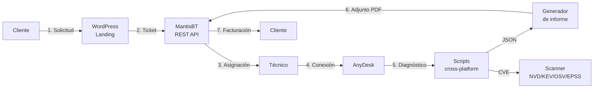
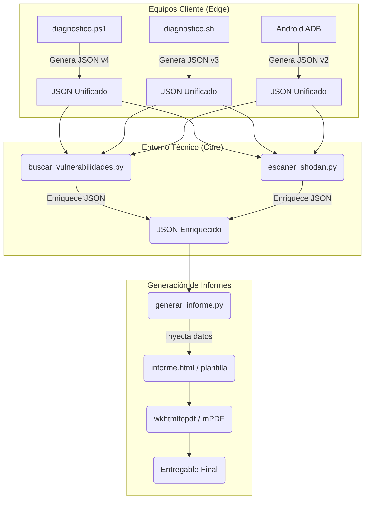

---
# ═══════════════════════════════════════════════════════════════
# METADATOS DEL DOCUMENTO — Memoria TFG ResolveCore
# (front-matter YAML — lo consume el maquetador, no se imprime)
# ═══════════════════════════════════════════════════════════════
titulo: "ResolveCore — Plataforma de mantenimiento y optimización remota"
subtitulo: "Memoria del Trabajo Fin de Grado"
eslogan: "Solución a tus problemas informáticos"
autor: "Francisco Vidal Mateo"
github: "Haplee"
tutor: "Juan Carlos Jiménez Hernández"
centro: "I.E.S. Trafalgar (Barbate, Cádiz)"
ciclo: "Ciclo Formativo de Grado Superior — Administración de Sistemas Informáticos en Red (ASIR)"
curso: "2025/2026"
version_documento: "1.0"
fecha: "2026-05-22"
idioma: "es-ES"
repositorio: "https://github.com/Haplee/ResolveCore"
dominio_produccion: "https://resolvecore.website"
formato_objetivo: "Google Docs"
paginacion: "A4 vertical"
margenes_cm:
  superior: 2.5
  inferior: 2.5
  izquierdo: 3.0
  derecho: 2.5
---

<!--
═══════════════════════════════════════════════════════════════
INSTRUCCIONES DE MAQUETACIÓN — leer antes de generar el Google Doc
═══════════════════════════════════════════════════════════════
Este fichero es la MEMORIA del TFG en Markdown. Un agente Claude
posterior debe convertirlo en un documento Google Docs maquetado.
Aplica los siguientes parámetros:

1. PORTADA (página 1, sin numerar)
   - Logo ResolveCore centrado (assets/logo/resolvcore-icon.svg).
   - Título grande:    {titulo}
   - Subtítulo:        {subtitulo}
   - Eslogan en cursiva: «{eslogan}»
   - Bloque inferior:  Autor · Tutor · Centro · Ciclo · Curso.
   - Fecha al pie.
   - [SALTO_PAGINA] tras la portada.

2. ÍNDICE (numeración romana i, ii, iii…)
   - Tabla de contenidos automática de Heading 1 y Heading 2.
   - A continuación: «Índice de figuras» e «Índice de tablas».
   - [SALTO_PAGINA] tras los índices.

3. NUMERACIÓN
   - Capítulos (Heading 1): 1, 2, 3…
   - Secciones (Heading 2): 1.1, 1.2…
   - Sub-secciones (Heading 3): 1.1.1…
   - Figuras: rótulo «Figura N.» — generadas desde los marcadores [FIGURA: …].
   - Tablas:  rótulo «Tabla N.»  — generadas desde los marcadores [TABLA: …].
   - Cuerpo del documento: numeración arábiga, empieza en 1 tras los índices.

4. GUÍA DE ESTILO
   - Fuente cuerpo:  Arial / DM Sans 11 pt · interlineado 1.15 · texto justificado.
   - Fuente código:  Consolas / Space Mono 9 pt · fondo #f2f3f5.
   - Paleta de marca: acento #00e5a0 · fondo oscuro #0a0c10 · texto #1a1c20.
   - Heading 1: 18 pt negrita, color #0a3d2e, con regla inferior.
   - Heading 2: 14 pt negrita · Heading 3: 12 pt negrita.
   - Tablas: fila de cabecera con fondo #00e5a0 al 15 %, bordes finos #d0d4da.
   - Bloques ```mermaid``` y diagramas ASCII → renderizar como imagen e
     insertar como Figura numerada con su pie.
   - Citas (>) → recuadro lateral gris con barra de acento.

5. MARCADORES (el maquetador los sustituye)
   - [FIGURA: texto]   → figura/diagrama con pie «Figura N. texto».
   - [TABLA: texto]    → pie de tabla «Tabla N. texto».
   - [CAPTURA: ruta]   → insertar PNG desde docs/capturas/.
   - [SALTO_PAGINA]    → forzar salto de página.

6. No alterar el contenido técnico ni las cifras; solo maquetar.
═══════════════════════════════════════════════════════════════
-->

# Memoria del Trabajo Fin de Grado: ResolveCore

> **Proyecto:** ResolveCore — Solución a tus problemas informáticos
> **Alumno:** Francisco Vidal Mateo
> **Tutor:** Juan Carlos Jiménez Hernández
> **Centro:** I.E.S. Trafalgar (Barbate, Cádiz). Ciclo Superior ASIR, curso 2025/2026

---

## Resumen Ejecutivo

ResolveCore es una plataforma integral de soporte técnico remoto que sustituye el
modelo **reactivo** tradicional —esperar a que un equipo falle para intervenir— por
un enfoque **proactivo y automatizado**. El sistema cubre el ciclo completo de una
incidencia en siete fases: solicitud del cliente a través de una web pública,
generación del ticket en MantisBT vía API REST, conexión remota supervisada,
diagnóstico automatizado multiplataforma (Windows, Linux, Android), auditoría de
vulnerabilidades, entrega de un informe técnico en PDF y facturación.

El proyecto integra de forma coherente un conjunto de tecnologías de código abierto:
WordPress como frontend con un tema y un plugin propios, MantisBT como gestor de
incidencias, scripts nativos de diagnóstico (PowerShell 5.1 y Bash), un motor de
correlación de vulnerabilidades en Python con arquitectura hexagonal, y un despliegue
real sobre un VPS Linux endurecido (Nginx, PHP-FPM, MariaDB, Let's Encrypt). Esta
amplitud permite ejercitar las competencias de la práctica totalidad de los módulos
del ciclo ASIR: administración de sistemas, redes, bases de datos, servicios web,
seguridad y alta disponibilidad.

El resultado es un sistema funcional, documentado y desplegado, concebido además
como base viable de emprendimiento técnico para autónomos y PYMEs. Esta memoria
recoge la justificación de cada decisión técnica, la arquitectura del sistema, el
desarrollo de cada módulo y el proceso de auditoría interna de calidad.

**Palabras clave:** soporte técnico remoto · diagnóstico automatizado · MantisBT ·
WordPress · PowerShell · Bash · auditoría CVE · arquitectura hexagonal · ASIR.

## Abstract

ResolveCore is a comprehensive remote IT support platform that replaces the
traditional **reactive** model —waiting for a system to fail before acting— with a
**proactive, automated** approach. It covers the full incident lifecycle across
seven phases: client request through a public website, ticket creation in MantisBT
via its REST API, supervised remote connection, automated cross-platform diagnostics
(Windows, Linux, Android), vulnerability auditing, delivery of a technical PDF
report, and billing.

The project integrates a coherent open-source stack: WordPress as the frontend with
a custom theme and plugin, MantisBT as the issue tracker, native diagnostic scripts
(PowerShell 5.1 and Bash), a Python vulnerability-correlation engine built on a
hexagonal architecture, and a real deployment on a hardened Linux VPS (Nginx,
PHP-FPM, MariaDB, Let's Encrypt). This breadth exercises competencies from nearly
every module of the ASIR vocational programme: systems administration, networking,
databases, web services, security and high availability.

**Keywords:** remote IT support · automated diagnostics · MantisBT · WordPress ·
PowerShell · Bash · CVE auditing · hexagonal architecture · ASIR.

<!-- [SALTO_PAGINA] -->

---

# 1. Introducción y Contexto

Este documento constituye la propuesta inicial de Trabajo Fin de Grado (TFG) para el Ciclo Formativo de Grado Superior en **Administración de Sistemas Informáticos en Red (ASIR)**. En él se definen las bases, objetivos y el alcance conceptual del ecosistema de mantenimiento y soporte proactivo ResolveCore.

---

### Ficha del Proyecto

* **Centro Educativo:** I.E.S. Trafalgar (Barbate, Cádiz)
* **Ciclo:** Ciclo Formativo de Grado Superior en Administración de Sistemas Informáticos en Red (ASIR)
* **Curso Académico:** 2025 / 2026
* **Proyecto:** ResolveCore — Plataforma de mantenimiento y optimización remota para Windows, Linux y Android
* **Eslogan:** *"Solución a tus problemas informáticos"*
* **Alumno:** Francisco Vidal Mateo
* **Tutor Académico:** Juan Carlos Jiménez Hernández

---

### 1. Punto de partida

Esta propuesta marca el inicio del desarrollo del TFG. El propósito principal es asentar las bases del sistema, evaluar la viabilidad de la arquitectura propuesta y definir una hoja de ruta estructurada. A estas alturas del desarrollo, ciertas decisiones técnicas finales están supeditadas a pruebas de rendimiento en entornos reales de laboratorio.

La concepción del proyecto surge a partir de una problemática común en la microempresa y el sector doméstico: el soporte técnico informático tradicional es puramente **reactivo**. Por lo general, se espera a que la infraestructura quede inoperativa para solicitar asistencia. Este enfoque ocasiona periodos de inactividad críticos, cobros imprevistos por intervenciones de urgencia y una carencia absoluta de trazabilidad sobre las tareas de mantenimiento realizadas.

**ResolveCore** propone un cambio de paradigma hacia el soporte **proactivo y automatizado**. En lugar de resolver fallos de manera presencial e individualizada, se plantea un sistema capaz de:
1. Realizar diagnósticos de salud automáticos en los sistemas finales de los usuarios.
2. Registrar un histórico detallado e inmutable de cada acción correctora sobre la máquina.
3. Facilitar un informe técnico en formato PDF para el cliente final, promoviendo la total transparencia del servicio.

---

### 2. Idea del proyecto

**ResolveCore** es una plataforma de soporte y mantenimiento remoto de extremo a extremo, especialmente dimensionada para autónomos, pequeñas empresas (PYMEs) y usuarios domésticos sin departamento de IT dedicado.

El ecosistema descansa sobre tres pilares arquitectónicos:
* **Diagnóstico Automatizado Multiplataforma:** Un núcleo de scripts ligeros que se ejecutan localmente en la máquina del cliente (Windows, Linux y Android) capturando el estado del hardware, red, servicios críticos y seguridad en una salida estructurada JSON común.
* **Motor de Auditoría de Vulnerabilidades:** Módulo en Python que cruza el inventario de software recogido en el diagnóstico con múltiples repositorios públicos y APIs de seguridad de gran relevancia (NVD del NIST, CISA KEV, Google OSV y métricas de probabilidad de explotación EPSS).
* **Gestión Centralizada y Reporting:** Un canal web público (WordPress) con un formulario de contacto seguro conectado de forma asíncrona a un gestor de incidencias (MantisBT via REST API). Tras la resolución del ticket por parte del técnico, se adjunta un reporte en PDF de alto nivel generado automáticamente.

---

### 3. Por qué este proyecto

La elección del proyecto responde a dos motivaciones principales:

1. **Multidisciplinariedad y Cobertura Curricular:** ASIR es un grado con un perfil profesional extremadamente transversal. ResolveCore abarca competencias clave de la totalidad de los módulos del ciclo formativo:
   * **Sistemas Operativos:** Administración e interactuación interna a bajo nivel con sistemas Windows (PowerShell 5.1), Linux (Bash) y Android (Android Debug Bridge - ADB).
   * **Bases de Datos:** Persistencia estructural e histórica en MariaDB/MySQL.
   * **Servicios de Red y Aplicaciones Web:** Despliegue de servidores Nginx, PHP-FPM, contenedores Docker y pasarelas AJAX asíncronas en WordPress.
   * **Seguridad y Alta Disponibilidad:** Implementación de cifrado SSL/TLS con Let's Encrypt, hardening del CMS, rate-limiting, saneamiento de entradas ante ataques XSS/SQLi y auditoría CVE.
2. **Viabilidad de Negocio y Continuidad:** Más allá de los fines puramente académicos del TFG, el proyecto se concibe como una alternativa real de emprendimiento técnico, ofreciendo un modelo de suscripción competitivo de mantenimiento informático corporativo para autónomos y pequeñas empresas.

---

### 4. Objetivos

#### 4.1. Objetivo general

Construir y desplegar un entorno de soporte informático proactivo completo que unifique la recepción de tickets a través de una web segura, el diagnóstico automatizado remoto de las plataformas de cliente (Windows, Linux, Android), el análisis inteligente de vulnerabilidades locales y la entrega automatizada de informes de resolución.

#### 4.2. Objetivos específicos

* **Scripts de Diagnóstico Nativos:**
  * PowerShell 5.1 para la obtención de métricas y estados del kernel en entornos Windows.
  * Bash estructurado y optimizado para sistemas GNU/Linux.
  * Captura de métricas internas en Android aprovechando comandos directos de la shell de ADB.
* **Modelo de Datos Unificado:** Definición de un esquema JSON común e interoperable que consolide los inventarios de los tres entornos de sistemas.
* **Mapeador CVE Multi-feed:** Implementación de un motor robusto en Python sin dependencias externas pesadas que realice la extracción y priorización de vulnerabilidades explotadas.
* **Middleware WordPress - MantisBT:** Desarrollo de un plugin corporativo en PHP que sirva de puente asíncrono entre el frontend y la base de incidencias MantisBT aprovechando sus APIs REST nativas.
* **Interfaz de Usuario de Alto Rendimiento:** Programación de un tema a medida para el CMS enfocado en rendimiento (puntuación Lighthouse ≥ 90) y cumplimiento riguroso de accesibilidad WCAG 2.1 nivel AA.
* **Generación de Reportes Dinámicos:** Módulo compilador que transforme la salida estructurada de los diagnósticos a plantillas PDF estandarizadas.
* **Despliegue e Infraestructura:** Configuración y securización de la infraestructura completa en un VPS Linux de producción real bajo el stack Nginx, PHP-FPM, MariaDB y certificados automatizados Let's Encrypt.

#### 4.3. Límites del proyecto (Fuera de alcance)

Para asegurar la viabilidad del TFG dentro de los plazos académicos establecidos, se excluyen los siguientes aspectos:
* **Aplicación móvil Android nativa:** El soporte a dispositivos Android se limita al motor interno ADB operado desde consola de técnico o Termux. Una app nativa queda relegada al roadmap futuro.
* **Soporte completo para macOS:** Se mantiene una estructura básica funcional (stub) a nivel demostrativo de comandos nativos de BSD, posponiendo un desarrollo completo de mantenimiento.
* **Integración fiscal Verifactu / AEAT:** La generación de facturación final será simulada en el PDF de cierre, sin implementar la conexión telemática con las agencias tributarias.
* **Modelos predictivos por Machine Learning:** Los avisos por degradación o fallos inminentes se calculan a través de heurísticas estables basadas en los parámetros SMART de almacenamiento y la vida útil estimada del hardware.

---

### 5. Tecnologías previstas

| Capa / Módulo | Tecnología de Elección | Justificación Técnica |
|---------------|-------------------------|------------------------|
| **Presentación y Frontend** | WordPress 6.x + Tema Custom | CMS de rápida implantación y fácil escalabilidad con un tema optimizado desde cero. |
| **Gestión de Soporte** | MantisBT 2.28.1 | Gestor de incidencias ligero con una API REST madura y consumo de recursos mínimo en contenedores. |
| **Base de Datos** | MariaDB 10.6+ / MySQL | Cumplimiento del estándar relacional con alta compatibilidad y rendimiento de lectura. |
| **Diagnóstico Windows** | PowerShell 5.1 (integrado en Windows 10/11) | Acceso al motor WMI, CIM y llamadas de administración del sistema nativas de Microsoft. |
| **Diagnóstico Linux** | Bash 4+ | Scripting de sistema universal, sin dependencias e integrable en cualquier shell POSIX. |
| **Diagnóstico Android** | Bash + ADB / Termux | Extracción de telemetría sin requerir root en el terminal cliente. |
| **Auditoría de Seguridad** | Python 3.8+ (Stdlib) | Máxima portabilidad. Sin dependencias externas de librerías de terceros (`pip`) para auditorías limpias. |
| **Acceso Remoto** | AnyDesk / RustDesk | Conexiones seguras supervisadas y cifradas. |
| **Compilador PDF** | DomPDF / wkhtmltopdf | Conversión de HTML semántico enriquecido a hojas de estilo PDF imprimibles. |

> [!NOTE]
> Uno de los principios fundamentales de diseño del proyecto es la **exclusión de plataformas de pago cerradas** (como Snyk, Nessus o Qualys) para el análisis local de seguridad. Toda la lógica del TFG se basa en APIs de acceso público y bases de datos libres, permitiendo la total reproducibilidad y despliegue del entorno sin costes de licenciamiento.

---

### 6. Gestión de riesgos y contingencias

| Riesgo Detectado | Impacto | Estrategia de Mitigación |
|------------------|---------|--------------------------|
| **Límites de tasa (Rate limits) de la API de NVD** | Alto | Implementación de una caché relacional local en MariaDB combinada con políticas de *exponential backoff* en las peticiones. |
| **Restricciones de licenciamiento en AnyDesk** | Medio | Mantener un plan de contingencia operativo enfocado en la migración a **RustDesk**, una alternativa robusta y de código abierto. |
| **Degradación de rendimiento y Lighthouse en WordPress** | Medio | Desarrollo de un tema ligero minimalista (CSS vanilla, JavaScript asíncrono no intrusivo y carga diferida de librerías multimedia). |
| **Cuestionamiento del stub de macOS en el tribunal** | Bajo | Justificación técnica del stub como un principio de modularidad y escalabilidad futura honesta, evitando código destructivo sin validación previa adecuada. |

---

### 7. Bibliografía inicial

* **WordPress Developer Resources:** <https://developer.wordpress.org/>
* **MantisBT REST API Reference:** <https://documenter.getpostman.com/view/29959/RVu8CTDL>
* **Microsoft Learn - PowerShell Documentation:** <https://learn.microsoft.com/en-us/powershell/>
* **NIST National Vulnerability Database:** <https://nvd.nist.gov/>
* **CISA Known Exploited Vulnerabilities Catalog:** <https://www.cisa.gov/known-exploited-vulnerabilities-catalog>
* **W3C Web Content Accessibility Guidelines (WCAG 2.1):** <https://www.w3.org/TR/WCAG21/>
* **Repositorio del proyecto en GitHub:** <https://github.com/Haplee/ResolveCore>

# 2. Diseño y Arquitectura del Sistema

> **Autor:** Francisco Vidal Mateo · TFG ASIR 2025/26

Este documento define la arquitectura lógica y la delegación de responsabilidades de los scripts que conforman el "Core" de diagnóstico y soporte de ResolveCore.

### 1. Paradigma de Diseño

El sistema de scripting se basa en un diseño **modular y desacoplado**. Las fases de recolección de datos, análisis de vulnerabilidades y generación de informes operan de forma independiente y se comunican a través de un contrato de datos estándar: un archivo **JSON unificado**.

Esto garantiza que el generador de informes en PDF funcione igual independientemente de si los datos provienen de un Windows 11 o de un servidor Ubuntu.

### 2. Arquitectura de Componentes (Scripts)

#### 2.1. Componente Windows: PowerShell 5.1+ (`scripts/windows/diagnostico.ps1`)
**Propósito:** Extracción profunda de métricas del sistema operativo Windows.
**Justificación técnica:** PowerShell maneja objetos nativos (CIM/WMI). Se evita parsear texto como haría Bash o CMD.
**Acciones de alto nivel:**
- Consulta de salud del Disco (WMI S.M.A.R.T.).
- Análisis del EventLog buscando errores críticos del sistema.
- Listado de software instalado y parches de Windows Update faltantes.
- Generación y exportación de un bloque estructurado con `ConvertTo-Json`.

#### 2.2. Componente Linux y Android: Bash (`scripts/linux/diagnostico.sh`)
**Propósito:** Extracción de métricas mediante utilidades base de UNIX sin dependencias extrañas.
**Justificación técnica:** Bash garantiza la ejecución en entornos limitados o servidores sin Python instalado.
**Acciones de alto nivel:**
- Ejecución de `top`, `df`, `ss`, `journalctl` extrayendo el texto y formateándolo.
- En el caso de **Android**, el script de Bash actúa como orquestador, enviando comandos al dispositivo del cliente conectado vía red mediante **ADB (Android Debug Bridge)** (`adb shell dumpsys battery`, etc.).

#### 2.3. Componente de Ciberseguridad: Python (`scripts/common/buscar_vulnerabilidades.py`)
**Propósito:** Escaneo y cruce de datos contra bases de datos globales de inteligencia de amenazas.
**Justificación técnica:** Python facilita enormemente las peticiones HTTP concurrentes a APIs REST y el manejo de estructuras JSON complejas.
**Acciones de alto nivel:**
- **Shodan API:** Análisis de puertos expuestos de forma pasiva sobre la IP pública del cliente.
- **NVD / CISA KEV:** Cruce de las versiones del software extraído (por PowerShell/Bash) contra bases de datos de vulnerabilidades conocidas (CVEs).

### 3. Flujo Lógico de Ejecución

1. **Launcher TUI (Text User Interface):** El técnico inicia `ResolveCore.ps1` (o `.sh`). Aparece un menú de opciones.
2. **Orquestación Local:** El script detecta el OS, extrae las credenciales o parámetros de entorno (ej. Tokens API para Shodan).
3. **Ejecución del Motor (Engine):** PowerShell o Bash recaban los datos de hardware, procesos y red.
4. **Análisis Secundario:** El script base llama al binario de Python (`python3 buscar_vulnerabilidades.py`) pasándole el listado de software recolectado.
5. **Consolidación JSON:** Todos los datos se unen en un único archivo estructurado (`diagnostico_cliente.json`).
6. **Generación HTML/PDF:** Un módulo final formatea el JSON en una plantilla HTML legible (`informe.html`), inyectando los datos de forma segura, listo para ser adjuntado por el técnico al ticket de MantisBT.

### 4. Estructura del JSON Estándar (Contrato de Datos)
Todos los scripts (Bash, PowerShell, Python) deben construir un árbol JSON que respete esta semántica:

```json
{
  "metadata": { "platform": "Windows|Linux", "timestamp": "ISO8601" },
  "hardware": { "cpu": "...", "ram": "...", "disk_health": "Good|Warning" },
  "security": { "open_ports": [], "cves_found": [] },
  "score": 85
}
```

> Documento técnico de justificación de tecnologías.  
> Autor: Francisco Vidal Mateo · TFG ASIR 2025/26  
> Última actualización: mayo 2026

---

### Índice

1. [Visión general](#1-visión-general)
2. [Frontend / CMS — WordPress](#2-frontend--cms--wordpress)
3. [Gestión de incidencias — MantisBT](#3-gestión-de-incidencias--mantisbt)
4. [Plugins MantisBT](#4-plugins-mantisbt)
5. [Acceso remoto — AnyDesk](#5-acceso-remoto--anydesk)
6. [Scripts de diagnóstico — PowerShell / Bash](#6-scripts-de-diagnóstico--powershell--bash)
7. [Base de datos — MariaDB](#7-base-de-datos--mariadb)
8. [Servidor web — Nginx + PHP-FPM](#8-servidor-web--nginx--php-fpm)
9. [Integración REST — MantisBT API](#9-integración-rest--mantisbt-api)
10. [Control de versiones — Git / GitHub](#10-control-de-versiones--git--github)
11. [Generación de informes — PDF](#11-generación-de-informes--pdf)
12. [Futuro — App Android](#12-futuro--app-android)
13. [Auditoría de exposición — Shodan](#13-auditoría-de-exposición--shodan)
14. [Clonado e imágenes de SO](#14-clonado-e-imágenes-de-so)
15. [Seguridad en cliente — Cifrado y gestores](#15-seguridad-en-cliente--cifrado-y-gestores)
16. [Resumen comparativo](#16-resumen-comparativo)

---

### 1. Visión general

ResolveCore es una plataforma de soporte técnico remoto estructurada en 7 fases:

```
Solicitud → Ticket (MantisBT) → Acceso remoto (AnyDesk) →
Diagnóstico (PS/Bash) → Resolución → Informe PDF → Facturación
```

El stack combina herramientas de código abierto maduras, con integración vía API REST, para cubrir todos los módulos del ciclo ASIR: administración de sistemas, redes, bases de datos, seguridad y servicios en red.

---

### 2. Frontend / CMS — WordPress

#### Tecnología elegida

**WordPress 6.x** con tema personalizado `resolvecore-theme` (PHP puro, sin builders).

#### Plan de WordPress elegido

WordPress.com ofrece cuatro planes. ResolveCore requiere el plan **Business** (mínimo) por la necesidad de instalar plugins propios.

| Característica | Gratuito | Personal | Business | VIP |
|---------------|----------|---------|---------|-----|
| Precio (aprox.) | 0 €/mes | ~4 €/mes | ~25 €/mes | Contacto |
| Plugins propios | ❌ | ❌ | ✅ | ✅ |
| Themes propios | ❌ | ❌ | ✅ | ✅ |
| Dominio personalizado | ❌ | ✅ | ✅ | ✅ |
| SSL automático | ✅ | ✅ | ✅ | ✅ |
| Acceso SFTP/DB | ❌ | ❌ | ✅ | ✅ |
| Soporte prioritario | ❌ | Chat | Chat + Email | Dedicado |
| Sin anuncios WordPress.com | ❌ | ✅ | ✅ | ✅ |
| WooCommerce | ❌ | ❌ | ✅ | ✅ |

**Por qué Business y no VIP:** VIP está orientado a grandes medios (CNN, TechCrunch). El coste es desproporcionado para un proyecto académico. Business proporciona todo lo necesario: plugin `rc-mantisbt`, tema personalizado `resolvecore-theme`, dominio `resolvecore.website` y acceso SFTP para despliegue.

**Alternativa considerada (WordPress.org + hosting propio):** WordPress.org (software libre) sobre VPS propio daría control total. Se descarta para la fase actual porque WordPress.com Business elimina la gestión de servidor en el periodo del TFG. El despliegue en VPS propio (Oracle Cloud Free Tier) está planificado para producción final.

---

#### Por qué WordPress

| Criterio | WordPress | Joomla | Drupal | Desarrollo custom |
|----------|-----------|--------|--------|-------------------|
| Curva de aprendizaje | Baja | Media | Alta | Alta |
| Ecosistema de plugins | 60 000+ | ~7 000 | ~50 000 | N/A |
| Comunidad / documentación | Muy amplia | Media | Media | N/A |
| Hosting compartido | Omnipresente | Común | Menos común | Variable |
| Tiempo de desarrollo | Bajo | Medio | Alto | Muy alto |
| Estándares PHP modernos (WPCS) | Sí | Parcial | Sí | Sí |
| Relevancia mercado laboral | 43% web mundial | ~2% | ~2% | — |

**Razón principal:** WordPress permite entregar un frontend profesional en el tiempo disponible para el TFG, con formularios AJAX, modo mantenimiento, SEO y un sistema de plugins que facilita la integración con MantisBT. El desarrollo de un CMS custom aportaría poco valor pedagógico frente al tiempo invertido. El stack completo (frontend + backend + BBDD) en un único sistema es el adecuado para demostrar administración web en ASIR, reduce dependencias de servicios externos y simplifica el despliegue en VPS propio.

#### Componentes del tema

- `front-page.php` — Landing page con demo interactiva, formulario AJAX, pricing
- `page-docs.php` — Documentación técnica con sidebar navegable
- `page-changelog.php` — Historial de versiones con timeline visual
- `functions.php` — Lógica PHP: AJAX handlers, rate limiting, integración MantisBT

---

### 3. Gestión de incidencias — MantisBT

#### Tecnología elegida

**MantisBT 2.x** (Bug Tracker de código abierto, PHP + MySQL).

#### Evolución de versiones MantisBT

| Versión | Año | Hitos principales |
|---------|-----|-------------------|
| 1.0.x | 2002-2006 | Primera versión estable. Solo SOAP, sin REST. PHP 4. |
| 1.2.x | 2010-2014 | Campos personalizados, plugins básicos. PHP 5. |
| 1.3.x LTS | 2015-2018 | Última rama 1.x. Soporte extendido. Sin REST nativa. |
| 2.0.x | 2017 | Reescritura UI (Bootstrap), REST API v1 introducida, PHP 5.6+. |
| 2.4.x – 2.25.x | 2018-2023 | Mejoras incrementales: API OAuth, 2FA, JSON configurable. |
| **2.26.x LTS** | 2023-2024 | Long Term Support. PHP 8.1+. Soporte hasta 2025. |
| **2.28.x** | 2024-act. | Versión actual. PHP 8.2, MariaDB 10.6, mejoras API. Elegida para ResolveCore (2.28.1). |

**Por qué 2.28 y no 2.26 LTS:** La rama LTS garantiza parches de seguridad sin nuevas features. Para un entorno de producción de empresa, LTS sería la elección. Para un TFG donde se demuestran capacidades técnicas actuales, 2.28 incluye mejoras en la API REST que simplifican la integración con el plugin WordPress.

---

#### Por qué MantisBT

| Criterio | MantisBT | Jira | GitLab Issues | Redmine | osTicket |
|----------|----------|------|---------------|---------|---------|
| Licencia | GPL (gratis) | Comercial (≥$8.15/user/mes) | GPL (gratis) | GPL (gratis) | GPL (gratis) |
| Autohospedaje | Sí | Cloud / Server costoso | Sí (GitLab CE) | Sí | Sí |
| REST API | Sí (v2+) | Sí | Sí | Sí (parcial) | No nativa |
| Curva de aprendizaje | Baja | Alta | Media | Media | Baja |
| Plugins disponibles | ~30 oficiales | Miles (pagos) | Integrado en GitLab | ~100 | ~20 |
| Workflow personalizable | Sí | Sí | Limitado | Sí | Sí |
| PHP nativo | Sí | No (Java) | No (Ruby/Go) | Sí | Sí |
| Integración GitHub | Plugin oficial | Sí | Nativo | Plugin | No |

**Razón principal:** MantisBT es la opción de bug tracker open-source más fácil de instalar en un VPS con PHP + MySQL (mismo stack que WordPress). Ofrece REST API completa desde la versión 2.0, flujo de estados configurable (new → assigned → resolved → closed), campos personalizados y un ecosistema de plugins suficiente para las necesidades de ResolveCore.

**Por qué no Jira:** Licencia comercial incompatible con un proyecto académico sin presupuesto. La complejidad de configuración supera las necesidades del TFG.

**Por qué no GitLab Issues:** Requeriría instalar GitLab completo (Ruby, Go, PostgreSQL, Redis, ~4GB RAM) solo para gestionar tickets. MantisBT ocupa <50MB y funciona en cualquier VPS básico.

**Por qué no Redmine:** Requiere Ruby on Rails, más complejo de administrar en entorno PHP. MantisBT encaja mejor con el stack PHP/MySQL del proyecto.

#### Flujo de ticket en ResolveCore

```
new → acknowledged → assigned → resolved → closed
         ↑                          ↓
      feedback ←────────────────────┘
```

Campos personalizados añadidos:
- **Plataforma:** Windows / Linux / macOS / Android / Otro
- **AnyDesk ID:** identificador de sesión remota

---

### 4. Plugins MantisBT

#### 4.1 source-integration

**Repositorio:** github.com/mantisbt-plugins/source-integration

**Función:** Vincula commits de GitHub con tickets MantisBT. Al incluir `fix #42` en un commit, el ticket #42 se marca automáticamente como resuelto y se adjunta el enlace al commit.

**Por qué:** Demuestra integración DevOps entre control de versiones y gestión de incidencias. Cubre el módulo ASIR de administración de sistemas y herramientas de desarrollo. Alternativa nativa no existe en MantisBT; este plugin es el estándar oficial.

**Configuración:** webhook en GitHub → `POST /mantis/plugin.php?page=Source/checkin`

---

#### 4.2 MantisKanban

**Repositorio:** github.com/mantisbt-plugins/MantisKanban

**Función:** Añade una vista Kanban sobre los tickets del proyecto. Columnas: Nuevo / En proceso / Feedback / Resuelto / Cerrado.

**Por qué:** Visualización inmediata del estado de las incidencias durante la demo de defensa. El tribunal puede ver el flujo de trabajo en tiempo real. Alternativas como Trello o Azure Boards requieren servicios externos y no se integran con MantisBT.

---

#### 4.3 SetDuedate

**Repositorio:** github.com/mantisbt-plugins/SetDuedate

**Función:** Asigna automáticamente fecha de vencimiento al crear un ticket, según su prioridad.

**Mapeo SLA ResolveCore:**

| Prioridad | Vencimiento |
|-----------|-------------|
| Inmediata | 1 hora |
| Urgente | 2 horas |
| Alta | 4 horas |
| Normal | 24 horas |
| Baja | 72 horas |

**Por qué:** Automatiza el SLA prometido en la landing page (`<2h de respuesta`). Sin este plugin, el técnico debe establecer la fecha manualmente en cada ticket. Ningún otro plugin MantisBT cubre esta funcionalidad.

---

#### 4.4 Reminder

**Repositorio:** github.com/mantisbt-plugins/Reminder

**Función:** Envía notificaciones por email cuando un ticket lleva X horas sin cambio de estado.

**Por qué:** Garantiza que ningún ticket quede sin atender más del tiempo acordado en el SLA. Complementa SetDuedate con avisos proactivos. Funciona vía cron del servidor, sin depender de servicios externos.

---

#### 4.5 mailtemplate

**Repositorio:** github.com/mantisbt-plugins/mailtemplate

**Función:** Sustituye los emails de texto plano de MantisBT por plantillas HTML con la identidad visual de ResolveCore.

**Por qué:** Los emails de notificación son el punto de contacto principal con el usuario. Emails HTML con el branding del proyecto (fondo oscuro, acento verde `#00e5a0`) ofrecen una imagen profesional coherente. MantisBT por defecto solo envía texto plano.

---

#### 4.6 EventLog

**Repositorio:** github.com/mantisbt-plugins/EventLog

**Función:** Registra todos los eventos de MantisBT: logins, creación/modificación de tickets, cambios de configuración, subida de archivos.

**Por qué:** Trazabilidad y auditoría, requisito de seguridad del módulo ASIR. Permite demostrar que el sistema registra quién hizo qué y cuándo sobre cada incidencia. Cubre normativas de seguridad básica (control de acceso, registro de actividad). No existe funcionalidad equivalente en MantisBT sin este plugin.

---

### 5. Acceso remoto — AnyDesk

#### Tecnología elegida

**AnyDesk** (acceso remoto por escritorio).

#### Por qué AnyDesk

| Criterio | AnyDesk | TeamViewer | RustDesk | VNC | SSH |
|----------|---------|-----------|----------|-----|-----|
| Licencia uso personal/educativo | Gratuita | Gratuita (limitada) | Gratuita (OSS) | Gratuita | Gratuita |
| Rendimiento (codec DeskRT) | Muy alto | Alto | Medio | Bajo | N/A |
| Latencia en conexiones pobres | Muy baja | Baja | Media | Alta | N/A |
| Compatible Windows+Linux+Android | Sí | Sí | Sí | Sí (parcial) | Solo CLI |
| Instalación en cliente | Opcional (portable) | Requerida | Opcional | Requerida | Requerida |
| ID único por dispositivo | Sí | Sí | Sí | No | No |
| Transferencia de archivos | Sí | Sí | Sí | No nativa | Sí (SCP) |

**Razón principal:** AnyDesk ofrece la mejor relación rendimiento/coste para uso educativo. El codec DeskRT minimiza la latencia incluso en conexiones lentas, lo que es crítico para diagnóstico remoto en tiempo real. La versión portable no requiere instalación en el equipo del cliente.

**Por qué no TeamViewer:** Detecta uso "comercial" en sesiones largas y bloquea la conexión en la versión gratuita. Poco fiable para demos en entornos de evaluación.

**Por qué no RustDesk (auto-alojado):** Requiere configurar un servidor relay propio, añadiendo complejidad de infraestructura innecesaria para el alcance del TFG.

**Integración con MantisBT:** El ID de AnyDesk del cliente se almacena como campo personalizado en el ticket, permitiendo al técnico iniciar la sesión remota directamente desde MantisBT.

---

### 6. Scripts de diagnóstico — PowerShell / Bash

#### Tecnología elegida

- **PowerShell 5.1+** para Windows
- **Bash (sh-compatible)** para Linux / macOS / Android

#### Por qué PowerShell en Windows

| Criterio | PowerShell 5.1 | CMD / .bat | Python | WMI/WMIC |
|----------|-------------|-----------|--------|---------|
| Acceso a WMI/CIM | Nativo | Limitado | Via pywin32 | Nativo |
| Objetos estructurados | Sí (PSCustomObject) | No | Sí | Parcial |
| Salida JSON | `ConvertTo-Json` nativo | No | `json.dumps()` | No |
| Manejo de errores | try/catch robusto | Limitado | try/except | Limitado |
| Multiplataforma | No (solo Windows) | No | Sí | Solo Windows |
| Disponible sin instalación | Win 10/11 (PS5) | Siempre | No (Python 3) | Siempre |
| Integración con Windows Update | Sí | No | Via subprocess | Parcial |

**Razón principal:** PowerShell 5.1 proporciona acceso nativo a todas las APIs de Windows (WMI, CIM, Event Log, Windows Update, S.M.A.R.T.) con salida en objetos tipados que se serializan directamente a JSON. Ninguna otra shell en Windows ofrece esta integración sin dependencias adicionales.

#### Por qué Bash en Linux/macOS/Android

| Criterio | Bash | Python | Perl | Zsh |
|----------|------|--------|------|-----|
| Disponible por defecto | Prácticamente siempre | No garantizado | No garantizado | No siempre |
| Dependencias | Ninguna | Python 3 instalado | Perl instalado | Ninguna |
| Llamadas a herramientas del sistema | Nativo | subprocess | system() | Nativo |
| Portabilidad sh-compatible | Sí | N/A | N/A | Parcial |
| Curva de aprendizaje ASIR | Baja | Media | Alta | Baja |

**Razón principal:** Bash garantiza funcionamiento en cualquier sistema Linux sin instalar nada. Los diagnósticos (CPU, RAM, disco, red, logs del sistema) se realizan llamando a herramientas estándar (`top`, `df`, `ss`, `journalctl`) que Bash orquesta directamente.

#### Salida estructurada

Ambos scripts generan un objeto JSON común:

```json
{
  "metadata": { "platform": "Windows", "version": "4.1.0", "timestamp": "..." },
  "hardware":  { "cpu": {...}, "ram": {...}, "disk": [...], "battery": {...} },
  "os":        { "name": "...", "build": "...", "updates_pending": 3 },
  "security":  { "firewall": true, "av_active": true, "vulnerabilities": [...] },
  "network":   { "interfaces": [...], "open_ports": [...] },
  "score":     { "health": 87, "risk": "medium" }
}
```

---

### 7. Base de datos — MariaDB

#### Tecnología elegida

**MariaDB 10.x** (fork de MySQL, motor InnoDB).

#### Por qué MariaDB

| Criterio | MariaDB | MySQL 8 | PostgreSQL | SQLite |
|----------|---------|---------|-----------|--------|
| Compatibilidad MySQL | Casi total | N/A | Parcial | Parcial |
| Licencia | GPL (100% libre) | GPL + Oracle | PostgreSQL | Dominio público |
| Rendimiento lectura | Alto | Alto | Muy alto | Medio |
| Instalación en VPS Linux | Estándar | Común | Menos común | N/A (embebido) |
| Requerido por WordPress | Compatible | Oficial | No | No |
| Requerido por MantisBT | Compatible | Oficial | Soportado | No |
| Comunidad Española / documentación | Amplia | Amplia | Media | Media |

**Razón principal:** MariaDB es el motor predeterminado en la mayoría de distribuciones Linux (Debian, Ubuntu). Es 100% compatible con WordPress y MantisBT, tiene licencia GPL sin restricciones comerciales de Oracle, y su rendimiento es equivalente o superior a MySQL 8 para las cargas de trabajo del proyecto.

**Por qué no PostgreSQL:** MantisBT lo soporta pero WordPress requiere plugins adicionales para PostgreSQL. La combinación MariaDB sirve a ambas aplicaciones sin fricción adicional.

**Tablas personalizadas ResolveCore:**

| Tabla | Contenido |
|-------|-----------|
| `rc_vulnerabilities` | CVEs: id, cve_id, gravedad, SO afectado, descripción, fix |
| `rc_tickets_log` | Historial extendido de tickets (complementa MantisBT) |

---

### 8. Servidor web — Nginx + PHP-FPM

#### Tecnología elegida

**Nginx 1.x** + **PHP-FPM 8.2+** en VPS Linux (Ubuntu 24.04 LTS).

#### Por qué Nginx

| Criterio | Nginx | Apache 2.4 | Caddy | Lighttpd |
|----------|-------|-----------|-------|---------|
| Rendimiento bajo carga | Muy alto (event-driven) | Alto (process-based) | Alto | Alto |
| Consumo de memoria | Bajo | Medio | Bajo | Bajo |
| Configuración para WordPress | Estándar | .htaccess nativo | Automática | Manual |
| SSL/TLS automático (Let's Encrypt) | Certbot | Certbot | Nativo | Manual |
| Proxy reverso | Excelente | Bueno | Bueno | Limitado |
| Documentación | Muy amplia | Muy amplia | Buena | Media |
| Popularidad servidores VPS | 1º | 2º | 3º | Residual |

**Razón principal:** Nginx maneja concurrencia con bajo consumo de memoria frente a Apache, que crea un proceso/hilo por conexión. Para un VPS con recursos limitados, Nginx permite servir WordPress y MantisBT simultáneamente sin degradación de rendimiento.

#### Por qué PHP-FPM

PHP-FPM (FastCGI Process Manager) gestiona un pool de workers PHP independiente del servidor web. Ventajas frente a `mod_php` (integrado en Apache):

- Cada aplicación (WordPress, MantisBT) puede tener su propio pool con usuario Unix distinto
- Reinicio del pool PHP sin reiniciar Nginx
- Control de recursos por pool (max_children, max_requests)

#### Por qué Ubuntu 24.04 LTS

- Soporte hasta abril 2029 (más que suficiente para el ciclo de vida del TFG)
- Repositorios oficiales incluyen PHP 8.3, MariaDB 10.11, Nginx actual
- La mayoría de VPS providers ofrecen imagen preconfigurada

---

### 9. Integración REST — MantisBT API

#### Tecnología elegida

**MantisBT REST API v1** (JSON sobre HTTP, autenticación por token).

#### Flujo de integración

```
WordPress (functions.php)
  → rc_mantis_create_ticket($data)          [plugin rc-mantisbt]
    → RC_Mantis_API::create_issue($body)    [class-mantis-api.php]
      → wp_remote_request(POST /api/rest/issues, Authorization: Token X)
        → MantisBT                          [crea ticket, devuelve ID]
      ← { "issue": { "id": 42 } }
    ← 42
  ← JSON: { success: true, ticket_id: 42, msg: "Ticket #42 creado" }
← JS muestra "[VER TICKET #42]" en el formulario
```

#### Por qué REST sobre otras opciones

| Opción | Ventajas | Desventajas |
|--------|----------|-------------|
| REST API (JSON) | Estándar, simple, sin dependencias extra | — |
| SOAP API (MantisBT legacy) | Compatible versiones antiguas | Verboso, obsoleto desde MantisBT 2.0 |
| Acceso directo a BD | Sin latencia de red | Acoplamiento fuerte, rompe con actualizaciones |
| Email-to-ticket (plugin) | Sin código | No devuelve ticket ID al formulario WP |

---

### 10. Control de versiones — Git / GitHub

#### Tecnología elegida

**Git** con repositorio remoto en **GitHub**.

#### Por qué GitHub

| Criterio | GitHub | GitLab.com | Bitbucket | Gitea (self-hosted) |
|----------|--------|-----------|-----------|-------------------|
| Integración con MantisBT | Plugin oficial (source-integration) | Plugin oficial | No oficial | No oficial |
| CI/CD gratuito | GitHub Actions | GitLab CI (300 min/mes) | Pipelines (50 min/mes) | Requiere Gitea Actions |
| Visibilidad del proyecto (TFG) | Máxima | Alta | Media | Ninguna (privado) |
| Issues, PRs, Releases | Sí | Sí | Sí | Sí |

**Razón principal:** El plugin `source-integration` de MantisBT tiene soporte oficial para GitHub, lo que permite vincular commits con tickets automáticamente. GitHub es además la plataforma con mayor visibilidad para mostrar el proyecto al tribunal.

#### Convención de commits

```
<tipo>(<ámbito>): <descripción>

feat(mantisbt): add SetDuedate SLA configuration
fix(scripts): correct PowerShell disk health parsing
docs(stack): add technology justification document
```

#### Estrategia de ramas

```
main          ← producción estable
feat/<nombre> ← nuevas funcionalidades
fix/<nombre>  ← correcciones
docs/<nombre> ← documentación
140526        ← rama actual de desarrollo
```

---

### 11. Generación de informes — PDF

#### Estado actual

En desarrollo. Las opciones evaluadas son:

#### Opciones comparadas

| Librería | Lenguaje | Calidad | Instalación | Licencia |
|---------|----------|---------|-------------|---------|
| **DomPDF** | PHP | Alta | `composer require dompdf/dompdf` | LGPL |
| **mPDF** | PHP | Muy alta | `composer require mpdf/mpdf` | GPL |
| **wkhtmltopdf** | Binario | Muy alta (Webkit real) | Binario en servidor | LGPL |
| **TCPDF** | PHP | Media | `composer require tecnickcom/tcpdf` | LGPL |
| **Puppeteer** | Node.js | Muy alta | pnpm + Chrome headless | MIT |

**Decisión prevista:** DomPDF o mPDF (PHP nativo, sin binarios externos). wkhtmltopdf produce la mejor calidad pero requiere instalar un binario en el VPS y tiene mantenimiento discontinuado desde 2023.

**Secciones del informe (obligatorias por diseño):**

1. Resumen ejecutivo
2. Incidencias detectadas
3. Problemas solucionados
4. Estado actual del sistema
5. Recomendaciones
6. Proyección de vida útil del hardware

---

### 12. Futuro — App Android

#### Tecnología prevista

**Kotlin + Jetpack Compose + Material 3** (nativa Android).

#### Por qué nativo sobre otras opciones

| Criterio | Kotlin/Compose | Flutter | PWA |
|----------|---------------|---------|-----|
| Acceso a APIs Android (ADB, diagnóstico) | Total | Parcial (plugins) | Muy limitado |
| Rendimiento | Máximo | Alto | Bajo |
| Material Design 3 | Nativo | Parcial | Via CSS |
| Alineación con ecosistema Android | Total | Parcial | Ninguna |
| Mantenimiento Google | Sí | Sí | Estándar web |

**Razón:** Los diagnósticos Android requieren acceso a APIs nativas (batería, almacenamiento, red, ADB) que solo Kotlin/Android SDK expone completamente. Fase planificada para después de la defensa del TFG.

---

### 13. Auditoría de exposición — Shodan

#### Tecnología elegida

**Shodan API REST** (free tier) + módulo Python `escaner_shodan.py` (stdlib, sin `pip install shodan`).

#### Por qué Shodan

| Criterio | Shodan | Censys | Fofa | Nmap (local) |
|----------|--------|--------|------|---------------|
| Datos históricos de internet | Sí | Sí | Sí | No |
| Free tier útil | 100 créditos/mes | 250 queries/mes | Limitado | N/A |
| CVEs en respuesta | Sí (campo `vulns`) | Sí | Parcial | No |
| API REST simple | Sí | Sí (más compleja) | Sí | N/A |
| Sin instalación en cliente | Sí | Sí | Sí | No |
| Referencia en ASIR/ciberseguridad | Alta | Media | Baja | Alta |

**Razón principal:** Shodan indexa puertos, banners de servicios y CVEs detectados pasivamente para cualquier IP pública. Permite a ResolveCore ofrecer un informe de exposición sin instalar nada en el equipo del cliente. El free tier (100 créditos/mes, 1 crédito por IP) es suficiente para el TFG.

**Implementación:** `scripts/common/escaner_shodan.py` — Python 3.8+ stdlib, sin dependencias pip. Lee `SHODAN_API_KEY` desde variable de entorno o `.env` local.

```
python escaner_shodan.py --ip 8.8.8.8
python escaner_shodan.py --ip 1.1.1.1 --json
```

**Integración en el catálogo:** Auditoría de exposición Shodan → 30 €/IP/informe → `escaner_shodan.py` genera el JSON que `generar_informe.py` formatea en PDF.

---

### 14. Clonado e imágenes de SO

#### Herramientas comparadas

| Herramienta | Tipo | Licencia | Red/Local | SO soportados | Curva | Coste |
|-------------|------|---------|-----------|--------------|-------|-------|
| **Clonezilla Live** | Live USB | GPL | Local (USB/NFS/SFTP) | Windows, Linux, macOS | Baja-Media | Gratis |
| **FOG Project** | Servidor PXE | GPL | Red (LAN) | Windows, Linux | Media | Gratis |
| **WDS + MDT** | Servicio Windows Server | Incluido en Win Server | Red (PXE) | Solo Windows | Alta | Win Server |
| **Veeam Agent Free** | Agente | Freemium | Local + NFS/SMB | Windows, Linux | Baja | Gratis |
| **Acronis Cyber Backup** | Agente + consola | Comercial | Local + Cloud | Windows, Linux | Baja | ~150 €/equipo/año |

#### Criterios de elección para ResolveCore

```
Un equipo o intervención puntual     → Clonezilla Live (USB)
Flota mixta >5 equipos (aulas, PYME) → FOG Project
Entorno Windows AD corporativo        → WDS + MDT
Backup programado en producción       → Veeam Agent Free
```

#### Casos de uso empresariales

| Escenario | Herramienta elegida | Beneficio |
|-----------|--------------------|-----------|
| Incorporación de nuevo empleado | FOG Project | Imagen corporativa en <20 min |
| Restauración post-ransomware | Clonezilla / Veeam | Vuelta a imagen limpia sin pagar rescate |
| Migración HDD → SSD | Clonezilla | Sector a sector, sin reinstalar SO |
| Actualización de SO en flota | FOG Project | Imagen actualizada → despliegue masivo en LAN |
| Backup previo a intervención mayor | Veeam Agent Free | Punto de restauración antes de cambios |

#### Posición en el catálogo ResolveCore

- **Clonación puntual:** 30-60 €/equipo — Clonezilla Live, técnico con USB en cliente
- **Despliegue de imagen en flota:** 15-30 €/equipo — FOG Project (mínimo 3 equipos)
- Ambos servicios se documentan en `docs/servicios-adicionales.md` § 2 y § 6

---

### 15. Seguridad en cliente — Cifrado y gestores

#### 15.1 Cifrado de disco

| Herramienta | SO | Licencia | TPM | Algoritmo | Recuperación | Caso de uso |
|-------------|-----|---------|-----|-----------|--------------|-------------|
| **BitLocker** | Windows Pro/Ent | Incluido | Opcional (recomendado) | AES-256-XTS | Clave 48 dígitos | Portátiles corporativos |
| **LUKS (dm-crypt)** | Linux | GPL (kernel) | No | AES-256-XTS | Header de recuperación | Servidores y estaciones Linux |
| **VeraCrypt** | Windows/Linux/macOS | Apache 2.0 | No | AES/Twofish/Serpent | Disco de rescate | Multiplataforma, contenedores cifrados |
| **ecryptfs** | Linux | GPL | No | AES-256 | — | Solo directorio home, sin reinstalar |

**Criterios de elección:**

```
Empresa con Win Pro/Ent + TPM 2.0 → BitLocker (sin coste, integración nativa)
Usuario doméstico con Win Home    → VeraCrypt (gratuito, open source)
Servidor Linux (instalación nueva) → LUKS durante instalación del SO
Portátil Linux sin reinstalar      → VeraCrypt contenedor o ecryptfs home
```

**Por qué no DiskCryptor:** sin mantenimiento activo desde 2014. VeraCrypt lo sustituye con soporte multiplataforma y auditorías de seguridad recientes (2016, 2020).

#### 15.2 Gestores de contraseñas

| Gestor | Licencia | Almacenamiento | Sync | 2FA | Compartir | Auditoría | Precio |
|--------|---------|---------------|------|-----|-----------|-----------|--------|
| **Bitwarden** | AGPL (OSS) | Cloud o self-hosted | ✅ | ✅ | ✅ Teams | ✅ | Gratis / 10 €/año Premium |
| **KeePassXC** | GPL | Local (`.kdbx`) | Manual (Dropbox/NAS) | ✅ (TOTP) | ❌ nativo | ❌ nativo | Gratis |
| **1Password** | Propietario | Cloud | ✅ | ✅ | ✅ | ✅ | ~3 €/mes |
| **Dashlane** | Propietario | Cloud | ✅ | ✅ | ✅ | ✅ | ~4 €/mes |

**Decisión para clientes ResolveCore:**

| Perfil cliente | Gestor recomendado | Razón |
|---------------|-------------------|---------|
| Usuario doméstico / autónomo | Bitwarden free | Sync automático, app móvil, sin coste |
| PYME (2-10 personas) | Bitwarden Teams | Compartir contraseñas + auditoría de accesos |
| Máxima seguridad / sin cloud | KeePassXC + NAS | Sin dependencia de terceros |

**Por qué Bitwarden sobre alternativas de pago:** código auditado públicamente (auditorías independientes 2018, 2020, 2022), opción self-hosted (Vaultwarden en VPS propio para clientes con requisitos GDPR estrictos), importación desde LastPass, 1Password o CSV.

**Integración en ResolveCore:** recomendación documentada en el informe PDF de auditoría generado por `generar_informe.py`. Se incluye en la sección "Recomendaciones de seguridad" del informe de cada cliente.

---

### 16. Resumen comparativo

| Componente | Elegido | Alternativa principal | Razón del descarte |
|-----------|---------|----------------------|-------------------|
| CMS | WordPress Business | CMS custom PHP | Tiempo de desarrollo, plugins, comunidad |
| Bug tracker | MantisBT 2.28.1 | Jira | Coste, complejidad, PHP incompatible |
| Acceso remoto | AnyDesk | TeamViewer | Bloqueo sesiones largas en free |
| Scripts Windows | PowerShell 5.1 | Python | No requiere instalación adicional |
| Scripts Linux | Bash | Python | Universal, sin dependencias |
| Base de datos | MariaDB | MySQL 8 | WordPress + MantisBT, mismo stack, GPL pura |
| Servidor web | Nginx + PHP-FPM | Apache | Mejor rendimiento, menor consumo RAM |
| Kanban | MantisKanban | Trello | Integración nativa MantisBT |
| VCS integration | source-integration | Manual | Plugin oficial, webhooks automáticos |
| SLA automático | SetDuedate | Manual | Automatiza promesa <2h |
| PDF (previsto) | DomPDF/mPDF | wkhtmltopdf | Sin mantenimiento desde 2023 |
| App Android (futuro) | Kotlin/Compose | Flutter | Acceso total a APIs nativas Android |
| Auditoría exposición | Shodan API | Censys | Free tier más generoso, CVEs en respuesta |
| Clonación puntual | Clonezilla Live | Macrium Reflect | GPL, multiplataforma (Linux/Windows/macOS) |
| Despliegue en flota | FOG Project | WDS + MDT | No requiere Windows Server, multiplataforma |
| Cifrado Windows | BitLocker / VeraCrypt | DiskCryptor | Sin mantenimiento activo |
| Cifrado Linux | LUKS | ecryptfs | Cifrado completo de disco, estándar |
| Gestor contraseñas | Bitwarden | 1Password | OSS, self-hosted, auditorías públicas |

---

*Documento generado en el contexto del TFG ASIR 2025/26 — ResolveCore.*  
*Stack diseñado para máxima coherencia entre componentes, mínimo coste operativo y cobertura completa de los módulos del ciclo formativo.*

> **Autor:** Francisco Vidal Mateo · TFG ASIR 2025/26
> **Propósito:** Justificación técnica exhaustiva y comparativa frente al tribunal sobre la elección de cada tecnología del stack.

---

### 1. CMS, Plataforma y Alojamiento

En la fase de diseño del portal, la decisión del motor y el alojamiento es clave para soportar la integración (plugins propios) minimizando el coste operativo.

| Opción Evaluada | Coste / Licencia | Características Clave | Decisión y Justificación ASIR |
| :--- | :--- | :--- | :--- |
| **WP.com Gratuito** | 0 € / mes | Subdominio, publicidad forzada. | **Descartado:** Imagen no profesional, sin dominio y no permite plugins de terceros. |
| **WP.com Personal** | ~4 € / mes | Dominio propio, sin publicidad. | **Descartado:** Aunque asume un coste bajo, sigue teniendo capada la instalación de plugins propios. Imposibilita cargar `rc-mantisbt` (esencial para el proyecto). |
| **WP.com Business** | ~25 € / mes | Plugins/temas libres, acceso SFTP. | **Descartado por coste:** Permite la arquitectura completa de ResolveCore, pero su precio es injustificable para la fase de TFG. |
| **WP.org (Autohospedado)** | **~4 € / mes (VPS) o 0 € (LocalWP)** | **Control total (Root), sin límites, plugins libres.** | **ELEGIDO:** Para el desarrollo se utiliza **LocalWP** (coste cero, emula servidor web). Para producción se migra a un **VPS Linux** (aprox 4€/mes). Esto proporciona la potencia del plan Business de 25€, pero aplicando conocimientos ASIR de despliegue web a un coste mínimo. |
| **Desarrollo Custom (PHP)** | Coste en horas | A medida, máxima flexibilidad. | **Descartado:** Reinventar la rueda (gestión de sesiones, XSS, routing) resta tiempo al núcleo del proyecto (integración y automatización). |

---

### 2. Soporte Técnico y Ticketing

El corazón de la trazabilidad requiere un sistema ligero, auditable y con API REST para conectarse con el CMS.

| Componente Evaluado | Tipo y Lenguaje | Consumo RAM / Backend | Decisión y Justificación Técnica |
| :--- | :--- | :--- | :--- |
| **MantisBT 2.28.1** | **GPL (Open Source) / PHP** | **Muy Bajo (<50 MB) / MySQL** | **ELEGIDO:** Comparte el mismo stack que WordPress (PHP+MariaDB), facilitando el mantenimiento en un único servidor. Su API REST madura y el ecosistema de plugins (MantisKanban, SetDuedate) cubren el flujo ASIR perfectamente. |
| **Jira Software** | Comercial (Atlassian) / Java | Muy Alto (Java Heap) | **Descartado:** Licencia de pago por usuario que compromete el modelo de bajo coste para autónomos. Requiere muchísima más memoria si es self-hosted. |
| **GitLab Issues** | GPL / Ruby & Go | Crítico (>4 GB RAM) | **Descartado:** Instalar un servidor GitLab local o en VPS consume recursos desproporcionados solo para aprovechar su módulo de ticketing. |
| **Redmine** | GPL / Ruby on Rails | Medio | **Descartado:** Mezclar entornos PHP (WordPress) y Ruby (Redmine) complica la administración del servidor y la estandarización. |

---

### 3. Control y Acceso Remoto

| Herramienta | Licencia / Coste | Rendimiento (Latencia) | Decisión y Justificación Técnica |
| :--- | :--- | :--- | :--- |
| **AnyDesk** | **Gratuito (Educativo)** | **Sobresaliente (DeskRT)** | **ELEGIDO:** Su codec (DeskRT) mantiene fluidez incluso en redes 4G deficientes. Es portable (no ensucia el equipo del cliente instalando servicios persistentes) y vincula un ID unívoco que se almacena en el ticket de Mantis. |
| **TeamViewer** | Gratuito condicionado | Alto | **Descartado:** Penaliza drásticamente las sesiones de soporte considerándolas "uso comercial", bloqueando las conexiones a los pocos minutos durante el diagnóstico. |
| **RustDesk** | GPL (Open Source) | Medio / Alto | **Descartado:** A pesar de ser libre, su mejor rendimiento se obtiene desplegando y administrando un servidor de relevo (Relay Server) propio, lo cual suma carga extra de administración de red innecesaria en este TFG. |

---

### 4. Scripting y Motor de Diagnóstico Local

| Sistema | Lenguaje Elegido | Alternativa Principal | Razones de la Decisión frente a la Alternativa |
| :--- | :--- | :--- | :--- |
| **Windows** | **PowerShell 5.1+** | Python / WMI (VBS) | **Decisión:** PS maneja **objetos nativos tipados** en lugar de cadenas de texto (como Bash/CMD). Accede directamente a las clases CIM/WMI sin dependencias. <br>**Descarte de Python:** Instalar el intérprete Python (`.exe`) más módulos pip (ej. `pywin32`) en el ordenador afectado del cliente rompe la filosofía de intervención limpia e inmediata. |
| **Linux y Android** | **Bash (sh-comp.)** | Python / Perl | **Decisión:** Compatibilidad universal. El script invoca binarios core del sistema (`df`, `free`, `ss`, `adb`) orquestándolos nativamente. <br>**Descarte de Python:** No todos los entornos de servidores embebidos o consolas ADB de Android tienen Python disponible out-of-the-box. Bash sí. |

---

### 5. Infraestructura Base: Base de Datos y Servidor Web

| Rol de Infraestructura | Componente Elegido | Alternativa Directa | Justificación de Arquitectura ASIR |
| :--- | :--- | :--- | :--- |
| **Servidor Web** | **Nginx + PHP-FPM** | Apache 2.4 (mod_php) | **Arquitectura asíncrona:** Nginx procesa conexiones mediante eventos no bloqueantes. Apache tradicional (prefork) abre un hilo por conexión web, disparando el consumo de RAM. Nginx protege al VPS contra agotamiento de memoria bajo picos de carga. |
| **Base de Datos** | **MariaDB 10.6+** | MySQL 8.0 | **Libertad y Rendimiento:** MariaDB es el fork verdaderamente comunitario (GPL pura frente a las licencias duales de Oracle de MySQL). Es el estándar de serie en Ubuntu/Debian y presenta optimizaciones superiores en lectura para el motor InnoDB. |

---

### 6. Ciberseguridad: Auditoría y Cifrado

| Categoría de Seguridad | Componente Elegido | Alternativas y Coste | Justificación |
| :--- | :--- | :--- | :--- |
| **Auditoría de Red (Pasiva)** | **Shodan REST API** | Nmap local / Censys | **Shodan (Free Tier):** Permite detectar servicios expuestos y CVEs vinculados desde el exterior de la IP del cliente *sin* lanzar un escaneo activo de puertos (que dispararía los IDS del cliente). Nmap requiere ser ejecutado localmente y consume más tiempo operativo. |
| **Cifrado Windows** | **BitLocker** | VeraCrypt / DiskCryptor | **BitLocker:** Integración con hardware moderno (TPM 2.0). Cifra el volumen en el arranque de forma transparente en Windows Pro/Enterprise. DiskCryptor carece de mantenimiento y VeraCrypt se reserva solo para versiones Windows Home sin soporte TPM. |
| **Cifrado Linux** | **LUKS (dm-crypt)** | ecryptfs | **LUKS:** Es el estándar robusto del kernel Linux operando a nivel de bloque (cifra la partición entera). Ecryptfs trabaja a nivel de archivo montado (solo cifra /home), lo que expone temporales y logs del sistema operativo. |
| **Gestor de Contraseñas** | **Bitwarden** | 1Password / LastPass | **Bitwarden:** Recomendado en los informes a clientes porque es Open Source, auditado por terceros, gratuito para usuarios básicos y permite despliegue self-hosted (Vaultwarden) para clientes corporativos severos. LastPass queda descartado tras las brechas de seguridad sufridas. |

---

### 7. Despliegue y Sistemas de Clonado

| Categoría de Intervención | Herramienta Elegida | Alternativa Directa | Justificación del Caso de Uso |
| :--- | :--- | :--- | :--- |
| **Desarrollo (Contenedores)** | **Docker Compose** | XAMPP / MAMP | **Aislamiento:** Docker permite reproducir la configuración exacta de MantisBT+MariaDB en cualquier máquina en 10 segundos, frente a los conflictos de puertos y versiones de PHP que acarrea XAMPP. |
| **Clonación Puntual (Física)** | **Clonezilla Live** | Macrium Reflect | **Escenario:** Técnico acude con pendrive. Es software libre (GPL), hace copias bit a bit sector por sector y funciona en Windows y Linux. Macrium es comercial. |
| **Despliegue Flotas (Red)** | **FOG Project** | WDS + MDT (Microsoft) | **Escenario:** Despliegue masivo en aulas. FOG se levanta en un servidor Linux gratuito (PXE boot). WDS/MDT requiere licencias obligatorias de Windows Server y no soporta imágenes Linux con la misma versatilidad. |

> Diagrama y descripción detallada del ciclo completo de soporte técnico de ResolvCore, de la solicitud del cliente al cierre facturado.
>
> **CLAUDE.md** obliga a actualizar este documento al añadir o modificar fases del flujo.

---

### Diagrama de alto nivel

<!-- [FIGURA: Diagrama de alto nivel del flujo de soporte ResolveCore — de la solicitud del cliente al cierre facturado] -->



---

### Fases

Las siete fases son secuenciales pero la fase **5** (diagnóstico) puede ejecutarse offline (sin sesión remota) cuando el técnico ya tiene acceso al sistema por otros medios (SSH, ADB, ejecución guiada por el cliente). Esta es la única bifurcación tolerada por diseño.

#### Fase 1 — Solicitud del cliente

| Atributo | Detalle |
|---|---|
| **Responsable** | Cliente final |
| **Input** | Necesidad de soporte (incidente, mejora, consulta, licencia) |
| **Herramienta** | Landing WordPress (`wordpress/page-resolvecore.php` o shortcode `[resolvecore_landing]`) |
| **Output** | Formulario enviado con `name`, `email`, `type`, `message` |
| **Persistencia** | Ninguna en esta fase — el formulario delega en WordPress AJAX |

El formulario admite cinco tipos de consulta (`soporte`, `bug`, `colaboracion`, `licencia`, `otro`) que se mapean a categoría + prioridad MantisBT en la fase siguiente.

#### Fase 2 — Creación del ticket

| Atributo | Detalle |
|---|---|
| **Responsable** | Plugin `rc-mantisbt` (automático) |
| **Input** | Array sanitizado con los campos del formulario |
| **Herramienta** | `rc_mantis_create_ticket()` → `RC_Mantis_API::create_issue()` → `POST /api/rest/issues` |
| **Output** | `issue_id` numérico de MantisBT |
| **Persistencia** | Ticket en MantisBT con estado `new` |

Mapeo aplicado:

| `type` formulario | Categoría MantisBT | Prioridad |
|---|---|---|
| `soporte` | Soporte técnico | high |
| `bug` | Bug | normal |
| `colaboracion` | Colaboración | low |
| `licencia` | Licencia | normal |
| `otro` | General | low |

Validación de payload: ver [`docs/mantis-integration.md`](mantis-integration.md#validación-de-payload-al-crear-tickets).

#### Fase 3 — Asignación

| Atributo | Detalle |
|---|---|
| **Responsable** | Técnico (manual) — plugin **MantisKanban** facilita la vista |
| **Input** | Ticket recién creado en estado `new` |
| **Herramienta** | UI MantisBT + plugin **SetDuedate** (calcula SLA según prioridad) |
| **Output** | Ticket en estado `assigned` con técnico asignado y `due_date` |
| **Notificación** | Plugin **mailtemplate** envía aviso al cliente con número de ticket |

#### Fase 4 — Conexión remota

| Atributo | Detalle |
|---|---|
| **Responsable** | Técnico, con autorización explícita del cliente |
| **Input** | ID AnyDesk del cliente (custom field del ticket) |
| **Herramienta** | AnyDesk corporate (sesión cifrada y supervisada) |
| **Output** | Sesión activa sobre el equipo del cliente |
| **Persistencia** | Log de sesión AnyDesk + nota en MantisBT |

Bypass tolerado: SSH (Linux/macOS) o ADB (Android) si el técnico ya tiene acceso por otra vía. En ese caso se salta directamente a la fase 5.

#### Fase 5 — Diagnóstico

| Atributo | Detalle |
|---|---|
| **Responsable** | Técnico, vía script |
| **Input** | Sistema objetivo (Windows / Linux / macOS / Android) |
| **Herramienta** | `scripts/<os>/diagnostico.{ps1,sh}` + `scripts/buscar_vulnerabilidades.py` |
| **Output** | JSON conforme a [`docs/schema-diagnostico.md`](schema-diagnostico.md) + opcionalmente HTML/TXT |
| **Persistencia** | `scripts/diagnosticos/diagnostico_<HOST>_<TS>.{json,html}` (gitignored) |

Métricas mínimas por SO:

| SO | Recogidas |
|---|---|
| Windows | CPU/RAM/disco, S.M.A.R.T., servicios críticos, Defender, Windows Update, eventos |
| Linux | Hardware, sensores, paquetes (apt/dnf/pacman), cron, puertos, journalctl |
| macOS | `system_profiler`, `pmset`, `vm_stat`, brew (estado actual: stub `0.1.0-demo`) |
| Android | Versión, batería, almacenamiento, apps instaladas, root status — vía ADB |

Salida estructurada en JSON con `_meta.plataforma` y `_meta.version` obligatorios para que el generador de informes y `rc_mantis_attach_diagnostic()` puedan validar el esquema.

#### Fase 6 — Resolución y entrega del informe

| Atributo | Detalle |
|---|---|
| **Responsable** | Técnico (resolución manual) + generador (automático) |
| **Input** | JSON de diagnóstico + acciones aplicadas (`scripts/<os>/optimizacion.*`) |
| **Herramienta** | Plantilla `scripts/informe.html` → wkhtmltopdf/DomPDF → PDF |
| **Output** | Informe PDF con secciones obligatorias (resumen ejecutivo, incidencias detectadas, problemas solucionados, estado actual, recomendaciones, vida útil estimada) |
| **Persistencia** | PDF adjunto al ticket vía `rc_mantis_attach_diagnostic()` + ticket pasa a `resolved` |

**Reversibilidad**: las optimizaciones aplicadas en esta fase son revertibles con `--undo` (Linux/macOS/Android) o `optimizacion.ps1 -Undo` (Windows). El backup previo se almacena junto al log de la sesión.

#### Fase 7 — Facturación y cierre

| Atributo | Detalle |
|---|---|
| **Responsable** | Sistema (auto-cierre tras 7 días) o cliente (feedback manual) |
| **Input** | Ticket en estado `resolved` |
| **Herramienta** | MantisBT + módulo de facturación (TBD: ver Roadmap v1.2+) |
| **Output** | Factura emitida según modelo (pago por servicio o suscripción) + ticket en estado `closed` |
| **Persistencia** | Factura en sistema contable + histórico en MantisBT |

Modelos:
- **Pago por servicio**: factura única al cerrar el ticket.
- **Suscripción**: revisiones programadas vía cron, no se factura por intervención sino por mensualidad.

---

### Datos que viajan entre fases

| Origen → Destino | Payload | Formato |
|---|---|---|
| F1 → F2 | Datos del formulario | Array PHP sanitizado |
| F2 → F3 | `issue_id` + ticket completo | JSON respuesta MantisBT |
| F3 → F4 | ID AnyDesk + datos del cliente | Custom fields MantisBT |
| F5 → F6 | Diagnóstico estructurado | JSON (esquema `_meta.*`) |
| F6 → F7 | Informe + estado del ticket | PDF + transición de estado |
| F7 → F1 (suscripción) | Notificación de revisión programada | Email (mailtemplate) |

---

### Cómo modificar el flujo

Si añades, divides o eliminas una fase:

1. Actualiza el diagrama mermaid (este fichero **y** el README).
2. Añade/edita la sección de la fase en este documento (responsable, input, output, herramientas, persistencia).
3. Si afecta al payload entre fases, actualiza la tabla "Datos que viajan entre fases".
4. Si la fase tiene impacto en el esquema JSON, actualiza [`docs/schema-diagnostico.md`](schema-diagnostico.md).
5. Si la fase introduce un nuevo módulo, regístralo en `CLAUDE.md` → "Módulos principales".

---

### Changelog del documento

| Fecha | Cambio |
|---|---|
| 2026-05-09 | Versión inicial — extraído del README y desglosado por fase. |

# 3. Desarrollo: Backend, Integración y Plataforma Web

> Documentación de infraestructura de los entornos de desarrollo y producción, y políticas de copia de seguridad.  
> **Autor:** Francisco Vidal Mateo · TFG ASIR 2025/26

---

### 1. Entorno de Desarrollo (Dev)

Para el desarrollo local del tema `resolvecore-theme` y la integración con el plugin de MantisBT, se utiliza un entorno encapsulado.

#### Opción elegida: LocalWP (Local by Flywheel)

**Justificación:** Proporciona un entorno completo (NGINX, PHP 8.1+, MySQL/MariaDB) con gestión de SSL local automático y MailHog para pruebas de correos (crítico para MantisBT y notificaciones web) sin contaminar el SO del técnico con servicios sueltos.

#### Reproducibilidad y despliegue local

Para replicar el entorno de desarrollo:

1.  Descargar e instalar [LocalWP](https://localwp.com/).
2.  Crear nuevo sitio:
    *   **Nombre:** ResolveCore Dev
    *   **Entorno:** Custom (PHP 8.2, NGINX, MariaDB 10.6) — *Mismo stack que producción VPS.*
    *   **WordPress admin:** `admin` / `resolvecore-dev` (credenciales de prueba efímeras).
3.  Acceder a la carpeta del sitio (ej. `~/Local Sites/resolvecore-dev/app/public/wp-content/themes/`).
4.  Ejecutar git clone (o symlink) de la carpeta del tema del repositorio:
    ```bash
    ln -s /path/to/proyecto/ResolvCore/wordpress/resolvecore-theme ./resolvecore-theme
    ```
5.  **URL de acceso local:** `https://resolvecore-dev.local`

#### Entorno de variables (.env.development)

```env
WP_ENVIRONMENT_TYPE=development
WP_DEBUG=true
MANTIS_API_URL=http://localhost:8080/api/rest/
MANTIS_API_TOKEN=mock_token_for_dev_only
SHODAN_API_KEY=mock_key
```

---

### 2. Entorno de Producción (Prod)

El entorno de producción se divide en el frontal público (WordPress) y el backend de gestión (MantisBT).

#### Frontal (WordPress)

*   **Host actual:** WordPress.com (Plan Business).
*   **URL:** `https://resolvecore.website` (apunta a la instancia gestionada).
*   **Gestión:** Despliegue mediante SFTP al entorno de WordPress.com del tema personalizado y los plugins.
*   **Estado:** Operativo y público.

#### Backend (MantisBT)

*   **Estado actual:** *Pendiente de despliegue final.*
*   **Decisión técnica de servidor:** VPS Linux (Ubuntu 24.04 LTS). Se recomienda el uso de **Oracle Cloud Free Tier** (instancia ARM Ampere A1 o micro AMD) por ofrecer recursos sobrados y coste cero para la defensa del proyecto, o un VPS tradicional (Hetzner/Linode).
*   **URL planificada:** `https://support.resolvecore.website` (subdominio).

#### Entorno de variables (.env.production.example)

Este archivo se mantendrá en el servidor VPS, nunca en el repositorio:

```env
WP_ENVIRONMENT_TYPE=production
WP_DEBUG=false
MANTIS_API_URL=https://support.resolvecore.website/api/rest/
MANTIS_API_TOKEN=your_secure_mantis_token_here
SHODAN_API_KEY=your_real_shodan_key
DB_NAME=resolvecore_prod
DB_USER=resolvecore_usr
DB_PASSWORD=secret_password_prod
```

---

### 3. Política de Backups y Recuperación Ante Desastres (DR)

#### Backup del Entorno Web (WordPress)

Para garantizar la integridad del portal público y el catálogo de servicios, se aplica la regla de backup 3-2-1 apoyada en el plugin **UpdraftPlus**.

**Configuración en Producción:**

1.  **Frecuencia automática:** Semanal para archivos (Tema, Plugins, Uploads) y Diaria para Base de Datos.
2.  **Destino externo (Cloud):** Google Drive asociado a la cuenta de administración de ResolveCore.
3.  **Retención:** Conservar los últimos 4 backups (1 mes de cobertura).

**Exportación Manual (DRC Extremo):**

Antes de cada actualización mayor de WordPress o despliegue crítico de la web para la defensa del TFG, el administrador debe:

```bash

wp db export resolvecore_backup_$(date +%Y%m%d).sql


tar -czvf resolvecore_wpcontent_$(date +%Y%m%d).tar.gz wp-content/
```

#### Backup del Backend (MantisBT)

Dado que MantisBT almacenará datos sensibles (AnyDesk IDs, información de vulnerabilidades), el backup debe realizarse a nivel de SO en el VPS.

1.  **Dump de BBDD MariaDB:** Cronjob nocturno (`mysqldump`) para extraer la base de datos `bugtracker`.
2.  **Archivos adjuntos:** Sincronización mediante `rsync` del directorio de adjuntos si se almacenan en disco en lugar de base de datos.
3.  **Destino:** Almacenamiento S3 compatible (ej. AWS S3 free tier, Cloudflare R2) para copias externas.

#### Restauración (RTO / RPO)

*   **RPO (Recovery Point Objective):** Máxima pérdida de datos aceptable de 24 horas (gracias a copias nocturnas automáticas).
*   **RTO (Recovery Time Objective):** Tiempo de recuperación estimado < 2 horas disponiendo de acceso root al VPS y las copias descargadas de Google Drive/S3.

> Ver también: [`docs/stack-tecnologico.md`](stack-tecnologico.md) para justificación completa de tecnologías.

### Arquitectura

```
Usuario → Formulario WP → functions.php → rc_mantis_create_ticket()
                                        → MantisBT REST API POST /api/rest/issues
                                        ← ticket_id en respuesta JSON
                                        → JS muestra "#ID" en mensaje de éxito
```

### Instalación MantisBT en VPS

#### 1. Descargar MantisBT

```bash
cd /var/www
wget https://github.com/mantisbt/mantisbt/releases/download/2.28.1/mantisbt-2.28.1.tar.gz
tar -xzf mantisbt-2.28.1.tar.gz
mv mantisbt-2.28.1 mantis
```

> **Para desarrollo local** (no VPS): el bundle MantisBT no se versiona en este
> repo. Para obtener una copia local:
>
> ```bash
> bash scripts/bootstrap-mantis.sh
> ```
>
> El script descarga el tarball oficial 2.28.1 a `mantisbt-2.28.1/`
> (gitignored). Es idempotente y verifica SHA256 si hay
> `mantisbt/mantis-2.28.1.sha256`.

#### 2. Permisos

```bash
chown -R www-data:www-data /var/www/mantis
chmod -R 755 /var/www/mantis
mkdir -p /var/www/mantis/uploads
chmod 775 /var/www/mantis/uploads
```

#### 3. Base de datos

```sql
CREATE DATABASE mantisbt CHARACTER SET utf8mb4 COLLATE utf8mb4_unicode_ci;
CREATE USER 'mantis_user'@'localhost' IDENTIFIED BY 'CONTRASEÑA_SEGURA';
GRANT SELECT, INSERT, UPDATE, DELETE, INDEX, CREATE, ALTER, DROP
  ON mantisbt.* TO 'mantis_user'@'localhost';
FLUSH PRIVILEGES;
```

#### 4. Nginx (site config)

```nginx
server {
    listen 443 ssl;
    server_name tudominio.com;
    root /var/www/mantis;
    index index.php;

    location ~ \.php$ {
        fastcgi_pass unix:/run/php/php8.2-fpm.sock;
        fastcgi_param SCRIPT_FILENAME $realpath_root$fastcgi_script_name;
        include fastcgi_params;
    }

    location ~* /admin/ {
        deny all;   # Bloquear tras la instalación
    }
}
```

#### 5. Instalación web

1. Copiar `mantisbt/config/config_inc.php.template` → `/var/www/mantis/config/config_inc.php`
2. Editar credenciales y URL
3. Abrir `https://tudominio.com/mantis/admin/install.php`
4. Completar el wizard → `Install/Upgrade Database`
5. Verificar en `admin/check/index.php`
6. **Eliminar el directorio `admin/`** antes de abrir al público

#### 6. Setup inicial

```bash


```

#### 7. Categorías y campos personalizados

```bash
mysql -umantis_user -p mantisbt < mantisbt/sql/resolvecore-setup.sql
```

---

### Plugin WordPress: rc-mantisbt

**Ruta:** `wordpress/plugins/rc-mantisbt/`

#### Activación

1. Copiar el directorio `rc-mantisbt/` a `wp-content/plugins/`
2. Activar en WordPress → Plugins → ResolveCore — MantisBT Integration
3. Configurar en Ajustes → MantisBT

#### Configuración

| Campo | Descripción |
|-------|-------------|
| URL MantisBT | URL base, p.ej. `https://tudominio.com/mantis` |
| API Token | Generar en MantisBT → Mi cuenta → API Tokens |
| ID Proyecto | ID numérico del proyecto (ver URL al editar el proyecto) |
| Activar | Checkbox para habilitar la creación automática de tickets |

#### Almacenamiento de credenciales

El plugin lee URL y token con el siguiente orden de prioridad:

1. **Constantes en `wp-config.php`** (recomendado en producción):

   ```php
   define( 'RC_MANTIS_URL',   'https://tudominio.com/mantis' );
   define( 'RC_MANTIS_TOKEN', 'tu_api_token' );
   ```

   El token nunca se persiste en `wp_options`. La pantalla de ajustes detecta la constante y desactiva el campo correspondiente con un aviso.

2. **`wp_options`** (fallback): si la constante no está definida, se usa el valor guardado por el formulario. El token se guarda en claro, así que solo es aceptable en entornos de desarrollo aislados.

**CLAUDE.md** prohíbe guardar tokens sin cifrar en opciones de WordPress. Si la constante está definida y además existe un token en `wp_options`, la pantalla muestra un aviso recomendando vaciar el campo.

Funciones públicas equivalentes (uso desde código propio):

```php
$url   = rc_mantis_get_url();   // constante > wp_options
$token = rc_mantis_get_token(); // constante > wp_options
$api   = rc_mantis_get_api();   // null si falta cualquiera de los dos
```

#### Verificar conexión (CSRF)

El botón "Verificar conexión con MantisBT" en la página de ajustes está protegido por nonce (`wp_nonce_url` + `check_admin_referer`). Un enlace `?rc_mantis_test=1` falsificado ya no dispara la prueba.

#### Generar API Token en MantisBT

1. Iniciar sesión como administrador
2. Clic en el nombre de usuario → **Mi cuenta**
3. Pestaña **API Tokens**
4. Nombre: `wordpress-integration` → **Crear token**
5. Copiar el token (solo se muestra una vez)

---

### REST API — Endpoints usados

| Método | Endpoint | Uso |
|--------|----------|-----|
| `POST` | `/api/rest/issues` | Crear ticket desde formulario |
| `GET`  | `/api/rest/issues/{id}` | Consultar estado de ticket |
| `POST` | `/api/rest/issues/{id}/notes` | Añadir nota (resumen del diagnóstico) |
| `POST` | `/api/rest/issues/{id}/files` | Adjuntar JSON de diagnóstico |
| `GET`  | `/api/rest/projects` | Verificar conexión |

#### Ejemplo de petición (crear ticket)

```http
POST /api/rest/issues HTTP/1.1
Authorization: Token abc123def456...
Content-Type: application/json

{
  "summary": "[ResolveCore] Soporte — Juan García",
  "description": "**Remitente:** Juan García\n**Email:** juan@ejemplo.com\n\n---\n\nMi equipo no arranca...",
  "project": { "id": 1 },
  "category": { "name": "Soporte técnico" },
  "priority": { "name": "high" }
}
```

#### Respuesta

```json
{
  "issue": {
    "id": 42,
    "summary": "[ResolveCore] Soporte — Juan García",
    "status": { "name": "new" },
    "priority": { "name": "high" }
  }
}
```

---

### Flujo de ticket en MantisBT

| Estado | Quién actúa | Acción |
|--------|-------------|--------|
| `new` | Técnico | Revisa y asigna |
| `assigned` | Técnico | Conecta vía AnyDesk, ejecuta diagnóstico |
| `resolved` | Técnico | Cierra con resolución + adjunta PDF |
| `closed` | Sistema | Auto-cierre tras 7 días |
| `feedback` | Técnico | Solicita más información al usuario |

---

### Mapeo tipo de consulta → MantisBT

| Formulario WP | Categoría MantisBT | Prioridad |
|---------------|-------------------|-----------|
| Soporte técnico | Soporte técnico | high |
| Reportar un bug | Bug | normal |
| Colaboración | Colaboración | low |
| Licencia | Licencia | normal |
| Otro | General | low |

---

### Plugins instalados

Instalación automática: `bash mantisbt/plugins/install.sh /var/www/mantis`

Configs personalizadas en `mantisbt/plugins/<nombre>/config.php`.

| Plugin | Función | Config |
|--------|---------|--------|
| **source-integration** | Vincula commits GitHub → tickets | `plugins/source-integration/config.php` |
| **MantisKanban** | Vista Kanban del flujo de soporte | Sin config adicional |
| **SetDuedate** | SLA automático según prioridad | `plugins/SetDuedate/config.php` |
| **Reminder** | Aviso si ticket sin atender supera umbral | `plugins/Reminder/config.php` |
| **mailtemplate** | Notificaciones HTML con branding ResolveCore | `plugins/mailtemplate/config.php` |
| **EventLog** | Auditoría completa de eventos | `plugins/EventLog/config.php` |

#### source-integration: configurar webhook

1. MantisBT → **Gestionar → Repositorios → Crear repositorio**
   - Tipo: GitHub
   - URL: `https://github.com/Haplee/ResolveCore`

2. GitHub repo → **Settings → Webhooks → Add webhook**
   - Payload URL: `https://tudominio.com/mantis/plugin.php?page=Source/checkin`
   - Content type: `application/json`
   - Secret: `php -r "echo bin2hex(random_bytes(20));"`
   - Events: Push

3. En mensajes de commit usar:
   - `fix #42: descripción` → cierra ticket #42
   - `refs #17: descripción` → referencia sin cerrar

#### SetDuedate: SLA activo tras activar plugin

El plugin lee la prioridad del ticket al crearse y calcula la fecha de vencimiento automáticamente. No requiere acción manual del técnico.

---

### Subir el JSON de diagnóstico al ticket

Tras ejecutar `scripts/<os>/diagnostico.*` se obtiene un JSON conforme a [`docs/schema-diagnostico.md`](schema-diagnostico.md). Para asociarlo a un ticket existente:

```php
// Desde cualquier hook de WordPress, p.ej. al cerrar la sesión remota
$ok = rc_mantis_attach_diagnostic( $issue_id, '/ruta/diagnostico_HOST_20260507_120000.json' );
if ( is_wp_error( $ok ) ) {
    error_log( $ok->get_error_message() );
}
```

`rc_mantis_attach_diagnostic()` hace dos cosas:

1. **Adjunta el JSON** vía `POST /api/rest/issues/{id}/files` (multipart/form-data, campo `files[]`).
2. **Crea una nota** privada con un resumen Markdown que el técnico puede leer sin descargar el adjunto (SO, hardware, latencia, estado seguridad).

#### Validaciones previas a la subida

| Comprobación | Acción si falla |
|--------------|-----------------|
| Fichero legible y no vacío | `WP_Error('rc_mantis_file_unreadable')` |
| `json_decode` válido | `WP_Error('rc_mantis_json_invalid')` con `json_last_error_msg()` |
| Esquema mínimo: `_meta.plataforma` + `_meta.version` | `WP_Error('rc_mantis_schema_invalid')` |
| Tamaño ≤ 5 MB (límite por defecto Mantis) | `WP_Error('mantis_file_too_large')` |
| Token y URL configurados | `WP_Error('rc_mantis_no_config')` |

Si solo falla la nota (no el adjunto), no se aborta — el adjunto ya está en el ticket y el fallo se loguea con `error_log('[rc-mantisbt] add_note failed: ...')`.

---

### Validación de payload al crear tickets

El cliente valida y normaliza el payload antes de enviar a `POST /api/rest/issues`:

| Campo | Regla |
|-------|-------|
| `summary` | Trim + UTF-8 + máx 250 chars |
| `description` | Trim + UTF-8 + máx 65 000 chars (se añade `[truncado]` si excede) |
| `project_id` | Entero ≥ 1 obligatorio |
| `category` | String no vacío; fallback `'General'` |
| `priority` | Whitelist: `none, low, normal, high, urgent, immediate` → `normal` por defecto |
| `severity` | Whitelist: `feature, trivial, text, tweak, minor, major, crash, block` → `minor` |

`wp_json_encode()` se invoca con `JSON_UNESCAPED_UNICODE | JSON_UNESCAPED_SLASHES` para no romper acentos ni rutas en los logs.

Cabeceras de la petición:

```http
Authorization: Token <api_token>
Content-Type: application/json; charset=utf-8
Accept: application/json
```

---

### Troubleshooting

| Síntoma | Causa probable | Cómo verificar |
|---------|---------------|----------------|
| `HTTP 401 Unauthorized` | Token revocado/incorrecto | Probar `GET /api/rest/projects` desde "Verificar conexión" en Ajustes → MantisBT |
| `HTTP 403 Forbidden` | Token sin permiso sobre el proyecto | Revisar nivel de acceso del usuario dueño del token en MantisBT |
| `HTTP 404` al adjuntar | `issue_id` no existe en el proyecto | Confirmar ID correcto y mismo proyecto |
| `HTTP 413 Payload Too Large` | JSON > límite Mantis | Subir `php_max_upload_size` y `g_max_file_size` en `config_inc.php` |
| `Category not found` | Categoría inexistente en MantisBT | Crear categoría manualmente o usar `'General'` |
| Acentos rotos en summary/notes | DB MariaDB sin `utf8mb4` | `SHOW CREATE TABLE mantis_bug_table` y migrar collation |
| Adjunto OK pero nota falla | `g_allow_no_category=OFF` y proyecto sin categorías | Crear al menos una categoría en el proyecto |

Logs del plugin: cualquier error HTTP 4xx/5xx se vuelca en el `error_log` de PHP con prefijo `[rc-mantisbt]` y truncado a 1000 caracteres.

```bash
tail -f /var/log/php/error.log | grep rc-mantisbt
```

---

### Esquema esperado del JSON adjunto

El JSON debe contener al menos:

```json
{
  "_meta": {
    "version":     "3.x.y",
    "plataforma":  "windows | linux | android | macos",
    "hostname":    "...",
    "generado_en": "ISO-8601"
  }
}
```

Si falta cualquiera de los dos campos `version` o `plataforma`, el helper rechaza la subida con `rc_mantis_schema_invalid`. Esto evita adjuntar JSONs corruptos o de otro origen al ticket. Estructura completa: ver [`docs/schema-diagnostico.md`](schema-diagnostico.md).

> Garantiza que los correos de confirmación de ticket (`wp_mail` desde el tema
> ResolveCore) lleguen a la bandeja de entrada del cliente y no a spam.
>
> Script automatizado: `scripts/server/setup-mail-dkim.sh` (idempotente).
> Tiempo total: ~10 min + propagación DNS.

---

### 0. Por qué hace falta

WordPress envía correo con `wp_mail()` → función `mail()` de PHP → Postfix local.
Sin autenticación de dominio, Gmail/Outlook marcan el correo como spam o lo
rechazan. Las tres capas que lo arreglan:

| Registro | Qué demuestra | Sin él |
|----------|---------------|--------|
| **SPF**  | Qué IP puede enviar correo del dominio | El correo parece falsificado |
| **DKIM** | El correo no se alteró en tránsito (firma criptográfica) | Sin firma de confianza |
| **DMARC**| Qué hacer si SPF/DKIM fallan + reporting | Sin política, cada proveedor decide |

El correo de confirmación al cliente es **no bloqueante** (si `wp_mail` falla, el
ticket se crea igual y se registra en el log), pero un correo en spam = cliente
que no ve su número de incidencia. Por eso esta configuración es necesaria en
producción.

---

### 1. Ejecutar el script en el VPS

```bash

ssh tecnico@<ip-vps>


sudo bash scripts/server/setup-mail-dkim.sh --domain resolvecore.website


sudo bash scripts/server/setup-mail-dkim.sh --domain resolvecore.website \
     --relayhost smtp.ionos.es:587


sudo bash scripts/server/setup-mail-dkim.sh --domain resolvecore.website --selector rc


sudo bash scripts/server/setup-mail-dkim.sh --domain resolvecore.website --check
```

El script:

1. Instala `postfix`, `opendkim`, `opendkim-tools`.
2. Genera una clave DKIM de 2048 bits en `/etc/opendkim/keys/<dominio>/`.
3. Escribe `opendkim.conf`, `KeyTable`, `SigningTable`, `TrustedHosts`.
4. Conecta Postfix al milter OpenDKIM (`smtpd_milters` puerto 8891).
5. Con `--relayhost`: configura el relay saliente (pide usuario/contraseña).
6. Reinicia los servicios.
7. **Imprime los 3 registros DNS** que hay que crear en Ionos.

> El script es idempotente: si la clave DKIM ya existe, la conserva (no
> regenerar, o invalidarías el registro DNS publicado).

---

### 1b. Relay saliente — obligatorio en VPS Ionos

**Los VPS de Ionos bloquean el puerto 25 saliente** (política antispam estándar
de la mayoría de proveedores). Sin tratar esto, el correo se queda en cola:

```
postfix/smtp: connect to ...:25: Connection timed out
status=deferred
```

El VPS no puede entregar correo directamente a otros servidores. La solución es
enviar **autenticado a través de un smarthost SMTP** del proveedor, por el
puerto 587. El flag `--relayhost` lo automatiza:

```bash
sudo bash scripts/server/setup-mail-dkim.sh --domain resolvecore.website \
     --relayhost smtp.ionos.es:587
```

El script pedirá de forma interactiva el **usuario** (un buzón completo del
dominio, p. ej. `tecnicos@resolvecore.website`) y su **contraseña** — la contraseña
nunca se pasa por la línea de comandos. Con eso:

- Escribe `/etc/postfix/sasl_passwd` (permisos `600`) y lo compila con `postmap`.
- Configura `relayhost`, `smtp_sasl_*` y `smtp_tls_security_level = encrypt`.
- Ajusta `mydestination` para que el correo a buzones del dominio salga por el
  relay y **no** se intente entregar localmente (causa del rebote
  `unknown user`).

Detalles importantes:

- **El buzón del smarthost debe existir** en el proveedor (créalo antes en el
  panel de correo de Ionos).
- La firma DKIM se aplica en el VPS *antes* del relay, así que el correo llega
  firmado al destinatario aunque salga por Ionos.
- El SPF debe incluir el `include:` del proveedor además de la IP del VPS
  (ver 2.1) — el relay envía desde las IP de Ionos.
- `myhostname` se fija a `mail.<dominio>` (no al dominio raíz) para que Postfix
  no trate el dominio como local.

Verificar el relay:

```bash
echo "test" | sendmail tu-correo@gmail.com
tail -n 5 /var/log/mail.log
```

Esperado: `status=sent` con `relay=smtp.ionos.es`. Si aparece
`SASL authentication failed`, la contraseña del buzón es incorrecta — corrige
`/etc/postfix/sasl_passwd`, vuelve a `postmap` y `systemctl reload postfix`.

---

### 2. Crear los registros DNS en Ionos

Panel Ionos → `Dominios y SSL` → dominio → `DNS`.

Sustituye `resolvecore.website` por tu dominio y `<IP_VPS>` por la IP pública del
VPS (el script la detecta y la imprime).

#### 2.1 SPF

| Campo | Valor |
|-------|-------|
| Tipo  | `TXT` |
| Host  | `@` (raíz del dominio) |
| Valor | `v=spf1 a mx ip4:<IP_VPS> include:_spf-eu.ionos.com ~all` |

Solo **un** registro SPF por dominio. Si ya existe uno (p. ej. de Ionos Mail),
**fusiona** las directivas en una sola línea — no crees un segundo registro.

Como el correo sale por el relay de Ionos (sección 1b), el SPF debe autorizar
**tanto** la IP del VPS (`ip4:`) **como** los servidores de Ionos
(`include:_spf-eu.ionos.com`). Si omites el `include`, el correo relayado
falla SPF. Al guardar el registro, Ionos avisará de que desactiva su SPF
gestionado: es correcto siempre que el valor nuevo ya contenga el `include`.

#### 2.2 DKIM

| Campo | Valor |
|-------|-------|
| Tipo  | `TXT` |
| Host  | `rc._domainkey` (usa el selector elegido) |
| Valor | Contenido entre comillas de `/etc/opendkim/keys/resolvecore.website/rc.txt` |

El fichero `.txt` trae el valor partido en varias líneas entre paréntesis;
concatena lo que está entre comillas en una sola cadena `v=DKIM1; k=rsa; p=…`.

#### 2.3 DMARC

| Campo | Valor |
|-------|-------|
| Tipo  | `TXT` |
| Host  | `_dmarc` |
| Valor | `v=DMARC1; p=quarantine; rua=mailto:postmaster@resolvecore.website; fo=1` |

Empieza con `p=quarantine`. Cuando lleves semanas sin reportes de fallo, súbelo
a `p=reject`.

---

### 3. Verificación

```bash

dig +short TXT rc._domainkey.resolvecore.website
dig +short TXT resolvecore.website
dig +short TXT _dmarc.resolvecore.website


sudo bash scripts/server/setup-mail-dkim.sh --domain resolvecore.website --check
```

Prueba de entrega real:

1. Abre <https://www.mail-tester.com> y copia la dirección de test.
2. Desde WordPress, crea un ticket de prueba poniendo esa dirección como email
   del cliente (o usa el formulario de contacto).
3. Vuelve a mail-tester → puntuación. Objetivo: **10/10** (SPF pass, DKIM pass,
   DMARC alineado, sin blacklist).

---

### 4. Problemas frecuentes

| Síntoma | Causa probable | Arreglo |
|---------|----------------|---------|
| `Connection timed out` a puerto 25, `status=deferred` | Proveedor bloquea el puerto 25 saliente | Configurar relay con `--relayhost` (sección 1b) |
| `status=bounced (unknown user)` a un buzón del dominio | Postfix entrega local porque el dominio está en `mydestination` | Relay configurado pone `mydestination = localhost...`; o quitar el dominio a mano |
| `SASL authentication failed` | Usuario/contraseña del smarthost incorrectos | Corregir `/etc/postfix/sasl_passwd`, `postmap`, `reload postfix` |
| Correo no llega | Postfix no escucha o sin milter | `--check`, revisar `systemctl status postfix` |
| DKIM `fail` en mail-tester | DNS no propagó / valor mal pegado | `dig` el TXT, comparar con `rc.txt` |
| SPF `softfail` | IP del VPS o `include:` del relay no autorizados | Añadir `ip4:<IP_VPS>` e `include:_spf-eu.ionos.com` al SPF |
| `opendkim` no arranca | Permisos de la clave | `chown -R opendkim:opendkim /etc/opendkim` |
| Doble SPF | Dos registros TXT SPF | Fusionar en uno solo |

---

### 5. Referencias

- Script: `scripts/server/setup-mail-dkim.sh`
- Despliegue VPS: `docs/tecnica/despliegue-ionos.md`
- Función emisora: `resolvecore_send_client_confirmation()` en
  `wordpress/resolvecore-theme/functions.php`

> Guía de despliegue completo para VPS Ionos Linux S (Ubuntu 24.04 LTS).
> Resultado: WordPress en `<dominio>` + MantisBT en `mantis.<dominio>`,
> ambos con HTTPS Let's Encrypt, en el mismo VPS de 2,50 €/mes.
>
> Script automatizado: `scripts/server/deploy-ionos.sh` (idempotente).
> Tiempo total: ~15 min si el DNS ya propagó.

---

### 0. Pre-requisitos

| Recurso | Dónde se obtiene | Coste |
|---------|------------------|-------|
| VPS Linux S Ionos (1 vCPU / 2 GB / 80 GB) | `ionos.es` → "Servidores Cloud y VPS" | 2,50 €/mes (promo) |
| Dominio (`.es` / `.com` / …)              | Ionos o DonDominio                    | ~7-12 €/año |
| Email administrativo                        | Cualquier proveedor                   | — |
| SSH key pública (ED25519 recomendado)       | `ssh-keygen -t ed25519` en local      | gratis |

Coste anual estimado año 1: **~37-50 €** (12 × 2,50 + dominio).

### 1. Provisión del VPS

#### 1.1 Pedir VPS

Panel Ionos → `Servidores Cloud y VPS` → `VPS Linux S`:

- **SO**: Ubuntu 24.04 LTS
- **Datacenter**: Madrid (latencia mínima España)
- **Hostname**: `resolvecore-prod` (o similar)
- **Plazo**: mensual (no anual hasta validar)
- **Snapshot**: activar — 0,5 €/mes adicional pero salva la vida

Tras provisión (5-15 min), Ionos envía email con:
- IP pública (v4 + v6)
- Usuario inicial: `root`
- Password inicial (uso único)

#### 1.2 Configurar DNS

Panel Ionos → `Dominios y SSL` → tu dominio → `Configurar dominio` → `Registros DNS`:

| Tipo | Nombre  | Valor             | TTL  |
|------|---------|-------------------|------|
| A    | `@`     | `<IP_IONOS_IPv4>` | 3600 |
| A    | `www`   | `<IP_IONOS_IPv4>` | 3600 |
| A    | `mantis`| `<IP_IONOS_IPv4>` | 3600 |
| AAAA | `@`     | `<IP_IONOS_IPv6>` | 3600 |
| AAAA | `mantis`| `<IP_IONOS_IPv6>` | 3600 |

Esperar 10-30 min y verificar desde local:

```bash
dig +short resolvecore.website
dig +short mantis.resolvecore.website
```

Ambos deben resolver a la IP del VPS. **No continúes hasta que la resolución sea correcta** — Let's Encrypt falla sin DNS.

### 2. Primer acceso al VPS

```powershell

ssh root@<IP_IONOS>


passwd
```

### 3. Subir el código del proyecto al VPS

Desde **tu máquina Windows** (PowerShell), comprime y sube:

```powershell
cd C:\Users\franc\proyecto\ResolvCore


$exclude = @('--exclude=wp/', '--exclude=node_modules/', '--exclude=.git/',
             '--exclude=mantisbt-2.28.1/', '--exclude=scripts/diagnosticos/')
tar @exclude -czf resolvecore-src.tar.gz `
    wordpress/ mantisbt/ scripts/ docs/ reports/ vulnerabilities/

scp resolvecore-src.tar.gz root@<IP_IONOS>:/tmp/
```

En el VPS:

```bash
mkdir -p /opt/resolvecore-source
tar -xzf /tmp/resolvecore-src.tar.gz -C /opt/resolvecore-source
rm /tmp/resolvecore-src.tar.gz
ls /opt/resolvecore-source/wordpress/resolvecore-theme/    # comprobación
```

### 4. Ejecutar el script de despliegue

```bash
chmod +x /opt/resolvecore-source/scripts/server/deploy-ionos.sh

REPO_PATH=/opt/resolvecore-source \
bash /opt/resolvecore-source/scripts/server/deploy-ionos.sh \
    --domain resolvecore.website \
    --email  admin@resolvecore.website \
    --user   franvi \
    --ssh-pubkey "$(cat /root/.ssh/authorized_keys | head -n1)"
```

El script pide interactivamente:
- `WP_DB_PASS`     — contraseña MySQL para `wp_user`
- `MANTIS_DB_PASS` — contraseña MySQL para `mantis_user`

**Guárdalas en gestor de contraseñas** — no se vuelven a pedir.

El script automatiza:

| Paso | Acción |
|------|--------|
| 1    | `apt update && upgrade` |
| 2    | nginx + PHP-FPM 8.3 + MariaDB + certbot + ufw + fail2ban |
| 3    | Crea usuario `franvi` + clave SSH + sudo |
| 4    | SSH hardening (`PermitRootLogin no`, `PasswordAuthentication no`) |
| 5    | ufw: 22/80/443 |
| 6    | Swap 2 GB |
| 7    | Crea DBs `wp_resolvecore` + `mantisbt` y sus usuarios |
| 8    | Descarga WP core a `/var/www/wp` |
| 9    | Genera `wp-config.php` con SALT desde api.wordpress.org |
| 10   | `rsync` tema + plugin desde `/opt/resolvecore-source` |
| 11   | Descarga MantisBT 2.28.1 a `/var/www/mantis` |
| 12   | Vhosts nginx (con cache estáticos, bloqueo `xmlrpc.php`, `wp-config.php`, `.htaccess`) |
| 13   | Tuning PHP-FPM para 2 GB RAM (`pm = ondemand`, `max_children = 8`, `memory_limit = 256M`) |
| 14   | Let's Encrypt para `<dominio>`, `www.<dominio>`, `mantis.<dominio>` + redirect 80→443 |
| 15   | Cron Mantis (envío emails cada 5 min + schema check diario) |

### 5. Wizards web finales

El script deja todo listo pero los wizards de instalación requieren navegador.

#### 5.1 WordPress

URL: `https://<dominio>/wp-admin/install.php`

- Título: `ResolveCore`
- Usuario admin: `franvi` (o el que prefieras — NO uses `admin`)
- Password: generador integrado (guardar)
- Email: tu email administrativo
- Visibilidad motores búsqueda: marcado (hasta lanzar)

Tras login:
- `Apariencia → Temas` → activar **ResolveCore**
- `Plugins` → activar **ResolveCore — MantisBT Integration**
- `Ajustes → Enlaces permanentes` → `Nombre de la entrada` (`/%postname%/`) → Guardar
- `Páginas → Añadir nueva` → crear: `Inicio`, `Contacto` (plantilla `Contacto`), `Docs`, `Changelog`
- `Ajustes → Lectura` → "Página estática" → Inicio
- `Apariencia → Menús` → crear menú con las páginas y asignar a `primary`

#### 5.2 MantisBT

URL: `https://mantis.<dominio>/admin/install.php`

| Campo | Valor |
|-------|-------|
| Type of Database     | `MySQL Improved (mysqli)` |
| Hostname             | `localhost` |
| Username             | `mantis_user` |
| Password             | `<MANTIS_DB_PASS>` (paso 4) |
| Database name        | `mantisbt` |
| Admin Username       | `root` *(usuario root del MySQL — solo para crear tablas)* |
| Admin Password       | password root MySQL |
| Crypto Master Salt   | dejar el sugerido (lo guarda en `config_inc.php`) |

Tras `Install/Upgrade Database`:

```bash

sed -i 's|# location ~\* \^/admin/|location ~* ^/admin/|; s|# deny all; return 404;.*$|deny all; return 404; }|' \
    /etc/nginx/sites-available/mantis.conf

nano /etc/nginx/sites-available/mantis.conf
nginx -t && systemctl reload nginx
```

Login default Mantis: `administrator` / `root`. **Cambiar password inmediato**.

#### 5.3 Custom fields ResolveCore

En Mantis:
- Crear proyecto `Incidencias` (debe tener ID `1`)
- O aplicar SQL directo:

```bash
mysql -uroot -p mantisbt < /opt/resolvecore-source/mantisbt/sql/resolvecore-setup.sql
```

Esto crea:
- Categorías (`Soporte técnico`, `Bug`, `Colaboración`, `Licencia`, `General`)
- Custom field `Plataforma` (lista: Windows/Linux/macOS/Android/Otro)
- Custom field `AnyDesk ID` (texto, regex `^[0-9 ]{0,15}$`)

#### 5.4 API token + conexión WP↔Mantis

En Mantis, logueado como tu usuario admin:
1. `Mi cuenta` → `API Tokens` → `Crear`
2. Nombre: `wp-rc-mantisbt-prod`
3. **Copiar token (solo se muestra una vez)**

En VPS:

```bash
sudo nano /var/www/wp/wp-config.php


```

En WP Admin (`https://<dominio>/wp-admin`):
- `Ajustes → MantisBT` → marcar **Activar integración** → Guardar
- Botón **Verificar conexión con MantisBT** → debe decir "Conexión OK"

### 6. Test end-to-end

1. Abrir `https://<dominio>` en navegador incógnito
2. Click en `Contacta con nosotros` o ir a `#contacto`
3. Rellenar formulario (nombre, email, tipo: Soporte técnico, mensaje)
4. Enviar — debe mostrar `Ticket #N creado`
5. Abrir `https://mantis.<dominio>` → login → ver ticket en bandeja del proyecto `Incidencias`

### 7. Hardening adicional post-despliegue

#### 7.1 Auto-renew Let's Encrypt (ya activo)

```bash
systemctl list-timers | grep certbot
certbot renew --dry-run
```

#### 7.2 Backups MySQL diarios

```bash
sudo mkdir -p /var/backups/mysql
sudo tee /etc/cron.d/mysql-backup <<'CRON'
0 3 * * * root /usr/bin/mysqldump --all-databases --single-transaction --routines --triggers | gzip > /var/backups/mysql/all-$(date +\%F).sql.gz
0 4 * * 0 root /usr/bin/find /var/backups/mysql -name "all-*.sql.gz" -mtime +30 -delete
CRON
sudo chmod 644 /etc/cron.d/mysql-backup
```

#### 7.3 Monitorización básica

```bash

sudo tail -f /var/log/nginx/resolvecore.website.access.log


sudo systemctl status php8.3-fpm


sudo tail -f /var/www/wp/wp-content/debug.log
```

#### 7.4 Snapshot mensual Ionos

Panel Ionos → tu VPS → `Snapshots` → `Crear snapshot manual`. Recomendado antes de cambios mayores o actualizaciones.

### 8. Operación rutinaria

#### Actualizar tema/plugin desde local

```powershell

cd C:\Users\franc\proyecto\ResolvCore
tar -czf theme-update.tar.gz wordpress/resolvecore-theme/ wordpress/plugins/rc-mantisbt/
scp theme-update.tar.gz franvi@<IP>:/tmp/
ssh franvi@<IP> "
    sudo tar -xzf /tmp/theme-update.tar.gz -C /opt/resolvecore-source/ &&
    sudo rsync -a --delete /opt/resolvecore-source/wordpress/resolvecore-theme/  /var/www/wp/wp-content/themes/resolvecore-theme/ &&
    sudo rsync -a --delete /opt/resolvecore-source/wordpress/plugins/rc-mantisbt/ /var/www/wp/wp-content/plugins/rc-mantisbt/ &&
    sudo chown -R www-data:www-data /var/www/wp/wp-content/themes /var/www/wp/wp-content/plugins
"
```

#### Re-ejecutar el script (idempotente)

Si añades nuevas configs o quieres reaplicar tuning:

```bash
sudo bash /opt/resolvecore-source/scripts/server/deploy-ionos.sh \
    --domain resolvecore.website --email admin@resolvecore.website \
    --user franvi --ssh-pubkey ""
```

Skip-ea los pasos ya completados.

### 9. Troubleshooting

| Síntoma | Causa probable | Fix |
|---------|----------------|-----|
| `certbot` falla con "DNS problem" | DNS aún no propagado | `dig +short <dominio>` debe devolver IP VPS. Esperar 10-30 min y re-ejecutar `certbot --nginx ...` |
| `502 Bad Gateway` | PHP-FPM caído o socket equivocado | `sudo systemctl restart php8.3-fpm` + verificar `fastcgi_pass unix:/run/php/php8.3-fpm.sock` |
| `Error establishing database connection` (WP) | `WP_DB_PASS` no coincide con `wp-config.php` | Verificar `define('DB_PASSWORD', '...')` |
| `Mantis: 401 / Token inválido` | Token mal copiado o sin permisos | Regenerar token en Mantis → actualizar `RC_MANTIS_TOKEN` |
| Plugin WP "MantisBT no configurado" | constantes no leídas | Verificar `wp-config.php` define las 3: URL, TOKEN, PROJECT_ID |
| `OOM killer` mata MariaDB | 2 GB RAM saturados | `free -m` para confirmar. Ya hay swap 2 GB. Si insiste: subir VPS M (4 GB) |
| WP shows raw PHP on screen | OPcache caché stale | `sudo systemctl restart php8.3-fpm` |

### 10. Coste total real (TFG)

| Año | Concepto | € |
|-----|----------|---|
| 1   | VPS Ionos S (12 meses promo 2,50 €) | 30 |
| 1   | Dominio `.es`                       | 7-10 |
| 1   | Snapshots (opcional)                | 6 |
| **Año 1 total** | | **~43-46 €** |
| 2   | VPS Ionos S (sin promo, ~5-7 €/mes) | 60-84 |
| 2   | Dominio renovación                   | 7-10 |
| **Año 2 total** | | **~67-94 €** |

> Para defensa TFG ASIR el coste año 1 es despreciable. Lo importante es la
> demostración de despliegue end-to-end (nginx, MariaDB, PHP-FPM, certbot,
> integración WP↔REST API, hardening) — todo competencia ASIR pura.

### 11. Referencias cruzadas

- Configuración detallada MantisBT: [`manual-usuario-mantis.md`](manual-usuario-mantis.md)
- Integración WP↔Mantis (código + esquema BD): [`mantis-integration.md`](mantis-integration.md)
- Tutorial WP local (paso previo): [`tutorial-wordpress-manual.md`](tutorial-wordpress-manual.md)
- Backup / migración: [`backup-entorno-web.md`](backup-entorno-web.md)
- Stack tecnológico: [`stack-tecnologico.md`](stack-tecnologico.md)

# 4. Desarrollo: Scripting y Diagnóstico de Sistemas

> Documento de diseño arquitectónico de los módulos de scripting del proyecto.
> **Autor:** Francisco Vidal Mateo · TFG ASIR 2025/26

---

### 1. Diagrama de Módulos (Alto Nivel)

El sistema de scripts se basa en la extracción de telemetría en el equipo cliente (Edge), su unificación a formato JSON, y su enriquecimiento y procesado en el equipo del técnico (Core).

<!-- [FIGURA: Arquitectura de módulos de scripting — separación Edge (cliente) y Core (técnico)] -->



---

### 2. Flujo de Datos

1.  **Recolección:** El técnico ejecuta el script de diagnóstico correspondiente a la plataforma del cliente. El script extrae métricas de hardware, SO, red y seguridad.
2.  **Unificación:** Sin importar el origen (PowerShell, Bash, ADB), la salida se formatea siguiendo un Schema JSON unificado (ver `docs/schema-diagnostico.md`).
3.  **Enriquecimiento de Vulnerabilidades (NVD/KEV/EPSS):** El script `buscar_vulnerabilidades.py` parsea el JSON, identifica el software/OS y consulta las APIs de ciberseguridad para detectar CVEs y asignar un *Risk Score*.
4.  **Auditoría de Exposición (Shodan):** El script `escaner_shodan.py` se puede utilizar para buscar la IP pública del cliente en Shodan e identificar puertos abiertos expuestos a internet.
5.  **Generación de Informe:** El JSON final enriquecido con los CVEs y datos de Shodan se procesa mediante una plantilla HTML que, finalmente, se convierte a un documento PDF profesional para el cliente.

---

### 3. Módulos Python Previstos

| Módulo | Estado | Responsabilidad |
|--------|--------|----------------|
| `buscar_vulnerabilidades.py` | 🟢 Completado | Motor central de correlación. Lee el JSON de inventario y consulta APIs (NVD, OSV, KEV) calculando la gravedad de las vulnerabilidades. |
| `escaner_shodan.py` | 🟢 Completado | Auditoría de ataque externo (reconnaissance). Consulta la exposición de red de una IP pública dada sin tocar el equipo cliente. |
| `generar_informe.py` | 🟡 Pendiente | Lee el JSON enriquecido y utiliza un motor de plantillas (Jinja2/string template) para producir el HTML que será exportado a PDF. |

---

### 4. Variables de Entorno Requeridas

Para garantizar la seguridad de las credenciales y el cumplimiento de la política de cero dependencias fijas en código, las claves de las APIs se manejan mediante variables de entorno locales (o un fichero `.env` excluido del control de versiones):

| Variable | API | Uso | Módulo que la consume |
|----------|-----|-----|-----------------------|
| `SHODAN_API_KEY` | Shodan REST API | Consultas de exposición de red de host por IP. Consumo: 1 crédito/lookup (Free tier = 100/mes) | `escaner_shodan.py` |
| `NVD_API_KEY` | NIST NVD (Opcional) | Aumenta el límite de consultas a la base de datos nacional de vulnerabilidades y evita bloqueos (rate limiting) al procesar grandes inventarios. | `buscar_vulnerabilidades.py` |
| `MANTIS_API_TOKEN` | MantisBT REST API | Autenticación del técnico para automatizar la creación de tickets y notas desde los scripts, enviando alertas de vulnerabilidad graves. | `buscar_vulnerabilidades.py` |

---

### 5. Entornos de Ejecución y Despliegue de Dependencias

ResolveCore diferencia estrictamente entre el entorno de trabajo del técnico y el entorno del cliente auditado. Esta separación garantiza que no se instalan herramientas innecesarias en el PC del usuario final.

#### A. Entorno del Técnico (Core / Workstation)
Es el equipo desde el cual el técnico presta soporte. Requiere tener instaladas todas las herramientas de control, APIs y lenguajes de scripting completos.
- **Script responsable:** `scripts/setup/setup-tecnico-windows.ps1` (o `.sh` en Linux).
- **Qué instala:** Python 3, Git, ADB (para diagnosticar Androids), AnyDesk (para acceso remoto), Chocolatey/Scoop.
- **Cuándo se ejecuta:** Solo una vez, cuando un técnico nuevo se incorpora al sistema o prepara su equipo de trabajo.

#### B. Entorno del Cliente (Edge / Auditado)
Es el equipo del usuario final que presenta la incidencia. Cumple con la política de **Zero Dependencias intrusivas**. El script puede ejecutarse de forma portable desde un USB o un clonado temporal.
- **Script responsable:** `scripts/windows/ResolveCore.ps1` (o su invocación directa a `diagnostico.ps1`).
- **Qué instala:** Por defecto **NADA**. Solo extrae métricas usando comandos nativos (WMI, CIM, bash). 
- **Modo Extendido:** Si el técnico requiere herramientas avanzadas para ese diagnóstico específico, lanza el script con el flag `-InstallDeps` (o `-AutoInstall`). Esto despliega utilidades de diagnóstico pasivo como `Nmap`, `LibreHardwareMonitor`, `smartmontools` y `speedtest` usando `winget` o `choco`.

---

### 6. Arquitectura interna Python — Hexagonal (Ports & Adapters)

A partir de mayo 2026 los scripts Python aplican **Hexagonal Architecture** (Alistair Cockburn) para desacoplar la lógica de dominio (CVE scoring, correlación de vulnerabilidades, análisis de exposición) de las dependencias externas (Shodan, NVD, OSV, MantisBT).

#### Justificación para el TFG

| Pregunta tribunal probable | Respuesta basada en hexagonal |
|---------------------------|-------------------------------|
| ¿Cómo testeas sin consumir créditos Shodan? | Inyecto un `FakeHostIntelSource` que cumple el Port. Dominio no sabe que es fake. |
| ¿Qué pasa si Shodan cierra el free tier? | Implemento un nuevo Adapter `CensysAdapter` cumpliendo el mismo Port. Cero cambio en dominio. |
| ¿Cómo evitas dependencias pip? | El dominio no importa nada. Solo los adapters tocan red, y siguen usando `urllib.request` (stdlib). |

#### Estructura de paquetes

```
scripts/common/
├── __init__.py
├── domain/                    # Entidades puras, sin IO ni red
│   ├── __init__.py
│   └── models.py              # Host, Service, Vulnerability (dataclasses)
├── ports/                     # Interfaces abstractas (Protocols PEP 544)
│   ├── __init__.py
│   └── host_intel_source.py   # Port: HostIntelSource
├── adapters/                  # Implementaciones sobre APIs externas
│   ├── __init__.py
│   └── shodan_rest.py         # Adapter: ShodanRestAdapter
├── escaner_shodan.py          # CLI thin + compat retroactiva
├── escaner_nmap.py            # (sin migrar — pendiente fase 2)
└── buscar_vulnerabilidades.py # MONOLITO LEGACY — migración fase 2 (Strangler Fig)
```

#### Regla de dependencias

```
cli ────────────────► adapters ────────────────► ports
                         │                          ▲
                         └──────────────────────────┘
                                  cumple
                         │
                         ▼
                       domain  ◄──── (no importa NADA hacia afuera)
```

- `domain/` no importa de `ports/`, `adapters/` ni `cli/`.
- `ports/` solo importa de `domain/`.
- `adapters/` importan de `ports/` y `domain/`.
- `cli/` (entry points) cablean adapter → port → dominio.

#### Estado de migración (Strangler Fig)

| Módulo | Estado |
|--------|--------|
| `escaner_shodan.py` | ✅ Migrado a hexagonal (mayo 2026). Mantiene API legacy `shodan_host_info()` / `format_shodan_report()` para compatibilidad. |
| `escaner_nmap.py` | 🟡 Pendiente migración fase 2 |
| `buscar_vulnerabilidades.py` | 🟡 Monolito 2709 líneas. Migración progresiva planificada por subdominios (CVE source → KEV → EPSS → MantisBT sink). |

#### Ejemplo de testabilidad

```python

from common.domain import Host, Vulnerability
from common.ports import HostIntelSource

class FakeShodan:
    def get_host_info(self, ip: str) -> Host:
        return Host(ip=ip, ports=[22], vulnerabilities=[
            Vulnerability(cve="CVE-2024-1234", cvss=9.8)
        ])

def test_critical_count():
    source: HostIntelSource = FakeShodan()
    host = source.get_host_info("1.2.3.4")
    assert host.critical_count == 1
```

> Estructura común que producen los scripts de `scripts/{windows,linux,android,macos}/diagnostico.*`.
> El generador de informes PDF consume este JSON. Mantener compatibilidad.

---

### Versionado

`_meta.version` sigue **SemVer**. Cambios en campos:

- **major** — campo eliminado o renombrado (breaking).
- **minor** — campo nuevo añadido.
- **patch** — semántica idéntica, fix interno.

| Plataforma | Script                    | Versión actual    | Notas |
|------------|---------------------------|-------------------|-------|
| Windows    | `windows/diagnostico.ps1` | **4.1.0**         | Migrado a `hardware {}` (major, breaking) |
| Linux      | `linux/diagnostico.sh`    | 3.2.0             | |
| Android    | `android/diagnostico.sh`  | 2.2.0             | |
| macOS      | `macos/diagnostico.sh`    | 0.1.0-demo (stub) | |

---

### Estructura común (top-level)

| Campo                   | Win    | Linux | Android | macOS-demo | Tipo         | Notas |
|-------------------------|:------:|:-----:|:-------:|:----------:|--------------|-------|
| `_meta`                 | ✓      | ✓     | ✓       | ✓          | object       | Metadata del scan. |
| `hardware`              | ✓ v4+  | ✓     | ✓       | ✓ (stub)   | object       | Sub-objeto unificado. Ver detalle abajo. |
| `sistema`               | ✓      | —     | —       | —          | object       | Windows: nombre, build, uptime. |
| `sistema_operativo`     | —      | ✓     | ✓       | ✓ (stub)   | object       | Linux/Android/macOS. |
| `red`                   | ✓      | ✓     | ✓       | ✓ (stub)   | object       | Adaptadores, IP, latencia. |
| `seguridad`             | ✓      | ✓     | ✓       | ✓ (stub)   | object       | Firewall, antivirus, cifrado. |
| `servicios`             | ✓      | —     | —       | —          | object       | Windows: estado servicios críticos. |
| `software`              | ✓      | —     | —       | —          | object       | Windows: apps instaladas. |
| `rendimiento`           | ✓      | —     | —       | —          | object       | Windows: snapshot CPU/RAM. |
| `usuarios`              | ✓      | —     | —       | —          | array        | Windows: cuentas locales. |
| `drivers`               | —      | ✓     | —       | —          | object       | Linux: módulos kernel. |
| `aplicaciones`          | —      | —     | ✓       | —          | object       | Android: pm list packages. |
| `dispositivo`           | —      | —     | ✓       | —          | object       | Android: marca/modelo/serial. |

---

### `hardware` — sub-objeto unificado

Todos los campos de hardware están bajo `hardware {}` en todas las plataformas.

| Campo                   | Win 4.0 | Linux | Android | macOS-demo | Tipo      |
|-------------------------|:-------:|:-----:|:-------:|:----------:|-----------|
| `hardware.cpu`          | ✓        | ✓     | ✓       | ✓ (stub)   | object    |
| `hardware.memoria`      | ✓        | ✓     | ✓       | ✓ (stub)   | object    |
| `hardware.discos`       | ✓        | ✓     | ✓       | ✓ (stub)   | object    |
| `hardware.gpu`          | ✓        | ✓     | —       | ✓ (stub)   | array     |
| `hardware.placa_base`   | ✓        | —     | —       | —          | object    |
| `hardware.bateria`      | ✓\|null  | ✓\|null | ✓\|null | null     | object\|null |
| `hardware.smart`        | ✓        | ✓ (en discos[].smart_atributos) | — | — | array |

---

### `_meta` — campos comunes

```json
{
  "_meta": {
    "version":     "4.x.y",
    "plataforma":  "windows | linux | android | macos",
    "hostname":    "string",
    "generado_en": "ISO-8601",
    "admin":       true,
    "stub":        false
  }
}
```

---

### Convenciones

- **Unidades:** GB para discos/RAM, MB para VRAM/módulos pequeños, MHz para frecuencias, mV/V para batería, °C para temperaturas, ms para latencia.
- **Booleanos:** `true`/`false` literales (no `0`/`1`).
- **Nulos:** un campo no disponible se serializa como `null`, nunca como string `"null"`, `"unknown"`, ni `"N/A"` (excepción documentada en Android: `disk_type:"Flash"`, `smart_status:"N/A"`).
- **Fechas:** ISO-8601 con offset (`2026-05-07T18:23:00+02:00`).
- **Identificadores de hardware:** preservar tal cual los devuelve el SO; no normalizar mayúsculas/minúsculas.

---

### Ejemplo mínimo — Windows 4.1.0

```json
{
  "hardware": {
    "cpu": { "cantidad": 1, "nucleos_total": 8, "hilos_total": 16, "processors": [...] },
    "memoria": { "total_gb": 32.0, "disponible_gb": 18.5, "usada_gb": 13.5, "modulos": [...] },
    "discos": { "fisicos": [...], "logicos": [...] },
    "gpu": [...],
    "placa_base": { "producto": "B550M DS3H", "bios_version": "F16", "bios_uuid": "..." },
    "bateria": null,
    "smart": [{ "temperatura_c": 38, "desgaste_pct": 12, "horas_encendido": 4320 }]
  },
  "sistema": {
    "nombre": "Windows 11 Pro", "build": "26100", "uptime_horas": 72.3
  },
  "servicios": { "total": 212, "iniciados": 98, "criticos": [...] },
  "software":   { "cantidad": 47, "lista": [...] },
  "rendimiento": { "cpu_pct": 12, "memoria_pct": 42 },
  "seguridad":  { "windows_defender": { "activo": true }, "uac": true },
  "_meta": { "version": "4.1.0", "plataforma": "windows", "admin": true, "generado_en": "2026-05-12T12:00:00+02:00" }
}
```

### Ejemplo mínimo — Linux 3.2.0

```json
{
  "hardware": {
    "cpu_cores": 8, "ram_gb": 16, "disk_type": "NVMe",
    "disk_gb": 512, "smart_status": "OK",
    "discos": [...], "bateria": null, "gpu": null
  },
  "sistema_operativo": {
    "nombre": "Ubuntu 24.04 LTS", "build": "6.8.0-31-generic",
    "uptime_horas": 12.5, "actualizaciones_pendientes": 3
  },
  "drivers":    { "detenidos": 0, "sin_firma": 2 },
  "red":        { "latencia_ms": 14, "perdida_paquetes_pct": 0, "dns": ["1.1.1.1"] },
  "seguridad":  { "firewall": true, "antivirus": "ClamAV", "selinux": "Disabled" },
  "_meta":      { "version": "3.2.0", "plataforma": "linux", "admin": true, "generado_en": "2026-05-12T12:00:00+02:00" }
}
```

---

### Roadmap unificación

- [x] ~~Reorganizar Windows para mover `cpu`/`memoria`/`discos`/`gpu` bajo `hardware`~~ — **Completado v4.0.0**
- [x] ~~Mover `bateria` Windows a `hardware.bateria`~~ — **Completado v4.0.0**
- [ ] Implementar diagnóstico macOS real (sustituir stub) — pendiente, fuera del alcance de este sprint.
- [x] Definir JSON Schema formal (`/docs/schema-diagnostico.schema.json`) y validar en CI. — **Completado**
- [x] Actualizar template `reports/informe.html` para leer de `hardware.*` en vez de raíz (necesario con Windows 4.0.0). — **Completado**

---

*Última actualización: 2026-05-12*

> Persistencia local de las vulnerabilidades consumidas por `scripts/buscar_vulnerabilidades.py` y consultadas por los scripts de diagnóstico. La sincronización con feeds externos es responsabilidad del scanner CVE; esta tabla solo persiste el estado consolidado.
>
> Migración inicial: [`vulnerabilities/migrations/0001_init.sql`](../vulnerabilities/migrations/0001_init.sql).

---

### Visión general

| Tabla | Propósito |
|---|---|
| `rc_vulnerabilities` | Catálogo consolidado de CVEs por SO/producto. |
| `rc_vulnerabilities_sync` | Audit trail de cada run de sincronización (fuente, contadores, estado). |

Ambas viven en la base de datos de WordPress (o en un schema dedicado si el despliegue lo separa) con prefijo `rc_` siguiendo `CLAUDE.md`.

---

### `rc_vulnerabilities`

| Columna | Tipo | Nulo | Notas |
|---|---|---|---|
| `id` | `BIGINT UNSIGNED` PK | No | Auto-increment. |
| `cve_id` | `VARCHAR(32)` UNIQUE | No | Formato `CVE-YYYY-NNNNN`. |
| `fuente` | `VARCHAR(16)` | No | `NVD`, `KEV`, `OSV`, `EPSS`. Si la entrada se ha consolidado desde varias, prevalece la última que la tocó (auditable vía `rc_vulnerabilities_sync`). |
| `gravedad` | ENUM | No | `none / low / medium / high / critical`. |
| `cvss_score` | `DECIMAL(3,1)` | Sí | 0.0–10.0 según CVSSv3 (NVD). |
| `epss_score` | `DECIMAL(5,4)` | Sí | 0.0000–1.0000 (FIRST EPSS). |
| `kev_listed` | `TINYINT(1)` | No | `1` si aparece en CISA KEV (explotación activa conocida). |
| `so_afectado` | `VARCHAR(64)` | No | `windows / linux / macos / android / cross / <vendor>`. |
| `producto` | `VARCHAR(128)` | Sí | `openssl`, `kernel`, `chrome`, … |
| `version_rango` | `VARCHAR(255)` | Sí | Expresión CPE o rango legible. |
| `titulo` | `VARCHAR(255)` | No | Una línea. |
| `descripcion` | `TEXT` | No | Texto plano (≤ 4 KB). |
| `fix` | `TEXT` | Sí | Mitigación o versión que corrige. |
| `referencias` | `TEXT` | Sí | URLs separadas por salto de línea. |
| `publicado_en` | `DATETIME` | Sí | Fecha original de publicación. |
| `actualizado_en` | `DATETIME` | Sí | Última actualización en el feed. |
| `fecha_sync` | `DATETIME` | No | Última sync local con la fuente. |
| `creado_en` | `DATETIME` | No | Inserción local. |

#### Índices

| Índice | Columnas | Para qué |
|---|---|---|
| `uk_cve_id` | `cve_id` UNIQUE | Garantiza idempotencia en sync. |
| `idx_rc_vuln_so` | `so_afectado` | Filtro por SO desde scripts de diagnóstico. |
| `idx_rc_vuln_gravedad` | `gravedad` | Listados ordenados por severidad. |
| `idx_rc_vuln_kev` | `kev_listed` | Alertas inmediatas de KEV. |
| `idx_rc_vuln_fecha_sync` | `fecha_sync` | Detectar entradas obsoletas. |
| `idx_rc_vuln_producto` | `producto` | Lookup por software detectado. |

#### Reglas de actualización

- **Upsert por `cve_id`**: la sync semanal hace `INSERT … ON DUPLICATE KEY UPDATE` para no duplicar y preservar `creado_en`.
- **`fecha_sync` se actualiza siempre** que la entrada se toque, aunque el contenido no cambie.
- **`kev_listed`** se sobrescribe en cada sync con KEV — si CISA elimina una entrada, el flag debe volver a `0`.

---

### `rc_vulnerabilities_sync`

| Columna | Tipo | Notas |
|---|---|---|
| `id` | `BIGINT UNSIGNED` PK | |
| `fuente` | `VARCHAR(16)` | `NVD / KEV / OSV / EPSS`. |
| `iniciado_en` | `DATETIME` | `DEFAULT CURRENT_TIMESTAMP`. |
| `finalizado_en` | `DATETIME` | NULL hasta que el run cierra. |
| `items_nuevos` | `INT UNSIGNED` | Filas insertadas. |
| `items_actualizados` | `INT UNSIGNED` | Filas modificadas. |
| `estado` | ENUM | `ok / parcial / fallo`. |
| `detalle` | `TEXT` | Mensaje de error o resumen. |

Útil para responder en una pasada: ¿cuándo fue la última sync exitosa de NVD? ¿qué runs de KEV fallaron esta semana?

---

### Política de fixtures

Los seeds de desarrollo deben usar **CVE IDs explícitamente ficticios** (`CVE-9999-9000` en adelante) para evitar confundir un fixture local con un CVE real cuando un script consulte la tabla. **Nunca** se versionan datos reales de clientes ni capturas con CVEs reales asociados a un host del usuario.

---

### Cómo aplicar la migración

```bash
mysql -u resolvecore_user -p resolvecore_db < vulnerabilities/migrations/0001_init.sql
```

La migración es idempotente: ejecutarla dos veces es seguro (todas las sentencias usan `IF NOT EXISTS`).

---

### Cómo consultar desde un script

```sql
-- Vulnerabilidades críticas KEV-listed para Linux con CVSS ≥ 9.0
SELECT cve_id, titulo, cvss_score, fix
FROM rc_vulnerabilities
WHERE so_afectado IN ('linux', 'cross')
  AND gravedad = 'critical'
  AND kev_listed = 1
  AND cvss_score >= 9.0
ORDER BY cvss_score DESC, fecha_sync DESC;
```

---

### Changelog del documento

| Fecha | Cambio |
|---|---|
| 2026-05-09 | Versión inicial — migración 0001 + tabla auxiliar de sync. |

---

### Índice

1. [Expresiones Regulares](#1-expresiones-regulares)
   - 1.1 [Validación numérica](#11-validación-numérica)
   - 1.2 [Integer limpio](#12-integer-limpio)
   - 1.3 [Confirmación de usuario](#13-confirmación-de-usuario)
   - 1.4 [Extracción de temperatura](#14-extracción-de-temperatura-con-k)
   - 1.5 [Horas SMART con comas](#15-horas-smart-con-comas)
   - 1.6 [Número con word boundary](#16-número-con-word-boundary)
   - 1.7 [Ancla de inicio de línea](#17-ancla-de-inicio-de-línea-)
   - 1.8 [Alternaciones](#18-alternaciones-con-)
   - 1.9 [Patrón AWK dpkg](#19-patrón-awk-dpkg)
2. [Estructura JSON de Salida](#2-estructura-json-de-salida)
   - 2.1 [Esquema completo](#21-esquema-completo)
   - 2.2 [Notas de diseño](#22-notas-de-diseño)

---

### 1. Expresiones Regulares

#### 1.1 Validación numérica

```
^-?[0-9]+(\.[0-9]+)?$
```

Usada en `json_num()` antes de insertar cualquier valor en el JSON:

```bash
if [[ "$v" =~ ^-?[0-9]+(\.[0-9]+)?$ ]]; then
    printf '%s' "$v"
else
    printf 'null'     # evita romper el JSON con texto basura
fi
```

| Parte | Significado |
|---|---|
| `^` | inicio del string |
| `-?` | guión opcional (admite negativos) |
| `[0-9]+` | uno o más dígitos |
| `(\.[0-9]+)?` | grupo opcional: punto seguido de dígitos (parte decimal) |
| `$` | fin del string |

**Por qué existe:** comandos como `grep -c` pueden devolver `"0\n0"` (dos líneas) cuando se usan con `pipefail`. Si ese valor se interpolara directamente en el JSON, generaría JSON inválido. `json_num` lo detecta y emite `null`.

---

#### 1.2 Integer limpio

```
^[0-9]+$
```

Versión sin negativo ni decimal. Usada en ~15 puntos del script para validar capturas antes de operar con ellas:

```bash
[[ "$d_size"          =~ ^[0-9]+$ ]]   # tamaño disco en bytes (lsblk -b)
[[ "$_rlc"            =~ ^[0-9]+$ ]]   # sectores reubicados SMART
[[ "$_t"              =~ ^[0-9]+$ ]]   # temperatura raw en milligrados
[[ "$pending_updates" =~ ^[0-9]+$ ]]   # actualizaciones pendientes
[[ "$_uid"            =~ ^[0-9]+$ ]]   # UID de usuario (/etc/passwd)
[[ "$bat_full"        =~ ^[0-9]+$ ]]   # capacidad batería actual
[[ "$_cc"             =~ ^[0-9]+$ ]]   # ciclos de carga batería
```

Patrón de uso: si la comprobación falla, el valor se sustituye por `"null"` o se salta el bloque entero.

---

#### 1.3 Confirmación de usuario

```
^[YySs]$
```

```bash
[[ "$_ans" =~ ^[YySs]$ ]] || { warn "Instalación cancelada"; return 1; }
```

| Parte | Significado |
|---|---|
| `^` y `$` | el string debe ser exactamente un carácter |
| `[YySs]` | clase de caracteres: acepta `Y`, `y`, `S` o `s` |

Rechaza `"Yes"`, `"sí"`, `" y"` (con espacio), etc.

---

#### 1.4 Extracción de temperatura con `\K`

```
\+\K[0-9]+\.[0-9]+
```

```bash
sensors | grep -oP '\+\K[0-9]+\.[0-9]+'


```

| Parte | Significado |
|---|---|
| `\+` | literal `+` (el `\` escapa porque `+` cuantifica en regex) |
| `\K` | **keep** — descarta todo lo anterior del match (lookbehind sin grupo) |
| `[0-9]+\.[0-9]+` | número decimal obligatorio |

Sin `\K` el resultado sería `"+52.0"`. Con él, solo `"52.0"`, listo para JSON.

---

#### 1.5 Horas SMART con comas

```
[0-9,]+
```

```bash
grep -oP '[0-9,]+'


```

Algunos firmwares formatean los separadores de miles en los atributos SMART (`1,234` en vez de `1234`). La regex captura dígitos Y comas; `tr -d ','` limpia el resultado después.

---

#### 1.6 Número con word boundary

```
\b[0-9]+\b
```

```bash
grep -oP '\b[0-9]+\b'


```

`\b` marca la frontera entre carácter alfanumérico y no-alfanumérico. Evita extraer fragmentos de números más largos (p.ej. evitaría `45` dentro de `45000`).

---

#### 1.7 Ancla de inicio de línea (`^`)

Usada con `grep` para filtrar líneas de salida de herramientas del sistema:

| Regex | Comando | Propósito |
|---|---|---|
| `^Inst` | `apt-get -s upgrade \| grep -c '^Inst'` | Cuenta paquetes a actualizar (cada uno empieza por "Inst") |
| `^[A-Za-z]` | `dnf check-update \| grep -c "^[A-Za-z]"` | Filtra cabeceras/líneas vacías del output de dnf |
| `^PRETTY_NAME=` | `grep "^PRETTY_NAME=" /etc/os-release` | Extrae línea exacta del archivo de configuración |
| `^VERSION_ID=` | `grep "^VERSION_ID=" /etc/os-release` | Idem para versión numérica |
| `^processor` | `grep -c ^processor /proc/cpuinfo` | Cuenta entradas de CPU (fallback sin `nproc`) |

Sin `^`, `grep 'Inst'` también matchearía `"reinstall"` o `"uninstall"`.

---

#### 1.8 Alternaciones con `|`

##### Con `-E` (Extended RE) — `|` literal

```bash
grep -E 'Package id 0:|Core 0:|Tdie:|CPU Temp'


grep -iE 'VGA compatible|3D controller|Display controller'


grep -E "disk|nvme"


grep -qE "nologin|false"

```

##### Con grep BRE (sin `-E`) — `\|` para alternar (extensión GNU)

```bash
grep -qi 'amd\|radeon'


grep -ic "module.*error\|firmware.*failed"


```

> **Nota:** `\|` es una extensión de GNU grep, no POSIX BRE estándar. Funciona en todas las distribuciones Linux con glibc, pero fallaría en BSD/macOS sin `-E`.

---

#### 1.9 Patrón AWK dpkg

```
/^[a-zA-Z]{2,3}[[:space:]]/ && $1 != "ii"
```

```bash
dpkg -l | awk '/^[a-zA-Z]{2,3}[[:space:]]/ && $1 != "ii" {c++} END{print c+0}'
```

`dpkg -l` produce líneas con un código de estado de 2-3 letras al inicio:

```
Desired=Unknown/Install/Remove/Purge/Hold
| Status=Not/Inst/Conf-files/Unpacked/halF-conf/Half-inst/trig-aWait/Trig-pend
|/ Err?=(none)/Reinst-required (Status,Err: uppercase=bad)
||/ Name              Version        Architecture  Description
+++-=================-==============-=============-======================
ii  bash              5.2.21-2ubuntu  amd64         GNU Bourne Again SHell
rc  vim-common        2:9.0.1672-1    all           Vi IMproved - Common files
```

| Parte AWK | Significado |
|---|---|
| `^[a-zA-Z]{2,3}` | 2 o 3 letras al inicio — el código de estado (`ii`, `rc`, `iU`...) |
| `[[:space:]]` | espacio tras el código — distingue filas de datos de cabeceras |
| `$1 != "ii"` | excluye paquetes correctamente instalados |
| `{c++}` | incrementa contador |
| `END{print c+0}` | imprime 0 si no hubo matches (el `+0` fuerza tipo numérico) |

`{2,3}` es un **cuantificador de repetición**: exactamente 2 o 3 ocurrencias del patrón anterior.

---

### 2. Estructura JSON de Salida

#### 2.1 Esquema completo

Archivo generado en: `scripts/diagnosticos/diagnostico_<hostname>_<YYYYMMDD_HHMMSS>.json`

```json
{
  "hardware": {
    "cpu_nombre":    "Intel Core i7-12700H",
    "cpu_cores":     14,
    "cpu_hilos":     14,
    "cpu_mhz":       2300,
    "cpu_temp_c":    52.0,
    "ram_gb":        32,
    "disk_type":     "NVMe",
    "disk_gb":       1000,
    "disk_free_gb":  650,
    "disk_uso_pct":  35,
    "smart_status":  "OK",
    "discos": [
      {
        "modelo":       "Samsung MZVL21T0HCLR",
        "tipo":         "NVMe",
        "capacidad_gb": 1000,
        "smart":        "OK",
        "bus":          "nvme",
        "smart_atributos": {
          "reallocated_sectors":  0,
          "pending_sectors":      0,
          "uncorrectable_errors": 0,
          "temperatura_c":        38,
          "horas_encendido":      2150
        }
      }
    ],
    "bateria": {
      "presente":     true,
      "carga_pct":    78,
      "estado":       "Discharging",
      "desgaste_pct": 8.3,
      "ciclos":       124
    },
    "gpu": {
      "nombre":       "NVIDIA GeForce RTX 3070",
      "tipo":         "NVIDIA",
      "vram_mb":      8192,
      "temperatura_c": 61
    }
  },

  "sistema_operativo": {
    "nombre":                  "Ubuntu 24.04.1 LTS",
    "build":                   "6.8.0-51-generic",
    "arquitectura":            "x86_64",
    "uptime_horas":            18.4,
    "actualizaciones_pendientes": 5,
    "sfc_archivos_danados":    0,
    "plan_energia":            "equilibrado"
  },

  "drivers": {
    "detenidos":       0,
    "sin_firma":       3,
    "detenidos_lista": [],
    "sin_firma_lista": []
  },

  "red": {
    "latencia_ms":         14,
    "perdida_paquetes_pct": 0,
    "dns":                 ["192.168.1.1", "8.8.8.8"],
    "interfaz":            "enp3s0"
  },

  "seguridad": {
    "antivirus":         "ClamAV",
    "firewall":          true,
    "uac_habilitado":    null,
    "defender_activo":   true,
    "defender_firma_dias": null,
    "selinux":           "Disabled"
  },

  "servicios": {
    "total":                   52,
    "activos":                 44,
    "detenidos":               8,
    "automaticos_detenidos":   2,
    "criticos": [
      { "nombre": "sshd",          "estado": "active"   },
      { "nombre": "NetworkManager","estado": "active"   },
      { "nombre": "nginx",         "estado": "active"   },
      { "nombre": "mariadb",       "estado": "inactive" }
    ]
  },

  "software": [
    { "nombre": "bash",   "version": "5.2.21-2ubuntu4"  },
    { "nombre": "curl",   "version": "8.5.0-2ubuntu10.4" },
    { "nombre": "nginx",  "version": "1.24.0-2ubuntu7"  }
  ],

  "rendimiento": {
    "cpu_uso_pct":      12.3,
    "memoria_uso_pct":  61.7,
    "top_procesos": [
      { "pid": 1842, "memoria_pct": 5.2, "nombre": "/usr/bin/python3" },
      { "pid": 932,  "memoria_pct": 3.8, "nombre": "postgres"         },
      { "pid": 2201, "memoria_pct": 2.1, "nombre": "firefox"          }
    ]
  },

  "usuarios": [
    { "nombre": "francisco", "uid": 1000, "activo": true,  "home": "/home/francisco" },
    { "nombre": "deploy",    "uid": 1001, "activo": false, "home": "/home/deploy"    }
  ],

  "placa_base": {
    "fabricante":    "ASUSTeK COMPUTER INC.",
    "producto":      "ROG STRIX B550-F GAMING",
    "version_bios":  "F15",
    "fecha_bios":    "02/14/2023",
    "uuid":          "A1B2C3D4-E5F6-7890-ABCD-EF1234567890"
  },

  "_meta": {
    "version":      "3.2.0",
    "plataforma":   "linux",
    "hostname":     "resolvecore-pc",
    "generado_en":  "2026-05-12T14:30:00+02:00",
    "admin":        true
  }
}
```

---

#### 2.2 Notas de diseño

| Decisión | Razón |
|---|---|
| `null` en vez de `""` para datos no disponibles | JSON válido; el importador puede distinguir "no medido" de "valor vacío" |
| `discos[]` es array | soporta multi-disco sin cambiar el esquema |
| `smart_atributos` anidado dentro de cada disco | es propiedad del disco concreto, no del sistema |
| `bateria: null` en sobremesa | no hay path `/sys/class/power_supply/BAT*` → la variable queda `null` |
| `uac_habilitado: null` en Linux | campo reservado para compatibilidad con esquema Windows |
| `_meta` con prefijo `_` | convención: metadato del archivo, no del sistema diagnosticado |
| Ensamblaje vía `jq -n --argjson` | cada sección se valida como JSON antes de incluirse; si una sección está corrupta, `jq` falla con mensaje preciso en vez de generar silenciosamente un archivo inválido |
| `software[]` limitado a 50 paquetes | equilibrio entre utilidad y tamaño del archivo; en sistemas con 2000+ paquetes el JSON sería inmanejable |
| `top_procesos` solo 5 entradas | suficiente para detectar procesos con fuga de memoria |

---

*Referencia: `scripts/linux/diagnostico.sh` v3.2.0 — ResolveCore TFG ASIR 2025/26*

# 5. Administración, Uso y Mantenimiento

> Documento técnico de referencia para la operación del gestor de tickets MantisBT v2.28.1
> dentro de la plataforma ResolveCore. Dirigido a Administrador de Sistemas en Red
> (rol ADMINISTRATOR) y técnico de soporte (rol DEVELOPER / UPDATER).
>
> Ruta canónica: `docs/tecnica/manual-usuario-mantis.md`.

---

### SECCIÓN 1 · ARQUITECTURA E INTEGRACIÓN WP ↔ MantisBT

#### 1.1 Topología de servicios

| Servicio | Origen | Host / Puerto | Imagen / Stack |
|----------|--------|---------------|----------------|
| WordPress (frontend ResolveCore) | LocalWP | `localhost:80` / `:443` | PHP-FPM + nginx |
| Plugin `rc-mantisbt`             | WordPress (`wp-content/plugins/`) | — | PHP 8.x |
| MantisBT v2.28.1                 | Docker Compose | `localhost:8989 → 80` | `vimagick/mantisbt` |
| MySQL 5.7                        | Docker Compose | red interna `mantis_net:3306` | `mysql:5.7` |

Levantar stack:

```bash
docker compose -f mantisbt/docker-compose.yml up -d
docker compose -f mantisbt/docker-compose.yml ps
```

#### 1.2 Flujo de petición (formulario → ticket)

```
[Navegador]
   │  POST /wp-admin/admin-ajax.php   action=resolvecore_contact
   ▼
[WordPress :80]
   │  resolvecore_handle_contact()       (functions.php)
   │     ├─ check_ajax_referer()           — nonce CSRF
   │     ├─ honeypot rc_website            — anti-spam
   │     ├─ rate-limit transient           — 3 envíos / IP / hora
   │     ├─ sanitize_* / is_email()
   │     └─ wp_mail() + rc_mantis_create_ticket(...)
   │
   ▼
[Plugin rc-mantisbt → RC_Mantis_API]
   │  POST http://localhost:8989/api/rest/issues
   │     Authorization: <API_TOKEN>
   │     Content-Type:  application/json; charset=utf-8
   │     Body JSON:
   │        { "summary":..., "description":...,
   │          "project":   { "id": 1 },
   │          "category":  { "name": "Soporte técnico" },
   │          "priority":  { "name": "high" },
   │          "severity":  { "name": "minor" } }
   ▼
[MantisBT :8989/api/rest/issues]
   │  Validación token → permisos REPORTER → INSERT mantis_bug_table
   │  ← 201 Created { "issue": { "id": <ID>, ... } }
   ▼
[WordPress]
   │  Devuelve JSON al frontend:
   │     { "success": true, "data": { "ticket_id": <ID>, "msg": "Ticket #<ID> creado" } }
```

Latencia típica en local: 80–220 ms por petición (sin SMTP). Si `wp_mail()`
usa SMTP externo, sumar 600–1500 ms.

#### 1.3 Red local — redirección de peticiones

WordPress y MantisBT comparten host, pero exponen puertos distintos:

```
Cliente externo ──▶ nginx :443 (WP) ──▶ PHP-FPM (functions.php)
                                            │
                                            ▼
                              wp_remote_request() loopback
                                            │
                                            ▼
                              http://localhost:8989/api/rest/issues
                                  (Docker container vimagick/mantisbt)
```

Notas operativas:
- La petición sale **del propio servidor PHP** vía `wp_remote_request()` (clase
  `RC_Mantis_API` → método privado `request()`). No es CORS — no cruza navegador.
- Si MantisBT corre en otra máquina, sustituir la URL base por
  `https://mantis.dominio.tld/` y abrir el firewall del host MantisBT al host WP.
- En LocalWP el contenedor Docker debe ser alcanzable desde el PHP de WordPress:
  usar `host.docker.internal` si LocalWP corre en contenedor distinto.

#### 1.4 Configuración mínima de `config_inc.php`

Archivo: `mantisbt/config/config_inc.php` (copia desde `config_inc.php.template`).
Claves obligatorias para habilitar la REST API y la integración:

```php

$g_allow_rest_api = ON;          # MantisBT 2.x — directiva canónica


$g_path = 'http://localhost:8989/';     # debe terminar en '/'


$g_crypto_master_salt = 'GENERAR_CON: php -r "echo bin2hex(random_bytes(32));"';


$g_report_bug_threshold    = REPORTER;     # 25
$g_update_bug_threshold    = DEVELOPER;    # 55
$g_resolve_bug_threshold   = DEVELOPER;    # 55
$g_close_bug_threshold     = MANAGER;      # 70
$g_auto_set_status_to_assigned = ON;
```

#### 1.5 Token de API de larga duración (REPORTER)

Generación, vinculado a una cuenta de servicio (no a un humano):

1. MantisBT → `Mi cuenta` → `Tokens de API` → `Crear token`.
2. Nombre: `wp-rc-mantisbt-prod` (o `-dev`). Sin expiración (long-lived).
3. **Copiar el token UNA VEZ** — Mantis no lo vuelve a mostrar.
4. Almacenar en `wp-config.php` (NUNCA en `wp_options`):

```php
// wp-config.php
define( 'RC_MANTIS_URL',   'http://localhost:8989' );
define( 'RC_MANTIS_TOKEN', 'PASTE_TOKEN_HERE' );
```

El plugin `rc-mantisbt` da prioridad a las constantes sobre `wp_options`
(`rc_mantis_get_token()` en `wordpress/plugins/rc-mantisbt/rc-mantisbt.php`).

---

### SECCIÓN 2 · BASE DE DATOS Y CAMPOS PERSONALIZADOS (SQL DIRECTO)

#### 2.1 Tablas relevantes

| Tabla | Función | Filas/ticket |
|-------|---------|--------------|
| `mantis_bug_table`                     | Ficha del ticket (resumen, descripción, prioridad, estado) | 1 |
| `mantis_bug_text_table`                | Texto largo (descripción, pasos para reproducir)             | 1 |
| `mantis_category_table`                | Categorías por proyecto                                       | n |
| `mantis_custom_field_table`            | Definición global del campo personalizado                     | 1/campo |
| `mantis_custom_field_project_table`    | Asociación campo ↔ proyecto + orden de visualización          | 1/(campo,proyecto) |
| `mantis_custom_field_string_table`     | Valor real del campo en cada ticket                           | 1/(campo,ticket) |
| `mantis_bugnote_table` + `_text_table` | Notas técnicas y comentarios                                  | n |
| `mantis_bug_file_table`                | Adjuntos (PDF, JSON de diagnóstico)                            | n |
| `mantis_user_table`                    | Cuentas (técnicos, cuenta de servicio WP)                      | n |
| `mantis_api_token_table`               | Tokens API + último uso                                        | n |

#### 2.2 Definición de campos personalizados — esquema utilizado

Fichero canónico: `mantisbt/sql/resolvecore-setup.sql`. Ejecutar **después** de la
instalación web de MantisBT, con el proyecto `Incidencias` ya creado y con ID `1`.

##### 2.2.1 Campo `Plataforma` — `type = 6` (lista desplegable)

```sql
INSERT IGNORE INTO mantis_custom_field_table
  (name, type, possible_values, default_value, valid_regexp,
   access_level_r, access_level_rw, length_min, length_max,
   filter_by, display_report, display_update, display_resolved,
   display_closed, require_report, require_update, require_resolved, require_closed)
VALUES
  ('Plataforma',
   6,                                       -- type 6 = enumeración/lista
   'Windows|Linux|macOS|Android|Otro',      -- possible_values separados por '|'
   'Windows',                               -- default_value
   '',                                      -- sin regex (la lista ya restringe)
   10, 55,                                  -- read = VIEWER (10), write = DEVELOPER (55)
   0, 0,
   1,                                       -- filter_by: se puede filtrar en listados
   1, 1, 1, 1,                              -- visible en report/update/resolved/closed
   1,                                       -- require_report = ON (obligatorio al crear)
   0, 0, 0);
```

##### 2.2.2 Campo `AnyDesk ID` — `type = 0` (texto plano)

```sql
INSERT IGNORE INTO mantis_custom_field_table
  (name, type, possible_values, default_value, valid_regexp,
   access_level_r, access_level_rw, length_min, length_max,
   filter_by, display_report, display_update, display_resolved,
   display_closed, require_report, require_update, require_resolved, require_closed)
VALUES
  ('AnyDesk ID',
   0,                                       -- type 0 = texto plano
   '', '',
   '^[0-9 ]{0,15}$',                        -- regex: solo dígitos + espacios, máx 15
   10, 55,
   0, 15,                                   -- length_min=0, length_max=15
   0,
   0, 1, 0, 0,                              -- solo visible/editable en estado 'update'
   0, 0, 0, 0);                             -- nunca obligatorio en alta vía API
```

##### 2.2.3 Asociación campo ↔ proyecto

`mantis_custom_field_project_table` enlaza la definición global al proyecto `1`
y fija el orden de visualización (`sequence`):

```sql
SET @field_id          = (SELECT id FROM mantis_custom_field_table WHERE name = 'Plataforma'  LIMIT 1);
SET @anydesk_field_id  = (SELECT id FROM mantis_custom_field_table WHERE name = 'AnyDesk ID'  LIMIT 1);

INSERT IGNORE INTO mantis_custom_field_project_table (field_id, project_id, sequence)
VALUES
  (@field_id,         1, 10),    -- Plataforma primero
  (@anydesk_field_id, 1, 20);    -- AnyDesk ID después
```

#### 2.3 Tabla de tipos de campo (`mantis_custom_field_table.type`)

| Tipo | Constante MantisBT     | Descripción           | Valida con |
|------|------------------------|------------------------|------------|
| 0    | `CUSTOM_FIELD_TYPE_STRING`     | Texto libre           | `valid_regexp` |
| 1    | `CUSTOM_FIELD_TYPE_NUMERIC`    | Numérico              | rango `length_*` |
| 3    | `CUSTOM_FIELD_TYPE_DATE`       | Fecha (timestamp)     | calendar picker |
| 4    | `CUSTOM_FIELD_TYPE_CHECKBOX`   | Múltiple checkbox     | `possible_values` |
| 5    | `CUSTOM_FIELD_TYPE_LIST`       | Lista (single select) | `possible_values` |
| 6    | `CUSTOM_FIELD_TYPE_MULTILIST`  | Lista múltiple        | `possible_values` |
| 7    | `CUSTOM_FIELD_TYPE_EMAIL`      | Email                 | regex interna |
| 8    | `CUSTOM_FIELD_TYPE_TEXTAREA`   | Textarea              | `valid_regexp` |
| 9    | `CUSTOM_FIELD_TYPE_RADIO`      | Radio                 | `possible_values` |

> ResolveCore usa **type 6 (lista) para `Plataforma`** y **type 0 (texto) para `AnyDesk ID`**.

#### 2.4 Almacenamiento de valores por ticket

`mantis_custom_field_string_table` guarda el valor real por par (bug, field):

```sql
-- Estructura simplificada
CREATE TABLE mantis_custom_field_string_table (
  field_id INT UNSIGNED NOT NULL,
  bug_id   INT UNSIGNED NOT NULL,
  value    TEXT         NOT NULL,
  PRIMARY KEY (field_id, bug_id),
  KEY idx_custom_field_bug (bug_id, field_id)
);
```

Consulta de plataforma y AnyDesk ID de un ticket:

```sql
SELECT
  b.id                                   AS ticket,
  b.summary,
  MAX(CASE WHEN cf.name = 'Plataforma'  THEN s.value END) AS plataforma,
  MAX(CASE WHEN cf.name = 'AnyDesk ID'  THEN s.value END) AS anydesk_id
FROM mantis_bug_table b
LEFT JOIN mantis_custom_field_string_table s ON s.bug_id   = b.id
LEFT JOIN mantis_custom_field_table        cf ON cf.id      = s.field_id
WHERE b.project_id = 1
GROUP BY b.id, b.summary
ORDER BY b.id DESC
LIMIT 50;
```

#### 2.5 Categorías del proyecto Incidencias

```sql
INSERT IGNORE INTO mantis_category_table (project_id, user_id, name, status)
VALUES
  (1, 1, 'Soporte técnico', 10),
  (1, 1, 'Bug',             10),
  (1, 1, 'Colaboración',    10),
  (1, 1, 'Licencia',        10),
  (1, 1, 'General',         10);
```

El plugin `rc-mantisbt` mapea el campo `type` del formulario web a estas categorías
en `rc_mantis_create_ticket()` (array `$category_map`).

---

### SECCIÓN 3 · FLUJO DE ESTADOS DE SOPORTE TÉCNICO

Estados internos de MantisBT relevantes (códigos en `mantis_bug_table.status`):

| Código | Constante         | Etiqueta visible | Umbral de transición |
|--------|-------------------|------------------|----------------------|
| 10     | `NEW_`            | Nueva            | API/REPORTER         |
| 20     | `FEEDBACK`        | Realimentación   | DEVELOPER            |
| 30     | `ACKNOWLEDGED`    | Reconocida       | DEVELOPER            |
| 40     | `CONFIRMED`       | Confirmada       | DEVELOPER            |
| 50     | `ASSIGNED`        | Asignada         | DEVELOPER            |
| 80     | `RESOLVED`        | Resuelta         | DEVELOPER            |
| 90     | `CLOSED`          | Cerrada          | MANAGER              |

`$g_auto_set_status_to_assigned = ON` provoca el salto automático
`NEW_(10) → ASSIGNED(50)` en cuanto se asigna un handler.

#### 3.1 Transición 1 — `Nueva` (creación por API)

- **Origen:** `POST /api/rest/issues` desde WordPress.
- **Actor:** cuenta de servicio `wp-rc-mantisbt-prod` (rol REPORTER).
- **Estado inicial:** `NEW_` (10).
- **Proyecto:** `1 — Incidencias`.
- **Campos automáticos rellenados por el plugin:**
  - `summary` = `[ResolveCore] <Tipo> — <Nombre>`
  - `description` = bloque Markdown con remitente, email, tipo, mensaje
  - `category.name` = `Soporte técnico` | `Bug` | `Colaboración` | `Licencia` | `General`
  - `priority.name` = `high` (soporte) / `normal` (bug, licencia) / `low` (otros)
- **Pendiente del técnico:** revisar bandeja del proyecto y autoasignarse.

#### 3.2 Transición 2 — `Asignada` (técnico, rol DEVELOPER / UPDATER)

Acciones físicas del técnico:

1. **Autoasignación**
   ```
   Ver ticket #ID → bloque "Asignar a" → seleccionar usuario propio → Actualizar
   ```
   La columna `mantis_bug_table.handler_id` pasa a `user_id` del técnico.
   El estado salta a `ASSIGNED` (50) por `$g_auto_set_status_to_assigned`.

2. **Lectura de metadatos ResolveCore** desde la ficha avanzada:
   - `Plataforma` (lista) — determina el script de diagnóstico a lanzar.
   - `AnyDesk ID` (texto, regex `^[0-9 ]{0,15}$`) — id del cliente para AnyDesk.

   Consulta SQL equivalente para automatizar:
   ```sql
   SELECT
     MAX(CASE WHEN cf.name='Plataforma' THEN s.value END) AS plataforma,
     MAX(CASE WHEN cf.name='AnyDesk ID' THEN s.value END) AS anydesk_id
   FROM mantis_custom_field_string_table s
   JOIN mantis_custom_field_table cf ON cf.id = s.field_id
   WHERE s.bug_id = <ID>;
   ```

3. **Conexión remota y ejecución de scripts**
   - `AnyDesk → Conectar con <AnyDesk ID>` → el usuario acepta la sesión.
   - Según plataforma:
     ```powershell
     # Windows
     pwsh .\scripts\windows\diagnostico.ps1 -OutputJson .\scripts\diagnosticos\diag-<ID>.json
     ```
     ```bash
     # Linux / macOS
     bash ./scripts/linux/diagnostico.sh   --json scripts/diagnosticos/diag-<ID>.json
     bash ./scripts/macos/diagnostico.sh   --json scripts/diagnosticos/diag-<ID>.json
     ```

4. **Adjuntar JSON de diagnóstico al ticket**
   - Vía UI: pestaña *Subir fichero* → seleccionar `diag-<ID>.json`.
   - Vía API (preferido — desde un script o WP-CLI):
     ```php
     rc_mantis_attach_diagnostic( <ID>, 'scripts/diagnosticos/diag-<ID>.json', true );
     ```
     La función valida `_meta.plataforma` + `_meta.version` y añade nota
     privada con resumen (hardware, SO, red, seguridad).

#### 3.3 Transición 3 — `Resuelta` (técnico, rol DEVELOPER)

1. Generar informe PDF a partir de la plantilla:
   ```bash
   php artisan resolvecore:report --ticket=<ID>
   # → produce reports/output/informe-diagnostico-<ID>.pdf
   ```
2. Adjuntar el PDF al ticket vía `RC_Mantis_API::attach_file()`:
   ```php
   $api->attach_file( <ID>, 'reports/output/informe-diagnostico-' . $ID . '.pdf' );
   ```
   Límite: 5 MB (`RC_Mantis_API::MAX_FILE_BYTES`).
3. Añadir **nota técnica pública** describiendo la acción tomada:
   ```php
   $api->add_note( <ID>,
       "Acción tomada:\n- Limpieza de temporales (1.4 GB)\n- Actualización de drivers chipset\n- CVE-2024-3049 parcheado\nEstado final: nominal.",
       'public' );
   ```
4. Cambiar el estado a `Resuelta` (80) desde la UI:
   - `Resolver problema` → seleccionar resolución (`fixed`, `won't fix`, etc.)
   - Asignar versión fijada en `mantis_project_version_table` (por defecto `v1.0.0`).

   El umbral para llegar a este estado es `DEVELOPER` (55) — fijado en
   `$g_resolve_bug_threshold` (sección 1.4).

#### 3.4 Transición 4 — `Cerrada` (Administrador / MANAGER)

- Verificación: el informe PDF está adjunto, la nota técnica existe, el cliente
  confirma la resolución.
- Comprobación de facturación: factura emitida o cargo en suscripción procesado.
- Acción:
  ```
  Ver ticket #ID → "Cerrar problema" → confirmar
  ```
  Estado pasa a `CLOSED` (90). Umbral requerido: `MANAGER` (70) —
  `$g_close_bug_threshold = MANAGER`.
- Auditoría: el cambio queda registrado en `mantis_bug_history_table` con
  `field_name = 'status'`, `old_value = 80`, `new_value = 90`.

#### 3.5 Resumen visual del workflow

```
[API/REPORTER]    [DEVELOPER]              [DEVELOPER]                  [MANAGER]
   NEW_ (10) ──▶  ASSIGNED (50) ───────▶   RESOLVED (80) ───────────▶   CLOSED (90)
                  · autoasignación         · adjunta PDF                · verificación
                  · lee custom fields      · nota técnica               · factura/pago
                  · ejecuta scripts        · resolución=fixed
                  · adjunta JSON           · version=v1.0.0
```

---

### SECCIÓN 4 · SEGURIDAD Y PERMISOS — MATRIZ DE ROLES

#### 4.1 Niveles de acceso MantisBT (`access_level`)

| Nivel | Constante           | Valor | Uso ResolveCore                |
|-------|---------------------|-------|--------------------------------|
| 10    | `VIEWER`            | 10    | Lectura pública (no usado)     |
| 25    | `REPORTER`          | 25    | **Cuenta de servicio WP**      |
| 40    | `UPDATER`           | 40    | (reservado, no usado)          |
| 55    | `DEVELOPER`         | 55    | **Técnico de soporte**         |
| 70    | `MANAGER`           | 70    | Coordinación / cierre tickets  |
| 90    | `ADMINISTRATOR`     | 90    | **Administrador del stack**    |

#### 4.2 Matriz de permisos por rol ResolveCore

| Capacidad                                  | Reporter (WP) | Developer (Técnico) | Administrator |
|--------------------------------------------|:--------------:|:-------------------:|:-------------:|
| Crear ticket vía REST API                  | ✅ | ✅ | ✅ |
| Leer tickets propios                       | ✅ | ✅ | ✅ |
| Leer **todos** los tickets del proyecto    | ❌ | ✅ | ✅ |
| Asignarse handler                          | ❌ | ✅ | ✅ |
| Modificar campos personalizados            | ❌ | ✅ | ✅ |
| Añadir notas públicas                      | ❌ | ✅ | ✅ |
| Añadir notas privadas                      | ❌ | ✅ | ✅ |
| Adjuntar ficheros (JSON, PDF)              | ❌ | ✅ | ✅ |
| Cambiar estado a `Resuelta`                | ❌ | ✅ | ✅ |
| Cambiar estado a `Cerrada`                 | ❌ | ❌ | ✅ |
| Editar tickets de otros usuarios           | ❌ | ❌ | ✅ |
| Crear/modificar campos personalizados      | ❌ | ❌ | ✅ |
| Regenerar tokens API (otros usuarios)      | ❌ | ❌ | ✅ |
| Acceder a `manage_user_page.php`           | ❌ | ❌ | ✅ |
| Auditoría — leer `mantis_bug_history_table` | ❌ | ✅ (sólo lectura) | ✅ (completo) |
| Operar stack Docker (`docker compose ...`) | ❌ | ❌ | ✅ |
| Backup/restore `mantisbt/sql/`             | ❌ | ❌ | ✅ |

#### 4.3 Cuenta de servicio WordPress (REPORTER)

Perfil dedicado, **sin acceso de lectura cruzada** a otros tickets:

```sql
-- Crear usuario para WP (ejecutar como ADMINISTRATOR)
INSERT INTO mantis_user_table (username, realname, email, enabled, access_level, login_count, date_created)
VALUES ('wp-resolvecore', 'WordPress ResolveCore', 'noreply@tudominio.com', 1, 25, 0, UNIX_TIMESTAMP());
```

Tras crear el usuario, generar token desde su cuenta:

```
Login como wp-resolvecore → Mi cuenta → API Tokens → Crear
Nombre: wp-rc-mantisbt-prod
```

Restringir lectura a tickets ajenos (configuración a nivel proyecto):

```php

$g_limit_reporters       = ON;   // un reporter sólo ve sus propios bugs
$g_view_bug_threshold    = REPORTER;
```

#### 4.4 Cuenta de técnico (DEVELOPER)

```sql
INSERT INTO mantis_user_table (username, realname, email, enabled, access_level, login_count, date_created)
VALUES ('tecnico1', 'Nombre Apellidos', 'tecnico1@tudominio.com', 1, 55, 0, UNIX_TIMESTAMP());
```

Asignar al proyecto `Incidencias` con nivel DEVELOPER:

```sql
INSERT INTO mantis_project_user_list_table (project_id, user_id, access_level)
SELECT 1, id, 55
FROM mantis_user_table
WHERE username = 'tecnico1';
```

#### 4.5 Cuenta de Administrador

- Usuario inicial creado durante `admin/install.php` con `access_level = 90`.
- **Cambiar contraseña inicial inmediatamente**: `manage_user_edit_page.php?user_id=1`.
- Tareas exclusivas:
  - Mantenimiento del stack:
    ```bash
    docker compose -f mantisbt/docker-compose.yml pull
    docker compose -f mantisbt/docker-compose.yml up -d --remove-orphans
    docker compose -f mantisbt/docker-compose.yml logs -f mantisbt
    ```
  - Backup MySQL:
    ```bash
    docker compose -f mantisbt/docker-compose.yml exec db \
      mysqldump -uroot -proot mantis > backups/mantis-$(date +%F).sql
    ```
  - Regenerar token API comprometido:
    ```
    Gestionar → Usuarios → <usuario> → API Tokens → Revocar
    ```
    Acto seguido actualizar `wp-config.php` (`RC_MANTIS_TOKEN`).
  - Auditoría EventLog:
    ```sql
    SELECT user_id, event_type, FROM_UNIXTIME(timestamp) AS ts, message
    FROM mantis_log_event_table
    WHERE timestamp > UNIX_TIMESTAMP(NOW() - INTERVAL 7 DAY)
    ORDER BY ts DESC;
    ```

#### 4.6 Endurecimiento adicional recomendado

- **Bloquear `/admin/` tras la instalación** en nginx:
  ```nginx
  location ~* /admin/ { deny all; return 404; }
  ```
- **Desactivar registro público:** `$g_allow_signup = OFF;`.
- **Forzar HTTPS** en cualquier despliegue público: `$g_path = 'https://...';`
  + redirección 301 desde 80.
- **Rotar `crypto_master_salt`** invalida sesiones — hacerlo solo si el secreto
  se filtra. Regenerar con `php -r "echo bin2hex(random_bytes(32));"`.
- **Limitar superficie REST API** a hosts conocidos (firewall del Docker host
  bloqueando `:8989` desde fuera del loopback, o reverse proxy con auth-basic
  delante).

> Configuración de seguridad de MantisBT 2.28.1 para ResolveCore.
> Define qué nivel de acceso mínimo necesita cada capacidad del sistema.
> **Autor:** Francisco Vidal Mateo · TFG ASIR 2025/26

---

### Niveles de acceso (roles)

MantisBT define seis niveles de acceso jerárquicos. Cada capacidad tiene un **umbral**: el nivel mínimo que la posee. Todos los niveles iguales o superiores la heredan automáticamente.

| Rol | Constante | Nivel | Quién lo usa en ResolveCore |
|-----|-----------|:-----:|------------------------------|
| Espectador | `VIEWER` | 10 | Auditoría de solo lectura (tutor) |
| Informador | `REPORTER` | 25 | Clientes — crean tickets vía la API del plugin WordPress |
| Actualizador | `UPDATER` | 40 | Técnico de apoyo (rol intermedio, sin gestión) |
| Desarrollador | `DEVELOPER` | 55 | Técnico principal — diagnostica y resuelve incidencias |
| Supervisor | `MANAGER` | 70 | Gestión de proyectos y SLA |
| Administrador | `ADMINISTRATOR` | 90 | Administración del sistema y usuarios |

**Criterio aplicado:** principio de mínimo privilegio. El cliente (Informador) recibe lo justo para abrir incidencias y aportar evidencias; no puede borrar nada ni gestionar. El técnico (Desarrollador) tiene el control operativo. Supervisor y Administrador acumulan la gestión de proyectos, campos y usuarios.

Leyenda de las tablas: **✓** = capacidad concedida · **·** = capacidad denegada.

---

### 1. Adjuntos

| Capacidad | Espectador | Informador | Actualizador | Desarrollador | Supervisor | Administrador | Umbral |
|-----------|:----------:|:----------:|:------------:|:-------------:|:----------:|:-------------:|--------|
| Ver lista de adjuntos | ✓ | ✓ | ✓ | ✓ | ✓ | ✓ | Espectador |
| Descargar adjuntos | ✓ | ✓ | ✓ | ✓ | ✓ | ✓ | Espectador |
| Adjuntar archivos a la incidencia | · | ✓ | ✓ | ✓ | ✓ | ✓ | Informador |
| Borrar adjuntos | · | · | · | ✓ | ✓ | ✓ | Desarrollador |

**Justificación:** ver y descargar adjuntos es necesario para cualquiera que pueda ver la incidencia. El cliente debe poder adjuntar capturas o ficheros, y la API del plugin adjunta el JSON de diagnóstico — por eso "Adjuntar" baja a Informador. **Borrar** se reserva al técnico: el cliente no debe poder eliminar evidencias (JSON, informe PDF).

---

### 2. Filtros

| Capacidad | Espectador | Informador | Actualizador | Desarrollador | Supervisor | Administrador | Umbral |
|-----------|:----------:|:----------:|:------------:|:-------------:|:----------:|:-------------:|--------|
| Usar filtros guardados | ✓ | ✓ | ✓ | ✓ | ✓ | ✓ | Espectador |
| Guardar filtros | · | · | · | ✓ | ✓ | ✓ | Desarrollador |
| Guardar filtros como compartidos | · | · | · | · | ✓ | ✓ | Supervisor |

**Justificación:** usar un filtro existente es inofensivo y se permite a todos. Guardar filtros propios es una herramienta de trabajo del técnico. Los filtros **compartidos** afectan a la vista de todos los usuarios, así que se limitan a Supervisor.

---

### 3. Proyectos

| Capacidad | Espectador | Informador | Actualizador | Desarrollador | Supervisor | Administrador | Umbral |
|-----------|:----------:|:----------:|:------------:|:-------------:|:----------:|:-------------:|--------|
| Gestionar proyectos | · | · | · | · | ✓ | ✓ | Supervisor |
| Administrar el acceso de usuarios al proyecto | · | · | · | · | ✓ | ✓ | Supervisor |
| Incluido automáticamente en proyectos privados | · | · | · | ✓ | ✓ | ✓ | Desarrollador |
| Crear Proyecto | · | · | · | · | · | ✓ | Administrador |
| Borrar Proyecto | · | · | · | · | · | ✓ | Administrador |

**Justificación:** crear y borrar proyectos son operaciones estructurales — solo Administrador. La gestión diaria del proyecto y de su acceso de usuarios corresponde al Supervisor. El técnico (Desarrollador) se incluye automáticamente en proyectos privados para poder atender incidencias de clientes sin asignación manual.

---

### 4. Campos personalizados

| Capacidad | Espectador | Informador | Actualizador | Desarrollador | Supervisor | Administrador | Umbral |
|-----------|:----------:|:----------:|:------------:|:-------------:|:----------:|:-------------:|--------|
| Vincular campos personalizados a proyectos | · | · | · | · | ✓ | ✓ | Supervisor |
| Gestionar campos personalizados | · | · | · | · | · | ✓ | Administrador |

**Justificación:** definir o modificar los campos personalizados (Plataforma, AnyDesk ID, Modalidad, Precio, Notas técnico) cambia el modelo de datos — solo Administrador. Vincularlos a un proyecto concreto es gestión de proyecto, nivel Supervisor.

---

### 5. Otros

| Capacidad | Espectador | Informador | Actualizador | Desarrollador | Supervisor | Administrador | Umbral |
|-----------|:----------:|:----------:|:------------:|:-------------:|:----------:|:-------------:|--------|
| Ver Resumen | · | · | · | ✓ | ✓ | ✓ | Desarrollador |
| Enviar recordatorios | · | · | · | ✓ | ✓ | ✓ | Desarrollador |
| Añadir perfiles | · | · | · | ✓ | ✓ | ✓ | Desarrollador |
| Ver la dirección de correo de otros usuarios | · | · | · | · | · | ✓ | Administrador |
| Gestionar usuarios | · | · | · | · | · | ✓ | Administrador |
| Notificación de creación de nuevos usuarios | · | · | · | · | · | ✓ | Administrador |

**Justificación:** el técnico necesita el panel **Resumen** (estadísticas de incidencias), poder **enviar recordatorios** y gestionar **perfiles** de plataforma/hardware. Ver el **correo de otros usuarios** se restringe al Administrador por coherencia con las páginas RGPD del proyecto — el email de un cliente es un dato personal. La gestión de usuarios y sus notificaciones es administración pura.

---

### Resumen por rol

| Rol | Qué puede hacer |
|-----|-----------------|
| **Espectador** | Ver y descargar adjuntos, usar filtros guardados. Solo lectura. |
| **Informador** (cliente) | Lo anterior + adjuntar archivos a su incidencia. |
| **Actualizador** | Igual que Informador a nivel de estas capacidades (su poder real está en el flujo de estados de la incidencia). |
| **Desarrollador** (técnico) | + borrar adjuntos, guardar filtros, acceso a proyectos privados, ver Resumen, enviar recordatorios, añadir perfiles. |
| **Supervisor** | + gestionar proyectos y su acceso, filtros compartidos, vincular campos personalizados. |
| **Administrador** | Todo: crear/borrar proyectos, gestionar campos y usuarios, ver correos. |

---

### Aplicación de la configuración

#### Opción A — Interfaz web (recomendada para la defensa)

`Gestionar → Configuración → Gestión de permisos`

Para cada capacidad, marca la casilla del nivel **umbral**; los niveles superiores se heredan solos. El Administrador siempre conserva todas las capacidades.

#### Opción B — `config_inc.php` (configuración reproducible)

Equivalente como código, apto para versionar y redeplegar. Las constantes `VIEWER`, `REPORTER`, `UPDATER`, `DEVELOPER`, `MANAGER` y `ADMINISTRATOR` las define MantisBT.

**Este bloque ya está aplicado** en el repositorio: `mantisbt/config/config_inc.php` (entorno Docker local) y `mantisbt/config/config_inc.php.template` (referencia de producción).

```php
// === ResolveCore — Gestión de permisos MantisBT ===

// 1. Adjuntos
$g_view_attachments_threshold      = VIEWER;
$g_download_attachments_threshold  = VIEWER;
$g_upload_bug_file_threshold       = REPORTER;
$g_delete_attachments_threshold    = DEVELOPER;

// 2. Filtros
$g_stored_query_create_threshold         = DEVELOPER;
$g_stored_query_create_shared_threshold  = MANAGER;

// 3. Proyectos
$g_manage_project_threshold  = MANAGER;
$g_project_user_threshold    = MANAGER;
$g_private_project_threshold = DEVELOPER;
$g_create_project_threshold  = ADMINISTRATOR;
$g_delete_project_threshold  = ADMINISTRATOR;

// 4. Campos personalizados
$g_custom_field_link_threshold     = MANAGER;
$g_manage_custom_fields_threshold  = ADMINISTRATOR;

// 5. Otros
$g_view_summary_threshold             = DEVELOPER;
$g_add_profile_threshold              = DEVELOPER;
$g_show_user_email_threshold          = ADMINISTRATOR;
$g_manage_user_threshold              = ADMINISTRATOR;
$g_notify_new_user_created_threshold  = ADMINISTRATOR;
```

> **«Usar filtros guardados»** y **«Enviar recordatorios»** no tienen una constante global fiable en MantisBT 2.28 — se ajustan desde la interfaz `Gestionar → Configuración → Gestión de permisos` (umbrales recomendados: Espectador y Desarrollador respectivamente).

> Tras editar `config_inc.php`, recarga cualquier página de MantisBT para aplicar los cambios. Si una capacidad aparece distinta en la interfaz, prevalece el valor guardado en base de datos sobre el de `config_inc.php`: revísalo en `Gestionar → Configuración → Gestión de permisos`.

> **VPS en producción:** la instancia ya desplegada en `mantis.resolvecore.website` usa su propio `config_inc.php` (generado por el instalador, fuera del repo). Para aplicar estos permisos allí, copia el bloque anterior a `/var/www/mantis/config/config_inc.php` en el VPS.

---

### Checklist de verificación (smoke-test)

Tras aplicar los permisos, comprueba que la configuración funciona como se
espera. Crea un usuario de prueba por cada rol relevante y recorre esta lista.
Marca **OK** si el resultado coincide con lo previsto.

#### Preparación

- [ ] Existe un usuario de prueba `test-informador` con nivel **Informador**.
- [ ] Existe un usuario de prueba `test-desarrollador` con nivel **Desarrollador**.
- [ ] Existe una incidencia de prueba con un adjunto (JSON o captura).

#### Rol Informador (cliente)

- [ ] Puede **ver y descargar** el adjunto de su incidencia.
- [ ] Puede **adjuntar** un fichero nuevo a la incidencia.
- [ ] **NO** ve el botón de **borrar adjunto** (capacidad denegada).
- [ ] **NO** puede guardar filtros (solo usar los existentes).
- [ ] **NO** ve el menú `Gestionar` (sin gestión de proyectos ni usuarios).
- [ ] **NO** ve el panel **Resumen**.

#### Rol Desarrollador (técnico)

- [ ] Puede **borrar** un adjunto de una incidencia.
- [ ] Puede **guardar un filtro** propio.
- [ ] **NO** puede guardar un filtro **compartido** (umbral Supervisor).
- [ ] Ve el panel **Resumen** con estadísticas.
- [ ] Puede **enviar recordatorios**.
- [ ] Aparece automáticamente con acceso a un **proyecto privado** nuevo.
- [ ] **NO** puede crear ni borrar proyectos.

#### Rol Administrador

- [ ] Puede **crear y borrar** proyectos.
- [ ] Puede **gestionar campos personalizados** (Plataforma, AnyDesk ID…).
- [ ] Puede **ver el correo** de otros usuarios.

#### Integración con el plugin WordPress

- [ ] El token de API usado por `rc-mantisbt` pertenece a un usuario con nivel
      **Informador o superior** (mínimo necesario para crear incidencias).
- [ ] Al enviar el formulario de contacto en WordPress se crea la incidencia
      en MantisBT y el JSON de diagnóstico queda adjunto.
- [ ] El cliente recibe el correo de confirmación con su número `#ID`
      (ver `docs/tecnica/correo-dkim.md`).

> Si algún punto falla, revisa primero `Gestionar → Configuración → Gestión de
> permisos` en la base de datos: ese valor prevalece sobre `config_inc.php`.

Sistema operativo preconfigurado para técnicos que necesitan el stack completo de ResolveCore listo para trabajar sin configuración manual.

---

### Concepto

El técnico instala el SO base (Ubuntu o Windows) y ejecuta **un único script** que instala y configura automáticamente:

| Componente | Versión | Función |
|------------|---------|---------|
| Nginx | Última LTS | Servidor web |
| PHP | 8.2 | Motor backend |
| MariaDB | 10.11 | Base de datos |
| WordPress | Última | Frontend del soporte |
| MantisBT | 2.28.1 | Gestión de tickets |
| wkhtmltopdf | 0.12.6 | Generación de PDF |
| AnyDesk | Última | Acceso remoto al cliente |
| PowerShell | 7+ | Scripts multiplataforma |
| Scripts ResolveCore | main | Diagnóstico y optimización |

Al terminar el script, el técnico solo necesita:
1. Abrir `http://resolvecore.local/mantis/` → completar wizard MantisBT
2. Abrir `http://resolvecore.local/wp-admin/` → instalar tema + plugin
3. Configurar el API token de MantisBT en el plugin de WordPress

---

### Opción A: Linux (recomendada para producción)

**Base:** Ubuntu Desktop 24.04 LTS

#### Instalación rápida

```bash

sudo bash -c "$(curl -fsSL https://raw.githubusercontent.com/Haplee/ResolveCore/main/scripts/iso/linux/post-install.sh)"
```

#### Instalación desatendida (autoinstall)

Para instalar Ubuntu + stack completo sin intervención manual:

1. Descarga la ISO de Ubuntu Server 24.04 LTS
2. Arranca el instalador con el parámetro:
   ```
   autoinstall ds=nocloud-net;s=http://TU_SERVIDOR/
   ```
3. Sirve el fichero `scripts/iso/linux/autoinstall.yaml` en `TU_SERVIDOR`
4. El sistema instala Ubuntu y lanza `post-install.sh` automáticamente al primer arranque

#### Qué hace `post-install.sh`

```
[✓] Actualiza el sistema
[✓] Instala Nginx
[✓] Instala PHP 8.2 + extensiones
[✓] Instala MariaDB → crea BBs resolvecore_wp + resolvecore_mantis
[✓] Instala WordPress via WP-CLI
[✓] Instala MantisBT 2.28.1
[✓] Configura Nginx (WordPress en / , MantisBT en /mantis/)
[✓] Instala wkhtmltopdf
[✓] Instala PowerShell 5.1
[✓] Instala AnyDesk
[✓] Clona los scripts de ResolveCore en /opt/resolvecore/
[✓] Configura UFW (firewall)
[✓] Guarda credenciales en /root/resolvecore-credentials.txt
```

**Tiempo estimado:** 10–20 minutos (según velocidad de red)

---

### Opción B: Windows 10/11 (máquina física del técnico)

**Nota:** Microsoft no permite redistribuir ISOs de Windows modificadas con software preinstalado de terceros. La solución es un script que transforma una instalación limpia de Windows en el stack completo.

#### Instalación rápida

```powershell

Set-ExecutionPolicy Bypass -Scope Process -Force
Invoke-Expression (Invoke-WebRequest "https://raw.githubusercontent.com/Haplee/ResolveCore/main/scripts/iso/windows/setup.ps1" -UseBasicParsing).Content
```

O ejecutar localmente:

```powershell
pwsh -ExecutionPolicy Bypass -File .\scripts\iso\windows\setup.ps1
```

#### Qué hace `setup.ps1`

```
[✓] Instala Chocolatey (gestor de paquetes)
[✓] Instala PHP 8.2 + extensiones
[✓] Instala Nginx → registrado como servicio Windows (NSSM)
[✓] Instala MariaDB → crea BBs resolvecore_wp + resolvecore_mantis
[✓] Instala WordPress via WP-CLI
[✓] Instala MantisBT 2.28.1
[✓] Instala wkhtmltopdf
[✓] Instala AnyDesk
[✓] Clona los scripts de ResolveCore en C:\ResolveCore\scripts\
[✓] Configura hosts local: resolvecore.local
[✓] Guarda credenciales en C:\ResolveCore\credenciales.txt
```

**Tiempo estimado:** 15–30 minutos

---

### Estructura generada post-instalación

#### Linux
```
/opt/resolvecore/
├── linux/
│   ├── diagnostico.sh
│   └── optimizacion.sh
├── windows/
│   ├── diagnostico.ps1
│   └── optimizacion.ps1
├── macos/
└── android/
/var/www/
├── wordpress/       ← WordPress
└── mantis/          ← MantisBT
/root/resolvecore-credentials.txt   ← Credenciales (solo root)
```

#### Windows
```
C:\ResolveCore\
├── www\
│   ├── wordpress\
│   └── mantis\
├── scripts\
│   ├── linux\
│   ├── windows\
│   ├── macos\
│   └── android\
├── credenciales.txt
└── install.log
```

---

### Credenciales generadas automáticamente

Ambos scripts generan contraseñas aleatorias y seguras para:
- Root de MariaDB
- Usuario de BD de WordPress
- Usuario de BD de MantisBT
- Admin de WordPress

Las credenciales se guardan en:
- **Linux:** `/root/resolvecore-credentials.txt` (permisos 600, solo root)
- **Windows:** `C:\ResolveCore\credenciales.txt`

---

### Requisitos del sistema

| | Linux | Windows |
|---|---|---|
| OS | Ubuntu 22.04 / 24.04 LTS | Windows 10/11 Pro |
| RAM | 2 GB mínimo (4 GB recomendado) | 4 GB mínimo (8 GB recomendado) |
| Disco | 20 GB libres | 30 GB libres |
| Red | Acceso a Internet durante instalación | Acceso a Internet durante instalación |
| Privilegios | root / sudo | Administrador |

---

### Ficheros

| Fichero | Descripción |
|---------|-------------|
| `scripts/iso/linux/post-install.sh` | Script de instalación completa para Ubuntu/Debian |
| `scripts/iso/linux/autoinstall.yaml` | Preseed para instalación desatendida Ubuntu 24.04 |
| `scripts/iso/windows/setup.ps1` | Script de instalación completa para Windows 10/11 |

> Justificación técnica de los servicios complementarios ofrecidos por ResolveCore.  
> Autor: Francisco Vidal Mateo · TFG ASIR 2025/26  
> Última actualización: mayo 2026

---

### Índice

1. [Congelación de sistemas](#1-congelación-de-sistemas)
2. [Clonación de sistemas](#2-clonación-de-sistemas)
3. [Acceso remoto y físico](#3-acceso-remoto-y-físico)
4. [Cifrado de disco](#4-cifrado-de-disco)
5. [Gestores de contraseñas](#5-gestores-de-contraseñas)
6. [Despliegue de SO por imágenes](#6-despliegue-de-so-por-imágenes)
7. [Posición en el catálogo de servicios ResolveCore](#7-posición-en-el-catálogo-de-servicios-resolvecore)

---

### 1. Congelación de sistemas

#### Concepto

La congelación de sistemas protege una imagen de referencia del sistema operativo. Tras cada reinicio, el equipo vuelve al estado congelado, descartando todos los cambios realizados durante la sesión. Se usa en entornos donde varios usuarios comparten el mismo equipo y donde la persistencia de cambios es indeseable.

#### Herramientas

##### Windows

| Herramienta | Fabricante | Licencia | Mecanismo | Caso de uso principal |
|-------------|-----------|----------|-----------|----------------------|
| **Deep Freeze** | Faronics | Comercial (~50 €/equipo) | Driver de bloqueo de escritura a nivel de sector | Aulas, quioscos, salas de examen |
| **Reboot Restore Rx** | Horizons | Gratuita (básica) / Pro | Snapshot de disco + restauración automática en reinicio | Uso doméstico, PYMES |
| **Returnil** | Returnil Software | Freemium | Disco virtual temporal para sesión | Protección ligera, usuario avanzado |
| **SteadyState** | Microsoft | Descontinuado (Win XP/Vista) | Perfil de usuario bloqueado | Referencia histórica, no usar en producción |

**Elección para ResolveCore:** Deep Freeze para clientes con aulas o salas de acceso público. Reboot Restore Rx para PYMES con presupuesto limitado.

##### Linux

| Herramienta | Mecanismo | Caso de uso |
|-------------|-----------|-------------|
| **fsprotect** | Overlay sobre sistema de ficheros (tmpfs) | Equipos de aula con Debian/Ubuntu |
| **BTRFS + snapper** | Snapshots del sistema + rollback automático en GRUB | Servidores y estaciones de trabajo |
| **OverlayFS manual** | Capas de lectura/escritura efímeras sobre rootfs | Contenedores, kioscos embedded |
| **aufs (deprecated)** | Unión de sistema de ficheros | Referencia histórica, no usar en kernels modernos |

**Elección para ResolveCore:** BTRFS + snapper en Ubuntu 24.04 LTS. Permite restauración selectiva por fecha, no solo reinicio. Compatible con el entorno de despliegue del proyecto.

#### Procedimiento de implantación (cliente tipo)

```
1. Instalar herramienta de congelación en estado limpio del equipo
2. Configurar partición de trabajo (datos de usuario) excluida de la congelación
3. Definir estado de referencia (snapshot o imagen de congelación)
4. Validar: realizar cambios → reiniciar → verificar restauración
5. Documentar en MantisBT como servicio aplicado (ticket cerrado)
```

#### Cuándo ofrece ResolveCore este servicio

- Aulas de informática (colegios, academias, centros de formación)
- Quioscos de atención al público
- Equipos compartidos en oficinas (recepción, salas de reuniones)
- Equipos de demostración en tiendas o ferias

---

### 2. Clonación de sistemas

#### Concepto

La clonación crea una imagen exacta (sector a sector o a nivel de ficheros) de un disco o partición. La imagen se puede restaurar sobre hardware idéntico o similar, eliminando la necesidad de reinstalar y reconfigurar el SO desde cero.

#### Herramientas

| Herramienta | Tipo | Licencia | Red/Local | SO soportados | Compresión | Restauración bare-metal |
|-------------|------|---------|-----------|--------------|-----------|------------------------|
| **Clonezilla Live** | Live CD/USB | GPL | Local (USB/NFS/SFTP) | Windows, Linux, macOS | gzip/lzo/zstd | ✅ |
| **FOG Project** | Servidor PXE | GPL | Red (PXE boot) | Windows, Linux | gzip | ✅ |
| **Acronis Cyber Backup** | Agente + consola | Comercial | Local + Cloud | Windows, Linux | Propietario | ✅ |
| **Veeam Agent Free** | Agente | Freemium | Local + NFS/SMB | Windows, Linux | zlib | ✅ |
| **Macrium Reflect Free** | GUI Windows | Freemium | Local | Solo Windows | Propietario | ✅ |

**Elección para ResolveCore:**
- **Clonezilla** para intervenciones puntuales (un equipo, USB en mano).
- **FOG Project** para clientes con flotas de equipos (>5 equipos idénticos).
- **Veeam Agent Free** para backups programados en producción (integración con MantisBT vía script).

#### Procedimiento estándar (Clonezilla)

```
1. Arrancar equipo desde Clonezilla Live (USB o PXE)
2. Seleccionar "device-image" → "local_dev" o "samba_server"
3. Elegir partición/disco origen
4. Comprimir imagen: zstd (velocidad) o gzip (compatibilidad)
5. Almacenar en NAS, carpeta de red o disco externo
6. Verificar integridad: Clonezilla genera hash MD5/SHA256 automáticamente
7. Documentar imagen: equipo, fecha, SO, estado (limpio/post-instalación/producción)
```

#### Procedimiento de restauración

```
1. Arrancar desde Clonezilla Live
2. Seleccionar "restore-disk" o "restore-parts"
3. Apuntar a la imagen almacenada
4. Confirmar disco destino (⚠️ operación destructiva — requiere flag --confirm en ResolveCore)
5. Restaurar y verificar arranque
```

#### Casos de uso empresariales

| Escenario | Herramienta | Beneficio |
|-----------|------------|-----------|
| Incorporación de nuevo empleado | FOG Project | Despliegue de imagen corporativa en <20 min |
| Restauración post-ransomware | Clonezilla/Veeam | Vuelta a imagen limpia sin pagar rescate |
| Migración HDD → SSD | Clonezilla | Clonado sector a sector, sin reinstalación |
| Actualización de SO en flota | FOG Project | Imagen actualizada → despliegue masivo en red |
| Backup previo a intervención técnica | Veeam/Clonezilla | Punto de restauración antes de cambios mayores |

---

### 3. Acceso remoto y físico

#### Herramientas de acceso remoto

| Herramienta | Licencia | Protocolo | Windows | Linux | Android | ID único | Grabación sesión | GDPR |
|-------------|---------|-----------|---------|-------|---------|----------|-----------------|------|
| **AnyDesk** | Comercial (free personal) | DeskRT (propietario) | ✅ | ✅ | ✅ | ✅ | Pro | Parcial |
| **RustDesk** | AGPL (OSS) | RustDesk (basado en VP9) | ✅ | ✅ | ✅ | ✅ | ✅ | ✅ (self-hosted) |
| **TeamViewer** | Comercial (free personal, bloqueado long-session) | TV patentado | ✅ | ✅ | ✅ | ✅ | Pro | ✅ |
| **VNC (TigerVNC/RealVNC)** | GPL/Comercial | RFB | ✅ | ✅ | ❌ | ❌ (IP) | RealVNC Pro | Variable |
| **SSH** | N/A (protocolo) | SSH-2 | ✅ (OpenSSH) | ✅ | ❌ GUI | ❌ | Manual | ✅ |
| **Microsoft RDP** | Propietario (incluido Win) | RDP | ✅ | ❌ nativo | ❌ | ❌ (IP) | Win Server | ✅ |

#### Decisión para ResolveCore

**Principal:** AnyDesk (free tier para uso personal/educativo). El ID único del dispositivo se almacena como campo personalizado en MantisBT, lo que permite al técnico iniciar la sesión directamente desde el ticket sin necesidad de preguntar al cliente.

**Alternativa GDPR-compliant:** RustDesk con servidor relay propio. Para clientes que requieran que los datos de la sesión no pasen por servidores de terceros. Instalación del servidor relay en el mismo VPS de ResolveCore.

**SSH:** Obligatorio para acceso a servidores Linux sin GUI. Se configura con clave pública (sin contraseña). Tunneling SSH (`-L`) para acceder a servicios internos del cliente durante el diagnóstico.

#### Procedimiento de primera conexión AnyDesk

```
1. Cliente descarga AnyDesk portable (sin instalación) desde resolvecore.website/tools
2. Cliente envía su AnyDesk ID al técnico (vía ticket MantisBT o email)
3. Técnico registra AnyDesk ID en campo personalizado del ticket
4. Técnico inicia sesión → cliente aprueba la conexión en pantalla
5. Técnico ejecuta script de diagnóstico en el equipo del cliente
6. Al finalizar: AnyDesk ID queda en el ticket para sesiones de seguimiento
```

#### Kit de implantación en cliente

Para clientes recurrentes que contratan suscripción mensual:

```
resolvecore-kit/
├── anydesk-portable.exe         # Sin instalación, cliente lo ejecuta cuando necesite
├── README-cliente.pdf           # Instrucciones de uso (una página)
└── scripts/
    ├── diagnostico-windows.ps1  # Opcional: cliente lo ejecuta antes de llamar
    └── diagnostico-linux.sh     # Idem Linux
```

#### SSH — tunneling para diagnóstico

```bash

ssh -L 8080:localhost:8080 usuario@ip-cliente


ssh -D 1080 usuario@ip-cliente


ssh usuario@ip-cliente 'bash -s' < scripts/linux/diagnostico.sh
```

---

### 4. Cifrado de disco

#### Windows

| Herramienta | Licencia | TPM requerido | Algoritmo | Recuperación | Caso de uso |
|-------------|---------|--------------|-----------|--------------|-------------|
| **BitLocker** | Incluido Win Pro/Ent | Opcional (recomendado) | AES-128/256-XTS | Clave de recuperación 48 dígitos | Portátiles corporativos |
| **VeraCrypt** | Apache 2.0 (OSS) | No | AES/Twofish/Serpent | Disco de rescate | Multiplataforma, contenedores cifrados |
| **DiskCryptor** | GPL | No | AES/Twofish/Serpent | Clave de rescate | Windows only, sin soporte activo |

**Elección para ResolveCore:**
- **BitLocker** para clientes con Windows Pro/Enterprise y TPM 2.0. Integración nativa, sin software adicional.
- **VeraCrypt** para clientes con Windows Home o cuando se requiere cifrar una partición/contenedor concreto sin cifrar el disco completo.

#### Linux

| Herramienta | Integración | Algoritmo | Gestor |
|-------------|-------------|-----------|--------|
| **LUKS (dm-crypt)** | Nativo (kernel) | AES-256-XTS | `cryptsetup` |
| **VeraCrypt** | Multiplataforma | AES/Twofish/Serpent | GUI/CLI |
| **ecryptfs** | Nivel de directorio | AES-256 | `ecryptfs-utils` |

**Elección para ResolveCore:** LUKS para cifrado completo de disco en instalaciones Linux. ecryptfs para cifrar solo el directorio home sin reiniciar.

#### Criterios de elección para cliente tipo

```
Empresa con Win Pro/Ent + TPM 2.0 → BitLocker (sin coste adicional)
Usuario doméstico con Win Home    → VeraCrypt (gratuito, open source)
Servidor Linux                    → LUKS (durante instalación del SO)
Portátil Linux sin reinstalar     → VeraCrypt contenedor o ecryptfs home
```

---

### 5. Gestores de contraseñas

#### Comparativa

| Gestor | Licencia | Almacenamiento | Sync | 2FA | Compartir | Auditoría | Precio |
|--------|---------|---------------|------|-----|-----------|-----------|--------|
| **Bitwarden** | AGPL (OSS) | Cloud o self-hosted | ✅ | ✅ | ✅ Teams | ✅ | Gratis / 10€/año Premium |
| **KeePass** | GPL | Local (`.kdbx`) | Manual (Dropbox, NAS) | Plugin (KeeOTP) | ❌ nativo | ❌ nativo | Gratis |
| **1Password** | Propietario | Cloud | ✅ | ✅ | ✅ | ✅ | ~3 €/mes |
| **Dashlane** | Propietario | Cloud | ✅ | ✅ | ✅ | ✅ | ~4 €/mes |
| **Keepass XC** | GPL | Local | Manual | ✅ | ❌ | ❌ | Gratis |

#### Decisión para clientes ResolveCore

**Usuario doméstico / autónomo:** Bitwarden free. Sync automático, app móvil, extensión navegador. Sin coste.

**Empresa (2-10 personas):** Bitwarden Teams. Compartir contraseñas departamentales de forma segura. Auditoría de accesos.

**Máxima seguridad / sin cloud:** KeePass + base de datos en NAS propio o cifrada con VeraCrypt. Sin dependencia de terceros. Requiere gestión manual del sync.

#### Por qué Bitwarden sobre 1Password / Dashlane

1. **Open source:** código auditado públicamente. Historial de auditorías de seguridad independientes (2018, 2020, 2022).
2. **Self-hosted:** opción de instalar Bitwarden/Vaultwarden en VPS propio (opción para clientes con requisitos GDPR estrictos).
3. **Sin coste prohibitivo:** el plan gratuito cubre el 95% de casos domésticos.
4. **Importación desde otros gestores:** migración desde LastPass, 1Password, CSV.

---

### 6. Despliegue de SO por imágenes

#### Herramientas

| Herramienta | Tipo | Red/Local | SO soportados | Curva aprendizaje | Coste |
|-------------|------|-----------|--------------|-------------------|-------|
| **FOG Project** | Servidor PXE | Red (LAN) | Windows, Linux | Media | Gratis |
| **Clonezilla Server Edition** | Servidor PXE | Red (LAN) | Windows, Linux, macOS | Alta | Gratis |
| **WDS (Windows Deployment Services)** | Servidor Windows | Red (PXE/TFTP) | Solo Windows | Alta | Incluido Win Server |
| **MDT (Microsoft Deployment Toolkit)** | Herramienta + WDS | Red | Solo Windows | Alta | Gratis |
| **Clonezilla Live** | Live USB | Local | Todos | Baja-Media | Gratis |

#### Criterios de elección

```
Flota Windows corporativa grande (>20 equipos) → WDS + MDT (integración AD, GPO)
Flota mixta Windows/Linux (5-50 equipos)       → FOG Project
Un equipo o pocos equipos                       → Clonezilla Live (USB)
Sin servidor dedicado                           → Clonezilla Live
```

#### FOG Project — descripción técnica

FOG es un servidor de imágenes de disco que arranca los equipos cliente por PXE, les envía una imagen comprimida por la red y gestiona el inventario de hardware. Componentes:

- **Servidor FOG:** Ubuntu/Debian + Apache + MySQL + TFTP + NFS/FTP
- **Cliente FOG:** agente ligero instalado en cada equipo (inventario, despertado, snapins)
- **Interfaz web:** gestión de hosts, imágenes, grupos, programación

**Flujo de despliegue con FOG:**
```
1. Crear imagen de referencia (equipo maestro)
2. Subir imagen al servidor FOG
3. Asignar imagen a grupo de equipos
4. Programar despliegue (inmediato o programado)
5. Equipos arrancan por PXE → reciben imagen automáticamente
6. Verificar arranque → equipo listo en ~15 min
```

#### WDS — descripción técnica

WDS es el servicio de despliegue de Microsoft para entornos con Active Directory. Distribuye imágenes WIM (Windows Image) de forma centralizada:

- **Requisitos:** Windows Server + AD DS + DHCP configurado para PXE
- **Integración:** MDT añade automatización (drivers, aplicaciones, configuración post-instalación)
- **Formato imagen:** `.wim` (Windows Imaging Format) — diferencial, un solo fichero para múltiples variantes

---

### 7. Posición en el catálogo de servicios ResolveCore

| Servicio | Cuándo se ofrece | Precio orientativo | Módulo técnico |
|----------|-----------------|-------------------|----------------|
| Diagnóstico remoto | Siempre (fase 4 del flujo) | Incluido en tarifa base | `diagnostico.ps1` / `diagnostico.sh` |
| Optimización | Tras diagnóstico con problemas de rendimiento | +15 €/intervención | `optimizacion.ps1` / `optimizacion.sh` |
| Clonación de disco | Migración HDD→SSD, backup pre-intervención | 30-60 €/equipo | Clonezilla + procedimiento |
| Congelación de sistema | Entornos multiusuario, aulas, quioscos | 40-80 €/equipo (instalación) | Deep Freeze / BTRFS snapper |
| Despliegue de imagen | Flotas >3 equipos idénticos | 15-30 €/equipo | FOG Project / Clonezilla |
| Acceso remoto AnyDesk | Todas las intervenciones remotas | Incluido | AnyDesk (campo en MantisBT) |
| Cifrado de disco | Portátiles, datos sensibles | 25-40 €/equipo | BitLocker / LUKS / VeraCrypt |
| Gestor de contraseñas | Clientes sin gestión de credenciales | 0-10 €/usuario/año | Bitwarden |
| Auditoría de exposición Shodan | Empresas con IP pública | 30 €/IP/informe | `escaner_shodan.py` |

---

*Documento de referencia para justificación técnica de servicios TFG ASIR 2025/26 — ResolveCore.*

> **Autor:** Francisco Vidal Mateo · TFG ASIR 2025/26
> **Estado:** Primera versión (Definición teórica y práctica)

---

### 1. Contexto

Actualmente el entorno de WordPress de **ResolveCore** se encuentra en una primera versión Beta ("Aceptable mínimo") alojado de forma local (vía LocalWP) y con proyección a migrar a un VPS de producción. La pérdida de la página web implica perder el formulario AJAX que conecta con MantisBT, parando toda la operativa de soporte.

Por ello, se definen tres opciones de contingencia y backup ordenadas por nivel de complejidad y escenario ASIR.

---

### 2. Opciones de Backup Evaluadas

#### Opción A: Backup Integral a Nivel de Servidor (VPS / Producción Final)

Esta es la solución más robusta y agnóstica para cuando el WordPress se encuentre en un VPS propio corriendo con Nginx y PHP-FPM. Consiste en realizar una copia directa de los archivos físicos y un volcado de la base de datos MariaDB.

**Mecanismo:**
- **Base de datos:** Ejecución diaria de `mysqldump -u root -p[PASS] resolvecore_wp > /backups/db/wp_$(date +%F).sql`
- **Archivos:** Uso de `rsync` o `tar` del directorio `/var/www/resolvecore/` hacia un almacenamiento secundario (NFS, S3, o FTP).
- **Automatización:** Tarea `cron` en el sistema (`crontab -e`).

**Ventajas:** Copia bit a bit del estado exacto del servidor. No afecta al rendimiento del entorno web porque se ejecuta a nivel de OS. Independiente de vulnerabilidades en plugins de WordPress.

---

#### Opción B: Backup Automatizado vía Plugin (Duplicator / UpdraftPlus)

Recomendado para entornos de hosting compartido o donde no se desee depender enteramente del acceso SSH/root para la recuperación.

**UpdraftPlus (Uso Programado):**
- Realiza copias incrementales y completas de: Base de datos, Plugins, Temas (incluyendo `resolvecore-theme`) y el directorio Uploads.
- **Destino:** Permite enviar el archivo encriptado directamente a Google Drive, Dropbox o un Bucket de AWS S3.
- **Frecuencia propuesta:** Semanal para archivos, diaria para BBDD.

**Duplicator (Migración y Snapshots puntuales):**
- Genera un archivo "Installer.php" junto con un paquete `.zip`. 
- **Caso de uso:** Ideal para mover la beta actual desde LocalWP al VPS de producción de forma limpia.

**Ventajas:** Interfaz gráfica accesible. Facilita la recuperación de un desastre (Disaster Recovery) en menos de 10 minutos sin tocar comandos SQL.

---

#### Opción C: Snapshots del Entorno de Desarrollo (LocalWP)

Es la estrategia que se está utilizando actualmente durante la fase de desarrollo del TFG.

**Mecanismo:**
- El código fuente del tema (`resolvecore-theme`) y el plugin de conexión (`rc-mantisbt`) ya están versionados en el repositorio de **Git/GitHub**.
- **Base de datos local:** LocalWP permite exportar el sitio completo (archivos + BBDD) a un archivo `.zip` con un solo clic.

**Ventajas:** Al tener el código en GitHub, la base de datos es la única pieza crítica. Exportar el sitio desde LocalWP cada viernes garantiza la seguridad semanal del progreso.

---

### 3. Conclusión y Estrategia Adoptada

Para el alcance del TFG, la estrategia se divide en dos fases:
1. **Fase Actual (Beta en LocalWP):** Versionado del código en GitHub y exportación manual semanal del `.zip` del entorno LocalWP.
2. **Fase de Producción (VPS):** Implementación de la **Opción A** (Script Bash con `mysqldump` y `tar` enviado a un servidor de copias por `scp`) combinada con **UpdraftPlus** para mantener una redundancia en nube (Google Drive).

> Unifica cómo se numeran los componentes versionables de ResolveCore.
> Evita el desajuste entre la versión del tema, la del changelog público y la
> de cada plugin.
> **Autor:** Francisco Vidal Mateo · TFG ASIR 2025/26

---

### 0. El problema

ResolveCore tiene **cuatro flujos de versión independientes** que es fácil
confundir:

| Componente | Dónde vive la versión | Visible para |
|------------|-----------------------|--------------|
| Tema `resolvecore-theme` | `style.css` (`Version:`) + `functions.php` (`wp_enqueue_style`) | Técnico (cache-busting) |
| Versión de producto | `page-changelog.php` (timeline `vX.Y.Z`) | Cliente (página pública) |
| Plugin `rc-fleet` | cabecera `* Version:` + `define('RC_FLEET_VERSION')` | Técnico (panel WP) |
| Plugin `rc-mantisbt` | cabecera `* Version:` + `define('RC_MANTIS_VERSION')` | Técnico (panel WP) |
| Esquema de diagnóstico | `_meta.version` del JSON de los scripts | Sistema (validación) |

Cada uno avanza a su ritmo. **No deben sincronizarse a la fuerza**: un cambio
de CSS no implica subir la versión de un plugin. La regla es saber *cuándo*
toca cada uno.

---

### 1. Semántica común — SemVer

Todos los componentes usan **SemVer** (`MAYOR.MENOR.PARCHE`):

- **PARCHE** (`x.y.Z`): corrección de bug, ajuste de estilo, retoque de texto.
  Sin cambio de comportamiento ni de interfaz.
- **MENOR** (`x.Y.0`): funcionalidad nueva compatible hacia atrás.
- **MAYOR** (`X.0.0`): cambio incompatible (rompe API, esquema o flujo).

---

### 2. Regla por componente

#### 2.1 Tema `resolvecore-theme`

La versión del tema sirve para **cache-busting**: WordPress sirve CSS/JS con
`?ver=X.Y.Z`, así el navegador del cliente descarga la versión nueva.

- **Sube siempre que cambies `style.css`, `front-page.php` o cualquier asset
  encolado.** Aunque sea un retoque mínimo → sube el PARCHE.
- Mantén **idénticos** los dos sitios donde aparece:
  - `style.css` → línea `Version:`
  - `functions.php` → tercer argumento de `wp_enqueue_style('resolvecore-style', …, '3.1.2')`
- Si los dos no coinciden, el cache-busting falla en silencio.

#### 2.2 Versión de producto (`page-changelog.php`)

Es la versión **que ve el cliente** en la página de changelog. Representa el
*sistema ResolveCore como conjunto*, no un fichero concreto.

- **Sube MENOR (`v1.2.0`) cuando se entrega una funcionalidad nueva al cliente**
  (p. ej. el correo de confirmación de ticket).
- **Sube PARCHE** solo si se corrige algo que el cliente notó.
- Cada entrada del timeline lleva fecha y lista de cambios.
- No tiene por qué coincidir con la versión del tema: el tema puede ir por
  `3.1.x` mientras el producto va por `1.2.x`. Son escalas distintas.

#### 2.3 Plugins (`rc-fleet`, `rc-mantisbt`)

Cada plugin versiona **su propia funcionalidad**, de forma independiente.

- Sube según SemVer al tocar el plugin.
- Mantén **idénticos** los dos sitios:
  - cabecera del fichero → `* Version:`
  - constante → `define('RC_FLEET_VERSION', '0.2.2')`
- Un plugin en `0.y.z` indica que aún es pre-1.0 (interfaz no estable).

#### 2.4 Esquema de diagnóstico (`_meta.version`)

Versión del **contrato JSON** entre los scripts y `rc-mantisbt` /
`generate-report.php`.

- Sube MAYOR si cambias un campo de forma incompatible (renombrar, quitar).
- Sube MENOR si añades un campo opcional.
- `rc-mantisbt` valida `_meta.version`: ver `docs/scripting/schema-diagnostico.md`.

---

### 3. Checklist al publicar un cambio

1. ¿Tocaste CSS/JS/PHP del tema? → sube versión del tema en **los dos** sitios.
2. ¿El cliente verá algo nuevo? → añade entrada en `page-changelog.php` y sube
   la versión de producto.
3. ¿Tocaste un plugin? → sube su versión en cabecera **y** constante.
4. ¿Cambiaste la salida JSON de un script? → sube `_meta.version` y actualiza
   `docs/scripting/schema-diagnostico.md`.
5. Refleja el cambio en `docs/defensa/defensa-tfg.md` (regla del proyecto).
6. Regenera los `.zip` afectados en `builds/`.

---

### 4. Estado actual (2026-05-21)

| Componente | Versión |
|------------|---------|
| Tema `resolvecore-theme` | `3.1.3` |
| Producto (changelog) | `v1.2.0` |
| Plugin `rc-fleet` | `0.2.2` |
| Plugin `rc-mantisbt` | `1.0.0` |
| Esquema de diagnóstico | `4.1.0` |

> Guía paso a paso para construir la web pública de ResolveCore **a mano**, módulo a módulo, sin builders ni automatismos. Sirve como manual de despliegue en Ubuntu/Debian y como evidencia técnica para el TFG.
>
> **Autor:** Francisco Vidal Mateo · TFG ASIR 2025/26
> **Última actualización:** 2026-05-18
> **Tiempo estimado total:** 4–6 h (primera vez), ~1 h (re-instalación)

---

### Índice

1. [Antes de empezar — requisitos y materiales](#1-antes-de-empezar)
2. [Módulo 1 — Entorno local (LocalWP en Linux)](#módulo-1--entorno-local-localwp)
3. [Módulo 2 — Tema `resolvecore-theme`](#módulo-2--tema-resolvecore-theme)
4. [Módulo 3 — Páginas y menús con WP-CLI](#módulo-3--páginas-y-menús)
5. [Módulo 4 — Integración y despliegue de MantisBT](#módulo-4--integración-con-mantisbt)
6. [Módulo 5 — Plugin `rc-mantisbt` y credenciales seguras](#módulo-5--plugin-rc-mantisbt)
7. [Módulo 6 — Formulario de contacto AJAX y seguridad](#módulo-6--formulario-de-contacto-ajax)
8. [Módulo 7 — Backup y despliegue a producción](#módulo-7--backup-y-despliegue)
9. [Checklist final + capturas obligatorias](#checklist-final)
10. [Troubleshooting de sistemas](#troubleshooting)

---

### 1. Antes de empezar

#### Materiales necesarios

| Recurso | Descripción | Dónde se obtiene |
|---------|-------------|------------------|
| **LocalWP Linux** | Stack WordPress local (NGINX + PHP 8.2 + MySQL/MariaDB) | <https://localwp.com> |
| **MantisBT 2.28.1** | Bug tracker de control de tickets | Imagen Docker oficial |
| **Repositorio ResolvCore** | Código fuente del tema, plugins y scripts | `~/Escritorio/ResolvCore` |
| **Entorno OS** | Sistema operativo Linux (Ubuntu 22.04+ / Debian) | Entorno de desarrollo ASIR |

#### Estructura que debes obtener al final

```
/home/usuario/Local Sites/resolvecore/app/public/
├── wp-content/
│   ├── themes/
│   │   └── resolvecore-theme/       ← Módulo 2 (Tema custom)
│   └── plugins/
│       └── rc-mantisbt/             ← Módulo 5 (Plugin integración)
```

#### Carpeta de capturas

Crea la estructura de directorios en tu documentación para almacenar las evidencias de la instalación:

```bash
mkdir -p docs/capturas/tutorial-wordpress/{01-localwp,02-tema,03-paginas,04-mantis,05-config,06-formulario,07-backup}
```

> **Norma del proyecto** (`CLAUDE.md`): cada paso documentado debe ir acompañado de una captura PNG en `docs/capturas/`. Nombrado: `NN_descripcion.png`.

---

### Módulo 1 — Entorno local (LocalWP)

> **Objetivo:** WordPress levantado de forma nativa en Ubuntu utilizando LocalWP, y WP-CLI configurado con socket directo de MySQL.

#### Paso 1.1 — Instalar LocalWP en Ubuntu

1. Descarga el paquete `.deb` de LocalWP para Linux desde la web oficial.
2. Abre la terminal e instala el paquete resolviendo dependencias rotas:
   ```bash
   sudo dpkg -i ~/Descargas/local-*.deb
   sudo apt --fix-broken install -y
   ```
3. Inicia la aplicación. Si surgen problemas de librerías faltantes al provisionar motores de bases de datos, instala el paquete completo de dependencias de MySQL/LocalWP:
   ```bash
   sudo apt install libaio1 libncurses5 libtinfo5 libtidy5deb1 \
     libavif13 libonig5 libzip4 libsodium23 libargon2-1 curl -y
   ```

📸 **Captura 1.1** → `docs/capturas/tutorial-wordpress/01-localwp/01_localwp_instalado.png`

#### Paso 1.2 — Crear el sitio en LocalWP

Crea el sitio en la interfaz gráfica con los siguientes parámetros:

| Parámetro | Valor |
|-----------|-------|
| **Nombre** | `ResolveCore` |
| **PHP** | `8.2.29` |
| **Servidor web** | `NGINX 1.26.1` |
| **Base de datos** | `MySQL 8.4.0` |
| **Usuario WordPress** | `admin` |
| **Email de administración** | `fvidalmateo@gmail.com` |

📸 **Captura 1.2** → `02_localwp_sitio_creado.png`

#### Paso 1.3 — Instalación y configuración de WP-CLI

WP-CLI nos permite automatizar la administración del sitio. Lo instalamos manualmente y lo vinculamos al binario PHP interno que usa LocalWP:

1. Descarga e instala el binario de WP-CLI:
   ```bash
   curl -O https://raw.githubusercontent.com/wp-cli/builds/gh-pages/phar/wp-cli.phar
   chmod +x wp-cli.phar
   sudo mv wp-cli.phar /usr/local/bin/wp
   ```
2. Añade un alias en tu archivo de configuración de shell (`~/.bashrc` o `~/.zshrc`) para que WP-CLI utilice el motor PHP de LocalWP:
   ```bash
   alias wp='/home/usuario/.config/Local/lightning-services/php-8.2.29+0/bin/linux/bin/php /usr/local/bin/wp'
   ```
3. Carga los cambios de la terminal:
   ```bash
   source ~/.bashrc
   ```
4. Configura el host de base de datos en WP-CLI apuntando directamente al socket Unix generado por LocalWP en lugar del localhost TCP (evita problemas de resolución):
   ```bash
   wp config set DB_HOST 'localhost:<ruta_socket>/mysqld.sock'
   ```

📸 **Captura 1.3** → `03_localwp_wp_admin.png`

---

### Módulo 2 — Tema `resolvecore-theme`

> **Objetivo:** Copiar y activar el diseño personalizado del frontend bajo los estándares WCAG 2.1 AA.

#### Paso 2.1 — Despliegue del tema

El tema reside en el repositorio y se copia directamente al directorio de desarrollo de WordPress:

```bash
cp -r ~/Escritorio/ResolvCore/wordpress/resolvecore-theme/ \
  "/home/usuario/Local Sites/resolvecore/app/public/wp-content/themes/"
```

*Nota: Alternativamente, puedes usar un enlace simbólico (`ln -s`) para desarrollo activo.*

#### Paso 2.2 — Estructura interna del tema

Valida que el directorio contiene los archivos esenciales:

| Archivo / Carpeta | Función |
|-------------------|---------|
| `style.css` | Hoja de estilos v3.1.3. Contiene variables CSS del proyecto. |
| `functions.php` | Configuración del tema (hooks), enqueues y handler AJAX. |
| `front-page.php` | Estructura del landing: sección hero, servicios, pricing y contacto. |
| `page-docs.php` | Template de Documentación con barra lateral fija de navegación. |
| `page-changelog.php` | Template de registro de cambios con un diseño de timeline de versiones. |
| `page-contacto.php` | Template para el formulario dedicado de contacto técnico. |
| `header.php` / `footer.php` | Cabecera y pie semánticos compartidos. |

##### Variables CSS Principales (`style.css`):
```css
:root {
  --rc-bg: #0a0c10;       /* Fondo oscuro profundo */
  --rc-accent: #00e5a0;   /* Verde aguamarina de realce */
  --rc-text: #e8eaf0;     /* Texto claro */
}
```

#### Paso 2.3 — Activación del tema

Activa el tema utilizando WP-CLI para comprobar el correcto estado del entorno:

```bash
wp theme activate resolvecore-theme
```

📸 **Captura 2.1** → `02-tema/01_tema_activado.png`
📸 **Captura 2.2** → `02-tema/02_home_landing.png`

---

### Módulo 3 — Páginas y menús

> **Objetivo:** Generar la estructura de páginas y menús estáticos con WP-CLI aplicando las plantillas del tema.

#### Paso 3.1 — Creación de páginas

Ejecuta los siguientes comandos para crear las páginas en WordPress asignándoles sus respectivas plantillas de página personalizadas:

```bash

wp post create --post_type=page --post_title='Documentación' --post_status=publish \
  --post_name='docs' --page_template='page-docs.php'


wp post create --post_type=page --post_title='Changelog' --post_status=publish \
  --post_name='changelog' --page_template='page-changelog.php'


wp post create --post_type=page --post_title='Contacto' --post_status=publish \
  --post_name='contacto' --page_template='page-contacto.php'
```

📸 **Captura 3.1** → `03-paginas/01_pagina_docs.png`

#### Paso 3.2 — Configurar menús de navegación

Configuramos el menú principal del header y el menú secundario de soporte en el pie de página usando WP-CLI:

```bash

wp menu create 'Principal'
wp menu location assign principal primary


wp menu create 'Footer'
wp menu location assign footer footer


wp menu item add-custom footer 'GitHub' 'https://github.com/Haplee/ResolvCore'
```

📸 **Captura 3.2** → `03-paginas/02_menus_configurados.png`

---

### Módulo 4 — Integración con MantisBT

> **Objetivo:** Desplegar de forma aislada MantisBT usando contenedores y habilitar su API REST para recepción de incidencias.

#### Paso 4.1 — Despliegue con Docker Compose

1. Instala el motor de contenedores en tu sistema Ubuntu:
   ```bash
   sudo apt install docker.io docker-compose -y
   sudo usermod -aG docker $USER && newgrp docker
   ```
2. Crea un archivo `docker-compose.yml` en la ruta de tu infraestructura con la siguiente estructura:
   ```yaml
   version: '3.8'
   services:
     db:
       image: mysql:5.7
       volumes:
         - db_data:/var/lib/mysql
       environment:
         MYSQL_ROOT_PASSWORD: root
         MYSQL_DATABASE: bugtracker
         MYSQL_USER: mantisbt
         MYSQL_PASSWORD: mantisbt_password
     mantisbt:
       image: mantisbt/mantisbt:2.28.1
       ports:
         - "8989:80"
       depends_on:
         - db
       environment:
         MANTIS_DB_HOST: db
         MANTIS_DB_USER: mantisbt
         MANTIS_DB_PASSWORD: mantisbt_password
         MANTIS_DB_NAME: bugtracker
   volumes:
     db_data:
   ```
3. Levanta la infraestructura de soporte técnico:
   ```bash
   docker-compose up -d
   ```

#### Paso 4.2 — Habilitar API REST y crear Token

1. Inserta la directiva que habilita la API REST en el archivo de configuración de MantisBT dentro del contenedor en ejecución:
   ```bash
   docker exec mantisbt_mantisbt_1 bash -c \
     "echo '\$g_allow_rest_api = ON;' >> /var/www/html/config/config_inc.php"
   ```
2. Entra en MantisBT a través de `http://localhost:8989`, loguéate, dirígete a **Mi cuenta → API Tokens** y genera un nuevo token de acceso. Guárdalo temporalmente en un archivo local seguro.

#### Paso 4.3 — Pruebas de integración del API con cURL

Verifica la conectividad directa y la creación de componentes a través de peticiones HTTP:

```bash

curl -s -X POST -H 'Authorization: <TOKEN_API>' -H 'Content-Type: application/json' \
  -d '{"name":"ResolveCore"}' http://localhost:8989/api/rest/projects


curl -s -X POST -H 'Authorization: <TOKEN_API>' -H 'Content-Type: application/json' \
  -d '{"summary":"Test ticket manual","project":{"id":1},"category":{"name":"General"}}' \
  http://localhost:8989/api/rest/issues
```

📸 **Captura 4.1** → `04-mantis/01_mantis_token_creado.png`

---

### Módulo 5 — Plugin `rc-mantisbt`

> **Objetivo:** Instalar el plugin corporativo de ResolveCore para automatizar el volcado de solicitudes e implementar un almacenamiento seguro de credenciales.

#### Paso 5.1 — Copiar y activar el plugin

1. Copia el plugin de integración desde el repositorio local al directorio de plugins de WordPress:
   ```bash
   cp -r ~/Escritorio/ResolvCore/wordpress/plugins/rc-mantisbt \
     "/home/usuario/Local Sites/resolvecore/app/public/wp-content/plugins/"
   ```
2. Activa el plugin mediante WP-CLI:
   ```bash
   wp plugin activate rc-mantisbt
   ```

📸 **Captura 5.1** → `04-plugin/02_plugin_activado.png`

#### Paso 5.2 — Configuración segura con `wp-config.php`

Siguiendo las directrices de endurecimiento del TFG, los tokens del API no se almacenarán en la base de datos MySQL (`wp_options`) para mitigar ataques de inyección SQL o robo de credenciales. Los definiremos directamente como constantes de entorno seguras en el archivo de configuración del sistema.

Utilizando WP-CLI, añadimos las directivas directamente a `wp-config.php`:

```bash
wp config set RC_MANTIS_URL 'http://localhost:8989' --type=constant
wp config set RC_MANTIS_TOKEN '<TOKEN_MANTIS>' --type=constant
wp config set RC_MANTIS_PROJECT_ID '1' --type=constant
```

Esto inyectará de forma automática en tu `wp-config.php` el bloque de constantes correspondiente:
```php
define( 'RC_MANTIS_URL', 'http://localhost:8989' );
define( 'RC_MANTIS_TOKEN', 'tu_token_api_aqui' );
define( 'RC_MANTIS_PROJECT_ID', '1' );
```

📸 **Captura 5.2** → `05-config/01_wp_config_constantes.png`

---

### Módulo 6 — Formulario de contacto AJAX

> **Objetivo:** Gestionar el envío asíncrono de tickets técnicos de forma segura aplicando técnicas de sanitización y rate-limiting en base a transitorios de WordPress.

El formulario de contacto integrado en el template de la landing (`page-contacto.php`) utiliza la API AJAX de WordPress para canalizar las solicitudes al handler seguro de `functions.php`.

#### Esquema de Seguridad del Envío de Tickets

| Protección | Implementación Técnica | Respuesta del Servidor |
|------------|------------------------|-------------------------|
| **CSRF** | Inyección de token nonce (`wp_nonce_field`) y validación rigurosa con `check_ajax_referer`. | Retorna HTTP `403 Forbidden` en caso de fallo de firma. |
| **Rate Limiting** | Monitorización de dirección IP utilizando `Transients` de WordPress. Máximo de 3 envíos por hora por IP. | Retorna HTTP `429 Too Many Requests` si excede el umbral. |
| **Inyección SQL / XSS** | Desinfección completa con `sanitize_text_field` e `is_email` para campos de texto, y `sanitize_textarea_field` para el cuerpo del mensaje. | Almacena y procesa solo datos limpios. |

📸 **Captura 6.1** → `06-formulario/01_formulario_enviado.png`
📸 **Captura 6.2** → `06-formulario/02_ticket_creado_mantis.png`
📸 **Captura 6.3** → `06-formulario/03_rate_limit_429.png`

---

### Módulo 7 — Backup y despliegue

> **Objetivo:** Respaldar la plataforma y definir los mecanismos de migración de datos hacia el entorno de producción real.

#### Paso 7.1 — Backup automatizado en caliente (WP-CLI)

Ejecuta las tareas periódicas de respaldo directamente desde terminal, exportando la base de datos estructural y empaquetando el contenido cargado por los usuarios de forma nativa:

```bash

wp db export backup-$(date +%F).sql


tar -czvf wp-content-$(date +%F).tar.gz wp-content/
```

📸 **Captura 7.1** → `07-backup/01_updraft_backup_ok.png`

#### Paso 7.2 — Despliegue en VPS de Producción con Nginx y Let's Encrypt

Para el entorno real en un VPS Ubuntu, copiamos los archivos a través de canales seguros y configuramos el backend web:

1. Transfiere el tema y el plugin al servidor web de destino:
   ```bash
   scp -r wordpress/resolvecore-theme usuario@vps:/var/www/resolvecore/wp-content/themes/
   scp -r wordpress/plugins/rc-mantisbt usuario@vps:/var/www/resolvecore/wp-content/plugins/
   ```
2. Configura los hosts virtuales en Nginx (`/etc/nginx/sites-available/resolvecore`) y asegura el tráfico habilitando certificados SSL/TLS gratuitos mediante `certbot`:
   ```bash
   sudo certbot --nginx -d resolvecore.website -d www.resolvecore.website
   ```

📸 **Captura 7.2** → `07-backup/02_produccion_home.png`

---

### Checklist final

Marca cada casilla del checklist de defensa antes de la presentación:

- [ ] Entorno local WordPress levantado e instalado.
- [ ] Tema `resolvecore-theme` activado en el CMS.
- [ ] Landing page cargando correctamente.
- [ ] Enrutamiento y creación de páginas (`docs`, `changelog`, `contacto`) comprobado.
- [ ] Menús y asignación de ubicaciones de menús en el tema correctos.
- [ ] Contenedores de MantisBT activos y con el API REST habilitado.
- [ ] Constantes del token y URL movidas exitosamente a `wp-config.php`.
- [ ] Validación de la persistencia: base de datos sin rastros del token de MantisBT.
- [ ] Incidencias creadas con éxito tras envíos correctos del formulario AJAX.
- [ ] Protección contra spam y rate limit (HTTP 429) verificado y funcionando.
- [ ] Respaldos creados y verificados en formato tarball.

---

### Troubleshooting

| Síntoma | Causa probable | Solución |
|---------|----------------|----------|
| `libaio.so.1 not found` | Falta la biblioteca asíncrona de E/S del sistema. | Instalar la librería mediante `sudo apt install libaio1`. |
| `libncurses.so.5 not found` | Falta la librería heredada de terminal. | Instalar la versión mediante `sudo apt install libncurses5`. |
| `GLIBC_2.3x not found` | Ubuntu o Debian desactualizados para el binario MySQL. | Actualizar el sistema a Ubuntu 22.04 LTS o superior. |
| `wp: orden no encontrada` | WP-CLI no está instalado en el PATH global o el alias está mal configurado. | Instalar `wp-cli.phar` y registrar el alias correspondiente en `~/.bashrc`. |
| `Error establishing DB` | Socket incorrecto o puerto cerrado en LocalWP. | Buscar la ruta del socket de Local y reconfigurar DB_HOST: `wp config set DB_HOST 'localhost:<ruta>/mysqld.sock'`. |
| `MantisBT API 403` | Petición REST rechazada por deshabilitar la directiva REST. | Habilitar la directiva añadiendo `$g_allow_rest_api = ON;` al archivo `config_inc.php`. |
| `API token not found` | Token API no válido, caducado o mal referenciado. | Regenerar el token en el panel de MantisBT y actualizar la constante en `wp-config.php`. |
| `Charset unknown` | Incompatibilidad de set de caracteres con MySQL 8.0 en Mantis. | Utilizar contenedores con motor MySQL 5.7 o MariaDB 10.6. |
| `DNS resolution failed` | El contenedor de docker carece de resolución de red externa. | Añadir directivas de red explícitas (`networks`) en el `docker-compose.yml`. |

---

### Referencias

* **Stack tecnológico justificado:** [`docs/stack-tecnologico.md`](stack-tecnologico.md)
* **Integración detallada con MantisBT:** [`docs/mantis-integration.md`](mantis-integration.md)
* **Esquema de datos de diagnóstico:** [`docs/schema-diagnostico.md`](schema-diagnostico.md)
* **Entornos dev / prod / backup:** [`docs/entornos.md`](entornos.md)
* **Defensa TFG (índice maestro):** [`docs/defensa-tfg.md`](defensa-tfg.md)

# 6. Auditoría, Autoría y Defensa

> Lista priorizada de mejoras detectadas en auditoría del 2026-05-09.
> Marca cada `- [ ]` como `- [x]` al ir completando. Los IDs (`E1`, `S2`, …) sirven para referenciar items en commits y tickets.

---

### Cómo usar este documento

- **Severidad**: `alta` (bloqueante o seguridad) · `media` (calidad / coherencia con CLAUDE.md) · `baja` (mejora incremental).
- **Esfuerzo**: `bajo` (≤ 30 min) · `medio` (1–3 h) · `alto` (> 3 h).
- **Reversible**: ¿se puede deshacer sin reescribir histórico ni tocar terceros?
- Items marcados con **CLAUDE.md** son desviaciones respecto a las reglas que tú mismo fijaste en `.claude/CLAUDE.md` — corregir el código o relajar la regla, pero no dejarlo desalineado.

---

### Resumen ejecutivo

De 2.747 ficheros versionados en el momento de la auditoría, **2.680 (97,6 %) eran vendor MantisBT 2.28.1** (~41 MB). Solo 67 ficheros son código propio. El código custom es sólido (paridad cross-platform, plugin WP bien sanitizado, cliente Mantis con validaciones); el problema está en **vendor + artefactos + desviaciones respecto a `CLAUDE.md`**.

Si solo pudieras hacer dos tareas: **E1 + E2** (saca 41 MB del repo y deja de versionar artefactos generados). Si solo una de seguridad: **W1** (token Mantis sin cifrar).

---


#### `E1` — Sacar el bundle MantisBT 2.28.1 del repositorio  ✅
- **Severidad**: alta · **Esfuerzo**: medio · **Reversible**: sí (con cuidado si reescribes histórico)
- **Por qué**: 2.680 ficheros (97,6 % del repo, 41 MB) son upstream GPL ajeno. Inflas clones, ensucias `git blame`, y mezclas tu código con software de terceros. El commit `a64c65a` lo introdujo.
- **Estrategia elegida**: script de bootstrap (sin reescribir histórico).
- **Acciones**:
  - [x] Decidir estrategia (submódulo / bootstrap / instalación manual).
  - [x] Implementar la elegida → `scripts/bootstrap-mantis.sh`.
  - [x] `git rm -r --cached mantisbt-2.28.1/` (los ficheros locales se conservan).
  - [x] Añadir `mantisbt-2.28.1/` a `.gitignore` para que no vuelva por accidente.
  - [ ] (Opcional) Reescribir histórico con `git filter-repo` — descartado.

#### `E2` — Limpiar artefactos generados versionados  ✅
- **Severidad**: alta · **Esfuerzo**: bajo · **Reversible**: sí
- **Por qué**: hay bytecode, datos personales y zips empaquetados en el árbol. Viola CLAUDE.md ("No generes datos de prueba con IPs, MACs o emails reales") y rompe diffs.
- **Ficheros a desversionar**:
  - `scripts/__pycache__/buscar_vulnerabilidades.cpython-314.pyc`
  - `scripts/diagnosticos/vuln_FranVi-Victus_20260508_123609.json`
  - `scripts/diagnosticos/vuln_FranVi-Victus_20260508_123609.txt`
  - `scripts/diagnosticos/vuln_history.json`
  - `wordpress/resolvecore-landing.zip`
  - `wordpress/resolvecore-theme.zip`
  - `wordpress/resolvecore-theme-v11.zip`
- **Acciones**:
  - [x] `git rm --cached <ficheros>` (mantienes los locales, los sacas del índice).
  - [x] Añadir reglas a `.gitignore` (ver `E3`).
  - [ ] Mover los `.zip` a *Releases* de GitHub para distribución.

#### `E3` — Ampliar `.gitignore`  ✅
- **Severidad**: alta · **Esfuerzo**: bajo · **Reversible**: sí
- **Por qué**: la regla actual `diagnosticos/*.json` no funciona porque el path real es `scripts/diagnosticos/*.json`. Falta cobertura para Python y zips de empaquetado.
- **Reglas añadidas** en commit junto a E1+E2:
  ```gitignore
  # Python
  __pycache__/
  *.pyc

  # Diagnósticos generados (corrige el path actual, que no aplica)
  scripts/diagnosticos/

  # Empaquetados del tema/plugin (van en GitHub Releases)
  wordpress/*.zip

  # Vendor MantisBT (instalado vía bootstrap o submódulo)
  mantisbt-2.28.1/
  ```
- [x] Implementado

#### `E4` — Añadir `.editorconfig`
- **Severidad**: baja · **Esfuerzo**: bajo · **Reversible**: sí
- **Por qué**: trabajas con PHP + Bash + PowerShell entre Windows y Linux (dual boot). Sin guardia de EOL/charset acabarás mezclando CRLF/LF en scripts críticos.
- **Plantilla mínima**:
  ```ini
  root = true
  [*]
  charset = utf-8
  end_of_line = lf
  insert_final_newline = true
  trim_trailing_whitespace = true
  indent_style = space
  indent_size = 4
  [*.{ps1,psm1,psd1}]
  end_of_line = crlf
  [*.md]
  trim_trailing_whitespace = false
  ```
- [ ] Implementado

#### `E5` — Añadir `LICENSE` en raíz
- **Severidad**: baja · **Esfuerzo**: bajo · **Reversible**: sí
- **Por qué**: README declara GPL-3.0 pero no hay fichero `LICENSE`. GitHub no detecta licencia y el proyecto queda jurídicamente ambiguo.
- [ ] Añadir `LICENSE` con el texto oficial GPL-3.0.

---


#### `D1` — Crear `docs/flujo-sistema.md`  ✅
- **Severidad**: media · **Esfuerzo**: bajo · **Reversible**: sí
- **Por qué**: `CLAUDE.md` referencia el fichero ("Diagrama del sistema: `docs/flujo-sistema.md`") y obliga a actualizarlo "al añadir una nueva fase al flujo del sistema". El fichero **no existe**.
- **Contenido mínimo**: promover el diagrama mermaid del README + descripción detallada de cada fase (1–7) con responsable, input, output y herramientas implicadas.
- [x] Implementado — diagrama mermaid + 7 fases (responsable / input / output / herramienta / persistencia) + tabla de payloads + guía de modificación.

#### `D2` — Crear `vulnerabilities/migrations/`  ✅ (parcial)
- **Severidad**: media · **Esfuerzo**: medio · **Reversible**: sí
- **Por qué**: `CLAUDE.md` y README hablan de la tabla `rc_vulnerabilities` y de migraciones idempotentes en `vulnerabilities/migrations/`, pero **el directorio no existe**. La única SQL del repo (`mantisbt/sql/resolvecore-setup.sql`) solo configura categorías Mantis.
- **Acciones**:
  - [x] Crear `vulnerabilities/migrations/0001_init.sql` con `CREATE TABLE IF NOT EXISTS rc_vulnerabilities` (CVE, fuente, gravedad, CVSS, EPSS, KEV, SO afectado, producto, versión, fix, referencias, fecha sync) + tabla auxiliar `rc_vulnerabilities_sync` (audit trail).
  - [x] Documentar el esquema en `docs/schema-vulnerabilidades.md` (campos, índices, política de upsert, fixtures `CVE-9999-*`).
  - [ ] `0002_seed_dev.sql` con fixtures ficticios — pendiente hasta primera integración real con scanner (sin valor antes).

#### `D3` — Tabla de versiones por componente en README
- **Severidad**: baja · **Esfuerzo**: bajo · **Reversible**: sí
- **Por qué**: README declara `v1.1.0` pero internamente Windows va en `3.2.0`, Linux `3.0.0`, Android `2.0.0`, plugin WP `1.0.0`. Hoy es ambiguo qué número es el de referencia.
- [ ] Añadir en README (o `docs/defensa-tfg.md`) tabla "Componente → Versión actual" y política de versionado por componente.

#### `D4` — Confirmar estado real de macOS
- **Severidad**: baja · **Esfuerzo**: bajo · **Reversible**: sí
- **Por qué**: `docs/schema-diagnostico.md` declara macOS como `0.1.0-demo (stub)` pero `scripts/macos/diagnostico.sh` tiene 132 líneas reales. O el script ya pasó de stub y la doc está desactualizada, o la doc miente y el script no es funcional.
- [ ] Probar el script en un macOS y actualizar la versión en `_meta.version` y en `docs/schema-diagnostico.md`.

---


#### `S1` — **CLAUDE.md**: alinear shebangs y `set` en Bash  ✅
- **Severidad**: media · **Esfuerzo**: bajo · **Reversible**: sí
- **Por qué**: `CLAUDE.md` dice *"`#!/usr/bin/env bash` en todos los scripts. `set -euo pipefail`"*. Realidad:
  - `scripts/linux/diagnostico.sh:1` → `#!/bin/bash` y solo `set -o pipefail`.
  - `scripts/linux/optimizacion.sh:13` → `set -uo pipefail` (sin `-e`).
- **Decisión aplicada**: relajar `CLAUDE.md` para reflejar la realidad. `set -uo pipefail` es la convención del proyecto en scripts con captura granular (regresión 2026-05-09 con `apt-get -s upgrade | grep -c '^Inst'` demostró que `-e` rompe la captura). `set -euo pipefail` se mantiene para scripts auxiliares cortos como `bootstrap-mantis.sh`.
- **Acciones**:
  - [x] Política documentada en `CLAUDE.md` (sección `Bash`).
  - [x] Shebangs corregidos: `linux/diagnostico.sh` y `linux/ResolveCore.sh` pasan a `#!/usr/bin/env bash`.
  - [x] `set -uo pipefail` añadido a los launchers `linux/ResolveCore.sh`, `macos/ResolveCore.sh`, `android/ResolveCore.sh` que lo omitían.

#### `S2` — **CLAUDE.md**: `#Requires -Version 7.0` en PowerShell  ✅
- **Severidad**: media · **Esfuerzo**: bajo · **Reversible**: sí
- **Por qué**: `CLAUDE.md` exige `#Requires -Version 7.0`. Realidad: `scripts/windows/diagnostico.ps1:1` declara `#Requires -Version 5.1`. README también declara PS7+. Decide cuál es la verdad.
- **Decisión aplicada**: target real es **PS5.1** (Windows 10/11 default; pedir PS7 sumaba fricción al técnico). Se alinean `CLAUDE.md` y `README.md` a 5.1.
- **Acciones**:
  - [x] Bug fix: `scripts/windows/ResolveCore.ps1:1` tenía `# Requires -Version 5.1` (con espacio = comentario inerte). Corregido a `#Requires -Version 5.1`.
  - [x] `CLAUDE.md` actualizado: directiva PS5.1 + cláusula de excepción para scripts que necesiten capacidades PS7.
  - [x] `README.md` actualizado: badge, resumen ejecutivo, capa Diagnóstico, stack table, tabla de requisitos y árbol de directorios.

#### `S3` — Reescribir generación de JSON en Linux/macOS/Android  ✅
- **Severidad**: media (riesgo real de JSON inválido) · **Esfuerzo**: medio · **Reversible**: sí
- **Por qué**: scripts construían el JSON por **concatenación de strings**. Cualquier comilla, salto de línea o carácter especial rompía el JSON. **Ocurrió en producción 2026-05-09** con `actualizaciones_pendientes: $'0\n0'` provocado por `apt-get -s upgrade | grep -c '^Inst' || echo "0"` con `pipefail` (grep imprime `0` y exit 1, el `||` añade otro `0`).
- **Solución aplicada**:
  - **Linux** (3.0.0 → 3.1.0):
    - Bug raíz fix: `|| echo "0"` → `|| true` + validación regex en apt/dnf/yum/pacman.
    - Helper `json_num()` para coerción defensiva de numéricos a JSON válido (number o `null`).
    - Ensamblaje top-level migrado a `jq -n --argjson` con dump de fragmentos a `*.debug.txt` si falla.
    - `jq` ahora dependencia obligatoria (exit 3 si falta).
  - **Android** (2.0.0 → 2.1.0):
    - Mismo refactor a `jq -n --argjson` para los 7 sub-objetos (hardware, sistema_operativo, red, seguridad, aplicaciones, dispositivo, _meta).
    - `jq` añadido como dependencia obligatoria tras `adb`.
    - Helpers `json_str/num/bool` ya existentes — solo cambia la fase de ensamblaje.
  - **macOS** (stub, sin bump): hardening defensivo aunque sea stub. Si `jq` está, usa `jq -n --arg` para serializar; si no, fallback con escape manual de strings. Replicar el patrón completo cuando deje de ser stub.
- **Acciones**:
  - [x] Reescribir `scripts/linux/diagnostico.sh` (sección OUTPUT JSON).
  - [x] Replicar en `scripts/android/diagnostico.sh`.
  - [x] Hardening en `scripts/macos/diagnostico.sh` (stub).
  - [x] Versiones bumped en `docs/schema-diagnostico.md`.
  - [ ] Test con hostnames/valores que contengan `"`, `\`, `\n` para regresión.

#### `S4` — Inyección segura del JSON en `informe.html`
- **Severidad**: baja · **Esfuerzo**: bajo · **Reversible**: sí
- **Por qué**: `linux/diagnostico.sh:683-705` inyecta el JSON crudo dentro de la plantilla con `head/tail` cortando por la marca `__JSON_DATA__`. Si algún valor contiene `</script>` el HTML revienta.
- **Acciones**:
  - [ ] Cambiar plantilla para que el JSON viva en `<script type="application/json" id="rc-data">…</script>` y se lea con `JSON.parse(document.getElementById('rc-data').textContent)`.
  - [ ] Aplicar en `scripts/informe.html` y en los puntos de inyección de cada SO.

#### `S6` — Mismatch nivel "basico" entre launcher y optimización  ✅
- **Severidad**: media (UX: la opción 1 del menú revienta) · **Esfuerzo**: bajo · **Reversible**: sí
- **Por qué**: detectado 2026-05-09 testando Android. El launcher (`ResolveCore.sh`) mapea opción 1 → `nivel_opt="basico"`, pero `optimizacion.sh` solo acepta `ligero|estandar|rendimiento|extreme`. Resultado: "Opción no reconocida: basico" + ayuda. Mismo bug en Linux + macOS + Android.
- **Solución aplicada**: `"basico"` → `"ligero"` en los tres launchers (línea 335/258/336). Etiqueta del menú "BASICO" se mantiene como label de UI.
- [x] Implementado en los tres launchers.

#### `S5` — Modularizar `buscar_vulnerabilidades.py`
- **Severidad**: baja · **Esfuerzo**: alto · **Reversible**: sí
- **Por qué**: 2.709 líneas en un único fichero. No es bug, es mantenibilidad.
- **Estructura sugerida**:
  ```
  scripts/vulnscan/
      __init__.py
      cli.py            # argparse + entrypoint
      feeds/
          nvd.py
          kev.py
          osv.py
          epss.py
      report/
          json.py
          html.py
          txt.py
          csv.py
      compare.py
      mantis.py         # --mantis ticket_id
      ssh.py            # --ssh user@host
  ```
- [ ] Hacerlo solo si el fichero crece más o si se incorpora un colaborador.

---


#### `W1` — **CLAUDE.md**: cifrar (o externalizar) el token Mantis  ✅
- **Severidad**: alta (seguridad) · **Esfuerzo**: bajo · **Reversible**: sí
- **Por qué**: `wordpress/plugins/rc-mantisbt/rc-mantisbt.php:36` registra `rc_mantis_token` con `sanitize_text_field` y lo guarda en `wp_options` **en claro**. `CLAUDE.md` dice literalmente: *"YOU MUST never store sensitive data (contraseñas, tokens) en opciones de WordPress sin cifrar"*.
- **Solución aplicada**: opción 1 (constante en `wp-config.php`).
  - Helpers `rc_mantis_get_url()` y `rc_mantis_get_token()` con prioridad **constante > wp_options**.
  - Pantalla de ajustes detecta la constante y desactiva el campo correspondiente con un aviso.
  - Si la constante está definida y además existe un valor en `wp_options`, aviso de aplicación (recomendar vaciar el campo).
  - `rc_mantis_get_api()` ahora usa los helpers — ningún consumidor accede directamente a `get_option('rc_mantis_token')`.
  - `docs/mantis-integration.md` documenta la prioridad y la sección "Almacenamiento de credenciales".
- [x] Implementado.

#### `W2` — Nonce en el botón "Verificar conexión"  ✅
- **Severidad**: media · **Esfuerzo**: bajo · **Reversible**: sí
- **Por qué**: `rc-mantisbt.php:89-94` construye un enlace con `add_query_arg([..., 'rc_mantis_test' => '1'])` y lo dispara con `isset($_GET['rc_mantis_test'])`. Hay `current_user_can('manage_options')` (correcto), pero falta nonce — un admin que pinche un enlace malicioso dispararía el test sin querer (CSRF en acción admin).
- **Solución aplicada**: enlace generado con `wp_nonce_url(..., 'rc_mantis_test', 'rc_mantis_nonce')`; handler verifica con `check_admin_referer('rc_mantis_test', 'rc_mantis_nonce')` antes de llamar a `get_projects()`. Resuelto en el mismo commit que W1 (mismo archivo).
- [x] Implementado.

#### `W3` — Strlen vs mb_substr en sanitize_description
- **Severidad**: baja · **Esfuerzo**: bajo · **Reversible**: sí
- **Por qué**: `class-mantis-api.php:175-186` mide con `strlen` (bytes) y corta con `mb_substr` (caracteres). En strings con muchos caracteres multibyte cortarás antes del límite real.
- [ ] Cambiar la condición a `mb_strlen($s) > self::MAX_*` para coherencia.

#### `W4` — Cabecera del plugin: declarar requisitos
- **Severidad**: baja · **Esfuerzo**: bajo · **Reversible**: sí
- **Por qué**: `rc-mantisbt.php:1-11` no declara `Requires at least`, `Tested up to`, `Requires PHP`. Mejora UX en WP-Admin y bloquea instalaciones incompatibles.
- [ ] Añadir cabeceras estándar de WordPress.

#### `W5` — `INSERT … (SELECT … LIMIT 1)` en SQL Mantis
- **Severidad**: baja · **Esfuerzo**: bajo · **Reversible**: sí
- **Por qué**: `mantisbt/sql/resolvecore-setup.sql:55-57` usa subquery con `LIMIT 1` en `INSERT`. Funciona pero MariaDB/MySQL emite warnings según versión.
- [ ] Sustituir por `SET @anydesk_field_id = (SELECT MAX(id) ...);` o similar.

---


#### `C1` — GitHub Actions con linters
- **Severidad**: baja · **Esfuerzo**: medio · **Reversible**: sí
- **Stack sugerido**:
  - `shellcheck` para `scripts/{linux,macos,android}/*.sh`.
  - `PSScriptAnalyzer` para `scripts/windows/*.ps1`.
  - `phpcs` con `WordPress-Core` ruleset para `wordpress/`.
  - `python -m py_compile` + `ruff` para `scripts/buscar_vulnerabilidades.py`.
- **Workflow recomendado**: corre en PRs y bloquea merge con errores.
- [ ] Implementado

#### `C2` — Pre-commit hook local
- **Severidad**: baja · **Esfuerzo**: bajo · **Reversible**: sí
- **Por qué**: atrapa los mismos errores antes del push.
- [ ] Añadir `.pre-commit-config.yaml` con shellcheck + ruff + phpcs.

---


Por **ROI** (impacto / esfuerzo):

1. `E2` + `E3` — limpia artefactos y `.gitignore`. 30 min, alto impacto.
2. `W1` — token Mantis cifrado o externalizado. Único hallazgo de seguridad real.
3. `E1` — sacar MantisBT 2.28.1. Saca 41 MB y 2.680 ficheros del repo.
4. `S3` — JSON robusto en scripts Bash. Cierra un bug latente.
5. `D1` + `D2` — crear los docs/migraciones que `CLAUDE.md` ya promete.
6. `S1` + `S2` — alinear scripts con `CLAUDE.md` (o relajar `CLAUDE.md`).
7. `W2`, `W3`, `W4`, `W5` — pulido del plugin WP.
8. `D3`, `D4`, `S4` — coherencia de versiones, inyección segura HTML.
9. `S5`, `C1`, `C2`, `E4`, `E5` — mantenibilidad a largo plazo.

---

### Changelog del documento

| Fecha       | Cambio                                                       |
|-------------|--------------------------------------------------------------|
| 2026-05-09  | Versión inicial — auditoría completa.                        |
| 2026-05-09  | E1 + E2 + E3 completados: vendor Mantis fuera, bootstrap script, gitignore ampliado. |
| 2026-05-09  | S3 (Linux) parcial: jq -n + json_num + fix bug apt grep -c. S6 nuevo y resuelto. |
| 2026-05-09  | S3 cerrado: Android refactor (2.0.0 → 2.1.0) + macOS stub hardening. Versiones actualizadas en schema-diagnostico.md. |
| 2026-05-09  | W1 + W2 cerrados: token Mantis externalizable a `RC_MANTIS_TOKEN` (constante > wp_options), nonce CSRF en "Verificar conexión", aviso de duplicado, helpers `rc_mantis_get_*()`. D1 cerrado: `docs/flujo-sistema.md` con 7 fases. D2 parcial: migración 0001 (rc_vulnerabilities + sync) + `docs/schema-vulnerabilidades.md`. S1 + S2 cerrados: shebangs `#!/usr/bin/env bash` en linux/, `set -uo pipefail` en launchers, política Bash documentada en CLAUDE.md, target real PS5.1 alineado en CLAUDE.md/README, fix typo `# Requires` en ResolveCore.ps1. |

**Alumno:** Francisco Vidal Mateo (Haplee)  
**TFG ASIR 2025/26 — I.E.S. Trafalgar (Barbate, Cádiz)**  
**Fecha:** 20 de mayo de 2026

> Documento para el tribunal: justifica el origen de cada componente del proyecto,
> distinguiendo entre software de terceros reutilizado, código propio y el uso de
> herramientas de IA como asistente de desarrollo.

---

### Nota sobre el uso de IA

Durante el desarrollo de ResolveCore se ha utilizado **Claude (Anthropic)** como
asistente de programación, de forma análoga a como se usa Stack Overflow, la
documentación oficial o un compañero más experimentado. El rol de la IA ha sido:

- Sugerir estructuras y detectar errores en el código escrito por el alumno.
- Explicar APIs y comportamientos de herramientas (MantisBT REST, Shodan API, udev).
- Revisar y refactorizar scripts que el alumno había escrito previamente.

**Todo el código ha sido comprendido, revisado, probado y adaptado por el alumno.**
No se ha usado IA para generar código que no se entienda ni se sepa defender.
Esta práctica es equivalente al uso de cualquier otra herramienta de consulta y
está en línea con las competencias de un técnico ASIR que debe saber integrar y
adaptar herramientas existentes.

---

### 1. MantisBT (gestor de incidencias)

| Campo | Valor |
|-------|-------|
| Origen | Software libre de terceros |
| Licencia | GPL-2.0 |
| Fuente | https://mantisbt.org — versión 2.28.1 |
| Autor original | MantisBT Team |

**Qué he hecho yo:**
- Despliegue local vía Docker (`mantisbt/docker-compose.yml`).
- Configuración completa del sistema (`mantisbt/config/config_inc.php`):
  - SMTP, BD, API REST, permisos por rol, workflow de estados.
- Script SQL de setup ResolveCore (`mantisbt/sql/resolvecore-setup.sql`):
  - 5 categorías de ticket (Soporte, Bug, Colaboración, Licencia, General).
  - Campo personalizado "Plataforma" (Windows/Linux/macOS/Android/Otro).
  - Campo personalizado "AnyDesk ID" para registrar la sesión remota.
- Integración con WordPress vía API REST (ver punto 4).

**No he modificado** el código fuente de MantisBT — se usa como aplicación.

---

### 2. Plugins de MantisBT

Los siguientes plugins son proyectos open source independientes descargados del
repositorio oficial de MantisBT (`github.com/mantisbt-plugins`):

| Plugin | Función | Fuente |
|--------|---------|--------|
| source-integration | Vincula commits GitHub → tickets (`fix #42`) | mantisbt-plugins/source-integration |
| MantisKanban | Vista Kanban del backlog | mantisbt-plugins/MantisKanban |
| SetDuedate | SLA automático por prioridad | mantisbt-plugins/SetDuedate |
| Reminder | Alertas por ticket sin respuesta | mantisbt-plugins/Reminder |
| mailtemplate | Emails HTML con branding | mantisbt-plugins/mailtemplate |
| EventLog | Auditoría: login, tickets, config | mantisbt-plugins/EventLog |

**Qué he hecho yo:** configurar cada plugin para ResolveCore (SLA en horas
concretas, retención de logs 365 días, plantillas de email con la identidad
visual del proyecto). Los archivos de config personalizados están en
`mantisbt/plugins/<plugin>/config.php`.

---

### 3. WordPress y tema

#### WordPress (CMS)

| Campo | Valor |
|-------|-------|
| Origen | Software libre de terceros |
| Licencia | GPL-2.0 |
| Fuente | https://wordpress.org |

Se usa WordPress.com Business como entorno de producción (SaaS) y
LocalWP como entorno de desarrollo local. No se ha modificado el core de WordPress.

#### Tema ResolveCore (`wordpress/resolvecore-theme/`)

| Campo | Valor |
|-------|-------|
| Origen | **Creación propia** |
| Autor | Francisco Vidal Mateo |
| Asistencia IA | Sí — revisión de CSS y estructura PHP |

El tema es **código original** escrito desde cero. No se ha partido de ningún
tema hijo (child theme) ni plantilla premium. Se comenzó con un `style.css` vacío
y un `functions.php` mínimo, siguiendo la documentación oficial de WordPress
Theme Development.

**Decisiones de diseño propias:**
- Paleta dark: fondo `#0a0c10`, acento `#00e5a0` (verde terminal) — inspirada en
  terminales de desarrollo y la identidad visual de herramientas de ciberseguridad.
- Tipografía: `JetBrains Mono` para código, `Inter` para texto — elección personal
  del alumno por legibilidad y coherencia con el entorno técnico.
- Layout: `CSS Grid` y `Flexbox` sin frameworks externos (sin Bootstrap, sin Tailwind).
  Decisión deliberada para demostrar dominio del CSS nativo.
- Animaciones: `@keyframes` CSS puras, sin JavaScript de terceros.

**Páginas implementadas:** front-page, docs, changelog, contacto, header, footer.

La IA asistió en la detección de errores CSS (overflow en el layout con sidebar) y
en la revisión de seguridad PHP (sanitización de inputs con `sanitize_text_field()`).

---

### 4. Plugin WordPress: integración MantisBT (`wordpress/plugins/rc-mantisbt/`)

| Campo | Valor |
|-------|-------|
| Origen | **Creación propia** |
| Autor | Francisco Vidal Mateo |
| Asistencia IA | Sí — estructura del cliente REST y manejo de errores |

Plugin WordPress **original** que no existía previamente. Creado para resolver
una necesidad específica del proyecto: conectar el formulario de contacto de la
web con MantisBT sin soluciones intermedias.

**Componentes:**
- `rc-mantisbt.php` — Plugin principal: panel de configuración en Ajustes → MantisBT,
  registro de opciones (`rc_mantis_*`), sanitización y escaping WPCS-compliant.
- `includes/class-mantis-api.php` — Cliente REST para MantisBT 2.x:
  - `create_issue()`, `get_issue()`, `get_projects()`, `add_note()`, `attach_file()`.
  - Autenticación Bearer token. Manejo de errores via `WP_Error`.
  - Logging de respuestas HTTP no-2xx a `error_log()` para debug en producción.

**Por qué no usar un plugin existente:** no existe ningún plugin publicado en el
directorio oficial de WordPress que integre MantisBT vía REST API. Los que existen
usan SOAP (obsoleto) o el email gateway de MantisBT, que no permite campos personalizados.

---

### 5. Scripts de diagnóstico Windows (`scripts/windows/`)

| Campo | Valor |
|-------|-------|
| Origen | **Creación propia** |
| Autor | Francisco Vidal Mateo |
| Lenguaje | PowerShell 5.1+ |
| Asistencia IA | Sí — revisión de cmdlets WMI y estructura JSON |

`diagnostico.ps1` v4.1.0 — script original que recoge:
- CPU, RAM, disco, temperatura (WMI), red, servicios críticos.
- Software instalado (3 hives del registro: HKLM x64, HKLM x86, HKCU).
- Logs de errores del sistema (Event Log), estado Windows Update.
- Salida: JSON estructurado + informe HTML (generado desde plantilla).

`optimizacion.ps1` — script original con modo `--dry-run` y `--undo`.

**Fuentes consultadas** (no copiadas): documentación oficial Microsoft
(`learn.microsoft.com`), ejemplos de la comunidad PowerShell Gallery para
cmdlets específicos de WMI/CIM, adaptados y reescritos para ResolveCore.

---

### 6. Scripts de diagnóstico Linux/macOS (`scripts/linux/`, `scripts/macos/`)

| Campo | Valor |
|-------|-------|
| Origen | **Creación propia** |
| Autor | Francisco Vidal Mateo |
| Lenguaje | Bash (POSIX-compatible) |
| Asistencia IA | Sí — revisión de `set -uo pipefail` y captura granular de errores |

`diagnostico.sh` v3.2.0 — script original que recoge:
- CPU/RAM/disco via `/proc`, `df`, `free`.
- Servicios systemd, puertos abiertos (`ss`/`netstat`), journalctl.
- Temperatura (lm-sensors, SMART), GPU (pciutils/nvidia-utils) si disponibles.
- Salida JSON + HTML con inyección segura (fix S4: `<script type="application/json">`).

`optimizacion.sh` v3.2.0 — script original con `--dry-run` real (no simulado).

**Decisión técnica propia:** `set -uo pipefail` sin `-e` para permitir captura
granular de errores comando a comando, rellenando el JSON aunque un comando falle.
Con `-e` el script aborta antes de completar el diagnóstico.

---

### 7. Script de diagnóstico Android (`scripts/android/`)

| Campo | Valor |
|-------|-------|
| Origen | **Creación propia** |
| Autor | Francisco Vidal Mateo |
| Lenguaje | Bash (vía ADB — ejecutado en el host técnico) |
| Asistencia IA | Sí — comandos ADB y serialización JSON |

Script original que usa ADB (Android Debug Bridge) para recoger:
- Batería, almacenamiento, apps instaladas, conectividad Wi-Fi/datos.
- Versión Android, modelo, número de serie.
- Genera JSON + HTML en el host que ejecuta ADB (no en el dispositivo).

---

### 8. Scripts Python — reconocimiento de red y vulnerabilidades (`scripts/common/`)

| Campo | Valor |
|-------|-------|
| Origen | **Creación propia** con Hexagonal Architecture |
| Autor | Francisco Vidal Mateo |
| Lenguaje | Python 3.8+ — stdlib only (sin `pip install`) |
| Asistencia IA | Sí — patrón Hexagonal y manejo de APIs REST |

#### `buscar_vulnerabilidades.py`
Consulta en tiempo real NVD (NIST), CISA KEV, OSV y EPSS-FIRST.
No almacena base de datos local — cada ejecución obtiene datos frescos.
Salida: JSON, HTML con chips de severidad, texto plano.

#### `escaner_shodan.py` (adapter `adapters/shodan_rest.py`)
Cliente REST puro para la API de Shodan. Sin dependencia `pip install shodan`.
Descubre puertos abiertos y CVEs asociados a una IP pública.

#### `escaner_nmap.py`
Wrapper sobre Nmap (debe estar instalado en el sistema).
Parsea salida XML de Nmap y la convierte a la estructura de dominio de ResolveCore.

**Arquitectura Hexagonal aplicada:**
```
domain/         → modelos (Host, Vulnerability, Service) — sin dependencias externas
ports/          → interfaces abstractas (HostIntelSource)
adapters/       → implementaciones concretas (shodan_rest.py, nmap_adapter.py)
```
Esta arquitectura permite añadir nuevas fuentes (VirusTotal, Censys) sin modificar
el dominio, siguiendo el patrón Strangler Fig (migración incremental).

---

### 9. Plantilla de informe HTML (`reports/informe.html`)

| Campo | Valor |
|-------|-------|
| Origen | **Creación propia** |
| Autor | Francisco Vidal Mateo |
| Asistencia IA | Sí — revisión de seguridad de inyección JSON |

Plantilla HTML + CSS + JS vanilla que consume el JSON generado por cualquiera
de los scripts de diagnóstico. Diseño coherente con la identidad visual de ResolveCore.

**Fix de seguridad S4 (mayo 2026):** el JSON se inyecta via
`<script type="application/json" id="rc-data">` y se parsea con `JSON.parse()`,
evitando que un valor que contenga `</script>` rompa el HTML. Identificado y
corregido durante el desarrollo — no es un problema teórico, es un caso real
que se reproduce con salidas de `lshw` en Linux.

---

### 10. Infraestructura Docker (`mantisbt/docker-compose.yml`)

| Campo | Valor |
|-------|-------|
| Origen | **Creación propia** basada en documentación oficial |
| Imagen MantisBT | `vimagick/mantisbt` (Docker Hub) |
| Imagen BD | `mysql:5.7` (Docker Hub oficial) |
| Asistencia IA | Mínima — revisión de variables de entorno |

El `docker-compose.yml` es configuración propia que orquesta dos servicios
(MantisBT + MySQL 5.7) en red interna (`mantis_net`) con volumen persistente.
Las imágenes son de terceros pero la orquestación y configuración son originales.

---

### 11. Documentación técnica (`docs/`)

| Campo | Valor |
|-------|-------|
| Origen | **Creación propia** |
| Asistencia IA | Sí — revisión de redacción y estructura |

Todos los documentos técnicos (`defensa-tfg.md`, `stack-tecnologico.md`,
`mantis-integration.md`, `schema-diagnostico.md`, etc.) han sido redactados por
el alumno. La IA ha asistido en la revisión de la coherencia y en la expansión
de secciones técnicas que el alumno ya había esbozado.

---

### Resumen de autoría

| Componente | Tipo | IA usada |
|------------|------|----------|
| MantisBT (core) | Tercero (GPL) | No |
| Plugins MantisBT | Terceros (GPL) | No |
| WordPress (core) | Tercero (GPL) | No |
| Tema ResolveCore | **Propio** | Revisión |
| Plugin rc-mantisbt | **Propio** | Revisión |
| diagnostico.ps1 | **Propio** | Revisión |
| optimizacion.ps1 | **Propio** | Revisión |
| diagnostico.sh (Linux/macOS) | **Propio** | Revisión |
| diagnostico.sh (Android/ADB) | **Propio** | Revisión |
| buscar_vulnerabilidades.py | **Propio** | Revisión |
| escaner_shodan.py | **Propio** | Revisión |
| informe.html | **Propio** | Revisión |
| docker-compose.yml | **Propio** | Mínima |
| Documentación | **Propia** | Revisión |

> **"Revisión"** = la IA detectó errores, sugirió mejoras o explicó APIs.
> El código fue escrito, entendido y adaptado por el alumno.

<!-- [SALTO_PAGINA] -->

# 7. Conclusiones

## 7.1 Cumplimiento de objetivos

El objetivo general planteado en el apartado 4.1 —construir y desplegar un entorno
de soporte informático proactivo de extremo a extremo— se ha alcanzado. La siguiente
tabla contrasta cada objetivo específico con su estado final.

<!-- [TABLA: Grado de cumplimiento de los objetivos específicos] -->

| Objetivo específico | Estado | Evidencia |
|---------------------|--------|-----------|
| Scripts de diagnóstico nativos (Windows / Linux / Android) | Completado | `diagnostico.ps1` v4.1.0, `diagnostico.sh` v3.2.0, Android v2.2.0 |
| Modelo de datos JSON unificado | Completado | `docs/scripting/schema-diagnostico.md` + JSON Schema validado en CI |
| Mapeador CVE multi-feed en Python | Completado | `buscar_vulnerabilidades.py` (NVD, KEV, OSV, EPSS) |
| Middleware WordPress ↔ MantisBT | Completado | Plugin `rc-mantisbt` v1.0.0 con cliente REST propio |
| Interfaz de usuario de alto rendimiento | Completado | Tema `resolvecore-theme` v3.1.3, CSS/JS vanilla |
| Generación de informes PDF | Parcial | Plantilla HTML lista; compilador `generar_informe.py` pendiente |
| Despliegue e infraestructura en VPS | Completado | Script `deploy-ionos.sh` idempotente, VPS Linux endurecido |

De los siete objetivos específicos, seis se han completado y uno —la generación
automática del PDF— queda en estado parcial: la plantilla y el contrato de datos
están definidos, y solo resta el módulo compilador. Esta acotación es coherente con
los límites declarados en el apartado 4.3.

## 7.2 Competencias ASIR ejercitadas

El proyecto ha permitido ejercitar, de forma transversal y aplicada, las
competencias de la práctica totalidad de los módulos del ciclo:

- **Administración de sistemas operativos:** scripting nativo de bajo nivel en
  Windows (WMI/CIM), Linux (utilidades POSIX) y Android (ADB).
- **Redes:** despliegue de Nginx, configuración DNS, SPF/DKIM/DMARC, relay SMTP,
  túneles SSH y auditoría de exposición con Shodan.
- **Bases de datos:** modelado relacional (`rc_vulnerabilities`), migraciones
  idempotentes y consultas sobre el esquema interno de MantisBT.
- **Servicios web y aplicaciones:** WordPress, plugin PHP propio, formularios AJAX
  e integración REST.
- **Seguridad y alta disponibilidad:** cifrado TLS, hardening del CMS y del VPS,
  rate-limiting, saneamiento de entradas, política de backups 3-2-1 y auditoría CVE.

## 7.3 Dificultades encontradas y lecciones aprendidas

El desarrollo no estuvo exento de obstáculos técnicos cuya resolución forma parte
del aprendizaje:

- **Generación frágil de JSON en Bash:** la construcción del JSON por concatenación
  de cadenas producía documentos inválidos ante caracteres especiales. La solución
  —ensamblaje con `jq -n --argjson` y validación por fragmentos— consolidó la
  importancia de tratar los formatos de intercambio como contratos estrictos.
- **Bloqueo del puerto 25 saliente en el VPS:** obligó a comprender y configurar un
  relay SMTP autenticado, reforzando el conocimiento de la entrega de correo real.
- **Coherencia documental:** mantener sincronizadas versiones, dominios y cifras
  entre múltiples documentos resultó ser una tarea de ingeniería en sí misma, que
  motivó una auditoría interna de consistencia.

## 7.4 Valoración global

ResolveCore demuestra que es posible construir, con herramientas exclusivamente de
código abierto y coste de licenciamiento nulo, un sistema de soporte técnico
profesional, reproducible y desplegable en producción. Más allá de su valor
académico, el proyecto sienta una base realista para una actividad de
emprendimiento técnico orientada a autónomos y pequeñas empresas.

<!-- [SALTO_PAGINA] -->

# 8. Líneas de Trabajo Futuras

Las siguientes ampliaciones quedaron fuera del alcance del TFG (apartado 4.3) pero
constituyen la hoja de ruta natural del proyecto:

<!-- [TABLA: Roadmap de evolución de ResolveCore] -->

| Línea | Descripción | Prioridad |
|-------|-------------|-----------|
| Aplicación Android nativa | App en Kotlin + Jetpack Compose que sustituya la operación por ADB desde consola | Alta |
| Diagnóstico macOS real | Sustituir el stub `0.1.0-demo` por recolección efectiva con `system_profiler`, `pmset` y `vm_stat` | Media |
| Compilador de informes PDF | Implementar `generar_informe.py` (HTML → PDF con DomPDF/mPDF) y adjuntar al ticket automáticamente | Alta |
| Módulo de facturación | Generación de factura al cierre del ticket e integración fiscal Verifactu/AEAT | Media |
| Modelos predictivos | Sustituir las heurísticas SMART por modelos de Machine Learning para predecir fallos de hardware | Baja |
| Modularización del scanner CVE | Migrar el monolito `buscar_vulnerabilidades.py` (~2.700 líneas) a la estructura hexagonal por subdominios | Media |
| Integración continua | Pipeline de CI con `shellcheck`, `PSScriptAnalyzer`, `phpcs` y `ruff` que bloquee merges con errores | Media |
| Alta disponibilidad | Réplica de la base de datos y balanceo para escenarios con varios técnicos concurrentes | Baja |

<!-- [SALTO_PAGINA] -->

# 9. Glosario de Términos

<!-- [TABLA: Glosario de términos y acrónimos] -->

| Término | Definición |
|---------|------------|
| **ADB** | *Android Debug Bridge.* Herramienta de línea de comandos para comunicarse con dispositivos Android. |
| **AJAX** | *Asynchronous JavaScript And XML.* Técnica de peticiones asíncronas al servidor sin recargar la página. |
| **ASIR** | Administración de Sistemas Informáticos en Red. Ciclo Formativo de Grado Superior. |
| **CIM / WMI** | *Common Information Model / Windows Management Instrumentation.* Interfaces de administración nativas de Windows. |
| **CVE** | *Common Vulnerabilities and Exposures.* Identificador estándar de una vulnerabilidad conocida. |
| **CVSS** | *Common Vulnerability Scoring System.* Puntuación de gravedad de una vulnerabilidad (0,0–10,0). |
| **DKIM** | *DomainKeys Identified Mail.* Firma criptográfica que prueba que un correo no fue alterado en tránsito. |
| **DMARC** | *Domain-based Message Authentication, Reporting and Conformance.* Política de actuación cuando fallan SPF/DKIM. |
| **EPSS** | *Exploit Prediction Scoring System.* Probabilidad de que una vulnerabilidad sea explotada. |
| **Hexagonal (arquitectura)** | Patrón *Ports & Adapters* que aísla la lógica de dominio de las dependencias externas. |
| **KEV** | *Known Exploited Vulnerabilities.* Catálogo CISA de vulnerabilidades con explotación activa confirmada. |
| **Let's Encrypt** | Autoridad de certificación gratuita que emite certificados TLS automatizados. |
| **LUKS** | *Linux Unified Key Setup.* Estándar de cifrado de disco completo en Linux. |
| **MantisBT** | *Mantis Bug Tracker.* Gestor de incidencias de código abierto en PHP. |
| **nonce** | *Number used once.* Token de un solo uso que protege acciones frente a ataques CSRF. |
| **NVD** | *National Vulnerability Database* del NIST. Base de datos pública de vulnerabilidades. |
| **PXE** | *Preboot Execution Environment.* Arranque de un equipo por red para despliegue de imágenes. |
| **REST** | *Representational State Transfer.* Estilo de API basado en HTTP y JSON. |
| **SemVer** | *Semantic Versioning.* Esquema de versiones `MAYOR.MENOR.PARCHE`. |
| **SLA** | *Service Level Agreement.* Compromiso de tiempo de respuesta/resolución. |
| **SMART** | *Self-Monitoring, Analysis and Reporting Technology.* Telemetría de salud de discos. |
| **SPF** | *Sender Policy Framework.* Registro DNS que declara qué IP puede enviar correo de un dominio. |
| **Strangler Fig** | Patrón de migración incremental que reemplaza un sistema legacy de forma progresiva. |
| **VPS** | *Virtual Private Server.* Servidor virtual dedicado en la nube. |
| **WCAG** | *Web Content Accessibility Guidelines.* Directrices de accesibilidad web del W3C. |

<!-- [SALTO_PAGINA] -->

# 10. Bibliografía Ampliada

## Documentación oficial de tecnologías

- WordPress Developer Resources — <https://developer.wordpress.org/>
- MantisBT — Administration Guide y REST API Reference — <https://documentation.mantisbt.org/>
- Microsoft Learn — PowerShell Documentation — <https://learn.microsoft.com/powershell/>
- The GNU Bash Reference Manual — <https://www.gnu.org/software/bash/manual/>
- Python 3 — Standard Library Reference — <https://docs.python.org/3/library/>
- Nginx Documentation — <https://nginx.org/en/docs/>
- MariaDB Knowledge Base — <https://mariadb.com/kb/>
- Docker — Compose specification — <https://docs.docker.com/compose/>

## Seguridad y vulnerabilidades

- NIST — National Vulnerability Database — <https://nvd.nist.gov/>
- CISA — Known Exploited Vulnerabilities Catalog — <https://www.cisa.gov/known-exploited-vulnerabilities-catalog>
- FIRST — Exploit Prediction Scoring System (EPSS) — <https://www.first.org/epss/>
- Google — Open Source Vulnerabilities (OSV) — <https://osv.dev/>
- Shodan — Developer API Documentation — <https://developer.shodan.io/>
- OWASP — Top Ten — <https://owasp.org/www-project-top-ten/>

## Estándares y metodología

- W3C — Web Content Accessibility Guidelines (WCAG 2.1) — <https://www.w3.org/TR/WCAG21/>
- Semantic Versioning 2.0.0 — <https://semver.org/>
- Cockburn, A. — *Hexagonal Architecture (Ports and Adapters)* — <https://alistair.cockburn.us/hexagonal-architecture/>
- Fowler, M. — *StranglerFigApplication* — <https://martinfowler.com/bliki/StranglerFigApplication.html>
- IETF — RFC 7208 (SPF), RFC 6376 (DKIM), RFC 7489 (DMARC).

## Repositorio del proyecto

- Código fuente ResolveCore — <https://github.com/Haplee/ResolveCore>

<!-- [SALTO_PAGINA] -->

# 11. Índices de Figuras y Tablas

> El maquetador debe generar automáticamente estos dos índices a partir de los
> marcadores `[FIGURA: …]` y `[TABLA: …]` distribuidos por el documento. Cada
> entrada enlaza al número de página correspondiente.

## Índice de figuras

<!-- [INDICE_FIGURAS] — generar desde los marcadores [FIGURA: …] -->

| Nº | Descripción |
|----|-------------|
| Figura 1 | Diagrama de alto nivel del flujo de soporte ResolveCore |
| Figura 2 | Arquitectura de módulos de scripting (Edge / Core) |
| … | (resto generado automáticamente por el maquetador) |

## Índice de tablas

<!-- [INDICE_TABLAS] — generar desde los marcadores [TABLA: …] -->

| Nº | Descripción |
|----|-------------|
| Tabla 1 | Grado de cumplimiento de los objetivos específicos |
| Tabla 2 | Roadmap de evolución de ResolveCore |
| Tabla 3 | Glosario de términos y acrónimos |
| … | (resto generado automáticamente por el maquetador) |

---

*Fin de la memoria — ResolveCore · TFG ASIR 2025/26 · Francisco Vidal Mateo.*

