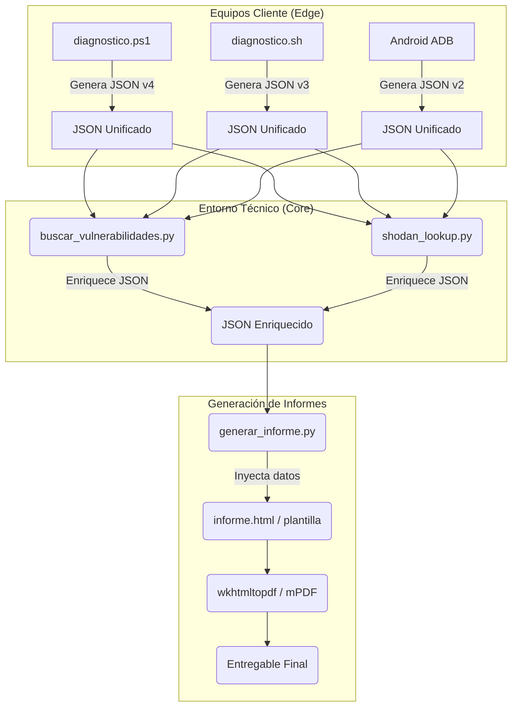

# ResolveCore — Arquitectura de Scripting

> Documento de diseño arquitectónico de los módulos de scripting del proyecto.
> **Autor:** Francisco Vidal Mateo · TFG ASIR 25/26

---

## 1. Diagrama de Módulos (Alto Nivel)

El sistema de scripts se basa en la extracción de telemetría en el equipo cliente (Edge), su unificación a formato JSON, y su enriquecimiento y procesado en el equipo del técnico (Core).

---

## 2. Flujo de Datos

1.  **Recolección:** El técnico ejecuta el script de diagnóstico correspondiente a la plataforma del cliente. El script extrae métricas de hardware, SO, red y seguridad.
2.  **Unificación:** Sin importar el origen (PowerShell, Bash, ADB), la salida se formatea siguiendo un Schema JSON unificado (ver `docs/schema-diagnostico.md`).
3.  **Enriquecimiento de Vulnerabilidades (NVD/KEV/EPSS):** El script `buscar_vulnerabilidades.py` parsea el JSON, identifica el software/OS y consulta las APIs de ciberseguridad para detectar CVEs y asignar un *Risk Score*.
4.  **Auditoría de Exposición (Shodan):** El script `shodan_lookup.py` se puede utilizar para buscar la IP pública del cliente en Shodan e identificar puertos abiertos expuestos a internet.
5.  **Generación de Informe:** El JSON final enriquecido con los CVEs y datos de Shodan se procesa mediante una plantilla HTML que, finalmente, se convierte a un documento PDF profesional para el cliente.

---

## 3. Módulos Python Previstos

| Módulo | Estado | Responsabilidad |
|--------|--------|----------------|
| `buscar_vulnerabilidades.py` | 🟢 Completado | Motor central de correlación. Lee el JSON de inventario y consulta APIs (NVD, OSV, KEV) calculando la gravedad de las vulnerabilidades. |
| `shodan_lookup.py` | 🟢 Completado | Auditoría de ataque externo (reconnaissance). Consulta la exposición de red de una IP pública dada sin tocar el equipo cliente. |
| `generar_informe.py` | 🟡 Pendiente | Lee el JSON enriquecido y utiliza un motor de plantillas (Jinja2/string template) para producir el HTML que será exportado a PDF. |

---

## 4. Variables de Entorno Requeridas

Para garantizar la seguridad de las credenciales y el cumplimiento de la política de cero dependencias fijas en código, las claves de las APIs se manejan mediante variables de entorno locales (o un fichero `.env` excluido del control de versiones):

| Variable | API | Uso | Módulo que la consume |
|----------|-----|-----|-----------------------|
| `SHODAN_API_KEY` | Shodan REST API | Consultas de exposición de red de host por IP. Consumo: 1 crédito/lookup (Free tier = 100/mes) | `shodan_lookup.py` |
| `NVD_API_KEY` | NIST NVD (Opcional) | Aumenta el límite de consultas a la base de datos nacional de vulnerabilidades y evita bloqueos (rate limiting) al procesar grandes inventarios. | `buscar_vulnerabilidades.py` |
| `MANTIS_API_TOKEN` | MantisBT REST API | Autenticación del técnico para automatizar la creación de tickets y notas desde los scripts, enviando alertas de vulnerabilidad graves. | `buscar_vulnerabilidades.py` |
