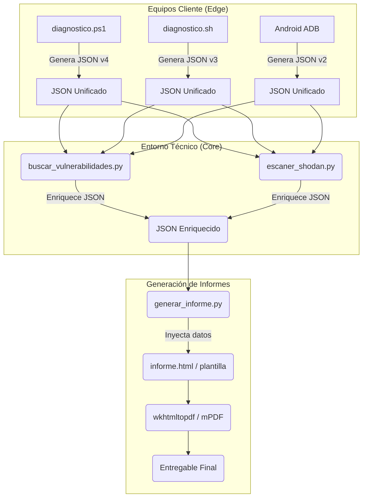

# ResolveCore — Arquitectura de Scripting

> Documento de diseño arquitectónico de los módulos de scripting del proyecto.
> **Autor:** Francisco Vidal Mateo · TFG ASIR 25/26

---

## 1. Diagrama de Módulos (Alto Nivel)

El sistema de scripts se basa en la extracción de telemetría en el equipo cliente (Edge), su unificación a formato JSON, y su enriquecimiento y procesado en el equipo del técnico (Core).



---

## 2. Flujo de Datos

1.  **Recolección:** El técnico ejecuta el script de diagnóstico correspondiente a la plataforma del cliente. El script extrae métricas de hardware, SO, red y seguridad.
2.  **Unificación:** Sin importar el origen (PowerShell, Bash, ADB), la salida se formatea siguiendo un Schema JSON unificado (ver `docs/schema-diagnostico.md`).
3.  **Enriquecimiento de Vulnerabilidades (NVD/KEV/EPSS):** El script `buscar_vulnerabilidades.py` parsea el JSON, identifica el software/OS y consulta las APIs de ciberseguridad para detectar CVEs y asignar un *Risk Score*.
4.  **Auditoría de Exposición (Shodan):** El script `escaner_shodan.py` se puede utilizar para buscar la IP pública del cliente en Shodan e identificar puertos abiertos expuestos a internet.
5.  **Generación de Informe:** El JSON final enriquecido con los CVEs y datos de Shodan se procesa mediante una plantilla HTML que, finalmente, se convierte a un documento PDF profesional para el cliente.

---

## 3. Módulos Python Previstos

| Módulo | Estado | Responsabilidad |
|--------|--------|----------------|
| `buscar_vulnerabilidades.py` | 🟢 Completado | Motor central de correlación. Lee el JSON de inventario y consulta APIs (NVD, OSV, KEV) calculando la gravedad de las vulnerabilidades. |
| `escaner_shodan.py` | 🟢 Completado | Auditoría de ataque externo (reconnaissance). Consulta la exposición de red de una IP pública dada sin tocar el equipo cliente. |
| `generar_informe.py` | 🟡 Pendiente | Lee el JSON enriquecido y utiliza un motor de plantillas (Jinja2/string template) para producir el HTML que será exportado a PDF. |

---

## 4. Variables de Entorno Requeridas

Para garantizar la seguridad de las credenciales y el cumplimiento de la política de cero dependencias fijas en código, las claves de las APIs se manejan mediante variables de entorno locales (o un fichero `.env` excluido del control de versiones):

| Variable | API | Uso | Módulo que la consume |
|----------|-----|-----|-----------------------|
| `SHODAN_API_KEY` | Shodan REST API | Consultas de exposición de red de host por IP. Consumo: 1 crédito/lookup (Free tier = 100/mes) | `escaner_shodan.py` |
| `NVD_API_KEY` | NIST NVD (Opcional) | Aumenta el límite de consultas a la base de datos nacional de vulnerabilidades y evita bloqueos (rate limiting) al procesar grandes inventarios. | `buscar_vulnerabilidades.py` |
| `MANTIS_API_TOKEN` | MantisBT REST API | Autenticación del técnico para automatizar la creación de tickets y notas desde los scripts, enviando alertas de vulnerabilidad graves. | `buscar_vulnerabilidades.py` |

---

## 5. Entornos de Ejecución y Despliegue de Dependencias

ResolveCore diferencia estrictamente entre el entorno de trabajo del técnico y el entorno del cliente auditado. Esta separación garantiza que no se instalan herramientas innecesarias en el PC del usuario final.

### A. Entorno del Técnico (Core / Workstation)
Es el equipo desde el cual el técnico presta soporte. Requiere tener instaladas todas las herramientas de control, APIs y lenguajes de scripting completos.
- **Script responsable:** `scripts/setup/setup-tecnico-windows.ps1` (o `.sh` en Linux).
- **Qué instala:** Python 3, Git, ADB (para diagnosticar Androids), AnyDesk (para acceso remoto), Chocolatey/Scoop.
- **Cuándo se ejecuta:** Solo una vez, cuando un técnico nuevo se incorpora al sistema o prepara su equipo de trabajo.

### B. Entorno del Cliente (Edge / Auditado)
Es el equipo del usuario final que presenta la incidencia. Cumple con la política de **Zero Dependencias intrusivas**. El script puede ejecutarse de forma portable desde un USB o un clonado temporal.
- **Script responsable:** `scripts/windows/ResolveCore.ps1` (o su invocación directa a `diagnostico.ps1`).
- **Qué instala:** Por defecto **NADA**. Solo extrae métricas usando comandos nativos (WMI, CIM, bash). 
- **Modo Extendido:** Si el técnico requiere herramientas avanzadas para ese diagnóstico específico, lanza el script con el flag `-InstallDeps` (o `-AutoInstall`). Esto despliega utilidades de diagnóstico pasivo como `Nmap`, `LibreHardwareMonitor`, `smartmontools` y `speedtest` usando `winget` o `choco`.

---

## 6. Arquitectura interna Python — Hexagonal (Ports & Adapters)

A partir de mayo 2026 los scripts Python aplican **Hexagonal Architecture** (Alistair Cockburn) para desacoplar la lógica de dominio (CVE scoring, correlación de vulnerabilidades, análisis de exposición) de las dependencias externas (Shodan, NVD, OSV, MantisBT).

### Justificación para el TFG

| Pregunta tribunal probable | Respuesta basada en hexagonal |
|---------------------------|-------------------------------|
| ¿Cómo testeas sin consumir créditos Shodan? | Inyecto un `FakeHostIntelSource` que cumple el Port. Dominio no sabe que es fake. |
| ¿Qué pasa si Shodan cierra el free tier? | Implemento un nuevo Adapter `CensysAdapter` cumpliendo el mismo Port. Cero cambio en dominio. |
| ¿Cómo evitas dependencias pip? | El dominio no importa nada. Solo los adapters tocan red, y siguen usando `urllib.request` (stdlib). |

### Estructura de paquetes

```
scripts/common/
├── __init__.py
├── domain/                    # Entidades puras, sin IO ni red
│   ├── __init__.py
│   └── models.py              # Host, Service, Vulnerability (dataclasses)
├── ports/                     # Interfaces abstractas (Protocols PEP 544)
│   ├── __init__.py
│   └── host_intel_source.py   # Port: HostIntelSource
├── adapters/                  # Implementaciones sobre APIs externas
│   ├── __init__.py
│   └── shodan_rest.py         # Adapter: ShodanRestAdapter
├── escaner_shodan.py          # CLI thin + compat retroactiva
├── escaner_nmap.py            # (sin migrar — pendiente fase 2)
└── buscar_vulnerabilidades.py # MONOLITO LEGACY — migración fase 2 (Strangler Fig)
```

### Regla de dependencias

```
cli ────────────────► adapters ────────────────► ports
                         │                          ▲
                         └──────────────────────────┘
                                  cumple
                         │
                         ▼
                       domain  ◄──── (no importa NADA hacia afuera)
```

- `domain/` no importa de `ports/`, `adapters/` ni `cli/`.
- `ports/` solo importa de `domain/`.
- `adapters/` importan de `ports/` y `domain/`.
- `cli/` (entry points) cablean adapter → port → dominio.

### Estado de migración (Strangler Fig)

| Módulo | Estado |
|--------|--------|
| `escaner_shodan.py` | ✅ Migrado a hexagonal (mayo 2026). Mantiene API legacy `shodan_host_info()` / `format_shodan_report()` para compatibilidad. |
| `escaner_nmap.py` | 🟡 Pendiente migración fase 2 |
| `buscar_vulnerabilidades.py` | 🟡 Monolito 2709 líneas. Migración progresiva planificada por subdominios (CVE source → KEV → EPSS → MantisBT sink). |

### Ejemplo de testabilidad

```python
# tests/test_dominio.py (sin red, sin pip)
from common.domain import Host, Vulnerability
from common.ports import HostIntelSource

class FakeShodan:
    def get_host_info(self, ip: str) -> Host:
        return Host(ip=ip, ports=[22], vulnerabilities=[
            Vulnerability(cve="CVE-2024-1234", cvss=9.8)
        ])

def test_critical_count():
    source: HostIntelSource = FakeShodan()
    host = source.get_host_info("1.2.3.4")
    assert host.critical_count == 1
```
