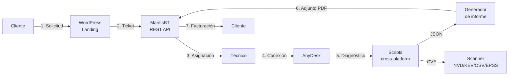

# Flujo del sistema — ResolvCore

> Diagrama y descripción detallada del ciclo completo de soporte técnico de ResolvCore, de la solicitud del cliente al cierre facturado.
>
> **CLAUDE.md** obliga a actualizar este documento al añadir o modificar fases del flujo.

---

## Diagrama de alto nivel

---

## Fases

Las siete fases son secuenciales pero la fase **5** (diagnóstico) puede ejecutarse offline (sin sesión remota) cuando el técnico ya tiene acceso al sistema por otros medios (SSH, ADB, ejecución guiada por el cliente). Esta es la única bifurcación tolerada por diseño.

### Fase 1 — Solicitud del cliente

| Atributo | Detalle |
|---|---|
| **Responsable** | Cliente final |
| **Input** | Necesidad de soporte (incidente, mejora, consulta, licencia) |
| **Herramienta** | Landing WordPress (`wordpress/page-resolvecore.php` o shortcode `[resolvecore_landing]`) |
| **Output** | Formulario enviado con `name`, `email`, `type`, `message` |
| **Persistencia** | Ninguna en esta fase — el formulario delega en WordPress AJAX |

El formulario admite cinco tipos de consulta (`soporte`, `bug`, `colaboracion`, `licencia`, `otro`) que se mapean a categoría + prioridad MantisBT en la fase siguiente.

### Fase 2 — Creación del ticket

| Atributo | Detalle |
|---|---|
| **Responsable** | Plugin `rc-mantisbt` (automático) |
| **Input** | Array sanitizado con los campos del formulario |
| **Herramienta** | `rc_mantis_create_ticket()` → `RC_Mantis_API::create_issue()` → `POST /api/rest/issues` |
| **Output** | `issue_id` numérico de MantisBT |
| **Persistencia** | Ticket en MantisBT con estado `new` |

Mapeo aplicado:

| `type` formulario | Categoría MantisBT | Prioridad |
|---|---|---|
| `soporte` | Soporte técnico | high |
| `bug` | Bug | normal |
| `colaboracion` | Colaboración | low |
| `licencia` | Licencia | normal |
| `otro` | General | low |

Validación de payload: ver [`docs/mantis-integration.md`](mantis-integration.md#validación-de-payload-al-crear-tickets).

### Fase 3 — Asignación

| Atributo | Detalle |
|---|---|
| **Responsable** | Técnico (manual) — plugin **MantisKanban** facilita la vista |
| **Input** | Ticket recién creado en estado `new` |
| **Herramienta** | UI MantisBT + plugin **SetDuedate** (calcula SLA según prioridad) |
| **Output** | Ticket en estado `assigned` con técnico asignado y `due_date` |
| **Notificación** | Plugin **mailtemplate** envía aviso al cliente con número de ticket |

### Fase 4 — Conexión remota

| Atributo | Detalle |
|---|---|
| **Responsable** | Técnico, con autorización explícita del cliente |
| **Input** | ID AnyDesk del cliente (custom field del ticket) |
| **Herramienta** | AnyDesk corporate (sesión cifrada y supervisada) |
| **Output** | Sesión activa sobre el equipo del cliente |
| **Persistencia** | Log de sesión AnyDesk + nota en MantisBT |

Bypass tolerado: SSH (Linux/macOS) o ADB (Android) si el técnico ya tiene acceso por otra vía. En ese caso se salta directamente a la fase 5.

### Fase 5 — Diagnóstico

| Atributo | Detalle |
|---|---|
| **Responsable** | Técnico, vía script |
| **Input** | Sistema objetivo (Windows / Linux / macOS / Android) |
| **Herramienta** | `scripts/<os>/diagnostico.{ps1,sh}` + `scripts/buscar_vulnerabilidades.py` |
| **Output** | JSON conforme a [`docs/schema-diagnostico.md`](schema-diagnostico.md) + opcionalmente HTML/TXT |
| **Persistencia** | `scripts/diagnosticos/diagnostico_<HOST>_<TS>.{json,html}` (gitignored) |

Métricas mínimas por SO:

| SO | Recogidas |
|---|---|
| Windows | CPU/RAM/disco, S.M.A.R.T., servicios críticos, Defender, Windows Update, eventos |
| Linux | Hardware, sensores, paquetes (apt/dnf/pacman), cron, puertos, journalctl |
| macOS | `system_profiler`, `pmset`, `vm_stat`, brew (estado actual: stub `0.1.0-demo`) |
| Android | Versión, batería, almacenamiento, apps instaladas, root status — vía ADB |

Salida estructurada en JSON con `_meta.plataforma` y `_meta.version` obligatorios para que el generador de informes y `rc_mantis_attach_diagnostic()` puedan validar el esquema.

### Fase 6 — Resolución y entrega del informe

| Atributo | Detalle |
|---|---|
| **Responsable** | Técnico (resolución manual) + generador (automático) |
| **Input** | JSON de diagnóstico + acciones aplicadas (`scripts/<os>/optimizacion.*`) |
| **Herramienta** | Plantilla `scripts/informe.html` → wkhtmltopdf/DomPDF → PDF |
| **Output** | Informe PDF con secciones obligatorias (resumen ejecutivo, incidencias detectadas, problemas solucionados, estado actual, recomendaciones, vida útil estimada) |
| **Persistencia** | PDF adjunto al ticket vía `rc_mantis_attach_diagnostic()` + ticket pasa a `resolved` |

**Reversibilidad**: las optimizaciones aplicadas en esta fase son revertibles con `--undo` (Linux/macOS/Android) o `optimizacion.ps1 -Undo` (Windows). El backup previo se almacena junto al log de la sesión.

### Fase 7 — Facturación y cierre

| Atributo | Detalle |
|---|---|
| **Responsable** | Sistema (auto-cierre tras 7 días) o cliente (feedback manual) |
| **Input** | Ticket en estado `resolved` |
| **Herramienta** | MantisBT + módulo de facturación (TBD: ver Roadmap v1.2+) |
| **Output** | Factura emitida según modelo (pago por servicio o suscripción) + ticket en estado `closed` |
| **Persistencia** | Factura en sistema contable + histórico en MantisBT |

Modelos:
- **Pago por servicio**: factura única al cerrar el ticket.
- **Suscripción**: revisiones programadas vía cron, no se factura por intervención sino por mensualidad.

---

## Datos que viajan entre fases

| Origen → Destino | Payload | Formato |
|---|---|---|
| F1 → F2 | Datos del formulario | Array PHP sanitizado |
| F2 → F3 | `issue_id` + ticket completo | JSON respuesta MantisBT |
| F3 → F4 | ID AnyDesk + datos del cliente | Custom fields MantisBT |
| F5 → F6 | Diagnóstico estructurado | JSON (esquema `_meta.*`) |
| F6 → F7 | Informe + estado del ticket | PDF + transición de estado |
| F7 → F1 (suscripción) | Notificación de revisión programada | Email (mailtemplate) |

---

## Cómo modificar el flujo

Si añades, divides o eliminas una fase:

1. Actualiza el diagrama mermaid (este fichero **y** el README).
2. Añade/edita la sección de la fase en este documento (responsable, input, output, herramientas, persistencia).
3. Si afecta al payload entre fases, actualiza la tabla "Datos que viajan entre fases".
4. Si la fase tiene impacto en el esquema JSON, actualiza [`docs/schema-diagnostico.md`](schema-diagnostico.md).
5. Si la fase introduce un nuevo módulo, regístralo en `CLAUDE.md` → "Módulos principales".

---

## Changelog del documento

| Fecha | Cambio |
|---|---|
| 2026-05-09 | Versión inicial — extraído del README y desglosado por fase. |
