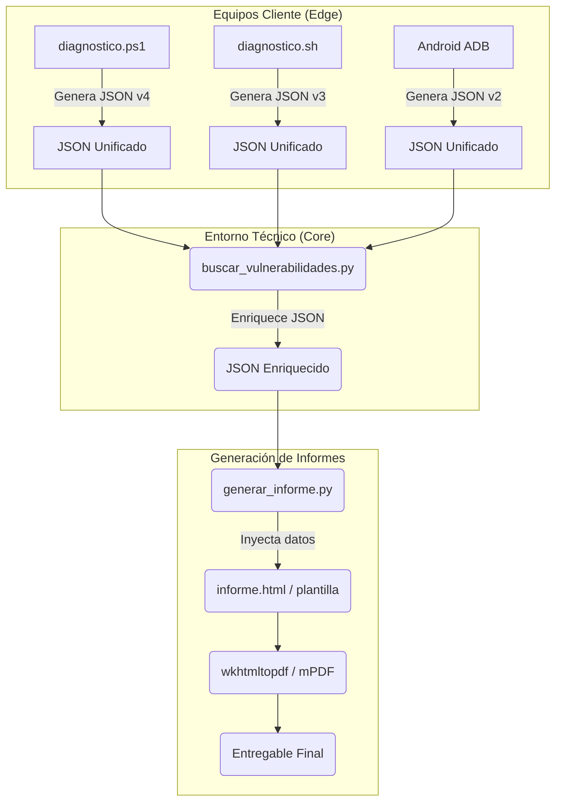

# ResolveCore — Arquitectura de Scripting

> Documento de diseño arquitectónico de los módulos de scripting del proyecto.
> **Autor:** Francisco Vidal Mateo · TFG ASIR 25/26

---

## 1. Diagrama de Módulos (Alto Nivel)

El sistema de scripts se basa en la extracción de telemetría en el equipo cliente (Edge), su unificación a formato JSON, y su enriquecimiento y procesado en el equipo del técnico (Core).



---

## 2. Flujo de Datos

1.  **Recolección:** El técnico ejecuta el script de diagnóstico correspondiente a la plataforma del cliente. El script extrae métricas de hardware, SO, red y seguridad.
2.  **Unificación:** Sin importar el origen (PowerShell, Bash, ADB), la salida se formatea siguiendo un Schema JSON unificado (ver `docs/schema-diagnostico.md`).
3.  **Enriquecimiento de Vulnerabilidades (NVD/KEV/EPSS):** El script `buscar_vulnerabilidades.py` parsea el JSON, identifica el software/OS y consulta las APIs de ciberseguridad para detectar CVEs y asignar un *Risk Score*.
4.  **Auditoría de red (Nmap):** El script `escaner_nmap.py` escanea puertos abiertos en la red local del cliente.
5.  **Generación de Informe:** El JSON final enriquecido con los CVEs se procesa mediante una plantilla HTML que, finalmente, se convierte a un documento PDF profesional para el cliente.

---

## 3. Módulos Python Previstos

| Módulo | Estado | Responsabilidad |
|--------|--------|----------------|
| `buscar_vulnerabilidades.py` | 🟢 Completado | Motor central de correlación. Lee el JSON de inventario y consulta APIs (NVD, OSV, KEV) calculando la gravedad de las vulnerabilidades. |
| `generar_informe.py` | 🟡 Pendiente | Lee el JSON enriquecido y utiliza un motor de plantillas (Jinja2/string template) para producir el HTML que será exportado a PDF. |

---

## 4. Variables de Entorno Requeridas

Para garantizar la seguridad de las credenciales y el cumplimiento de la política de cero dependencias fijas en código, las claves de las APIs se manejan mediante variables de entorno locales (o un fichero `.env` excluido del control de versiones):

| Variable | API | Uso | Módulo que la consume |
|----------|-----|-----|-----------------------|
| `NVD_API_KEY` | NIST NVD (Opcional) | Aumenta el límite de consultas a la base de datos nacional de vulnerabilidades y evita bloqueos (rate limiting) al procesar grandes inventarios. | `buscar_vulnerabilidades.py` |
| `MANTIS_API_TOKEN` | MantisBT REST API | Autenticación del técnico para automatizar la creación de tickets y notas desde los scripts, enviando alertas de vulnerabilidad graves. | `buscar_vulnerabilidades.py` |

---

## 5. Entornos de Ejecución y Despliegue de Dependencias

ResolveCore diferencia estrictamente entre el entorno de trabajo del técnico y el entorno del cliente auditado. Esta separación garantiza que no se instalan herramientas innecesarias en el PC del usuario final.

### A. Entorno del Técnico (Core / Workstation)
Es el equipo desde el cual el técnico presta soporte. Requiere tener instaladas todas las herramientas de control, APIs y lenguajes de scripting completos.
- **Script responsable:** `scripts/setup/setup-tecnico-windows.ps1` (o `.sh` en Linux).
- **Qué instala:** Python 3, Git, ADB (para diagnosticar Androids), AnyDesk (para acceso remoto), Chocolatey/Scoop.
- **Cuándo se ejecuta:** Solo una vez, cuando un técnico nuevo se incorpora al sistema o prepara su equipo de trabajo.

### B. Entorno del Cliente (Edge / Auditado)
Es el equipo del usuario final que presenta la incidencia. Cumple con la política de **Zero Dependencias intrusivas**. El script puede ejecutarse de forma portable desde un USB o un clonado temporal.
- **Script responsable:** `scripts/windows/ResolveCore.ps1` (o su invocación directa a `diagnostico.ps1`).
- **Qué instala:** Por defecto **NADA**. Solo extrae métricas usando comandos nativos (WMI, CIM, bash). 
- **Modo Extendido:** Si el técnico requiere herramientas avanzadas para ese diagnóstico específico, lanza el script con el flag `-InstallDeps` (o `-AutoInstall`). Esto despliega utilidades de diagnóstico pasivo como `Nmap`, `LibreHardwareMonitor`, `smartmontools` y `speedtest` usando `winget` o `choco`.

---

## 6. Arquitectura interna Python — Ports & Adapters (sin clases)

Los scripts Python separan la lógica propia (puntuar CVEs, correlacionar
vulnerabilidades, analizar exposición) de las dependencias externas (NVD, OSV,
MantisBT). La idea es la misma que la arquitectura Hexagonal de Alistair Cockburn,
pero **sin usar clases**: las entidades son diccionarios y todo lo demás son
funciones de módulo. Se hizo así a propósito para que el código se lea sin saber
programación orientada a objetos.

### Las tres capas

- **`domain/`** — las entidades. No son clases: son diccionarios que crean
  funciones `nueva_vulnerabilidad()`, `nuevo_servicio()`, `nuevo_host()`. Las
  reglas (¿es crítica?, ¿cuántas críticas tiene el host?) son funciones sueltas:
  `es_critica()`, `contar_criticas()`. No importa nada de fuera, ni red ni ficheros.
- **`ports/`** — los contratos. Aquí no hay código que importar: cada fichero es
  solo un docstring que dice qué función debe ofrecer un adapter (su nombre y sus
  argumentos). Es el "qué necesito", no el "cómo".
- **`adapters/`** — el código que toca el mundo. Cada adapter es un módulo con
  funciones que cumplen un contrato: `nvd_rest.get_vulns(product, version)` y
  `nmap_local.get_host_info(ip)`. Solo aquí se hacen llamadas HTTP, subprocesos
  y lectura de variables de entorno.

### Justificación para el TFG

| Pregunta tribunal probable | Respuesta |
|---------------------------|-----------|
| ¿Cómo testeas sin llamadas reales a APIs? | El dominio solo trabaja con dicts. Le paso un host de prueba hecho a mano con `nuevo_host(...)` y compruebo las reglas; no toco la red. |
| ¿Qué pasa si cambias de proveedor de inteligencia? | Escribo otro módulo adapter con la misma función (`get_vulns`/`get_host_info`). El dominio no se entera. |
| ¿Cómo evitas dependencias pip? | El dominio no importa nada. Solo los adapters tocan red, y siguen usando `urllib.request` (stdlib). |
| ¿Por qué sin clases? | Para que el código se entienda sin orientación a objetos. Diccionarios + funciones hacen lo mismo y van directos a JSON. |

### Estructura de paquetes

```
scripts/common/
├── __init__.py
├── domain/                    # Entidades = dicts, reglas = funciones. Sin IO ni red.
│   ├── __init__.py
│   └── models.py              # nueva_vulnerabilidad(), nuevo_servicio(), nuevo_host()...
├── ports/                     # Contratos escritos en docstrings. Sin código.
│   ├── __init__.py
│   ├── host_intel_source.py   # Contrato: get_host_info(ip) -> dict
│   ├── vuln_source.py         # Contrato: get_vulns(product, version) -> list
│   └── mantis_attachment_sink.py
├── adapters/                  # Funciones que tocan APIs externas.
│   ├── __init__.py
│   ├── nvd_rest.py            # get_vulns()  — consulta NVD NIST
│   └── nmap_local.py          # get_host_info() — escaneo nmap LAN
└── buscar_vulnerabilidades.py # Escáner de puertos por socket (independiente)
```

### Regla de dependencias

Quién puede importar a quién. Las flechas no se invierten nunca:

```
adapters ──importa──► domain
   │
   └──cumple el contrato de──► ports  (solo docstrings, no se importa)

domain  ◄──── no importa NADA hacia afuera
```

- `domain/` no importa de `ports/` ni de `adapters/`.
- `adapters/` importan de `domain/` (para crear los dicts) y cumplen lo que dice `ports/`.
- `ports/` no tiene código: son la documentación del contrato.

### Ejemplo de testabilidad

```python
# Probar las reglas del dominio sin red y sin pip.
from common.domain import nuevo_host, nueva_vulnerabilidad, contar_criticas

def test_contar_criticas():
    # Host de prueba hecho a mano: un CVE crítico (CVSS 9.8).
    host = nuevo_host("1.2.3.4", ports=[22], vulnerabilities=[
        nueva_vulnerabilidad("CVE-2024-1234", 9.8),
    ])
    assert contar_criticas(host) == 1
```

Para simular una fuente de datos sin tocar la red, basta una función con el mismo
nombre que el contrato:

```python
def get_vulns_falso(product, version):
    # Cumple el contrato VulnSource sin salir a internet.
    return [nueva_vulnerabilidad("CVE-2024-1234", 9.8)]
```
