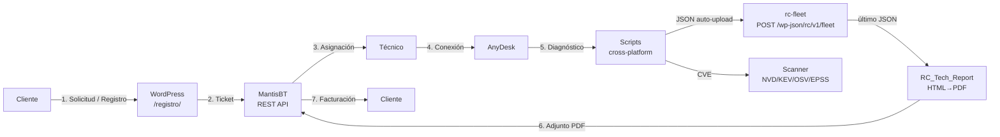

# Flujo del sistema — ResolvCore

> Diagrama y descripción detallada del ciclo completo de soporte técnico de ResolvCore, de la solicitud del cliente al cierre facturado.
>
> **CLAUDE.md** obliga a actualizar este documento al añadir o modificar fases del flujo.

---

## Diagrama de alto nivel

---

## Fases

Las siete fases son secuenciales pero la fase **5** (diagnóstico) puede ejecutarse offline (sin sesión remota) cuando el técnico ya tiene acceso al sistema por otros medios (SSH, ADB, ejecución guiada por el cliente). Esta es la única bifurcación tolerada por diseño.

### Fase 1 — Solicitud del cliente

| Atributo | Detalle |
|---|---|
| **Responsable** | Cliente final |
| **Input** | Necesidad de soporte (incidente, mejora, consulta, licencia) |
| **Herramienta** | Portal de registro WordPress (`page-registro.php`, ruta `/registro/`). El antiguo formulario público de la home se retiró el 01-06-2026 |
| **Output** | Cuenta de cliente + petición de soporte |
| **Persistencia** | Usuario WordPress (rol cliente) |

> El formulario público anónimo de contacto ya **no existe**: el alta pasa siempre por `/registro/`. La home enlaza a este portal desde el hero, la barra de navegación («Acceso clientes») y el paso 1 del diagrama de flujo.

### Fase 2 — Creación del ticket

| Atributo | Detalle |
|---|---|
| **Responsable** | Plugin `rc-mantisbt` (automático) |
| **Input** | Array sanitizado con los campos del formulario |
| **Herramienta** | `rc_mantis_create_ticket()` → `RC_Mantis_API::create_issue()` → `POST /api/rest/issues` |
| **Output** | `issue_id` numérico de MantisBT |
| **Persistencia** | Ticket en MantisBT con estado `new` |

Mapeo aplicado:

| `type` formulario | Categoría MantisBT | Prioridad |
|---|---|---|
| `soporte` | Soporte técnico | high |
| `bug` | Bug | normal |
| `colaboracion` | Colaboración | low |
| `licencia` | Licencia | normal |
| `otro` | General | low |

Validación de payload: ver [`docs/mantis-integration.md`](mantis-integration.md#validación-de-payload-al-crear-tickets).

### Fase 3 — Asignación

| Atributo | Detalle |
|---|---|
| **Responsable** | Técnico (manual) — plugin **MantisKanban** facilita la vista |
| **Input** | Ticket recién creado en estado `new` |
| **Herramienta** | UI MantisBT + plugin **SetDuedate** (calcula SLA según prioridad) |
| **Output** | Ticket en estado `assigned` con técnico asignado y `due_date` |
| **Notificación** | Plugin **mailtemplate** envía aviso al cliente con número de ticket |

### Fase 4 — Conexión remota

| Atributo | Detalle |
|---|---|
| **Responsable** | Técnico, con autorización explícita del cliente |
| **Input** | ID AnyDesk del cliente (custom field del ticket) |
| **Herramienta** | AnyDesk corporate (sesión cifrada y supervisada) |
| **Output** | Sesión activa sobre el equipo del cliente |
| **Persistencia** | Log de sesión AnyDesk + nota en MantisBT |

Bypass tolerado: SSH (Linux/macOS) o ADB (Android) si el técnico ya tiene acceso por otra vía. En ese caso se salta directamente a la fase 5.

### Fase 5 — Diagnóstico

| Atributo | Detalle |
|---|---|
| **Responsable** | Técnico, vía script |
| **Input** | Sistema objetivo (Windows / Linux / macOS / Android) |
| **Herramienta** | `scripts/<os>/diagnostico.{ps1,sh}` + `scripts/buscar_vulnerabilidades.py` |
| **Output** | JSON conforme a [`docs/schema-diagnostico.md`](schema-diagnostico.md) + opcionalmente HTML/TXT |
| **Persistencia** | Local: `scripts/diagnosticos/diagnostico_<HOST>_<TS>.{json,html}` (gitignored). Remota: tabla `rc_fleet_hosts` en WordPress |

**Subida automática (sin copiar a mano):** los scripts `diagnostico.{ps1,sh}` publican el JSON directamente en WordPress vía `POST /wp-json/rc/v1/fleet` (plugin `rc-fleet`) cuando se les pasa email de cliente + token. Variables de activación: `RC_CLIENT_EMAIL` y `RC_FLEET_TOKEN` (más `RC_FLEET_URL` y `RC_TICKET_ID` opcionales) en Linux/Android; parámetros `-ClientEmail`/`-Token`/`-TicketId` en Windows. Si la subida falla, el JSON local queda a salvo y el script no aborta.

Métricas mínimas por SO:

| SO | Recogidas |
|---|---|
| Windows | CPU/RAM/disco, S.M.A.R.T., servicios críticos, Defender, Windows Update, eventos |
| Linux | Hardware, sensores, paquetes (apt/dnf/pacman), cron, puertos, journalctl |
| macOS | `system_profiler`, `pmset`, `vm_stat`, brew (estado actual: stub `0.1.0-demo`) |
| Android | Versión, batería, almacenamiento, apps instaladas, root status — vía ADB |

Salida estructurada en JSON con `_meta.plataforma` y `_meta.version` obligatorios para que el generador de informes y `rc-fleet` puedan validar el esquema.

> **ROADMAP explícito — macOS y Android.** Windows y Linux son las plataformas productivas. **macOS** está en estado *stub* (`0.1.0-demo`, script no presente en el árbol activo) y **Android** depende de ADB y se considera soporte experimental. Ambas son **ROADMAP**, no funcionalidad estable; el panel de flota ya las contempla (`rc_fleet_normalize_os`) para no romper cuando lleguen.

### Fase 6 — Resolución y entrega del informe

| Atributo | Detalle |
|---|---|
| **Responsable** | Técnico (resolución manual) + generador (automático) |
| **Input** | JSON de diagnóstico + acciones aplicadas (`scripts/<os>/optimizacion.*`) |
| **Herramienta** | `RC_Tech_Report::generate()` (plugin `rc-tech`): renderiza el informe HTML en PHP y lo convierte a PDF con **wkhtmltopdf** si está disponible; si no, adjunta el HTML (degradación elegante). **Un único generador** — se eliminaron los generadores fantasma documentados (`reports/generate-report.php`, `scripts/informe.html`, CLI Python `generar_informe.py`) |
| **Output** | Informe con secciones fijas (resumen ejecutivo, incidencias detectadas, estado actual del sistema, recomendaciones) generado a partir del último diagnóstico de la flota |
| **Persistencia** | Fichero en `wp-content/uploads/rc-tech/reports/` + adjunto al ticket vía `RC_Mantis_API::attach_file()` + ticket pasa a `resolved` |

**Reversibilidad**: las optimizaciones aplicadas en esta fase son revertibles con `--undo` (Linux/macOS/Android) o `optimizacion.ps1 -Undo` (Windows). El backup previo se almacena junto al log de la sesión.

### Fase 7 — Facturación y cierre

| Atributo | Detalle |
|---|---|
| **Responsable** | Sistema (auto-cierre tras 7 días) o cliente (feedback manual) |
| **Input** | Ticket en estado `resolved` |
| **Herramienta** | `rc_tech_factura_inline()` (tema): emite factura HTML imprimible en `/tecnicos/?rc_factura=<ID>`. Numeración **secuencial contable** real (`F-AAAA-NNNN`, correlativa por año) y persistencia en la tabla `rc_invoices` vía `rc_invoice_get_or_create()` |
| **Output** | Factura emitida según modelo (pago por servicio o suscripción) + ticket en estado `closed` |
| **Persistencia** | Tabla `rc_invoices` (factura **inmutable**: una vez emitida no se renumera ni recalcula) + histórico en MantisBT |

Modelos:
- **Pago por servicio**: factura única al cerrar el ticket.
- **Suscripción**: revisiones programadas vía cron, no se factura por intervención sino por mensualidad.

---

## Datos que viajan entre fases

| Origen → Destino | Payload | Formato |
|---|---|---|
| F1 → F2 | Datos del formulario | Array PHP sanitizado |
| F2 → F3 | `issue_id` + ticket completo | JSON respuesta MantisBT |
| F3 → F4 | ID AnyDesk + datos del cliente | Custom fields MantisBT |
| F5 → F6 | Diagnóstico estructurado | JSON (esquema `_meta.*`) |
| F6 → F7 | Informe + estado del ticket | PDF + transición de estado |
| F7 → F1 (suscripción) | Notificación de revisión programada | Email (mailtemplate) |

---

## Cómo modificar el flujo

Si añades, divides o eliminas una fase:

1. Actualiza el diagrama mermaid (este fichero **y** el README).
2. Añade/edita la sección de la fase en este documento (responsable, input, output, herramientas, persistencia).
3. Si afecta al payload entre fases, actualiza la tabla "Datos que viajan entre fases".
4. Si la fase tiene impacto en el esquema JSON, actualiza [`docs/schema-diagnostico.md`](schema-diagnostico.md).
5. Si la fase introduce un nuevo módulo, regístralo en `CLAUDE.md` → "Módulos principales".

---

## Changelog del documento

| Fecha | Cambio |
|---|---|
| 2026-05-09 | Versión inicial — extraído del README y desglosado por fase. |
| 2026-06-02 | Flujo real: F1 vía `/registro/` (form público retirado); F5 sube el JSON automáticamente a `rc-fleet`; F6 unificada en `RC_Tech_Report::generate()` (HTML→PDF, fallback HTML) eliminando generadores fantasma; F7 con numeración secuencial persistida (`rc_invoices`). Nota ROADMAP explícita para macOS/Android. |
